<!-- TOC -->

- [Su-25T Basic Info](#su-25t-basic-info)
- [Instruments](#instruments)
    - [Fuel](#fuel)
    - [Warning Lamps](#warning-lamps)
    - [Hydraulics](#hydraulics)
    - [Threat Types](#threat-types)
- [Airport/Airfield/Aerodrome IDs](#airportairfieldaerodrome-ids)
- [Ground Radar signitures](#ground-radar-signitures)
    - [List of Radar designations](#list-of-radar-designations)
    - [Radar/IR Threat (range/height)](#radarir-threat-rangeheight)
        - [Enemy radar threats overview (range/height)](#enemy-radar-threats-overview-rangeheight)
        - [Enemy IR threats overview (range/height)](#enemy-ir-threats-overview-rangeheight)
- [How to shoot multiple Vikhr missiles](#how-to-shoot-multiple-vikhr-missiles)
- [HUD color](#hud-color)
- [Su-25T Pylons](#su-25t-pylons)
    - [Air-To-Air (IR)](#air-to-air-ir)
    - [Bombs (Guided/Free fall)](#bombs-guidedfree-fall)
    - [Missiles (Guided)](#missiles-guided)
- [Pods/Fuel Tanks](#podsfuel-tanks)
- [Rockets (S - Unguided)](#rockets-s---unguided)

<!-- /TOC -->

## Su-25T Basic Info

The information in this guide is subject to change if future updates modify/add anything.

Mission Role Tasks :
* AWACS (Airborne Warning And Control System) : An airborne radar
* CAP (Combat Air Patrol) : Protect friendly assets in and around the station area
* SEAD (Suppression of Enemy Air Defenses) : Engage SAM radar and launch vehicles.
* CAS (Close Air Support) : Destroy as many vehicles as possible
* Sweep : Aggressive counter air into enemy territory
* Intercept : Air to Air interception of an assigned aircraft
* Escort : Protect a target
* OCA (Offensive Counter Air) Engage dangerous enemy assets such like SAM launch vehicles and airbases
* Strike : Standard Air to Ground mission against enemy war production
* Deep Strike : Strike deep into enemy territory
* FAC (Forward Air Control) : Assign targets
* Recon (Reconnaissance) : Gather intelligence of enemy area

## Instruments

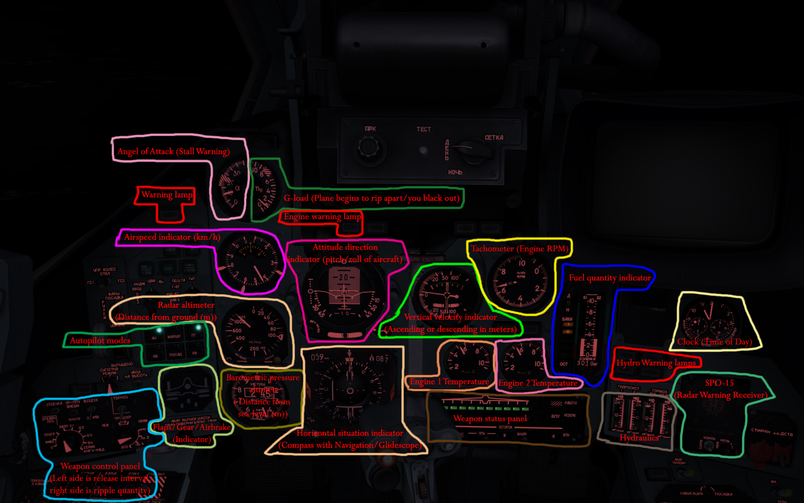

### Fuel

A lamp is lit it means that a particular tank is empty.

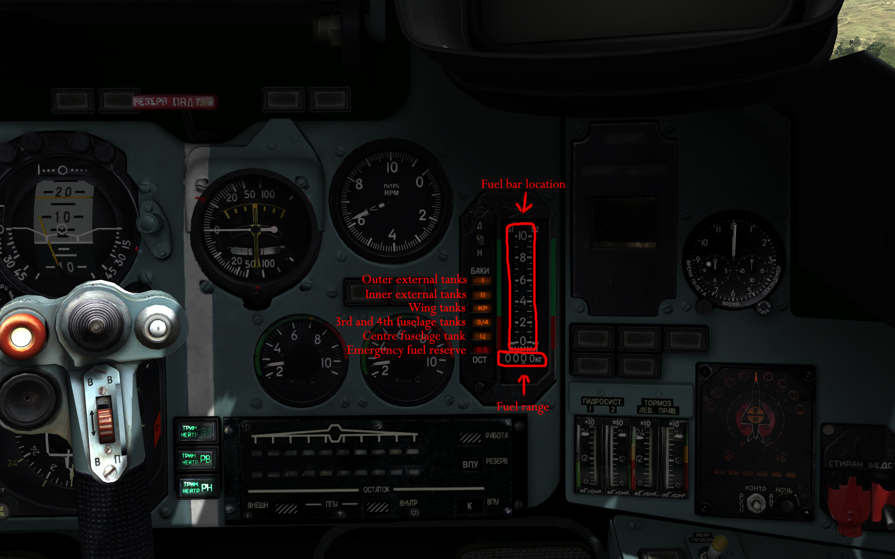

The meanings of the lamps:

* __I__ - outer two external tanks;
* __II__ - inner two external tanks;
* __КР__ - wing tanks;
* __3/4__ - third and fourth tanks;
* __Ц__ - central fuselage tank;
* __0.5__ - emeregency fuel quantity - equal or less 500 kilogramms.

### Warning Lamps

I've noticed only 4 warning lamps work in the Su-25T

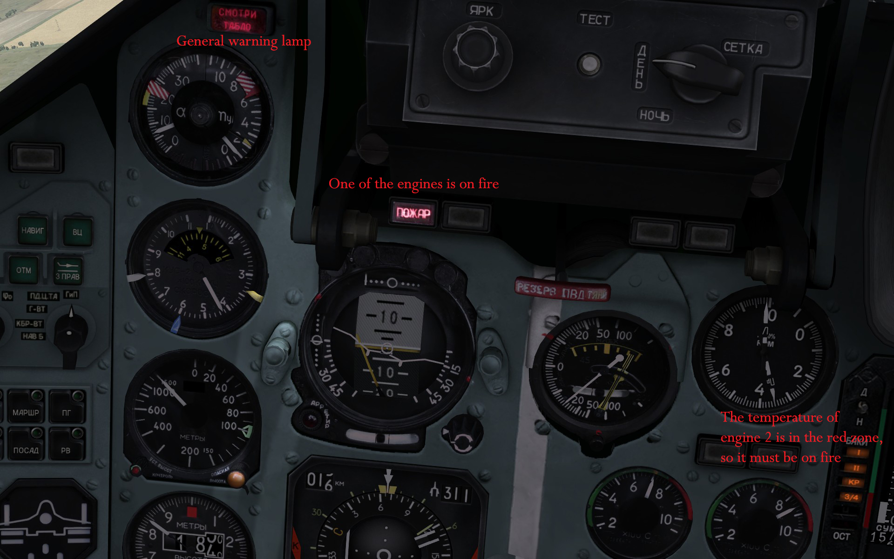

1. `Смотри таьло` -General warning lamp, indicates either stall speed, pull up, low air-speed, and along with most any other warning lamp.
2. `Пожар` - Engine failure/fire (_Currently it can be any engine_)

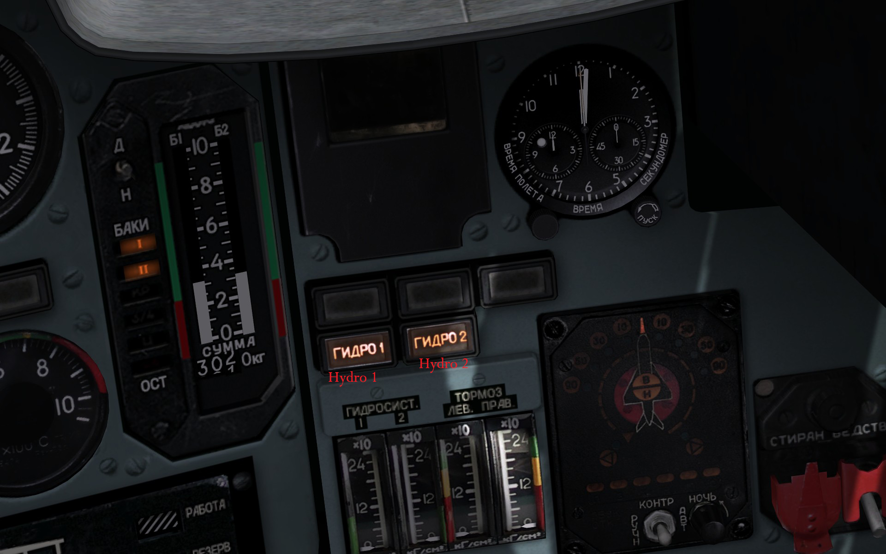

* Engine 1 controls hydraulics 1
* Engine 2 controls hydraulics 2

3. `гидро1` - hydraulics failure 1 (Hydro 1 controls the nosewheel steering unit, the initial chambers of the aileron boosters, the airbrakes, the slats, the flaps and the elevators (_Rudders are not controlled by hydraulic system_)
4. `гидро2` - hydraulics failure 2 (Hydro 2 controls the undercarriage extension and retraction, mainwheel braking, the yaw damper, and the second chambers of the aileron boosters)

* Looking at the engine temperatures also can show indication of a fire if the temperature is in the red zone, when engine is on fire you should turn it off or it will cause fuel tanks to explode.

### Hydraulics

(_Same stuff explained above, with addition to brakes and tips_)

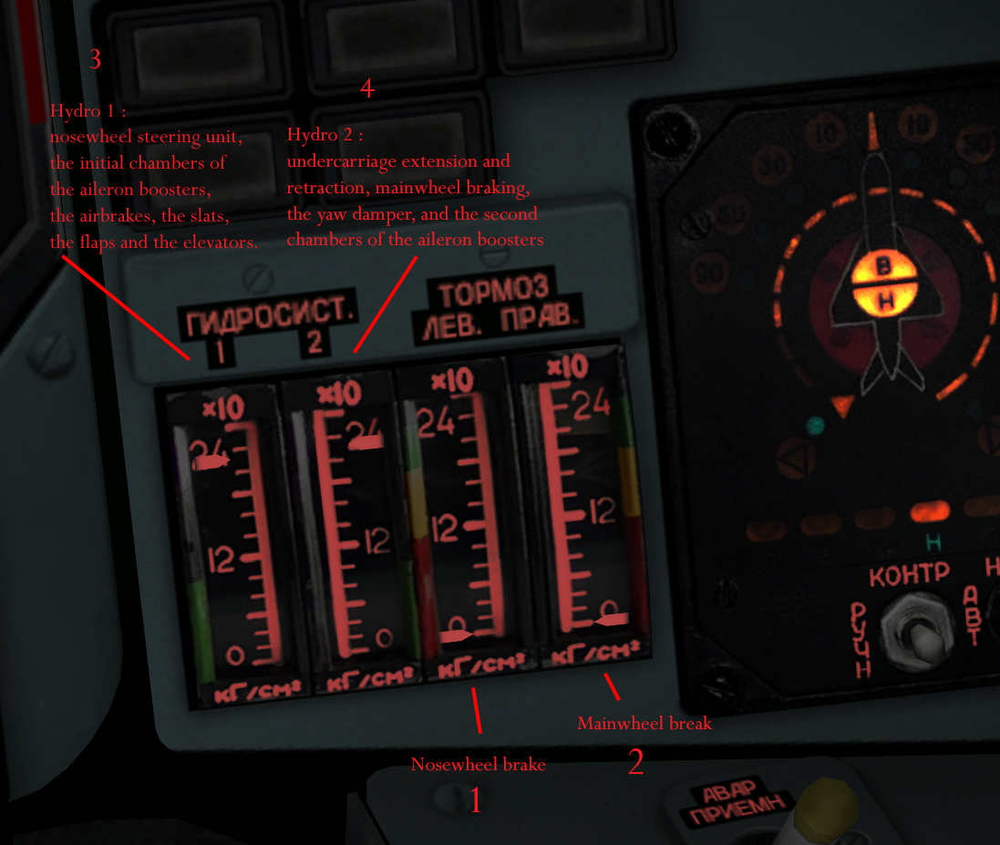

1. Nosewheel braking
2. Mainwheel brake
3. Hydro 1 controls the nosewheel steering unit, the initial chambers of the aileron boosters, the airbrakes, the slats, the flaps and the elevators (_Rudders are not controlled by hydraulic system_)
4. Hydro 2 controls the undercarriage extension and retraction, mainwheel braking, the yaw damper, and the second chambers of the aileron boosters

* If a hydraulic leak occurs and is of risk falling below 50%, it is best to lower the gears, otherwise they will not lower fully
* Airbreaks also should be closed quickly if a leak occurs or they will stay open once fluid leaks completely
* Flaps are not as important as landing than gear, and they also relly on the hydraulic fluid. Gears are more of a priority than flaps
* Functions of hydraulics do not function properly below 50%

### Threat Types

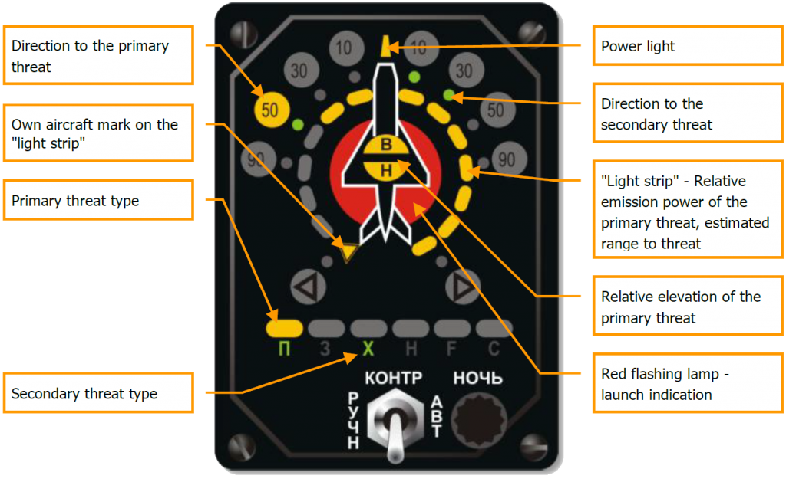

* __П__ = airborne radar

* __3__ = long range radar

* __X__ = medium range radar

* __H__ = short range radar

* __F__ = early warning radar

* __C__ = AWACS

## Airport/Airfield/Aerodrome IDs

_This is useful if you are not looking at a map or need more precise way of figuring out an airfield besides looking for the closest one._

These IDs are used with the navigation system built into the HUD of the Su-25T, when in navigation mode (pressing 1 for Route mode (`MPW` or `ENR`), Airfield beacon mode (`B3B` or `RTN`), and Landing mode (`ПОС` or `LNDC`) , pressing `Ctrl+` will cycle through the waypoints/ID's of Airfields in "Airfield beacon mode" and also the landing glidescopes of airfields in __Landing mode__.

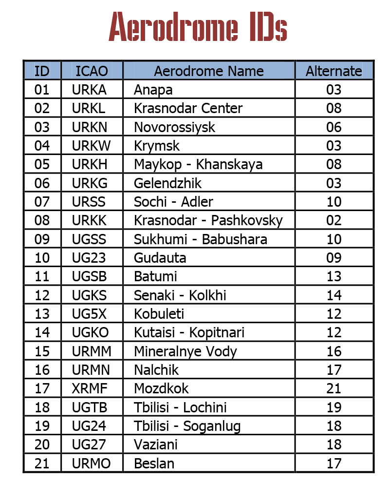

## Ground Radar signitures

When equiped with Fantasmagoria pod , going into ground attack mode (__7__) then activate the pod with (__I__) and Radar targets will appear on your hud. Some have designations to identify them with.

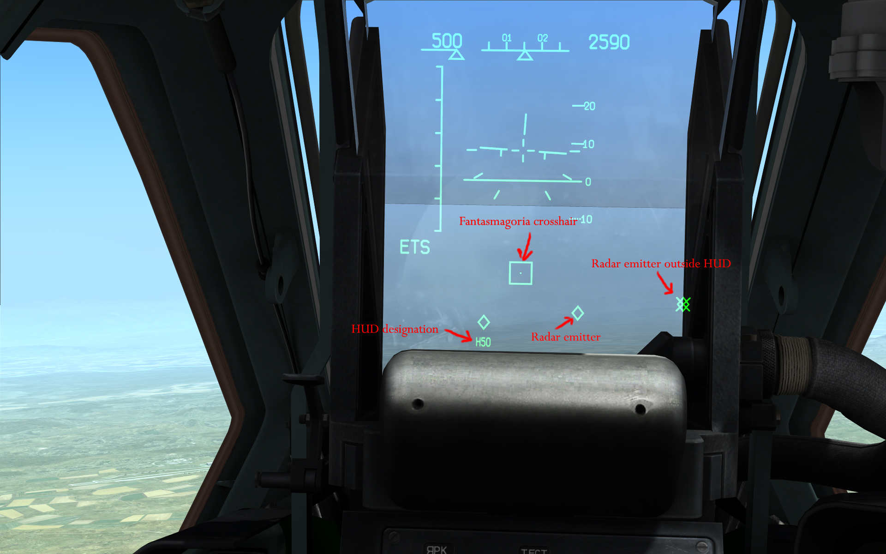

### List of Radar designations

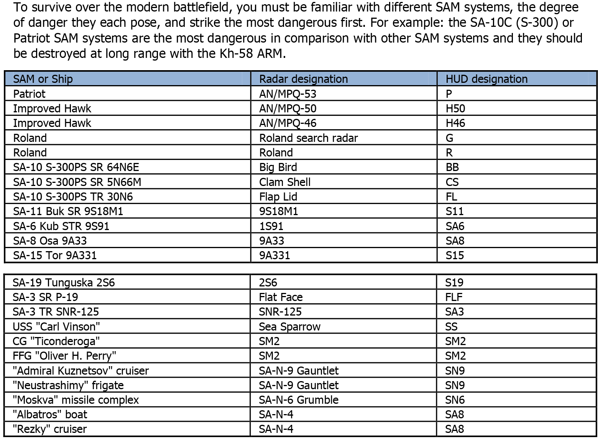

### Radar/IR Threat (range/height)

#### Enemy radar threats overview (range/height)

* 2km/1.5km M163 Vulcan
* 2.5km/2km ZSU-23-4 Shilka
* 3km/2.5km Gepard
* 6km/3km Roland
* 7km/6.5km OSA/Gecko
* 8km/5km Tunguska/Grison
* 12km/8km TOR/Gauntlet
* 16km/10km MIM-23-Hawk
* 16km/11km Kub/Gainful
* 25km/10km Newa/Goa
* 32km, 25km S-11 BOK/Gadfly
* 45km/30km Volkhlov/Grumble
* 90km/35km Patriot

#### Enemy IR threats overview (range/height)

* 3km/2.5km M6 Linebacker
* 3km/2.5km Stinger (Manpad)
* 3km/2.5km M1097 Avenger PMS
* 4.2km/3.5km Strela-1/Gaskin
* 4.5km/3km 9k38 IGLA/Grouse (Manpad)
* 5km/3.5km Strela-10/Gopher
* 8.5km/3km M48 Chaparral

## How to shoot multiple Vikhr missiles

1. Set launch mode to 2 rocket launch (hit Cntrl+V so that the missile launch circle is in the center of your hud, not the side.)
2. Press trigger for one missile to launch, hold for two to launch
3. Turn the laser off after each target is destroyed then slew shkval and lock onto new targert , the laser turns on when you fire Vikhr (Vikhr turns off laser after set time by itself, but this takes to long).

## HUD color

(`Right Ctrl` + `H`) changes the color of your hud to : Red,Green,Orange,Yellow
Brightness of HUD's color changed with (`Right Ctrl` + `H`) also.
Below are two example :

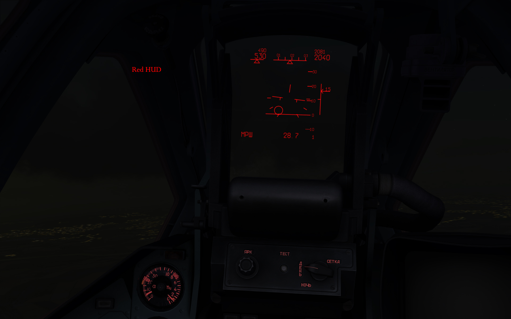

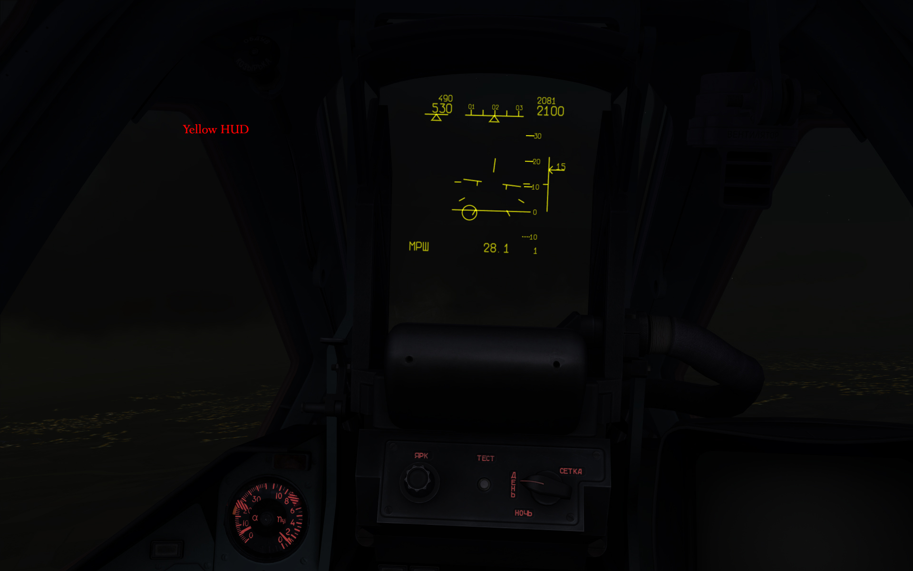

## Su-25T Pylons

The modeling of lateral and longitudinal center of mass is taken into effect. This can
change depending on fuel load and weapon loads.

The asymmetrical loading of weapon and fuel pylons, which influence the characteristics of
lateral control (depending on flight speed, regular overload, etc), is also modeled.

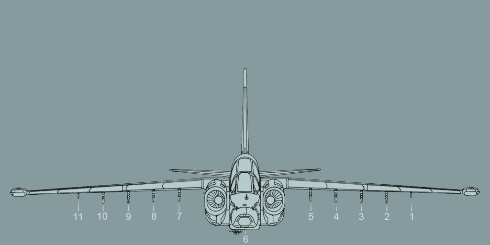

### Air-To-Air (IR)

| Weapon |	Type	| Guidance	| Range (km) |	Warhead (kg) |	Weight (kg) |	Speed |	Intended Targets |
| -- | -- | -- | -- | -- | -- | -- | -- |
| R-60M	| Short-range, infrared, air-to-air missile |	infared |	5 |	6 |	65	| Mach 2 |	Aircraft (Pylon 11,1) |
| R-73	| Medium-range, infrared, air-to-air missile |	infared and Inertial | 15 |	7.4 | 110 | Mach 2.5 |	Aircraft (Pylon 10,2) |

### Bombs (Guided/Free fall)
_Range of bombs depends on the height and horizontal speed they were dropped at_ 

| Weapon |	Type	| Guidance	| Range (km)	| Warhead (kg) |	Weight (kg) |	Intended Targets |
| -- | -- | -- | -- | -- | -- | -- |
| BetAB-500 |	Penetration bomb with re-tarded system | Free fall | - | 75.8 |	478	| Concrete piercing, bunkers, concrete runways. (_Pylon 2,3,4,5,7,8,9,10_) |
| BetAB-500ShP |	Penetration bomb with rocket / parachute system |	Parachute / Rocket |	- |	77 |	380 |	Concrete piercing, bunkers, concrete runways (_Pylon 2,3,4,5,7,8,9,10_) |
| FAB-100 |	General purpose bomb |	Free fall	| - |	44.9 |	99.8 |	Wide variety of targets, including artillery, trucks, bunkers, surface-to-air missile sites, antiaircraft artillery sites, ammunition dumps, railway engines, light surface vessels and supply points. (_Pylon 2,3,4,5,7,8,9,10_) |
| FAB-250 |	General purpose bomb |	Free fall	| -	| 120 |	249 |	Military-industrial sites, railway junctions, field facilities, personnel, light armoured vehicles and trucks (_Pylon 2,3,4,5,7,8,9,10_) |
| FAB-500 M62 |	General purpose bomb |	Free fall	| -	| 240 |	506 |	Defence industry facilities, light armoured vehicles, railway junctions, fortifications and personnel. (_Pylon 2,3,4,5,7,8,9,10_) |
| KAB-500kr	| TV-guided bomb |	TV-command	| 17 |	195 |	560 |	Wide variety of targets, including artillery, trucks, bunkers, Scuds, surface-to-air missile sites, antiaircraft artillery sites, early warning radars, and supply points. (__fire and forget weapon__) (_Pylon 5,7_) |
| KMGU-2 96 AO 2.5RT |	Dispenser	| Free fall cluster disp. |	50-150m |	96x2.5kg |	525	| 96 x 2.5kg Frag bomblets - Each bomblet has a kill radius of 30m against material, 20m against unsheltered personnel and 10m against entrenched personnel. (_Pylon 2,3,4,5,7,8,9,10_) |
| KMGU-2 96 PTAB 2.5KO |	Dispenser	| Free fall cluster disp. |	50-150m |	96x2.5kg |	525	| 96 x 2.5kg Armor piercing - Anti-tank and anti-personnel capability. (_Pylon 2,3,4,5,7,8,9,10_) |
| MBD-2-67U - 4 FAB-100	| Bomb rack of 4 FAB-100's	| Free fall	| - |	4 x 44.9	| 4 x 99.8	| Wide variety of targets, including artillery, trucks, bunkers, surface-to-air missile sites, antiaircraft artillery sites, ammunition dumps, railway engines, light surface vessels and supply points. (_Pylon 2,3,4,5,7,8,9,10_) |
| RBK-250 PTAB-2.5M	| Multipurpose cluster bomb |	Cluster free fall |	2.5 per 30 bmblt.	| 94 |	275	| 30 x 2.5kg General purpose, armoured targets (_Pylon 2,3,4,5,7,8,9,10_) |
| RBK-500 PTAB-10.5	| Anti-personnel/anti-material cluster bomb |	Cluster free fall	| 10 per 30 bmblt. |	- |	504	| 30 x 10kg General purpose, armoured targets(_Pylon 2,3,4,5,7,8,9,10_) |
| RBK-500U PTAB-1M |	Anti-personnel/anti-material cluster bomb	| Cluster free fall |	1 (per) 352 bmblt. |	- |	504 |	352 x 1kg General purpose, armoured targets (_Pylon 2,3,4,5,7,8,9,10_) |
| SAB-100	| Illumination bomb |	Free fall / Parachute |	1-3km altitude	| - |	-	| Dispenses 8 LUU-2B/B illumination flares. Each flare burn during 2 minutes, lock it onto a target and fly over it to deploy. (_Pylon 2,3,4,5,7,8,9,10_) |

### Missiles (Guided)

| Weapon |	Type	| Guidance |	Range(km) |	Warhead (kg) |	Weight (kg) |	Speed	| Intended Targets |
| -- | -- | -- | -- | -- | -- | -- | -- |
| 9A4172 Vikhr	| Medium-range, anti-tank, laser-guided |	Semi-Active Laser	| 10	| 12 |	45	| Mach 1.8 |	Armored vehicles, slow air targets (_Pylon 4,8_) |
| Kh-29L |	Medium-range, laser-guided, air-to-surface missile |	Semi-Active Laser	| 10 |	317 |	657 |	Mach 2.5 |	Fortifications, strong points, bridges, command and control centers, artillery and missile emplacements, boats. (_Pylon 5,7_) |
| Kh-29T |	Medium-range, TV-guided, air-to-surface missile	| TV-command |	12 |	317 | 670	| Mach 2.5 |	Fortifications, strong points, bridges, command and control centers, artillery and missile emplacements, boats. (__fire and forget weapon__) (_Pylon 5,7_) |
| Kh-58	| Medium-range, anti-radar, air-to-surface missile |	Inertial and Passive Radar |	70 |	320 |	640	| Mach 4 |	SAM Radars - NEEDS L-081 __Fantasmagoria__ Pod (_Pylon 5,7_) |
| S-25L |	340 mm laser guided aircraft rocket |	Semi-Active Laser |	3 |	190 |	480 |	2520 km/h	| Soft targets, concrete targets (_Pylon 2,3,4,5,7,8,9,10_) |
| Kh-25 ML |	Medium-range, laser-guided, air-to-surface missile |	Semi-Active Laser |	11 |	90 | 300 |	Mach 0.72 |	Fortifications, strong points, bridges, command and control centers, artillery and missile emplacements. (_Pylon 3,4,5,9,8,7_) |
| Kh-25 MP |	Medium-range, anti-radar, air-to-surface missile |	Semi-Active Laser |	25 |	90 |	320	| Mach 0.76 |	SAM Radars - NEEDS L-081 __Fantasmagoria__ Pod Press (I) to activate/deactivate it in air-to-ground mode(__fire and forget weapon__) (7) (_Pylon 3,4,5,9,8,7_) |

## Pods/Fuel Tanks

| Name |	Type |	Location |	Purpose |
| -- | -- | -- | -- |
| MPS-410 |	ECM Pod |	Wingtip |	Jams enemy radar homing missiles coming at you. Gives position away, (Activated with (SHIFT+E), but as of 1.2.12 ECM pods do not have an indicator inside the cabin, remember when you turn them on/off!) (_Pylon 11,1_) |
| Mercury LLTV |	Targeting	| Centerline |	Targeting pod with better low light camera in it than standard Shkval (_Pylon 6_) |
| L-081 Fantasmagoria |	ELINT Pod	| Centerline |	Passive electronics intelligence pod that receives and locates enemy radars - needed for anti-radar missiles (_Pylon 6_) |
| Fuel tank 800L Wing |	Fuel Tank |	Stations 3, 5, 7, and 9 |	Total added weight per FULL tank is 760 KG | Total added fuel weight per FULL tank is 620 KG. Means that when empty there is still 140KG per tank of useless weight on your aircraft, not to mention the additional drag. DROP WHEN EMPTY!!! (`Lalt` + `R`) (_Pylon 5,7,3,9_) |
| SPPU - 22-2 |	Gun pod	| Stations 5, 4, 7, and 8 |	Firing rate, rounds/minute: 2800-3000 | Muzzle velocity, m/s: 690-890 Range, km: 3 Ammunition storage, rounds: 260 Deflection method: manual or laser lock (_Pylon 5,4,7,8_) |
| Smoke Generator -Color (_Blue,Green,Orange,Red,White,Yellow_)	| Smoke | Stations 5, 4, 7, and 8	| Look like R-73 missiles, activated with (T) (_Pylon 1,11_) |

## Rockets (S - Unguided)

| Weapon |	Type |	Guidance |	Range (km) |	Warhead (kg) |	Weight (kg) | Speed (km/h) |	Intended Targets |
| -- | -- | -- | -- | -- | -- | -- | -- |
| S-13 OF	| 122 mm unguided aircraft rocket |	Unguided |	2.5 |	32.5 |	68 (pod 505) |	2700 |	5 x APAM Fragmentation Rocket , Designed for strikes against fortified and hardened objects (pillboxes, shelters, airport aprons and runways) (_Pylon 2,3,4,5,7,8,9,10_) |
| S-8 KOM |	80 mm unguided aircraft rocket |	Unguided |	1.3-4 |	3,6 |	11.3 (pod 386)	| 2196 |	20 x AT Fragmentation Rocket ,(400mm penetration) light anti-armor. This rocket is intended to engage modern tanks, lightly armored and soft-skinned combat materiel. Owing to the fragmentation effect, the rocket also inflicts damage on manpower. (_Pylon 2,3,4,5,7,8,9,10_) |
| S-8 OFP2 |	80 mm unguided aircraft rocket |	Unguided |	6-7 |	9.2 |	16.7 (pod 402)	| - |	20 x HE Fragmentation Rocket , This rocket is designed to engage personnel, soft and lightly armored targets. (_Pylon 2,3,4,5,7,8,9,10_) |
| S-8 TsM	| 80 mm unguided aircraft rocket |	Unguided	| 1.3-3 |	3.6 |	11.1 (pod 382) |	-	 | 20 x Smoke, This rocket is intended to mark ground targets, routes of movement and landing areas in daytime. (_Pylon 2,3,4,5,7,8,9,10_) |
| S-24 B |	240 mm unguided aircraft rocket	| Unguided |	2	| 123 |	235	| 2520	| 1 x Blast Fragmentation - frag warhead for large or area soft targets (_Pylon 2,3,4,5,7,8,9,10_) |
| S-25 OFM |	340 mm unguided aircraft rocket |	Unguided	| 3	| 190 |	480	| 2520	| 1 x Ultra heavy FFAR (folding-fin-aerial-rocket) HE ,soft targets, concrete targets (_Pylon 2,3,4,5,7,8,9,10_) |
| S-5 KO |	57mm unguided aircraft rocket |	Unguided |	3	| 1,05 |	3.86 (pod 264) |	2422.8 |	32 x HEAT Fragmentation Rocket frag warhead soft /armour targets. (_Pylon 2,3,4,5,7,8,9,10_) |