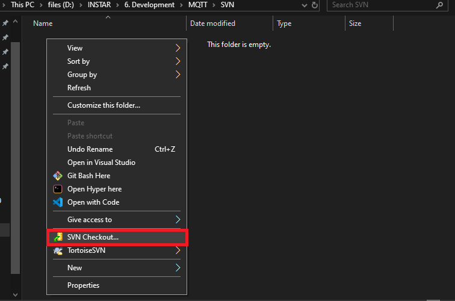
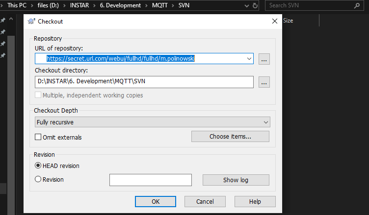
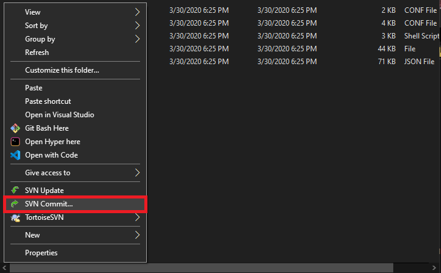

## Installing Subversion

Download and install [the latest version of Subversion](tortoisesvn.net/downloads.html)

## Checkout, Update and Commit

1. Create a folder for your project
2. Right-click inside this folder and select __SVN Checkout__

3. Copy&Paste in the URL to your project repository and add your user credentials when asked

2. Right-click inside this folder and select __SVN Commit__

