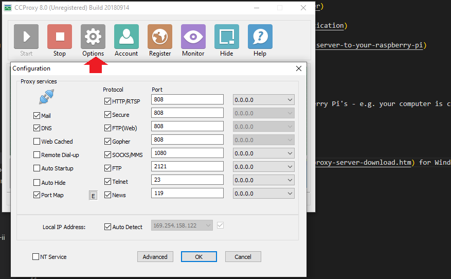
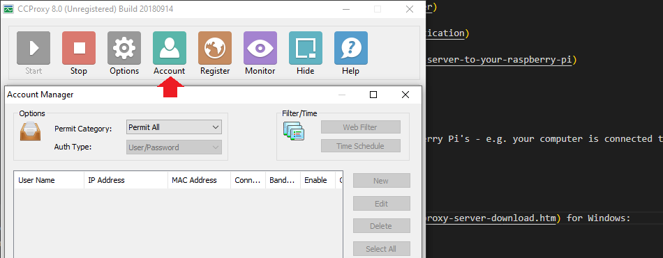
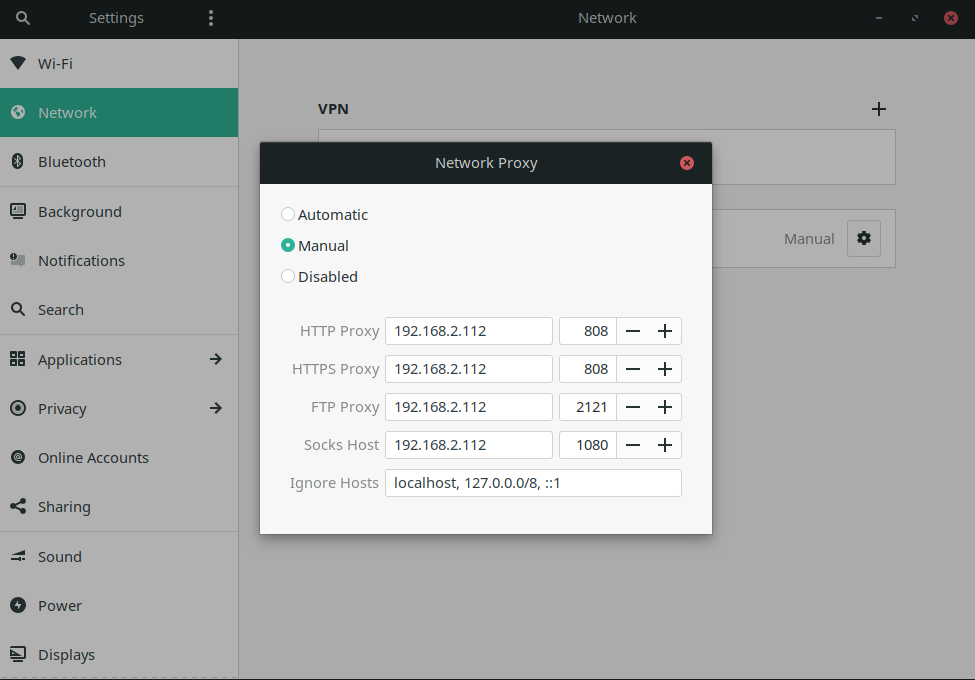

<!-- TOC -->

- [CCProxy](#ccproxy)

<!-- /TOC -->

Using your Windows 10 PC as a Proxy for your LINUX Laptop or Raspberry Pi's - e.g. your computer is connected to a seperate network that you cannot get access to from your other devices.

## CCProxy

Download and install [CCProxy](https://www.youngzsoft.net/ccproxy/proxy-server-download.htm) for Windows:

Configure your LINUX laptop to use the proxy:

