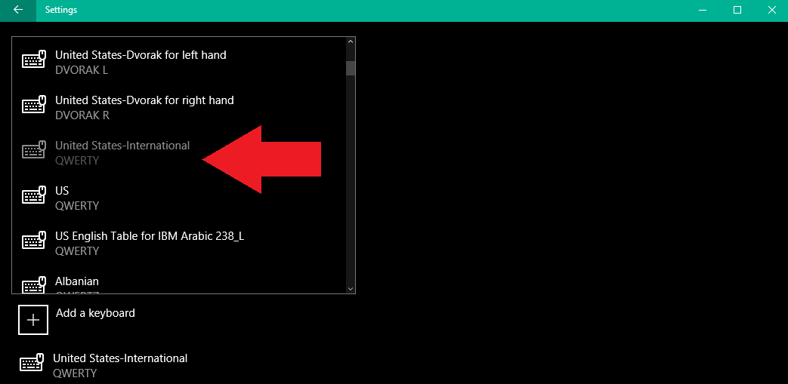

<!-- TOC -->

- [Hacking your US keyboard](#hacking-your-us-keyboard)
    - [Solving 1st World Problems by reading Usermanuals](#solving-1st-world-problems-by-reading-usermanuals)

<!-- /TOC -->


# Hacking your US keyboard

### Solving 1st World Problems by reading Usermanuals


I finally figured out how to write German Umlaute on an US keyboard, after studying the Windows 10 documentation for a while.

__tl;dr__ Switch your keyboard from ENG (US) or (UK) to ENG (International). Then type quotationmarks + the letter you want to change into an Umlaut.


```
"+a = ä
"+A = Ä
"+o = ö
"+O = Ö
"+u = ü
"+U = Ü
```

```
ALT+s = ß
```


Go to Settings and choose Time&Language


Add a language


Choose English


English (United States)


Go back to the screen from step 2 and click on options


Add a keyboard


Choose United States International. You can then go back, make this language your default and delete your previous language pack.


