import GifContainer from "../../src/components/ImageContainer";


<!-- TOC -->

- [Basic Setup](#basic-setup)
  - [Node-RED Introduction](#node-red-introduction)
- [IFTTT Setting up a Webhook](#ifttt-setting-up-a-webhook)
  - [Node-RED Contacting the external Webhook](#node-red-contacting-the-external-webhook)
  - [IFTTT Contacting a Node-RED Endpoint](#ifttt-contacting-a-node-red-endpoint)
- [Real-world example](#real-world-example)
  - [Deactivate the Alarm when I am Home](#deactivate-the-alarm-when-i-am-home)

<!-- /TOC -->


## Basic Setup

_If This Then That_, also known as [IFTTT](https://ifttt.com/) is a free web-based service to create chains of simple conditional statements, called applets. Build your own applets to connect web services with your INSTAR IP Camera.


### Node-RED Introduction

Use your Node-RED Installation under Windows, Linux (e.g. on a Raspberry Pi) to serve as an interface between your camera and the [IFTTT services](https://ifttt.com/discover). Node-RED will serve both to send messages to the IFTTT Webhook API when an event occurs on your local network, as well as provides an HTTP Endpoint for your IFTTT Applets to trigger events on your local network.

An example would be a camera triggers an alarm, contacts Node-RED that forwards a message to IFTTT, that in turns sends a message to your smartphone. Or the other way around - your phones GPS detects that you are arriving home, the IFTTT smartphone app contacts the IFTTT server that your local Node-RED installation should be informed to deactivate the motion detection on your INSTAR IP cameras.


## IFTTT Setting up a Webhook

1. First you need to [create an account](https://ifttt.com/join) on IFTTT and [login to your account](https://ifttt.com/login?wp_=1). Then go to the __My Applets__ tab and click on __New Applet__:


---

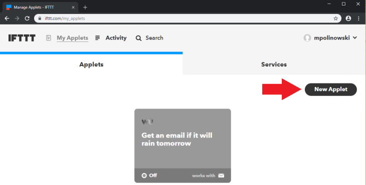

---


2. Click on __this__ to create the conditional part of the script - we want to select what needs to happen for this script to be executed:


---

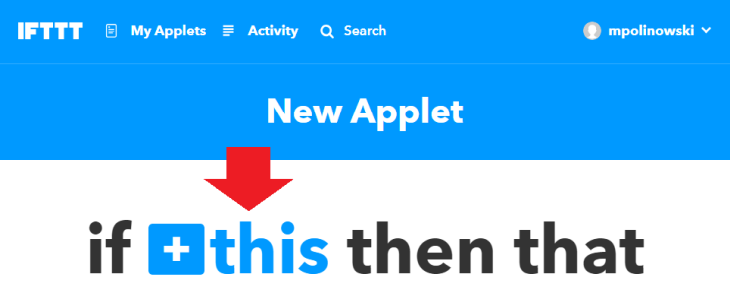

---


3. As mentioned above, we want to use the [webhook service](https://ifttt.com/services/maker_webhooks) - which is basically just a web address that your Node-RED installation needs to contact to trigger the IFTTT applet. Search for _web_ and select the __Webhooks Service__:

---

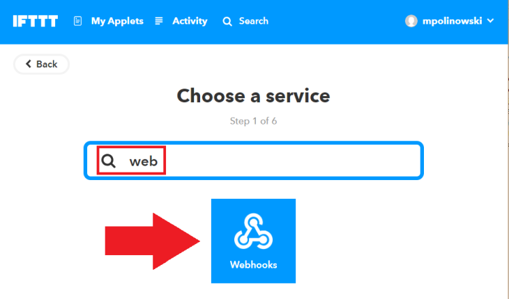

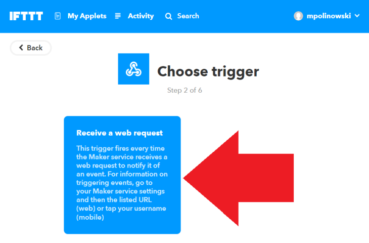

---


4. Then name the event - this will be part of the URL that we will later have to contact with Node-RED to trigger the event:


---

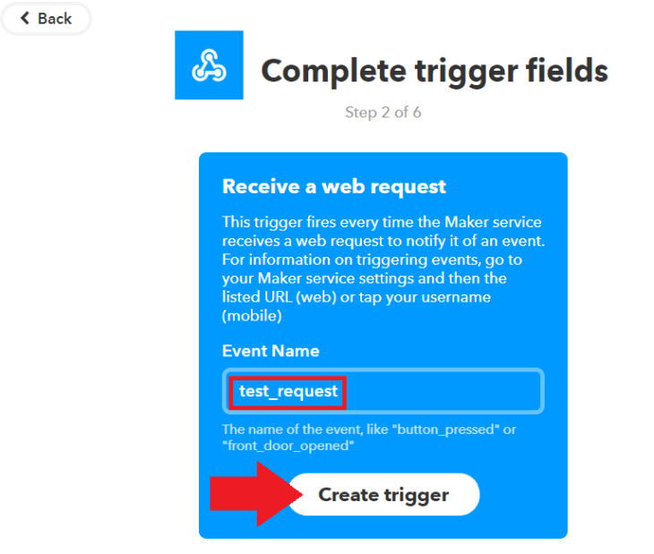

---


5. With the trigger set up we now need to assign an IFTTT service we want to trigger. To do this click on __that__:


---

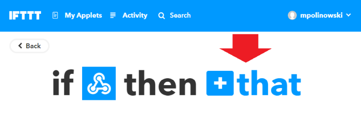

---


6. Let's use the __Email service__ - when the URL (webhook) for this applet is contacted we want to receive an Email to the address that we used to register with IFTTT:


---

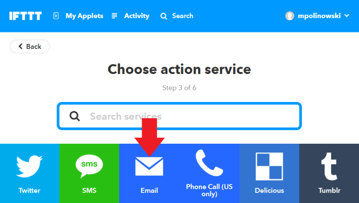

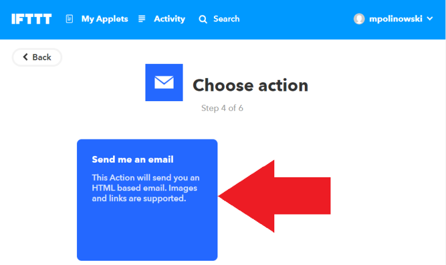

---


7. Now we can configure the subject and body text the email should have. Notice the words that are highlighted in white - these are variables that will be filled with data before the mail is sent. __EventName__ will be the name that you choose in step 4 above, __OccuredAt__ will be filled with a time stamp. The __Value 1-3__ below are variables that we can define in Node-RED and send them whenever the event is triggered in our flow - the naming, as well as the amount of variables that you want to add is up to you:


---

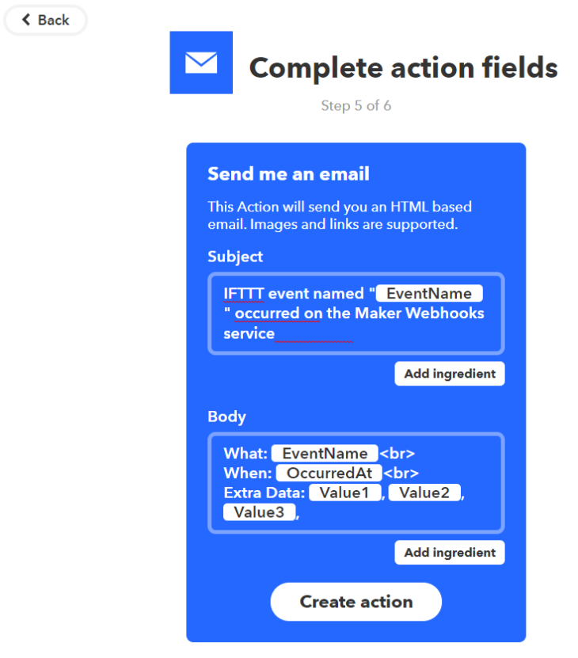

---


8. Confirm your setup and save your applet:


---

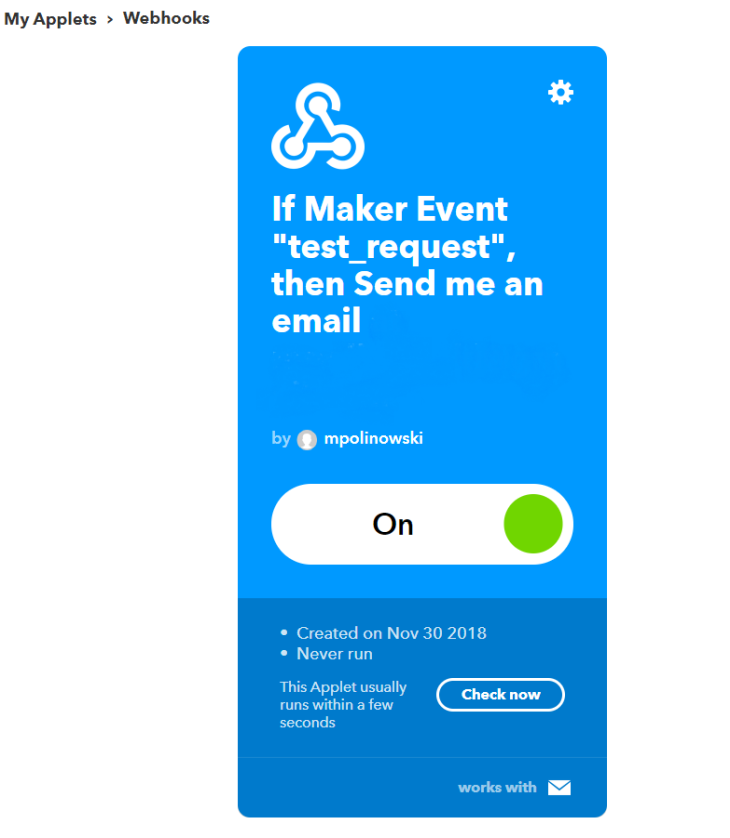

---


### Node-RED Contacting the external Webhook

Now we need to set up Node-RED to contact the webhook that we just configured whenever a local event is fired (we will be using a manual inject node to trigger it for now). The flow that we are going to build will consist of the following nodes:


---

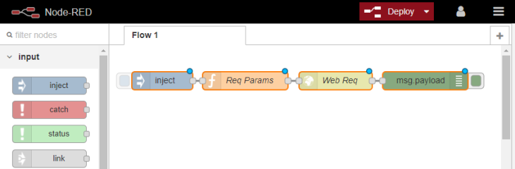

---


1. First, copy and import the following code into the Node-RED Admin Panel:

```json
[{"id":"87f67c26.0ff7b","type":"inject","z":"b8ce5e67.23af6","name":"","topic":"","payload":"","payloadType":"str","repeat":"","crontab":"","once":false,"onceDelay":"","x":90,"y":40,"wires":[["3b378299.bdbede"]]},{"id":"e8acbbcd.763f78","type":"http request","z":"b8ce5e67.23af6","name":"Web Req","method":"POST","ret":"txt","url":"https://maker.ifttt.com/trigger/{{event}}/with/key/API_KEY","tls":"","x":374,"y":40,"wires":[["9fe779e1.db2bb8"]]},{"id":"9fe779e1.db2bb8","type":"debug","z":"b8ce5e67.23af6","name":"","active":true,"tosidebar":true,"console":false,"complete":"false","x":521,"y":40,"wires":[]},{"id":"3b378299.bdbede","type":"function","z":"b8ce5e67.23af6","name":"Req Params","func":"msg.event = \"test_request\";\nmsg.payload = {\"value1\": \"testvalue1\", \"value2\": \"testvalue2\", \"value3\": \"testvalue3\"};\nreturn msg;","outputs":1,"noerr":0,"x":226,"y":40,"wires":[["e8acbbcd.763f78"]]}]
```

2. The Inject Node is set up to insert an empty string when clicked manually. It follows a __Function Node__ that has to set the __Event Name__ - needed to set the right URL for our IFTTT Webhook and a message payload that carries our three variables __Value 1-3__ that we want to display in the IFTTT Email notification:

```js
msg.event = "test_request";
msg.payload = {"value1": "testvalue1", "value2": "testvalue2", "value3": "testvalue3"};
return msg;

```


---

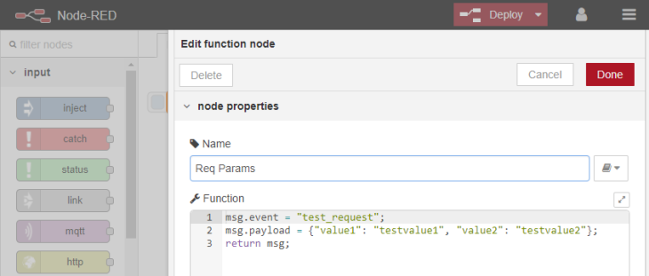

---


3. Next we have a __HTTP Request Node__ that sets the URL for our IFTTT Webhook as a __POST__ message:


```
https://maker.ifttt.com/trigger/{{event}}/with/key/API_KEY
```

__Note__ that this is using the __Event Name__ that we set as `msg.event` in the previous __Function Node__. But to identify our IFTTT account we first need to find out our personal __API_KEY__ and add it at the end of the URL:


---

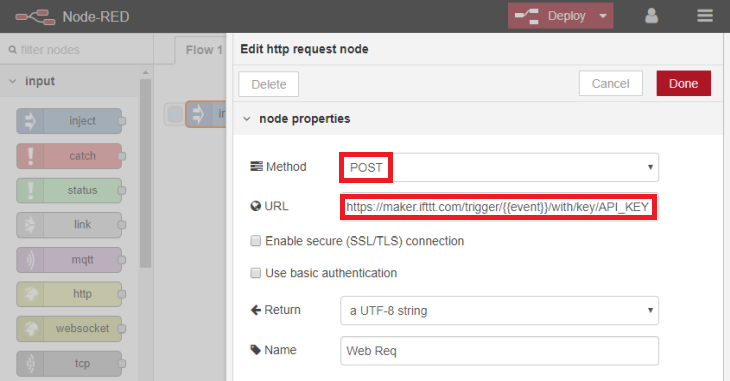

---


4. To get access to our personal API key we first have to sign in to our IFTTT account and open the following page `https://ifttt.com/services/maker_webhooks/settings`. Copy the alpha-numeric key in the Account Info - e.g. if you find the `URL: https://maker.ifttt.com/use/c3oL9WnAbz8Z08KumJWS`, then `c3oL9WnAbz8Z08KumJWS` is your API key:


---

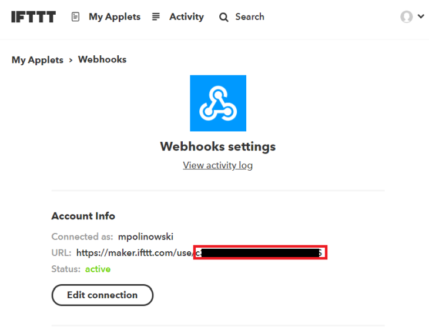

---


5. Copy your API key and replace the `API_KEY` part in the URL for the __HTTP Request Node__ in Node-RED. Then confirm the edit by hitting __Done__ and the __Deploy__ your flow:


---

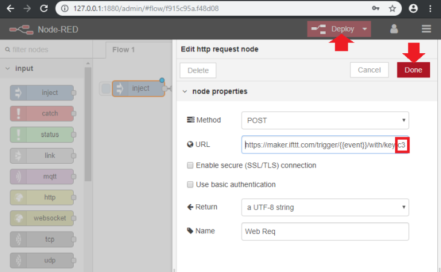

---


6. Hit the __Inject Node__ to trigger an event. The __HTTP Request Node__ will contact your IFTTT webhook and you will see a _success message_ outputted into the debug panel from the __Debug Node__ connected to the request node - `Congratulation! You fired the test_request event` - telling you that the IFTTT server was contacted and your Applet was executed:


---

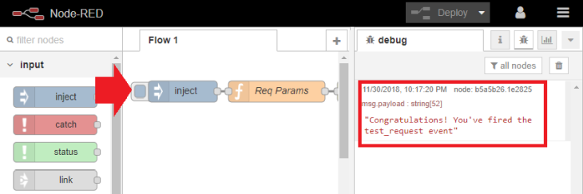

---


7. Check your Email (the one you used to register your IFTTT account) - you will have received a message from IFTTT that follows the structure we set up in the Applet configuration:


---

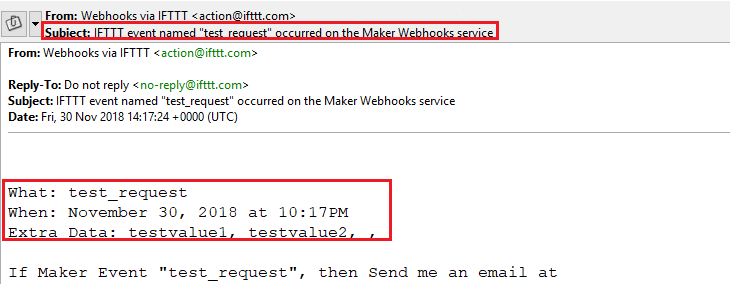

---


### IFTTT Contacting a Node-RED Endpoint

1. We now want to set up a Node-RED sequence that contacts an IFTTT Webhook - just as in the step before - but instead of sending an Email, we want IFTTT to contact our own Webhook in Node-RED and trigger an event there that we can consume in a Flow. __Note__ that this is just a proof of concept - later we want to use one of the many IFTTT services to replace the manual trigger, enabling us to connect the Node-RED webhook to services like _Amazon Alexa_, _Google Home_, _Nest Home Automation_, etc.


To set up the manual trigger, we could simply recycle the node sequence we build previously. But to explore a different approach, we are going to install a third-party node called [node-red-contrib-ifttt](https://www.npmjs.com/package/node-red-contrib-ifttt) - that basically just combines the __Function Node__ and __HTTP Request Node__ that we used earlier (__Note__ with this setup, we cannot send custom variables with the message payload - we still would have to add another function node to realize the same sequence we created earlier.):


```json
[{"id":"2efd9020.529d9","type":"inject","z":"b8ce5e67.23af6","name":"","topic":"","payload":"","payloadType":"str","repeat":"","crontab":"","once":false,"onceDelay":"","x":92,"y":139,"wires":[["7abb924d.fcfabc"]]},{"id":"7abb924d.fcfabc","type":"ifttt out","z":"b8ce5e67.23af6","eventName":"ifttt_webhook","key":"d6390bcb.c9fc08","x":236,"y":139,"wires":[]},{"id":"d6390bcb.c9fc08","type":"ifttt-key","z":""}]
```


---

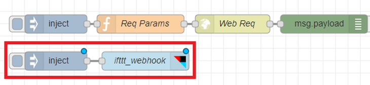

---


2. Double-Click the __IFTT Node__ to add an __Event Name__ - we choose `ifttt_webhook` -  and click on the pencil icon to add your __API key__, that we determined earlier:


---

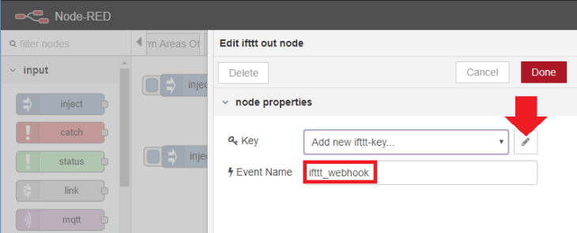

---


3. Just as in the [previous example](#ifttt-setting-up-a-webhook), we now create an Applet on IFTTT that will use a __Webhook__ to listen to the `ifttt_webhook` event. Go to the __My Applets__ tab on IFTTT and click on __New Applet__. Click on __this__ and choose a __Webhook__ as trigger:


---

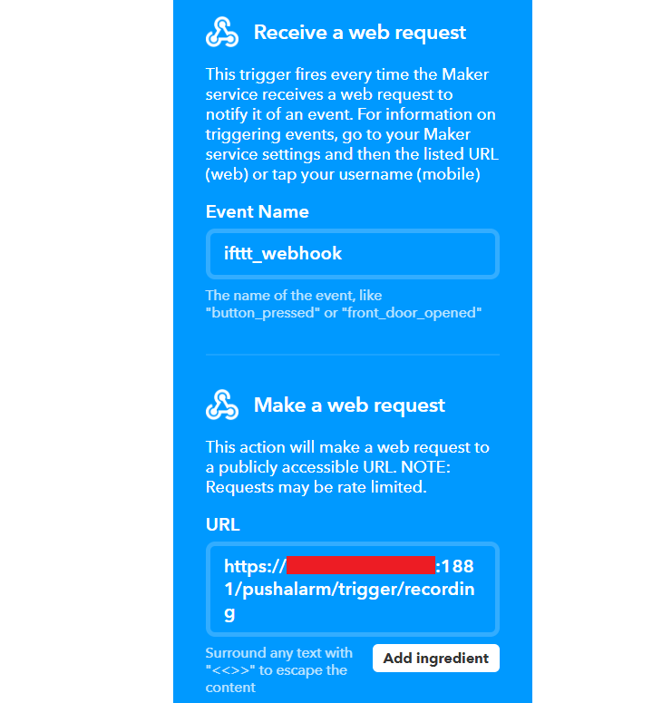

---


4. You have to give this __Webhook__ the __Event Name__ that you choose in Node-RED in the previous step and give it the URL to your Node-RED server. This can be done via the WAN IP address (__Note__ that this usually changes every 24hrs) or via your INSTAR cameras DDNS address (as long as it is on the same network as your Node-RED server!). This is followed by the port used by your Node-RED installation - by default this is the __Port 1880__. __Note__ that this port needs to be forwarded in your router for IFTTT to be able to access it! We complete the URL by adding `/pushalarm/trigger/recording` to identify the Node-RED webhook that we will have to create later.


5. We can also add a message payload to the webhook request by IFTTT - this way we will be able to use the same webhook in Node-RED for more than one IFTTT Applet - e.g. when I leave home __Applet 1__ sends the payload `{"val": "on"}` to activate the Motion Detection on my IP cameras. But if I arrive home and you receive `{"val": "off"}` from __Applet 2__, switch it off again. For this we have to switch to the __POST Method__, choose the __JSON Content Type__ and the value that we need - like `{"val": "on"}` :


---

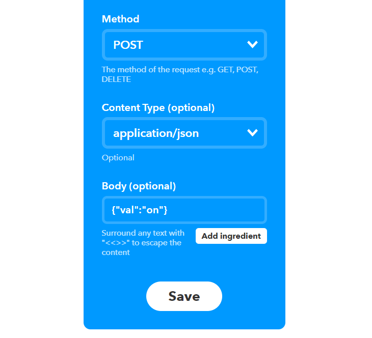

---


6. We now created an IFTTT Applet that, when triggered, will try to contact a webhook (__HTTP IN Node__) in our Node-RED installation - make sure that the URL is reachable from the internet before you continue in step 4). Let's create that HTTP Endpoint in our Node-RED Flow:


```json
[{"id":"988f4c1b.cfac3","type":"http in","z":"b8ce5e67.23af6","name":"IFTTT Trigger","url":"/pushalarm/trigger/recording","method":"post","upload":false,"swaggerDoc":"","x":86,"y":238,"wires":[["650a9d50.1e9294","df518ee6.55111"]]},{"id":"df518ee6.55111","type":"http response","z":"b8ce5e67.23af6","name":"","x":242,"y":239,"wires":[]},{"id":"650a9d50.1e9294","type":"json","z":"b8ce5e67.23af6","name":"","property":"payload","action":"","pretty":false,"x":242,"y":203,"wires":[["c2531a9f.8b5378"]]},{"id":"c2531a9f.8b5378","type":"debug","z":"b8ce5e67.23af6","name":"","active":true,"tosidebar":true,"console":false,"tostatus":false,"complete":"false","x":381,"y":203,"wires":[]}]
```


---

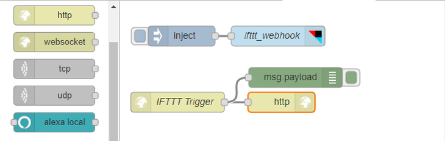

---


The sequence starts with an __HTTP IN Node__ that expects a __POST Request__ on `/pushalarm/trigger/recording` - that is the URL we added to our IFTTT Applet as the webhook that needs to be contacted. We need to add an empty __HTTP Response Node__ at the end for the webhook to be operational:


---

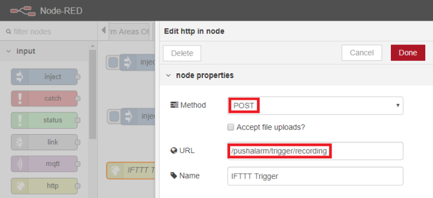

---


Beside the  __HTTP Response Node__, we also connect a __Debug Node__ that receives the payload that we set in the IFTTT Applet - the JSON payload `{"val": "on"}` will be received as a JavaScript Object that can be used by following nodes.


We can now test the chain that we build. Clicking on the __Inject Node__ will contact the __IFTTT Webhook__ that __IFTTT Applet__ is listening at. The Applet, when triggered, will then contact the __HTTP IN Node__ in our Node-RED Flow and transmit the JSON payload `{"val": "on"}`, as seen in the debug panel.


<GifContainer gifUrl="/assets/gif/IFTTT_24.gif" alt="IFTTT and Node-RED" />


## Real-world example

We are now able to trigger IFTTT Applets from a Node-RED Flow, as well as trigger the Flow through an IFTTT Applet - which opens up the whole variety of [services IFTTT](https://ifttt.com/services) offers to automate our INSTAR IP camera.


### Deactivate the Alarm when I am Home

IFTTT offers an [Android](https://play.google.com/store/apps/details?id=com.ifttt.ifttt) and [iOS](https://itunes.apple.com/jp/app/ifttt/id660944635?mt=8) App that can use the sensors on your phone to trigger your IFTTT Applets. For example, create a new Applet, choose __this__ to add a trigger and search for __location__:


---

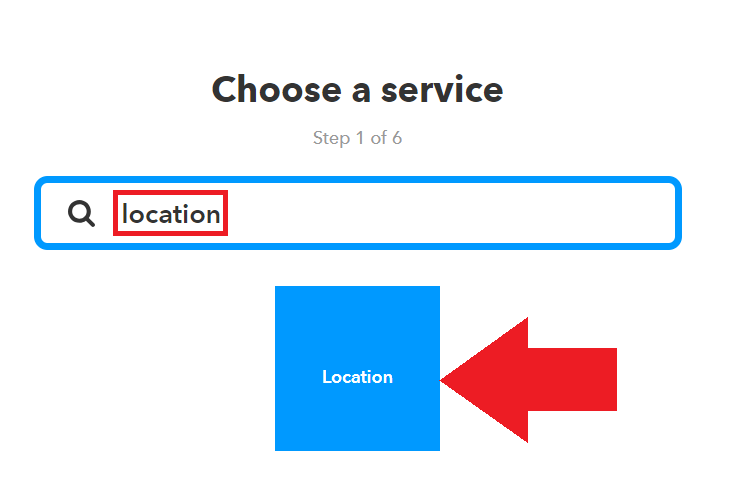

---


Select the __Location Trigger__ and choose if you want this trigger to go off when you enter an area or when you are leaving it - in the end we will have to add two applets for both cases. They can be combined into one Node-RED sequence later on. Choose _Enter Condition_ for now and point it to your home:


---

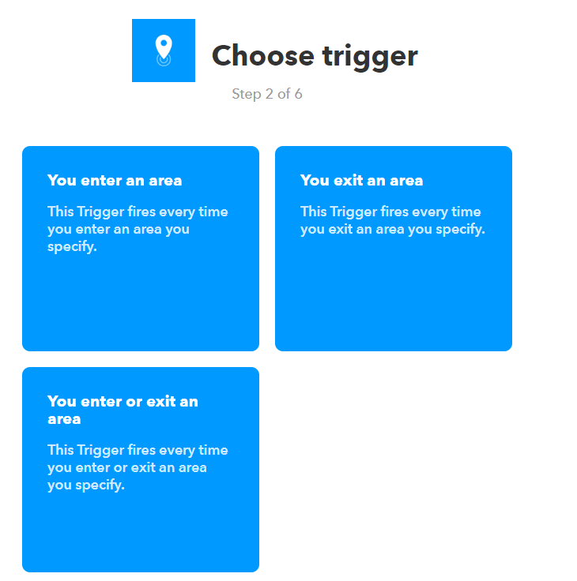

---


Now we have to select a __Webhook__ as the __that__ condition - just as we have done in the earlier example. We will create a new __HTTP IN Node__ listening on `/alarm/md/areas` in Node-RED for it - the URL for the webhook will be `https://<DDNS Address>:1880/alarm/md/areas` accordingly. The Applet has to use this URL to __POST__ the `{"val":"off"}` message:


---

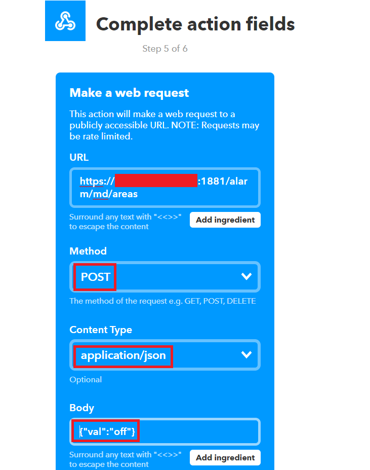

---


Repeat those steps for a second Applet that posts `{"val":"on"}`, whenever you leave the area.


We can now use a variation of the Alarm Flow that we [already used a couple of times](/Advanced_User/OpenHAB_Home_Automation/IP_Camera_Control/#setting-up-node-red) to switch the alarm areas of our INSTAR IP camera on and off when the message `{"val":"on"}` or `{"val":"off"}` is posted to our __HTTP IN Node__ webhook - you can [download the Flow from here](/Node-RED_Flows/nodered_flow_alarm_areas_IFTTT.json) and add your camera login to the __Login Node__. When the IFTTT Applets triggers our Node-RED webhook, the CGI commands for activating or deactivating the alarm areas will be send to your camera. __Note__ that the commands used here only work with HD and Full HD cameras and you can replace them with every other CGI command you need:


<GifContainer gifUrl="/assets/gif/IFTTT_28.gif" alt="IFTTT and Node-RED" />