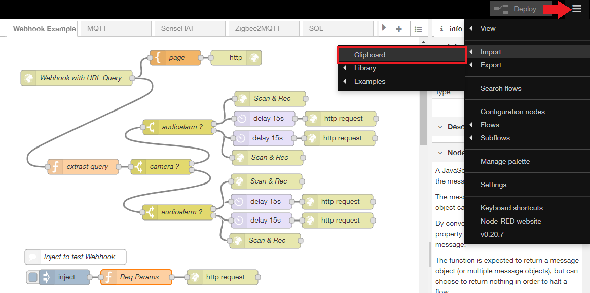
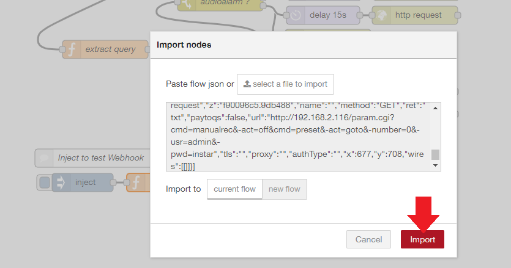

<!-- TOC -->

- [Import the Flow into Node-RED](#import-the-flow-into-node-red)

<!-- /TOC -->

Node-RED allows you to export/import your flows in a JSON format. This makes it very easy to share your work.

## Import the Flow into Node-RED

Download this JSON data into a text editor and edit the default parameter - IP addresses, logins, etc. - to match your personal setup. You can simply search & replace it.

To import it to your Node-RED installation, open the hamburger menu in the top right, choose __Import__ and __Clipboard__:

Copy & paste the data into the text field and click __Import__:

And you are all set!