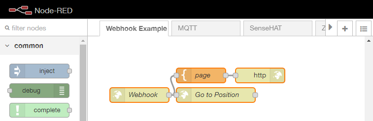
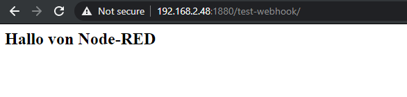
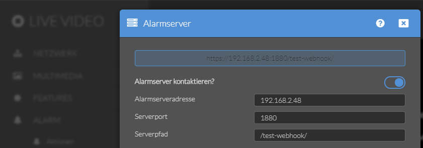

<!-- TOC -->

- [Setting up an Webhook in Node-RED](#setting-up-an-webhook-in-node-red)

<!-- /TOC -->


In IoT devices it is often necessary to propagate a state from one device to another. A very established way of doing this is by using a HTTP GET request. The receiving device needs to provide a URL that can be contacted by the device that detects the state change - e.g. motion detected. We are going to use Node-RED as our Alarmserver that will be contacted by an IP camera in case of an alarm. 


## Setting up an Webhook in Node-RED

Start by [importing the following flow](/node-red-flows-and-how-to-import-them) to your Node-RED panel:

```json
[{"id":"58bb17f6.7582b8","type":"http response","z":"f90096c5.9db488","name":"","x":430,"y":1040,"wires":[]},{"id":"e422f5bb.9081d8","type":"template","z":"f90096c5.9db488","name":"page","field":"payload","fieldType":"msg","format":"handlebars","syntax":"mustache","template":"<html>\n    <head></head>\n    <body>\n        <h2>Hallo von Node-RED</h2>\n    </body>\n</html>","x":310,"y":1040,"wires":[["58bb17f6.7582b8"]]},{"id":"d453a0d1.bfe63","type":"http in","z":"f90096c5.9db488","name":"Webhook","url":"/test-webhook/","method":"get","upload":false,"swaggerDoc":"","x":185,"y":1080,"wires":[["e422f5bb.9081d8","99d441b.1dd64c"]]},{"id":"99d441b.1dd64c","type":"http request","z":"f90096c5.9db488","name":"Go to Position","method":"GET","ret":"txt","paytoqs":false,"url":"http://192.168.2.117/param.cgi?cmd=preset&-act=goto&-number=2&-usr=admin&-pwd=instar","tls":"","persist":false,"proxy":"","authType":"","x":340,"y":1080,"wires":[[]]}]
```

The flow consists of 4 Nodes:





The HTTP entry node on the left gives us our webhook and we have to set the URL here that we want expose to our network - `"url":"/test-webhook/"`. I added some HTML and an HTTP response node to make it an valid URL that can be contacted by external devices and used to inject information to our flow.


Connected to our webhook is a HTTP request node that contacts an IP camera (`http://192.168.2.117/`) on our network and sends an [CGI command](https://wiki.instar.com/1080p_Series_CGI_List/) to have it do something - the command `/param.cgi?cmd=preset&-act=goto&-number=2&-usr=admin&-pwd=instar` sends our camera to preset position 3.


Here you can use __ANY__ action supported by Node-RED as a response to someone contacting our webhook.


To test that our webhook is operational we can call it from our browsers address bar - `http://Node-RED-Server-Address-and-Port/test-webhook/` :





The URL should lead you to the HTML page created by the Node-RED webhook. Once you opened the website the flow is triggered and action that you connected to the hook will be executed. In my case I have a camera start moving into a preset position.


Now all you have to do is adding this URL to your sensor device. As an example I will use a second IP camera that, once it detects motion, will contact the first camera and tells it to turn around to see what is happening:


