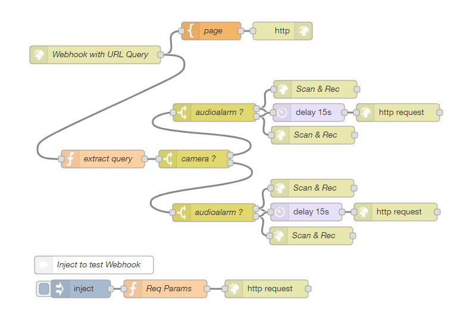
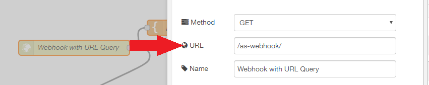
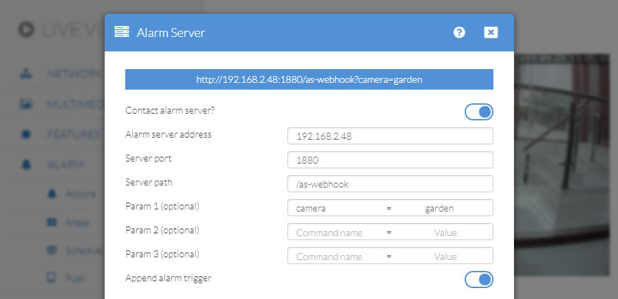
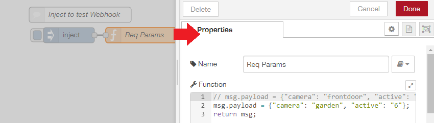

<!-- TOC -->

- [Setup](#setup)
  - [What we want](#what-we-want)
  - [Node-RED Flow](#node-red-flow)
  - [Alarmserver Configuration](#alarmserver-configuration)
  - [Testing](#testing)

<!-- /TOC -->

INSTAR IP cameras offer an Alarmserver Function - [1080p Models](https://wiki.instar.com/Web_User_Interface/1080p_Series/Alarm/Alarm_Server/), [720p Models](https://wiki.instar.com/Web_User_Interface/720p_Series/Alarm/Alarmserver/) - that allows you to send a request to a home automation system on your network. Thus, notifying your smarthome and trigger an response.

In an recent update they introduced parameters (__URL Queries__) that can be appended to this HTTP GET request. There are three custom parameters available as well as a specified parameter that can tell us what triggered the alarm. The latter - called `active` can have the following 10 values:

* Alarm Area 1 triggered: `&active=1`
* Alarm Area 2 triggered: `&active=2`
* Alarm Area 3 triggered: `&active=3`
* Alarm Area 4 triggered: `&active=4`
* Alarm-In / PIR triggered: `&active=5`
* Audio Alarm triggered: `&active=6`
* Motion Detection & triggered (Area 1): `&active=7`
* Motion Detection & triggered (Area 2): `&active=8`
* Motion Detection & triggered (Area 3): `&active=9`
* Motion Detection & triggered (Area 4): `&active=10`

We now want to build a Webhook in Node-RED - as a placeholder for one of the many smarthome solutions available - and have this Webhook trigger different actions depending on the __URL Query__ it receives.

## Setup

* First camera: IP=192.168.2.116, port=80, name=frontdoor, login=admin/instar
* Second camera: IP=192.168.2.117, port=80, name=garden, login=admin/instar
* Node-RED Server: IP=192.168.2.48, port=1880

### What we want

If our first camera is triggered we want it to contact the Node-RED Webhook, identify itself as __frontdoor__ and if the alarm was triggered by an [audio detection](https://wiki.instar.com/Web_User_Interface/1080p_Series/Alarm/Actions/) (`&active=6`), we want to camera to move to stored _position 3_ - which is where we estimate that the noise will be coming from. If the alarm was triggered by the internal motion detection (so the query will be __not__ `&active=6`), we want to contact our second camera __garden__ and have it swing around (_position 2_) to check out the area, where the motion was detected.

And vice versa - if our second camera triggers an alert it should contact the Node-RED Webhook, identify as __garden__, and in case of an audio alarm have it move to _position 3_. If the alarm trigger was not the audio detection the __frontdoor__ camera should be contacted instead and move to _position 2_.

To reset our setup after an alarm trigger, we can set _position 1_ to be our cameras [Park Position](https://wiki.instar.com/Web_User_Interface/1080p_Series/Features/PTZ/). Or actively send a command to our camera to go back to the idle position - with a delay of our choosing.

### Node-RED Flow

In this flow we setup a Webhook under the URL `/as-webhook/` - so that we can contact it under the IP/Port of our Node-RED server + URL. In this case this is: `http://192.168.2.48:1880/as-webhook/`:

When we receive a GET request via this URL, we now have to strip the URL queries that have been send with it. First we check for a query called `camera` and see if it has the value `frontdoor` or `garden`, to identify the camera that contacted us.

An then we have to check for the `active` parameter, to if the alarm was triggered by the audio alarm - `&active=6` - or not. If yes, we have to return the CGI command to start a video recording and move to __position 3__ to the triggering camera. Otherwise, send the CGI command to move to __position 2__ and start recording to the other camera.

And after a set time - I will choose 15s - we have to send the command to stop the recording and to move back to position 1. 

For our first camera those commands are as follows:

__ALARM ACTION__

* `http://192.168.2.116/param.cgi?cmd=manualrec&-act=on&-time=60&cmd=preset&-act=goto&-number=2&-usr=admin&-pwd=instar` // if `&active=6`
* `http://192.168.2.117/param.cgi?cmd=manualrec&-act=on&-time=60&cmd=preset&-act=goto&-number=1&-usr=admin&-pwd=instar` // if __not__ `&active=6`

__RESET__

* `http://192.168.2.116/param.cgi?cmd=manualrec&-act=off&cmd=preset&-act=goto&-number=0&-usr=admin&-pwd=instar` // if `&active=6`
* `http://192.168.2.117/param.cgi?cmd=manualrec&-act=off&cmd=preset&-act=goto&-number=0&-usr=admin&-pwd=instar` // if __not__ `&active=6`

### Alarmserver Configuration

The Alarmserver inside our camera has to be configured as follows:

For the other camera we just have to set the camera name to `camera = frontdoor`. All done!

Now every time the alarm on our camera is triggered it will contact our Node-RED Webhook and sends both it's name and the alarm trigger.

### Testing

You can use the __Inject Node__ to test that Node-RED is set up correctly. By clicking on the node, you will send a GET request to your Webhook and transmit the following parameter as query:

