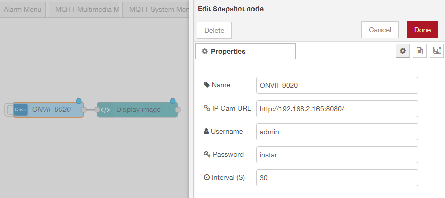
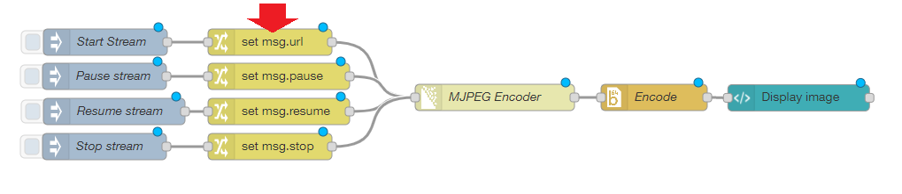

<!-- TOC -->

- [Using your Cameras Snapshot](#using-your-cameras-snapshot)
    - [Flow Export](#flow-export)
- [Using your Cameras ONVIF Service](#using-your-cameras-onvif-service)
    - [Flow Export](#flow-export-1)
- [Using your Cameras MJPEG Stream](#using-your-cameras-mjpeg-stream)
    - [Flow Export](#flow-export-2)

<!-- /TOC -->


This tutorial explores several ways to add your INSTAR cameras live image to the [Node-RED Dashboard](https://flows.nodered.org/node/node-red-dashboard). You might have to install the corresponding Nodes to use the flows below:


* [node-red-node-base64](https://flows.nodered.org/node/node-red-node-base64)
* [node-red-contrib-onvif](https://flows.nodered.org/node/node-red-contrib-onvif)
* [node-red-contrib-multipart-stream-encoder](https://flows.nodered.org/node/node-red-contrib-multipart-stream-encoder)


## Using your Cameras Snapshot

The simplest way to add your camera's live video is by requesting a live snapshot in an settable interval and using an image tag to display it as a stream on the Node-RED dashboard. For this we need to use an HTTP Request Node to GET the image from our camera and then convert the it using [node-red-node-base64](https://flows.nodered.org/node/node-red-node-base64) to feed it into an HTML template node.


The snapshot path for your INSTAR HD or Full HD camera is:

* http://IP-Address:Port/tmpfs/snap.jpg?usr=admin&pwd=instar
_Snapshot (1080p)_

* http://IP-Address:Port/tmpfs/auto.jpg?usr=admin&pwd=instar
_Snapshot (320p)_

* http://IP-Address:Port/tmpfs/auto2.jpg?usr=admin&pwd=instar
_Snapshot (160p)_


You can import the flow below and change the IP address and login to match that of your personal camera - `http://192.168.178.21/tmpfs/snap.jpg?usr=admin&pwd=instar`.


### Flow Export

```json
[{"id":"86fe9b81.31c418","type":"http request","z":"fafa85fb.98fd68","name":"","method":"GET","ret":"bin","paytoqs":false,"url":"http://192.168.178.21/tmpfs/snap.jpg?usr=admin&pwd=instar","tls":"","proxy":"","authType":"","x":265,"y":343,"wires":[["4068ec45.05b034"]]},{"id":"54d0ea94.c1b9a4","type":"ui_template","z":"fafa85fb.98fd68","group":"73b331f4.a8bda","name":"Display image","order":1,"width":"6","height":"6","format":"\n\n","storeOutMessages":true,"fwdInMessages":true,"templateScope":"local","x":575.3645515441895,"y":343.6041603088379,"wires":[[]]},{"id":"4068ec45.05b034","type":"base64","z":"fafa85fb.98fd68","name":"","action":"","property":"payload","x":415,"y":343,"wires":[["54d0ea94.c1b9a4"]]},{"id":"3fa57e6a.6819f2","type":"inject","z":"fafa85fb.98fd68","name":"","topic":"","payload":"","payloadType":"date","repeat":"","crontab":"","once":false,"onceDelay":0.1,"x":115,"y":343,"wires":[["86fe9b81.31c418"]]},{"id":"73b331f4.a8bda","type":"ui_group","z":"","name":"HTTP Snap","tab":"d75e440d.a22678","disp":true,"width":"6","collapse":false},{"id":"d75e440d.a22678","type":"ui_tab","z":"fafa85fb.98fd68","name":"Cameras","icon":"camera_alt","order":2}]
```


## Using your Cameras ONVIF Service


Use the ONVIF snapshot node to connect to your camera's ONVIF service. Make sure that the [Service is activated](/Web_User_Interface/1080p_Series/Network/ONVIF/), the authentication is set and note the ONVIF port that your camera is using. Use your camera's IP address, ONVIF port and your camera administrator login to configure the ONVIF node.





### Flow Export

```json
[{"id":"a1428a3e.9b4d78","type":"ONVIF Snapshot","z":"3ad90760.562918","name":"ONVIF 9020","url":"http://192.168.2.165:8080/","interval":"30","username":"admin","password":"instar","active":false,"x":290,"y":183,"wires":[["5f85bc5d.988a14"]]},{"id":"5f85bc5d.988a14","type":"ui_template","z":"3ad90760.562918","group":"b51595ca.fcd178","name":"Display image","order":1,"width":"6","height":"6","format":"\n","storeOutMessages":true,"fwdInMessages":true,"templateScope":"local","x":467,"y":183,"wires":[[]]},{"id":"b51595ca.fcd178","type":"ui_group","z":"fafa85fb.98fd68","name":"ONVIF","tab":"d75e440d.a22678","order":1,"disp":true,"width":"6","collapse":false},{"id":"d75e440d.a22678","type":"ui_tab","z":"fafa85fb.98fd68","name":"Cameras","icon":"camera_alt","order":2}]
```


## Using your Cameras MJPEG Stream


The following flow uses both the [node-red-node-base64](https://flows.nodered.org/node/node-red-node-base64) and [node-red-contrib-multipart-stream-encoder](https://flows.nodered.org/node/node-red-contrib-multipart-stream-encoder) node to embed your cameras MJPEG stream in the Node-RED dashboard.





The MJPEG path for your INSTAR HD and Full HD camera is:


* http://IP-Address:Port/mjpegstream.cgi?-chn=11&-usr=admin&-pwd=instar
_MJPEG Stream 11_
* http://IP-Address:Port/mjpegstream.cgi?-chn=12&-usr=admin&-pwd=instar
_MJPEG Stream 12_
* http://IP-Address:Port/mjpegstream.cgi?-chn=13&-usr=admin&-pwd=instar
_MJPEG Stream 13_


Please change the IP address and login according to your camera setup: `http://192.168.2.117/mjpegstream.cgi?-chn=13`. The URL is set inside the __set msg.url__ node as marked in the screenshot above.


### Flow Export

```json
[{"id":"bcfdc528.e179f8","type":"base64","z":"3ad90760.562918","name":"Encode","action":"","property":"payload","x":900,"y":652,"wires":[["9ac64835.1ca948"]]},{"id":"9ac64835.1ca948","type":"ui_template","z":"3ad90760.562918","group":"9f4bace2.7b09a","name":"Display image","order":1,"width":"6","height":"6","format":"\n","storeOutMessages":true,"fwdInMessages":true,"templateScope":"local","x":1063.256923675537,"y":652.4166660308838,"wires":[[]]},{"id":"58723502.20fb1c","type":"inject","z":"3ad90760.562918","name":"Start Stream","topic":"","payload":"","payloadType":"date","repeat":"","crontab":"","once":false,"onceDelay":"","x":280,"y":589,"wires":[["f3dc375f.005998"]]},{"id":"f3dc375f.005998","type":"change","z":"3ad90760.562918","name":"","rules":[{"t":"set","p":"url","pt":"msg","to":"http://192.168.2.117/mjpegstream.cgi?-chn=13","tot":"str"}],"action":"","property":"","from":"","to":"","reg":false,"x":466,"y":589,"wires":[["ac461010.24496"]]},{"id":"ac461010.24496","type":"multipart-decoder","z":"3ad90760.562918","name":"MJPEG Encoder","ret":"bin","url":"","tls":"","delay":"5","maximum":"10000000","blockSize":"1","x":720,"y":652,"wires":[["bcfdc528.e179f8"]]},{"id":"4821ba30.2f4374","type":"inject","z":"3ad90760.562918","name":"Pause stream","topic":"","payload":"true","payloadType":"bool","repeat":"","crontab":"","once":false,"x":279.00001525878906,"y":628,"wires":[["e32d48eb.0b1358"]]},{"id":"ffa25a37.8b6208","type":"inject","z":"3ad90760.562918","name":"Resume stream","topic":"","payload":"true","payloadType":"bool","repeat":"","crontab":"","once":false,"x":290,"y":668,"wires":[["8d2e7e10.68e59"]]},{"id":"69f879bd.8d8c38","type":"inject","z":"3ad90760.562918","name":"Stop stream","topic":"","payload":"true","payloadType":"bool","repeat":"","crontab":"","once":false,"x":279.00001525878906,"y":708,"wires":[["b9d3d5af.e7d4f8"]]},{"id":"e32d48eb.0b1358","type":"change","z":"3ad90760.562918","name":"","rules":[{"t":"set","p":"pause","pt":"msg","to":"payload","tot":"msg"}],"action":"","property":"","from":"","to":"","reg":false,"x":476.00001525878906,"y":628,"wires":[["ac461010.24496"]]},{"id":"8d2e7e10.68e59","type":"change","z":"3ad90760.562918","name":"","rules":[{"t":"set","p":"resume","pt":"msg","to":"payload","tot":"msg"}],"action":"","property":"","from":"","to":"","reg":false,"x":476.00001525878906,"y":668,"wires":[["ac461010.24496"]]},{"id":"b9d3d5af.e7d4f8","type":"change","z":"3ad90760.562918","name":"","rules":[{"t":"set","p":"stop","pt":"msg","to":"payload","tot":"msg"}],"action":"","property":"","from":"","to":"","reg":false,"x":466.00001525878906,"y":708,"wires":[["ac461010.24496"]]},{"id":"9f4bace2.7b09a","type":"ui_group","z":"","name":"MJPEG Encoder","tab":"d75e440d.a22678","disp":true,"width":"6","collapse":false},{"id":"d75e440d.a22678","type":"ui_tab","z":"fafa85fb.98fd68","name":"Cameras","icon":"camera_alt","order":2}]
```