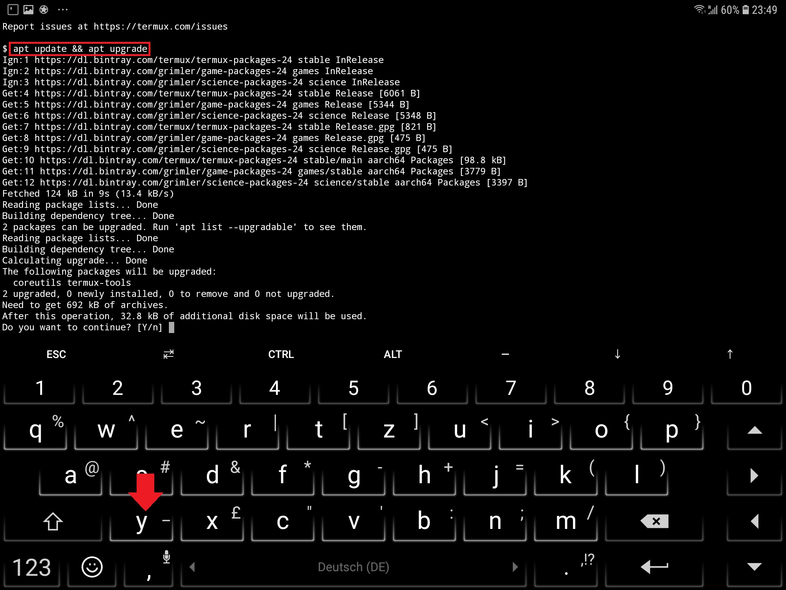
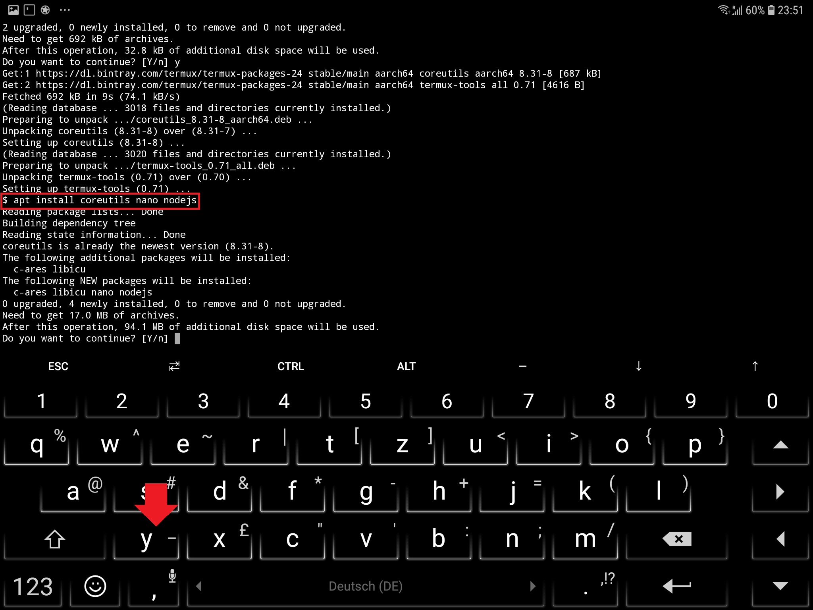
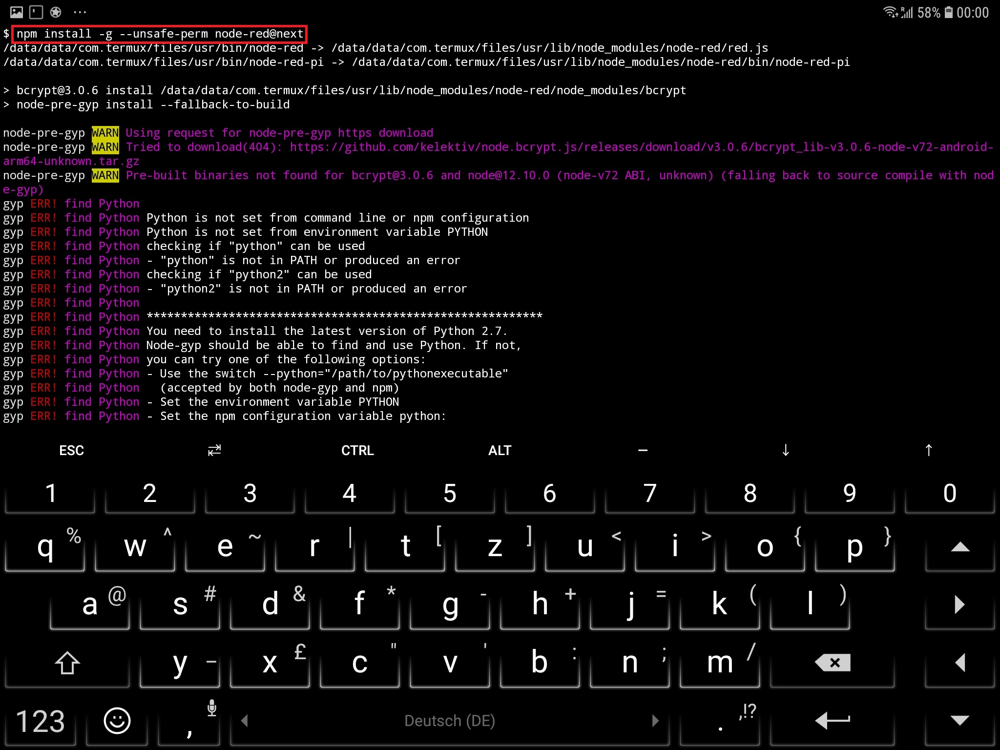
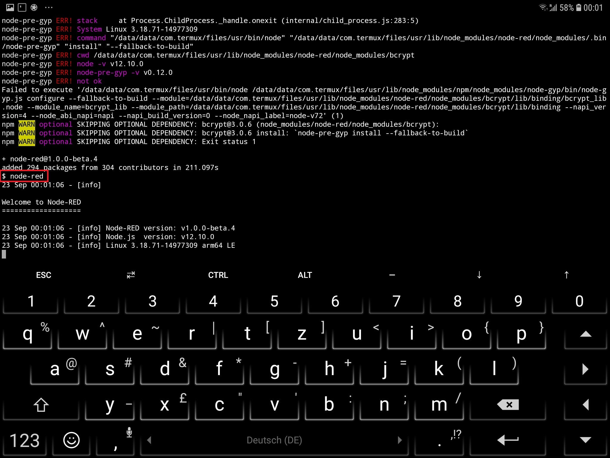
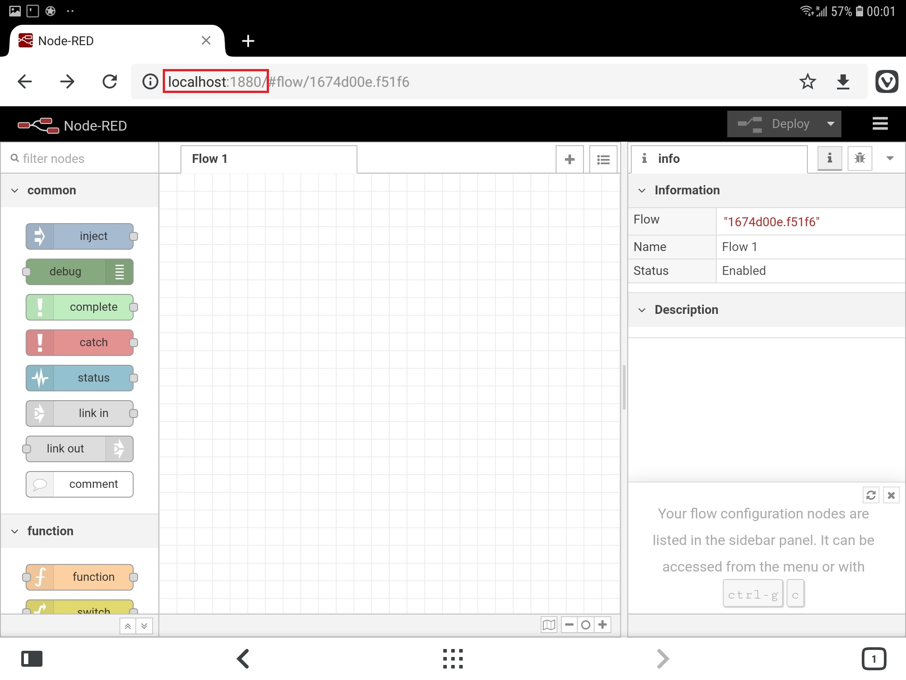

<!-- TOC -->

<!-- /TOC -->

[Termux](https://termux.com) now allows you to install [Node-RED](https://nodered.org) directly on your Android phone or tablet - turning it into the a powerful smarthome gateway.

---

---

Start by installing [Termux](https://termux.com) on your Android device and start the app. Make sure that everything is up-to-date by running `apt update && apt upgrade`.

---

---

[Node-RED](https://nodered.org) runs in [Node.js](https://nodejs.org/) which we can now install on our Android device by running the following command: `apt install coreutils nano nodejs`.

---

---

Now with [Node.js](https://nodejs.org/) in place we can install [Node-RED](https://nodered.org) with the following command: `npm install -g --unsafe-perm node-red`.

---

---

You can start up [Node-RED](https://nodered.org) by typing `node-red`.

---

---

Now start your default Android web browser and open `http://localhost:1880` to access the [Node-RED](https://nodered.org) interface.