<!-- TOC -->

- [Debian Installation](#debian-installation)
- [Creating a Node Administrator User](#creating-a-node-administrator-user)
- [Installing Node-RED](#installing-node-red)
  - [Run Node-RED as a Service](#run-node-red-as-a-service)
  - [Create the SSL Certificate](#create-the-ssl-certificate)
  - [Configuring Node-RED](#configuring-node-red)
  - [The Node-RED Admin Panel](#the-node-red-admin-panel)
- [Installing Mosquitto](#installing-mosquitto)
  - [Configuring Mosquitto](#configuring-mosquitto)
  - [Testing Mosquitto from an external Machine](#testing-mosquitto-from-an-external-machine)
  - [Adding SSL Encryption](#adding-ssl-encryption)
- [Using Node-RED to communicate with your Camera](#using-node-red-to-communicate-with-your-camera)
    - [Alarm SET Flow](#alarm-set-flow)
    - [Alarm Recording](#alarm-recording)
      - [FTP Snapshot](#ftp-snapshot)

<!-- /TOC -->


## Debian Installation

We choose to install Node-RED through Node.js under __Debian 9 Linux__ on our mini PC - you can check the [Node.js Wiki](https://nodejs.org/en/download/package-manager/) for more Linux flavours. To create the installation USB stick we [downloaded the minimal amd64 image](https://www.debian.org/CD/netinst/) and used the tool __Etcher__ to prepare the USB stick. Once the USB stick is ready, deactivate secure boot in your mini PC's BIOS and boot from the stick. We are not going to need a desktop environment. But __make sure that you install the SSH service__ - as we are going to use the SSH service to set up the Debian server.


## Creating a Node Administrator User

Let's create a user to administer the Node.js processes:

```bash
adduser nodeadmin
```


---

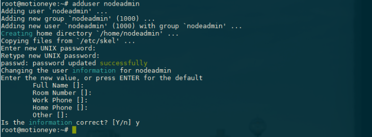

---


And make sure that the user is allowed to use the `sudo` command and switch users:


```bash
apt-get install sudo
addgroup nodeadmin sudo
su - nodeadmin
```


---

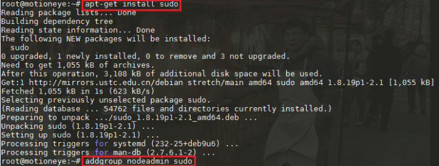

---


## Installing Node-RED

We first need to install the [Node.js](https://nodejs.org/en/) runtime and will use the Node Packet Manager (npm) to install [Node-RED](https://nodered.org) in the second step:


```bash
curl -sL https://deb.nodesource.com/setup_11.x | bash -
sudo apt-get install -y nodejs
```

Type in the install command and use your `nodeadmin` password to be allowed to execute it with `sudo`:


---

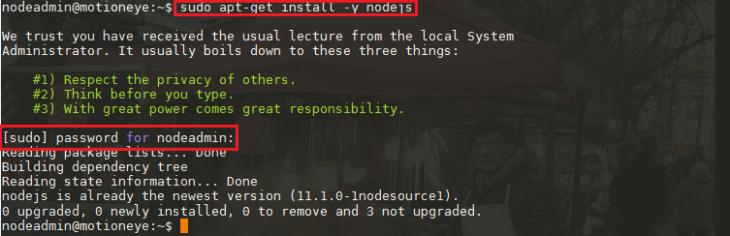

---
_(in case of the screenshot above, Node.js was already installed from a setup)_


Now, with the Node runtime installed, we can install Node-RED using the Node Package Manager `npm`:

```bash
sudo npm install -g --unsafe-perm node-red
```


---

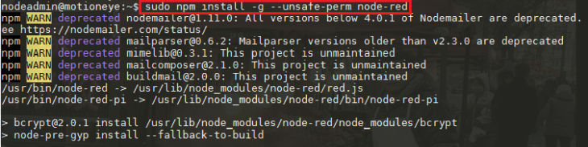

---


### Run Node-RED as a Service

[PM2](https://pm2.io/doc/en/runtime/guide/process-management/) is a process manager for Node.js. It makes it easy to run applications on boot and ensure they are restarted if necessary. Just like Node-RED, we can install PM2 from npm:


```bash
sudo npm install -g pm2
pm2 start /usr/bin/node-red
```


---

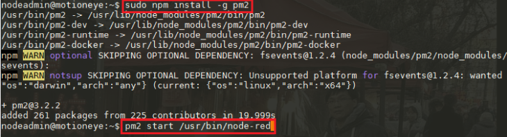
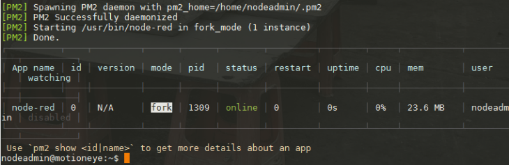

---


The second command takes the Node-RED process and runs it inside the Node.js runtime. PM2 is able to generate and configure a start-up script suitable for the platform it is being run on. Run these commands and follow the instructions it provides:


---

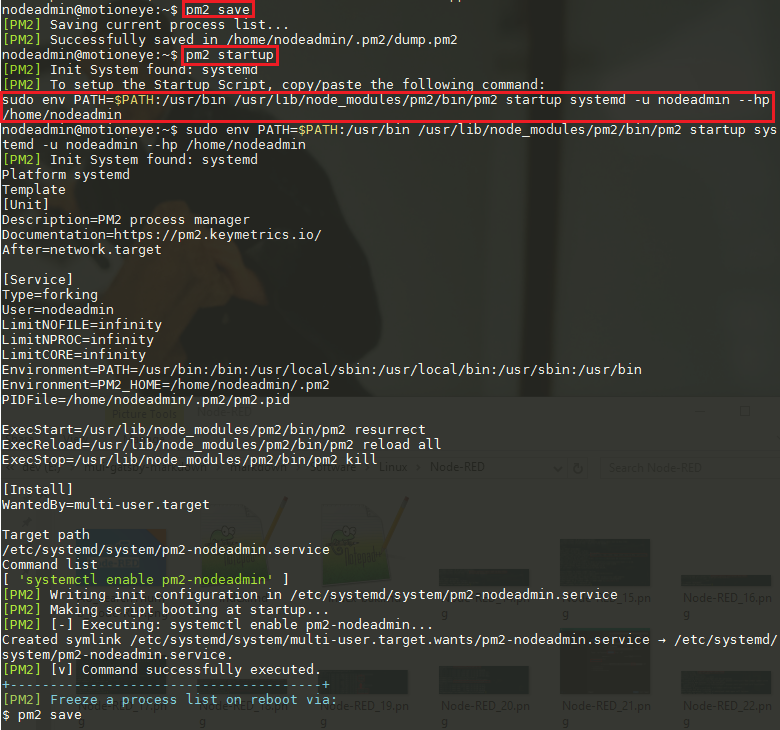

---


```bash
pm2 save
pm2 startup
sudo env PATH=$PATH:/usr/bin /usr/lib/node_modules/pm2/bin/pm2 startup systemd -u nodeadmin --hp /home/nodeadmin
```


The default port for the Node-RED admin panel is `1880` - let's make sure that FirewallD allows this traffic:


```bash
sudo firewall-cmd --permanent --zone=public --add-port=1880/tcp
```


### Create the SSL Certificate

We can create a self-signed key and certificate pair with OpenSSL in a single command:


```bash
sudo openssl req -x509 -nodes -days 365 -newkey rsa:2048 -keyout /home/nodeadmin/.node-red/certs/node-red-selfsigned.key -out /home/nodeadmin/.node-red/certs/node-red-selfsigned.crt
```


---

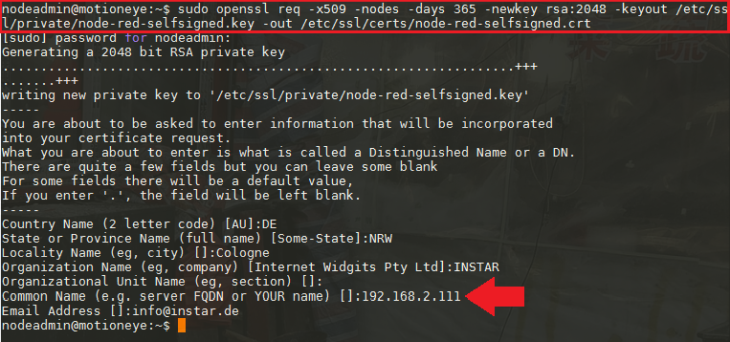

---


__Note__ that the server name is set to the local IP address of our Debian server (you have to change it according to your setup). If you want to access your Node-RED installation over a domain, you have to use this one here instead.


These options will create both a key file and a certificate. We will be asked a few questions about our server in order to embed the information correctly in the certificate. Those certificates will be used in the next step to set up the access over HTTPS to the Node-RED Admin-Panel.


### Configuring Node-RED


You will be able to find the Node-RED configuration file under `/home/nodeadmin/.node-red/`. Let's open the file to add some additional configuration:


```bash
nano /home/nodeadmin/.node-red/settings.js
```


---

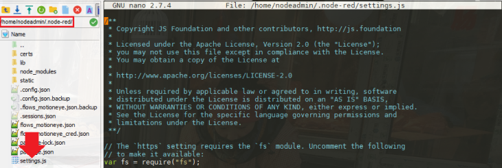

---


With all the comments removed the file should boil down to the following:


```js
var fs = require("fs");
module.exports = {
    uiPort: process.env.PORT || 1880,
    mqttReconnectTime: 15000,
    serialReconnectTime: 15000,
    debugMaxLength: 1000,
    httpAdminRoot: '/admin',
    httpStatic: '/home/nodeadmin/.node-red/static/',
    ui: { path: "reddash" },
    adminAuth: {
        type: "credentials",
        users: [{
            username: "admin",
            password: "$2a$08$k.syiLYKsLGJdy01hPolj.m7dfgZXWz0do4oKkesLrJExoYgFBZYu",
            permissions: "*"
        }],
        default: {
            permissions: "read"
        }
    },
    https: {
        key: fs.readFileSync('/home/nodeadmin/.node-red/certs/node-red-selfsigned.key'),
        cert: fs.readFileSync('/home/nodeadmin/.node-red/certs/node-red-selfsigned.crt')
    },
    requireHttps: true,
    functionGlobalContext: {},
    logging: {
        console: {
            level: "info",
            metrics: false,
            audit: false
        }
    },
    editorTheme: {
        projects: {
            enabled: false
        }
    },
}
```

Noteable changes:

* Uncommented the import of `fs` (needed to add the SSL certificate)
* httpAdminRoot is set to `/admin` - that means that Node-RED admin panel is available under `https://<IP Address>:1880/admin/` instead of  `https://<IP Address>:1880/`
* We created a folder `/home/nodeadmin/.node-red/static/` to host static content for the Node-RED flow.
* The [node-red-dashboard](https://flows.nodered.org/node/node-red-dashboard) is an optional plugin for Node-RED that allows us to create - well, a dashboard... The line `ui: { path: "reddash" }` sets the URL for this dashboard to  `https://<IP Address>:1880/reddash/`.
* For the `adminAuth` we create an Admin Login and set the default permission to `read` - which means that everyone can open the dashboard and see our Node-RED flows - but only the admin has the right to change them (you can remove the default permission, if not necessary).
* For `https` we linked in the certificate we created in the step before. Don't forget to set `requireHttps: true` to enforce an encrypted connection.


### The Node-RED Admin Panel

If you followed the recommendations above, you are now able to access Node-RED over `https://<IP Address>:1880/admin/` - in my case this is `https://192.168.2.111:1880/admin/`. Click on the user icon in the top left, login with the admin login you generated in the previous step and click on menu icon (on the right of the user login) and open the __Manage Palette__ menu:


---

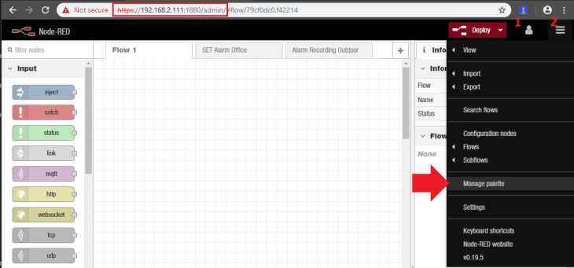

---


In the following tutorials we are going to use a couple of functions that don't come with Node-RED directly. But we can install them from the [Node-RED Flow Library](https://flows.nodered.org) - feel free to browse it and see if there is something that you can use.

You can install those from the palette menu - I already did that and highlighted them in my list of installed nodes:


---

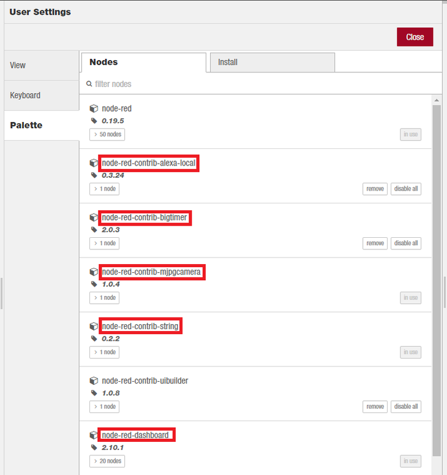

---


Switch to the __Install Tab__ and search for those entries and click the install button:

* node-red-contrib-alexa-local
* node-red-contrib-bigtimer
* node-red-contrib-mjpgcamera
* node-red-contrib-string
* node-red-dashboard


---

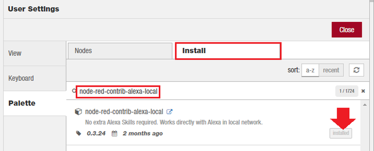

---


## Installing Mosquitto

MQTT is a machine-to-machine messaging protocol, designed to provide lightweight publish/subscribe communication to "Internet of Things" devices. It is commonly used for geo-tracking fleets of vehicles, home automation, environmental sensor networks, and utility-scale data collection. Mosquitto is a popular MQTT broker that has great community support and is easy to install and configure.


We are going to use it to exchange states between subflows in Node-RED. MQTT will also come in handy once we start using other home automation systems like [OpenHAB](https://www.openhab.org), [Home Assistant](https://www.home-assistant.io) or [ioBroker](http://iobroker.net). We will be able to let those programs control our INSTAR IP cameras using the MQTT protocol.


First, download their repository signing key and install it:

```
wget http://repo.mosquitto.org/debian/mosquitto-repo.gpg.key
sudo apt-key add mosquitto-repo.gpg.key
```

Now tell apt-get where to find the software by adding the repository URL to a file in `/etc/apt/sources.list.d/`:

```
sudo nano /etc/apt/sources.list.d/mosquitto.list
```

This will open up a new, blank file. Paste the following line into the file.

```
deb http://repo.mosquitto.org/debian stretch main
```


---

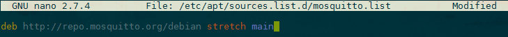

---


Save and close out of the editor, then update with apt-get to pull in the new package information. Then install the mosquitto package and its client software:


```
sudo apt-get update
sudo apt-get install mosquitto mosquitto-clients
```


---

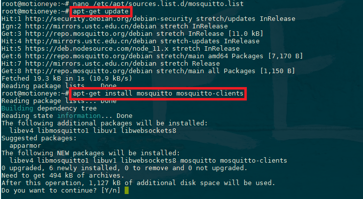

---


To test the Mosquitto service log in to your server a second time, so you have two terminals side-by-side. In the new terminal, use mosquitto_sub to subscribe to the test topic:


```bash
mosquitto_sub -h localhost -t test
```


The -h flag specifies the hostname of the MQTT server, and -t is the topic name. You'll see no output after hitting ENTER because mosquitto_sub is waiting for messages to arrive. Switch back to your other terminal and publish a message:


---

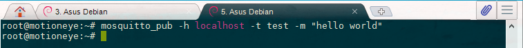

---


```bash
mosquitto_pub -h localhost -t test -m "hello world"
```

The options for mosquitto_pub are the same as mosquitto_sub, though this time we use the additional -m option to specify our message. Hit ENTER, and you should see hello world pop up in the other terminal. You've sent your first MQTT message!


---

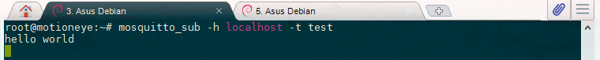

---


### Configuring Mosquitto

Mosquitto includes a utility to generate a special password file called mosquitto_passwd. This command will prompt you to enter a password for the specified username (we choose __debian__ in the example), and place the results in `/etc/mosquitto/passwd`:

```bash
mosquitto_passwd -c /etc/mosquitto/passwd debian
```

---

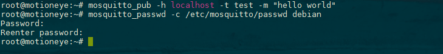

---


Now create a new configuration file for Mosquitto and tell it to use this password file to require logins for all connections:


```bash
nano /etc/mosquitto/conf.d/default.conf
```

This should open an empty file. Paste in the following:

```bash
allow_anonymous false
password_file /etc/mosquitto/passwd
```

---

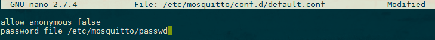

---


`allow_anonymous false` disables all non-authenticated connections, and the `password_file` line tells Mosquitto where to look for user and password information. Save and exit the file.


Now you need to restart Mosquitto and test your changes.


```bash
service mosquitto reload
```

### Testing Mosquitto from an external Machine

Since your devices that you want to connect will probably contacting your MQTT Server from an external IP address, let's test this and make sure everything is working. First let's now open the MQTT Port in our FirewallD configuration:

```
sudo firewall-cmd --permanent --zone=public --add-port=1883/tcp
sudo firewall-cmd --reload
sudo firewall-cmd --list-all
```

[We use MQTT.fx to debug our MQTT Server. Let's install it on another machine (Linux, Windows or macOS) and click on the Cog Wheel icon left to the Connect and Disconnect button to add our newly setup MQTT server:


---

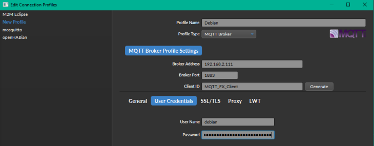

---


Replace the IP address ("192.168.2.111") with the address of your Linux machine that runs the MQTT service and add the login that you created for the Mosquitto server. Save the settings and connect to the server - the green light on the right should show that the connection was successfully establish.

Change to the __Subscribe__ tab type in `test` and hit __Subscribe__:


---

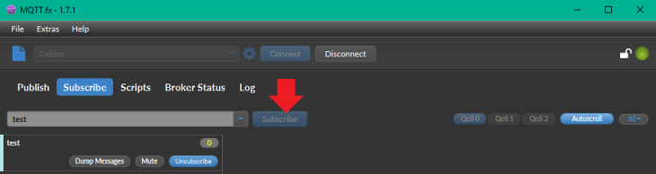

---


Switch to the __Publish__ tab, type in test - as the topic you want to publish a message under - and add a message as payload in the text field below, e.g. `{"hello":"world"}`. Then hit publish:


---

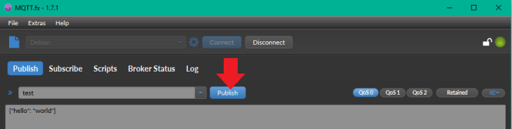

---


Switch back to the __Subscribe__ tab to verify that MQTT.fx successfully published the message and that our Mosquitto server notified clients with subscriptions to the topic about the change - in this case only our MQTT.fx instance:


---

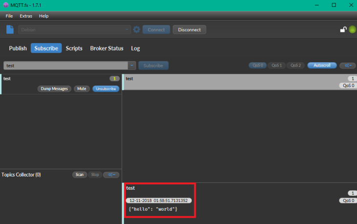

---


### Adding SSL Encryption

We are only going to use the MQTT protocol on our secure local network and decided to not encrypt the messages send by our IoT devices. If you plan to use the MQTT communication over the internet there is no way around wrapping those messages in an SSL/TLS encryption layer.

There are two (external) tutorials that will help you setting this up. The first tutorial shows you how to [work with a self-signed certificate](http://www.steves-internet-guide.com/mosquitto-tls/) and the second one helps you to set up [Certbot and use Lets-Encrypt](https://www.digitalocean.com/community/tutorials/how-to-install-and-secure-the-mosquitto-mqtt-messaging-broker-on-ubuntu-16-04) to create the certificate and auto-renew it.


## Using Node-RED to communicate with your Camera

The Node-RED admin panel is a visual tool to string function nodes into functional flows. all the flows used in this tutorial can be downloaded from here and imported into the admin panel using __Import Dialogue__.


#### Alarm SET Flow

Please copy the [Set Alarm Flow](https://wiki.instar.com/Node-RED_Flows/nodered_flow_set-alarm-office.json) and open the import window on the Node-RED panel:


---

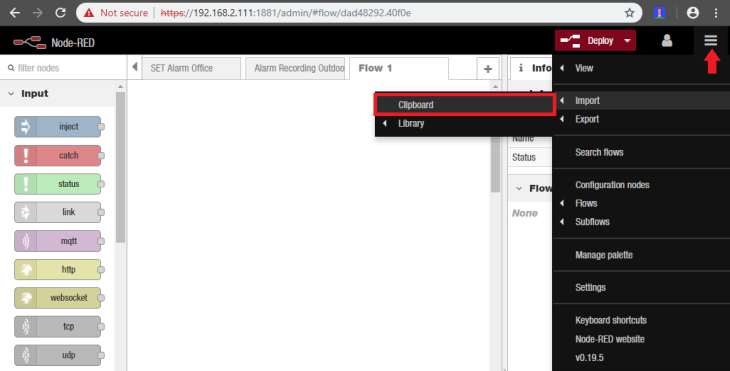

---


Paste the content into the input text field and hit the __Import__ button:


---

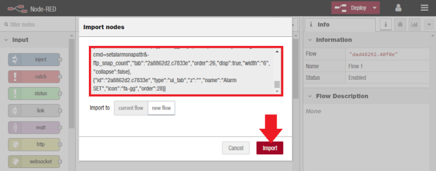

---


The Node-RED flow should be imported into a new tab, called __SET Alarm Office__. Hit the red __Deploy__ button to save and load the flow:


---

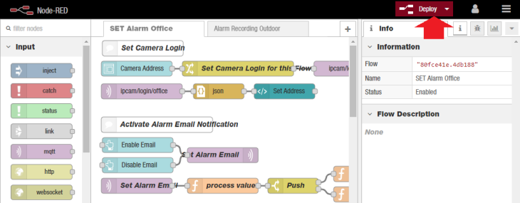

---


We [configured Node-RED](#configuring-node-red) to display the admin panel on `https://<IP of your Server>/admin`. You can switch to `https://<IP of your Server>/reddash` to see the corresponding __Node-RED Dashboard__. Just type in your __INSTAR Full HD cameras__ IP address and hit submit:


---

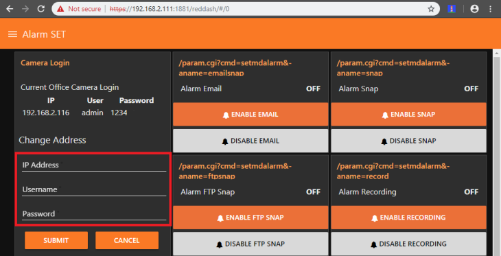

---


This flow can, of course, also be used with any other IP camera model - you just have to exchange the CGI commands used with the one that you need from our documentation for [Full HD](https://wiki.instar.com/1080p_Series_CGI_List/), [HD](https://wiki.instar.com/720p_Series_CGI_List/) and [VGA](https://wiki.instar.com/Advanced_User/CGI_Commands/VGA_Series_CGI_List/) camera models:


---

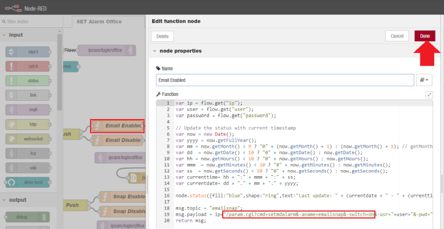

---


#### Alarm Recording

You can download this [Alarm Recording Flow](https://wiki.instar.com/Node-RED_Flows/nodered_flow_alarm_recording_outdoor.json) here.


---

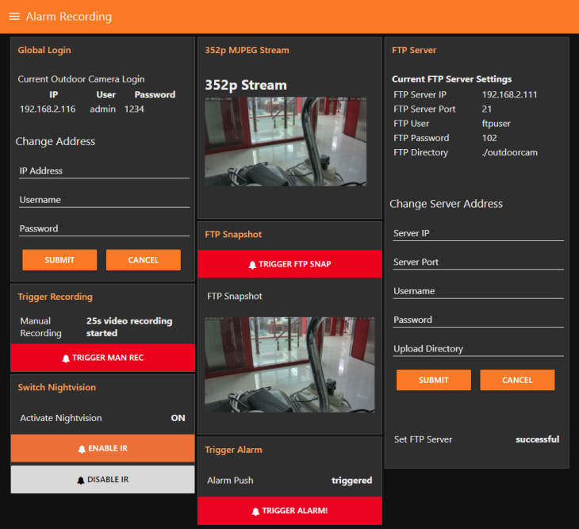

---


The first one enables you to manually upload a snapshot via FTP. And the second uses the PIR Motion Detector of your camera (of course, only applicable to camera's with PIR sensors) to detect motions, activate the nightvision LEDs and start a 1min Recording on the internal SD card of your camera every time an alarm is triggered. The use case is - you want to disable the IR nightvision LEDs during the night, which saves you electricity, makes your camera less intrusive and prevents the spider web problem (insects love the warm and illuminated front of your camera).


##### FTP Snapshot

To use this flow, we will need to configure an FTP server on Debian 9 Stretch Linux allowing our INSTAR IP cameras to upload snapshots and videos when a motion alarm was triggered. The following tutorial will explain how to install and configure FTP server using `vsFTPd` daemon.


```bash
sudo apt-get install vsftpd ftp
```

By default, the vsFTPd server comes configured to allow system users to access their home directories with read-only access. We will have to make changes to the vsFTPd config file `/etc/vsftpd.conf`:


```bash
sudo nano /etc/vsftpd.conf
```


---

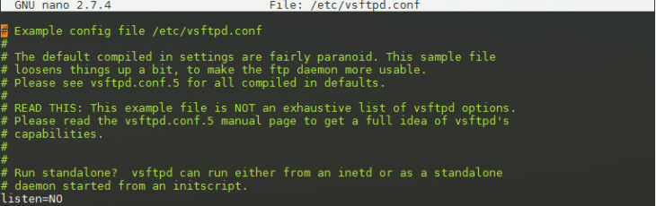

---


The result should look something like this:


```bash
listen=YES
listen_ipv6=NO
local_enable=YES
write_enable=YES
dirmessage_enable=YES
use_localtime=YES
xferlog_enable=YES
connect_from_port_20=YES
secure_chroot_dir=/var/run/vsftpd/empty
pam_service_name=vsftpd
rsa_cert_file=/etc/ssl/certs/nginx-selfsigned.crt
rsa_private_key_file=/etc/ssl/private/nginx-selfsigned.key
ssl_enable=YES
# implicit_ssl=YES
listen_port=21 
allow_anon_ssl=NO
force_local_data_ssl=NO
force_local_logins_ssl=NO
ssl_tlsv1=YES
ssl_sslv2=NO
ssl_sslv3=NO
userlist_file=/etc/vsftpd.userlist
userlist_enable=YES
userlist_deny=NO
```


We are using the [SSL Certificate](#create-the-ssl-certificate) that we generated for our NGINX server (of course you can also create a separate certificate for Node-RED following the instructions from the link above) and tell Node-RED to enforce SSL encryption. Note that we __cannot use implicit SSL__ - as our Full HD cameras only use explicit encryption.


__You can skip this part for HD and VGA cameras__, as they do not support FTPS. Just leave `ssl_enable=NO` to deactivate the encryption.


The above config file will only grant a __read-only__ access to any system user listed within `/etc/passwd` file. To add __write access__ for all system local user uncomment or add the following stanza `write_enable=YES`. The new configuration file consists of:


---

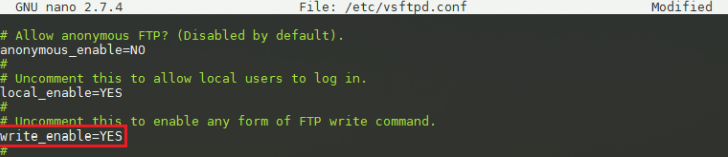

---


By default, our FTP server allows access to any system user defined within `/etc/passwd` file. In order to allow only specific users to be able to login we can include the following lines into our configuration file:


```bash
userlist_file=/etc/vsftpd.userlist
userlist_enable=YES
userlist_deny=NO
```


---

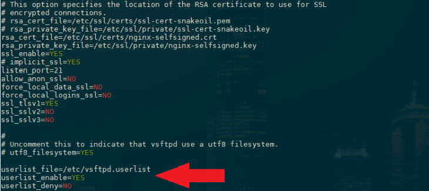

---


The above will enable a predefined user list where any user listed within `/etc/vsftpd.userlist` will have access to the FTP server. Let's first create a new user for the FTP service called `ftpuser` by typing the following command and adding a UNIX password:


```bash
sudo adduser ftpuser
```


Let's create a new `/etc/vsftpd.userlist` user list and add our `ftpuser`:


```bash
sudo echo ftpuser > /etc/vsftpd.userlist
```


Next, restart your vsFTPd:


```bash
sudo systemctl restart vsftpd
```

You can check if the FTP service is running on port 21 with the tool `netstat` - but you might have to install `net-tools` first:

```bash
sudo apt-get install net-tools
netstat -npl
```


---

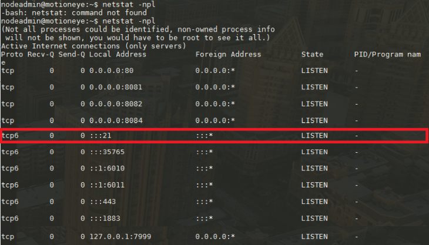

---


Now open port 20/21 in your firewall:


```bash
sudo firewall-cmd --permanent --zone=public --add-port=20-21/tcp
sudo firewall-cmd --reload
sudo firewall-cmd --list-all
```


You can test access to your FTP server using your default web browser - just prepend a `ftp://` to your Linux servers IP address, e.g. `ftp://192.168.2.111`, and log in with the `ftpuser`:


---

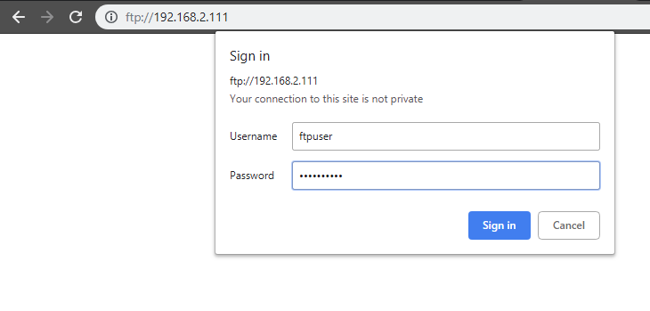

---


Note that the directory that is used for the `ftpuser` is his __home__ directory in `/home/ftpuser/`.  You can use a tool like the [Filezilla Client](https://filezilla-project.org/download.php?type=client) to login to your FTP Server and upload a file to check if the write access is working (the advantage of using Filezilla over just trying to send an image directly from the FTP service of your INSTAR Full HD camera is, that Filezilla will give a more thorough error report, in case that something goes wrong): 


---

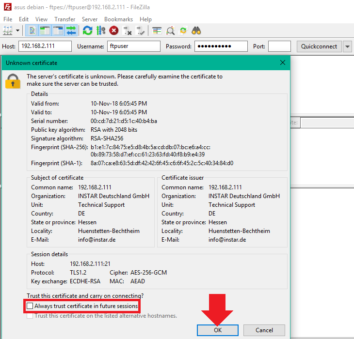

---


Now it's time to try to upload a test image from our INSTAR Full HD camera to the FTP server. Let's create a folder `/home/ftpuser/outdoorcam` on our Linux server and add the FTP information to our camera configuration and press __Apply__:


---

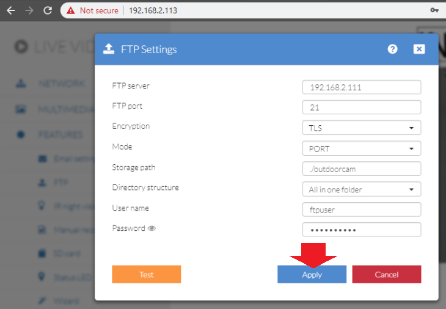

---


__Note__ that we added `TLS encryption` just as we defined it in `/etc/vsftpd.conf`:


```
ssl_tlsv1=YES
ssl_sslv2=NO
ssl_sslv3=NO
```

__Note2__ that we need to use the __PORT Mode__ since we are operating the FTP server behind a firewall!


We now just have one issue left - the files will be uploaded to the `/home/ftpuser` directory and will be owned by the `ftpuser`. Since we are going to start the Node-RED process with a different user - `nodeadmin` - we have to make sure that the files can also be handled by Node-RED. Type `sudo nano /etc/vsftpd.conf` and add the following line:


```
local_umask=0002
```


You can also make the uploaded files executable - if that is something you need... __potential dangerous__ - by changing this line to `file_open_mode=0777`.


---

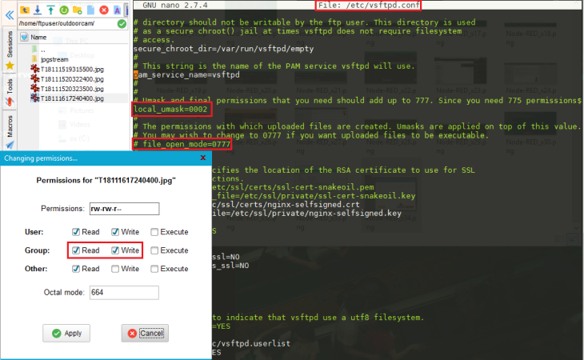

---


To open the `/home/ftpuser` directory to us type:


```bash
sudo chmod -R 777 /home/ftpuser
```

This way we are able to set the directory to be the Static Directory of our Node-RED Dashboard and display uploaded images:


---

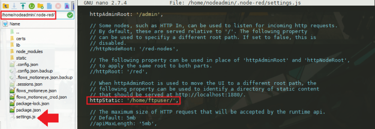

---