<!-- TOC -->

- [Installation of Home Assistant on a Debian Stretch Server](#installation-of-home-assistant-on-a-debian-stretch-server)
  - [Installation of dependencies:](#installation-of-dependencies)
  - [Create a user and group](#create-a-user-and-group)
  - [Install Home Assistant](#install-home-assistant)
  - [Run Home Assistant as a Service](#run-home-assistant-as-a-service)
- [Configuring Home Assistant](#configuring-home-assistant)
  - [Adding the MQTT Broker](#adding-the-mqtt-broker)
- [The Home Assistant Lovelace UI](#the-home-assistant-lovelace-ui)
  - [Adding your camera's Live Video](#adding-your-cameras-live-video)
  - [Using Home Assistant as Alarmserver for your INSTAR Camera](#using-home-assistant-as-alarmserver-for-your-instar-camera)

<!-- /TOC -->

<div class="primarybox">
    <h3>INSTAR MQTT Broker</h3>
    <p>The MQTT Interface enables you to access all camera functions through the native MQTT support from the Home Assistant Lovelace UI!</p>
</div>


## Installation of Home Assistant on a Debian Stretch Server

### Installation of dependencies:

```bash
sudo apt update
sudo apt install python3-dev python3-pip python3-venv
sudo pip3 install --upgrade virtualenv
```


---

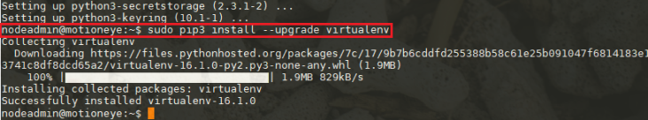

---


### Create a user and group

Give the user access to serial lines (zwave, insteon, etc):

```bash
sudo adduser --system homeassistant
sudo addgroup homeassistant
sudo adduser homeassistant dialout
```


---

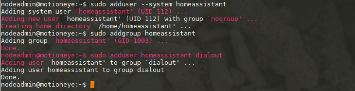

---


1. Create a directory to install HA in and set its ownership and permissions.

```bash
sudo mkdir /opt/homeassistant
sudo chown homeassistant:homeassistant /opt/homeassistant
```


---

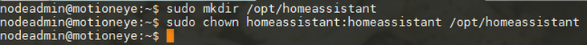

---


2. Change to the homeassistant user to do the installs.

```bash
sudo su -s /bin/bash homeassistant
```

### Install Home Assistant

1. Install a virtual env to sandbox the Home Assistant software and dependencies and activate it so further installs are done here.

```bash
cd /opt/homeassistant
python3 -m venv /opt/homeassistant
source bin/activate
```


---

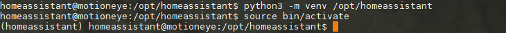

---


2. Install HA from pip. You might get some pip install errors that do not cause an issue later on:

```bash
pip3 install --upgrade homeassistant
```


---

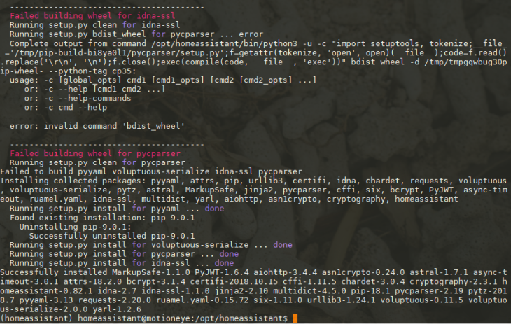

---


3. Open another terminal and login with your default (sudo enabled) user and open the Home Assistant port `8123` in your Firewall:

```bash
sudo firewall-cmd --permanent --zone=public --add-port=8123/tcp
sudo firewall-cmd --reload
sudo firewall-cmd --list-all
```

---

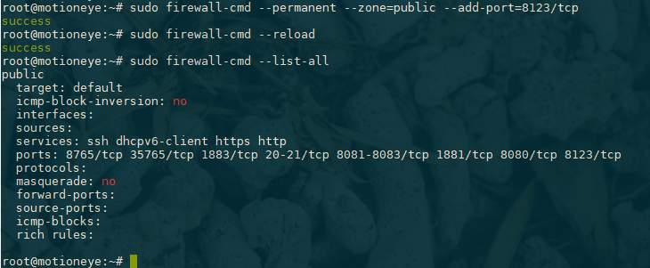

---


Then switch back to the homeassistant user.


1. To keep all the config and log files in the same directory (rather than having them in /home/homassistant) we can run Home Assistant with the following command:

```bash
mkdir config
./bin/hass -c /opt/homeassistant/config --log-file /opt/homeassistant/hass.log
```

Home Assistant should install a few things and make a default config file (let it run for a little while - it takes a bit on the first start up). Hit ctrl-c to stop it. The config directory now contains a bunch of sample config files for you to edit.


---

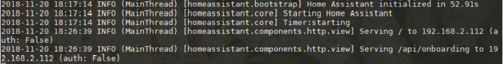

---


5. You can now access Home Assistants web interface by opening the following URL (exchange the IP address __192.168.2.111__ with the IP of your Linux Server) inside your webbrowser `http://192.168.2.111:8123/`:


---

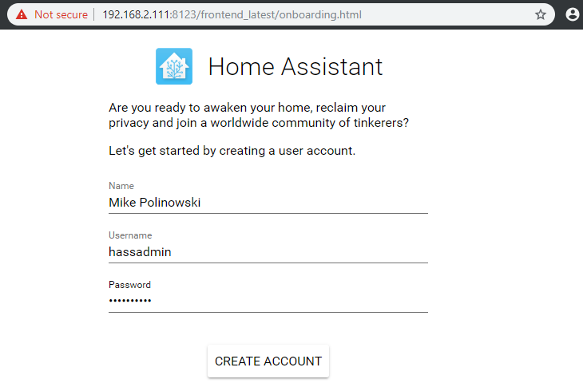

---


6. Type in your preferred login credentials and click to create the account:


---

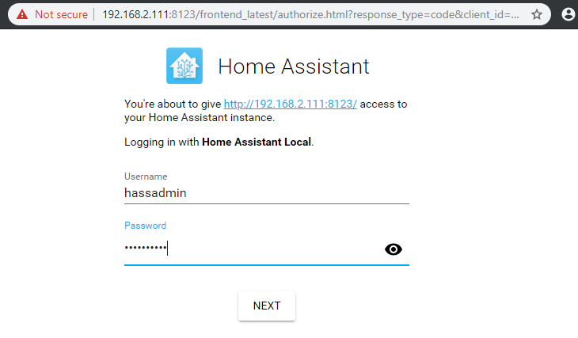

---


7. And login to the Home Assistant web interface using your credentials:


---

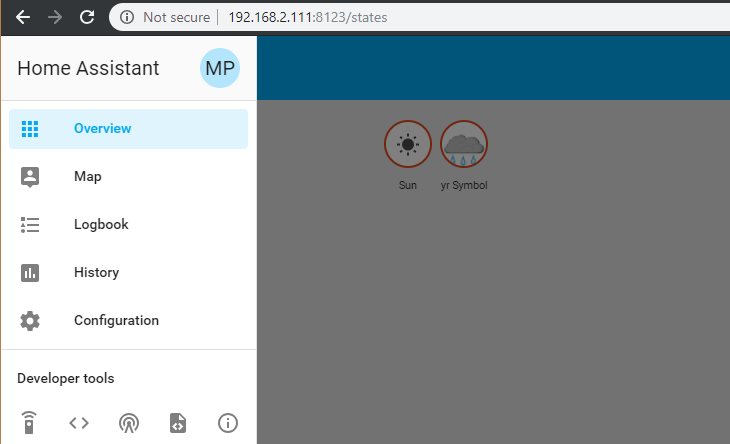

---


8. Hit ctrl-c to stop Home Assistants. The config directory now contains a bunch of sample config files for you to edit.


### Run Home Assistant as a Service

1. Assuming it works, exit the homeassistant user, change to the `/etc/systemd/system/` directory and create a service to start Home Assistant automatically.

```bash
exit
cd /etc/systemd/system/
sudo nano homeassistant.service
```

2. Create the following `systemd init` file:


---

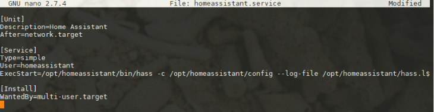

---


```
[Unit]
Description=Home Assistant
After=network.target mosquitto.service

[Service]
Type=simple
User=homeassistant
ExecStart=/opt/homeassistant/bin/hass -c /opt/homeassistant/config --log-file /opt/homeassistant/hass.log

[Install]
WantedBy=multi-user.target
```


<br/><br/>


3. Exit the homeassistant user, copy the service file to the system, and `update systemd` to run the service.

```bash
sudo systemctl --system daemon-reload
sudo systemctl enable homeassistant
sudo systemctl start homeassistant
```

4. If something goes wrong with the start command, check the logs:

```bash
sudo systemctl status homeassistant
```


---

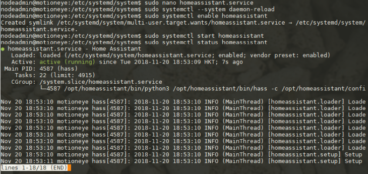

---


Finally, to make it easier to edit config files and try out code changes, give your regular user write permissions in the `homeassistant directory`. For this we need to assign both our regular user - in my case this is the `nodeadmin` - and the homeassistant user to the `homeassistant group`.


```bash
sudo groupadd homeassistant
sudo usermod -a -G homeassistant nodeadmin
sudo usermod -a -G homeassistant homeassistant
```

Make sure that both users are inside the created group:


---

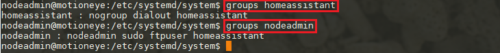

---


```bash
sudo chgrp -R homeassistant /opt/homeassistant
sudo chmod -R g+w /opt/homeassistant/
```


## Configuring Home Assistant

We set up Home Assistant to be installed in `/opt/homeassistant`. The configuration file can be found in the `config` subfolder. Let's open up the file to take a look at it:

```
sudo nano /opt/homeassistant/config/configuration.yaml
```


### Adding the MQTT Broker

---

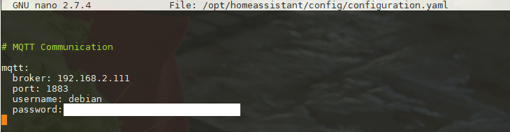

---


The first thing we should do, is adding our Mosquitto server (192.168.2.111) as MQTT broker. We can do this by adding the following lines at the end of the document:

```
# MQTT Communication

mqtt:
  broker: 192.168.2.111
  port: 1883
  user: debian
  password: mysecretpassword
```


<br/><br/>

To verify that we did not mess up the configuration we can go to the __Configuration Tab__ in Home Assistant:


---

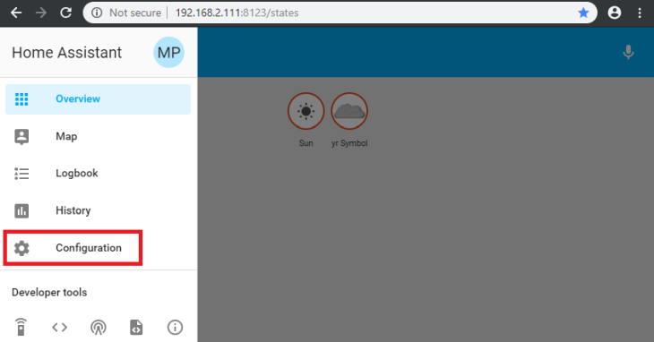

---


Open the __General__ section:


---

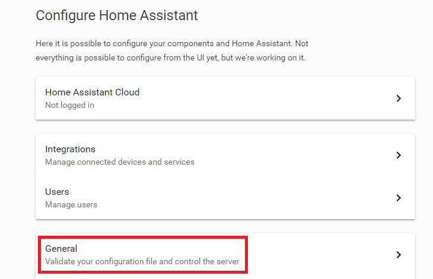

---


Click on __Check Config__ and - __when it passes__ - click on __Restart Server__:


---

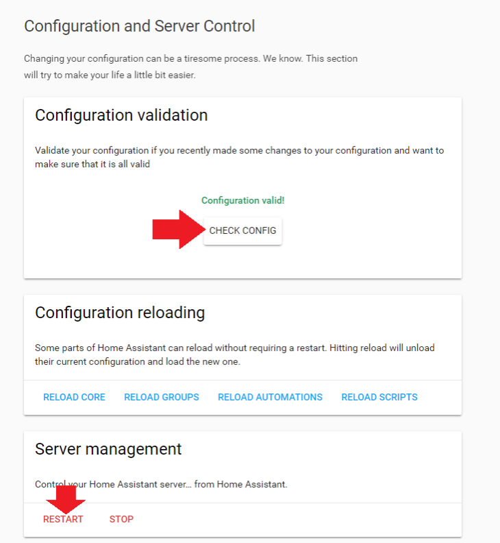

---


## The Home Assistant Lovelace UI

Now we can start with adding components to the Home Assistant UI - called __Lovelace__. Note that the INSTAR MQTT Broker is only included in _INSTAR Full HD cameras_. If you are using a HD (720p) or VGA camera you can still use MQTT to connect your camera.


### Adding your camera's Live Video


Home Assistant comes with a __Camera Module__ that we can use to add our camera's Live Video. Lets start by accessing the `configuration.yaml`. When you followed the steps above you will find this file in `/opt/homeassistant/config/configuration.yaml`. Open the configuration file and add the line `/home/pi/.homeassistant/configuration.yaml`:


```yaml
camera: !include cameras.yaml
```


Now create the `cameras.yaml` file next to the configuration file and add the following lines:


```yaml
- platform: generic
  name: 'IN-8015FHD'
  still_image_url: http://192.168.2.165/tmpfs/snap.jpg
  stream_source: 'rtsp://192.168.2.165:554/11'
  verify_ssl: false
  authentication: 'basic'
  username: 'admin'
  password: 'instar'
```

In case you need to restrict the bandwidth this live stream is requiring, use `auto.jpg` or `auto2.jpg` instead of `snap.jpg` in the __still_image_url__ above. Also the RTSP __stream_source__ can use a smaller live stream by replacing the `/11` with a `/12` or `/13`. Alternatively, you can access your camera's MJPEG stream with the following configuration:


```yaml
- platform: mjpeg
  name: 'IN-9010FHD'
  mjpeg_url: http://192.168.2.117/mjpegstream.cgi?-chn=11
  verify_ssl: false
  authentication: 'basic'
  username: 'admin'
  password: 'instar'
```

And again, to reduce the bandwidth requirements of this live stream use `chn=12` or `chn=13` instead of `chn=11`.

This will add a local INSTAR HD or Full HD camera with the IP address `192.168.2.165` on the default HTTP Port `80` and with the default RTSP Port 554. The camera login is `admin/instar` in this example - but note: you do not need to use the Administrator account to access the live video.


Now reload Home Assistant to be able to see the changes you just made. Once the UI is back up, click on __Configure UI__ in the top right:


---

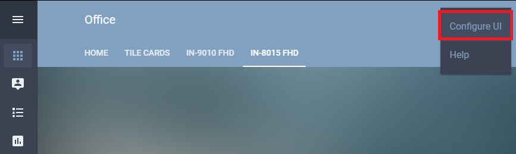

---


You might want to add a new Tab for your camera by clicking on the small __+__ icon next to your existing tabs. Then click on the big __+ Button__ to add a new card.


---

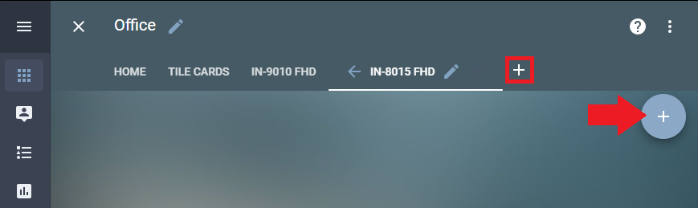

---


Here we have to add a new Entity and select the camera that we just added - in the case above this was `camera.in_8015fhd`:


---

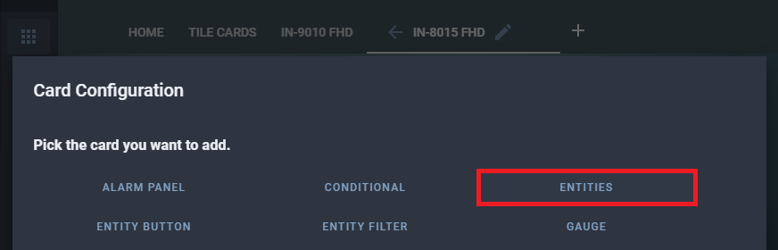

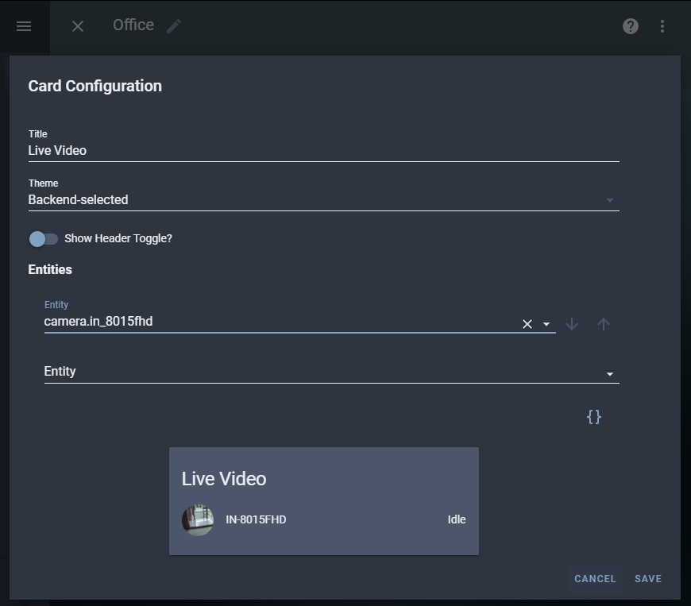

---


Save your setting and quit the UI configuration mode. You should see a small tile with a snapshot from your camera. Click on it to be directed to the live video:


---

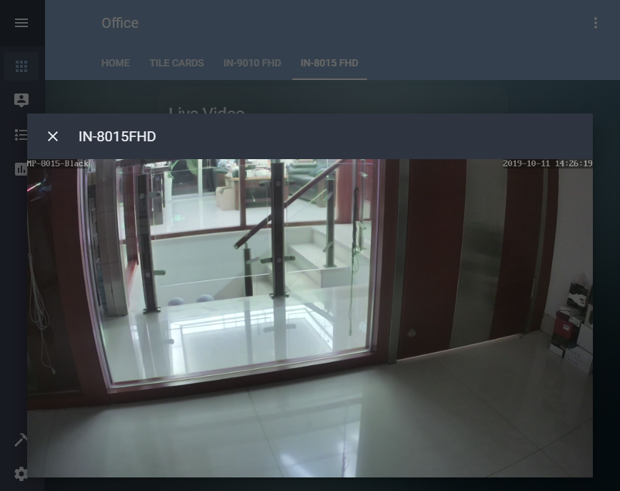

---


### Using Home Assistant as Alarmserver for your INSTAR Camera

All INSTAR Full HD cameras have a function to send a POST request to a HTTP Webhook when an alarm is triggered (HD cameras currently only support GET requests that are not supported by Home Assistant - though you will be able to use Node-RED to receive a GET request from your HD camera and trigger a POST request to Home Assistant).


When such a post request is received by Home Assistant such an event can be used as a trigger for your automation to control your INSTAR Full HD camera.


To set up a Webhook that can be used by your camera first open the Lovelace UI and go to __Configuration__ and open the __Automation__ tab:


---

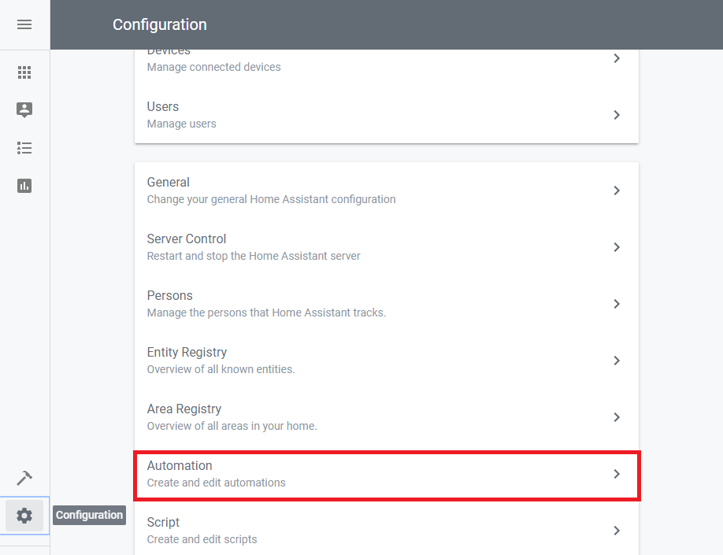

---


Click on the __+__ icon to add a new automation and select __Webhook__ as the automation trigger - the name you choose here for the Webhook will be used to name the resulting URL e.g. `mqtt_test` (better don't use spaces or special characters):


---

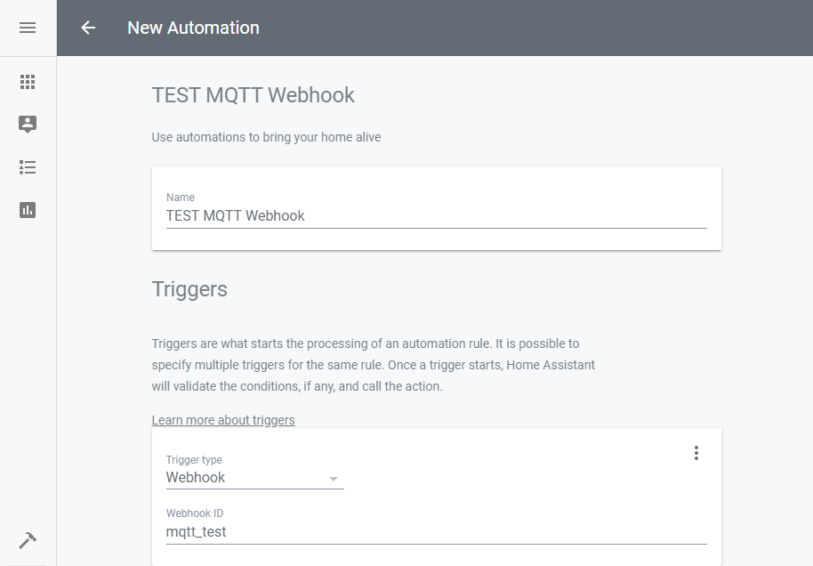

---


Now we need to define an action that we want to trigger. For this we are going to use a __MQTT Publish__ service we created in the. This service requires a MQTT topic (_Target_) and a MQTT message payload (_Message_) to be passed down:


```json
{
  "message": "{\"val\":\"1\"}",
  "target": "instar/000389888811/features/ptz/preset"
}
```


---

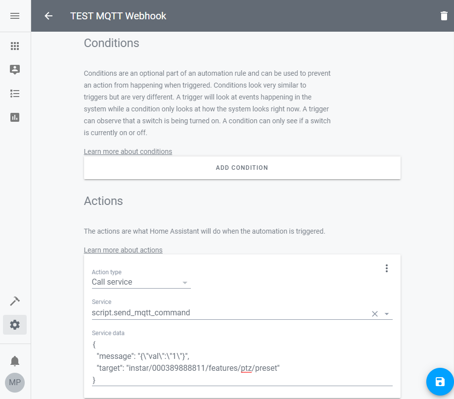

---

Here we choose the `features/ptz/preset` MQTT Topic and send the payload value `1` which will tell the camera with the MAC address `000389888811` to move to __Preset Position 2__ (numbering of those positions starts at `0`).


When you hit __Save__ this automation will be saved inside the `automations.yaml` file inside the Home Assistant directory:


```yaml
- id: '1571301476710'
  alias: TEST MQTT Webhook
  trigger:
  - platform: webhook
    webhook_id: mqtt_test
  condition: []
  action:
  - data:
      message: '{"val":"1"}'
      target: instar/000389888811/features/ptz/preset
    service: script.send_mqtt_command
```


You could test triggering the above automation by sending a __POST HTTP Request__ to


```json
http://your-home-assistant:8123/api/webhook/mqtt_test
```


---

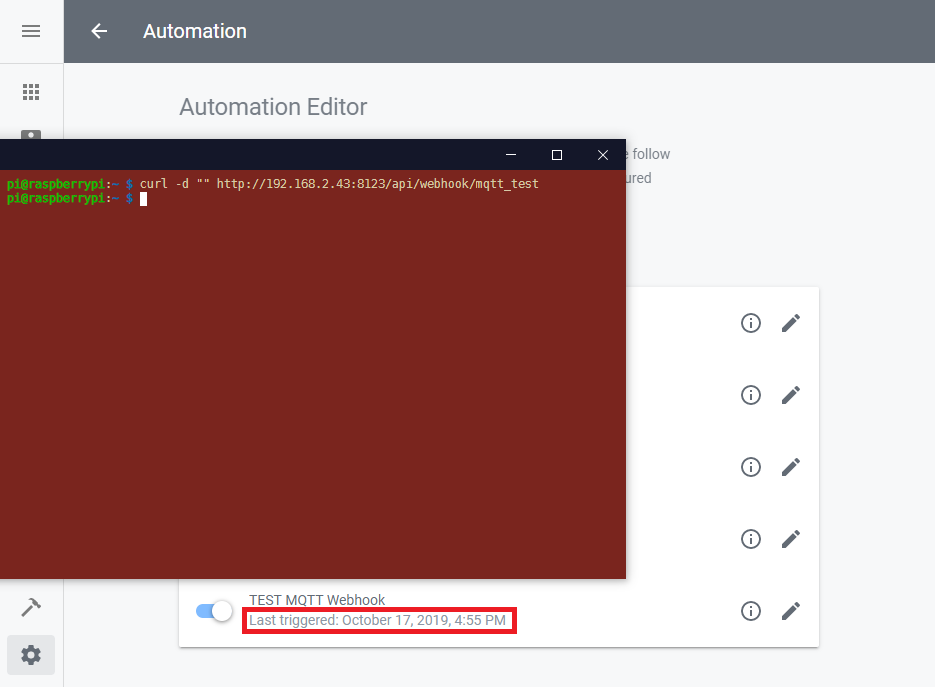

---


Sending the command `curl -d "" http://192.168.2.43:8123/api/webhook/mqtt_test` triggers the automation and sends the camera into the second preset position.


Now that we know that our automation is working and the Webhook is set up, we can configure our camera to contact Home Assistant when an Alarm is triggered by the camera internal detection systems. Please open the Alarmserver configuration inside your camera's web user interface and add the Home Assistant Webhook to the following form. You have to activate the POST Request and add a dummy request parameter - in the screenshot below we added `homeassistant=alarm`. But this parameter can be chosen freely:


---

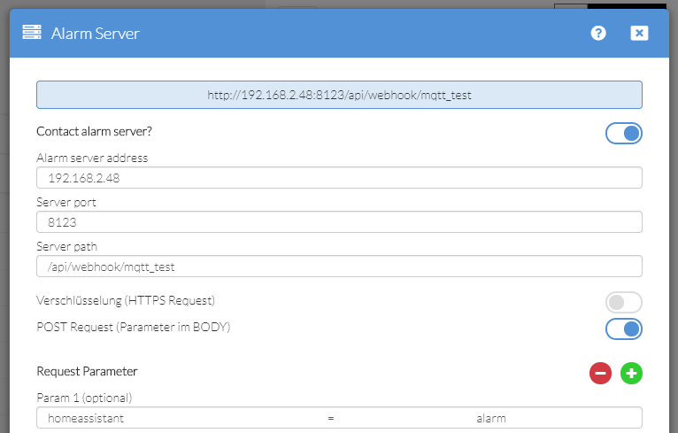

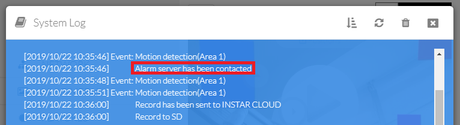

---


Now, every time an alert is triggered our camera will contact it's Alarmserver - the Home Assistant installation - and start the automation.