<!-- TOC -->

- [OpenHAB 2 Installation](#openhab-2-installation)
  - [How to install Java with Apt on Debian 9](#how-to-install-java-with-apt-on-debian-9)
    - [Installing the Default JRE/JDK](#installing-the-default-jrejdk)
- [OpenHAB Configuration though Paper UI](#openhab-configuration-though-paper-ui)
  - [MQTT Binding](#mqtt-binding)
  - [OpenHAB Cloud Connector](#openhab-cloud-connector)

<!-- /TOC -->


## OpenHAB 2 Installation

We are going to use the apt-get package manager to install the latest OpenHAB 2 snapshot on our Debian Linux server. For more installation options - different Linux versions, stable builds, etc. - check out the [OpenHAB Download Section](https://www.openhab.org/download/).


1. We will start by adding the needed repository key:

```bash
wget -qO - 'https://bintray.com/user/downloadSubjectPublicKey?username=openhab' | sudo apt-key add -
```


2. Add the HTTPS transport for APT:

```bash
sudo apt-get install apt-transport-https
```


3. Add the repository:

```bash
echo 'deb https://openhab.jfrog.io/openhab/openhab-linuxpkg unstable main' | sudo tee /etc/apt/sources.list.d/openhab2.list
```


---

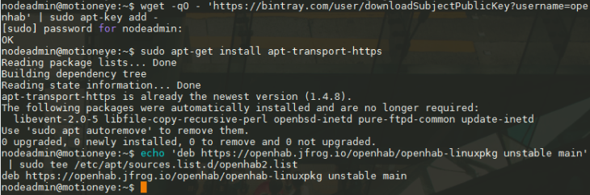

---


4. Update the package lists and install the openHAB distribution package:

```bash
sudo apt-get update && sudo apt-get install openhab2
```


---

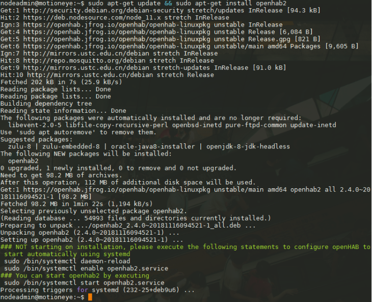

---


5. Execute the following statements to configure openHAB to start automatically using `systemd`:

```bash
sudo /bin/systemctl daemon-reload
sudo /bin/systemctl enable openhab2.service
```


6. You can start openhab2 by executing:

```bash
sudo /bin/systemctl start openhab2.service
```


---

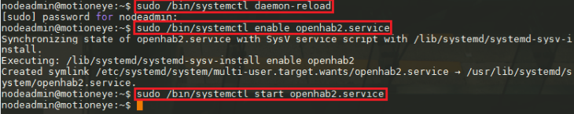

---


7. Open the OpenHAB default port in your Firewall:

```bash
sudo firewall-cmd --permanent --zone=public --add-port=8080/tcp
sudo firewall-cmd --reload
sudo firewall-cmd --list-all
```


---

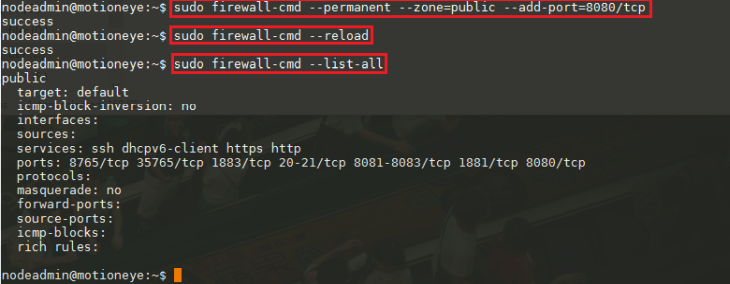

---


8. Navigate with a web browser to `http://<ip-address>:8080` and select the __Standard Package__:


---

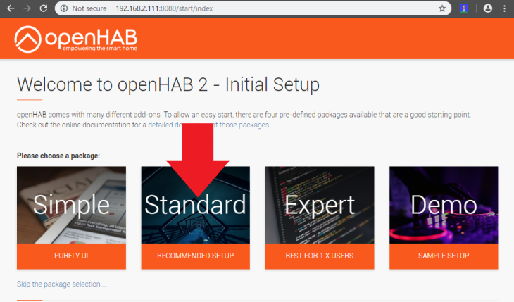

---


If the OpenHAB user interface does not load, you are probably missing Java on your Linux server. You can check the OpenHAB service status by typing:


```bash
systemctl status openhab2
```


---

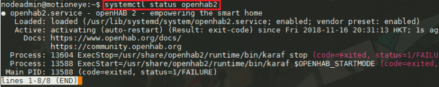

---


### How to install Java with Apt on Debian 9

In this guide, you will install various versions of the Java Runtime Environment (JRE) and the Java Developer Kit (JDK) using `apt`.


#### Installing the Default JRE/JDK

The easiest option for installing Java is to use the version packaged with Debian. By default, Debian 9 includes Open JDK, which is an open-source variant of the JRE and JDK.

This package will install OpenJDK version 1.8, which is compatible with Java 8. Java 8 is the current Long Term Support version and is still widely supported, though public maintenance ends in January 2019.

1. To install this version, first update the package index:

```bash
sudo apt update
```


2. Next, check if Java is already installed:

```bash
java -version
```


If Java is not currently installed, you'll see the following output:


---

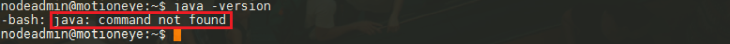

---


3. Execute the following command to install OpenJDK:

```bash
sudo apt install default-jre
```


This command will install the Java Runtime Environment (JRE). This will allow you to run almost all Java software.

Verify the installation with `java -version`:


---

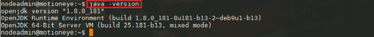

---


4. You may need the Java Development Kit (JDK) in addition to the JRE in order to compile and run some specific Java-based software. To install the JDK, execute the following command, which will also install the JRE:


```bash
sudo apt install default-jdk
```

Verify that the JDK is installed by checking the version of `javac`, the Java compiler:

```bash
javac -version
```


---

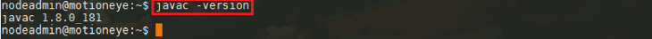

---


You can now navigate with a web browser to `http://<ip-address>:8080` and select the __Standard Package__ of OpenHAB2:


---


---

We highly recommend that you read the [Concepts Introduction](https://www.openhab.org/docs/concepts/). It introduces a number of important ideas that will help you as you install and begin to configure openHAB for the first time.


Once you have openHAB up and running, the [Configuration Guide](https://www.openhab.org/docs/configuration/) contains everything you need to know to get your openHAB installation talking to different devices around your home. For instance, you can use [Sitemaps](https://www.openhab.org/docs/configuration/sitemaps.html) to control how the status of these devices are displayed on different openHAB User Interfaces, and you can begin to experiment with [Rules](https://www.openhab.org/docs/configuration/rules-dsl.html) in order to get the most out of your installation. There are many other ways of interacting with your openHAB smart home: the most popular are presented in the Interfaces and Ecosystem section below.


---

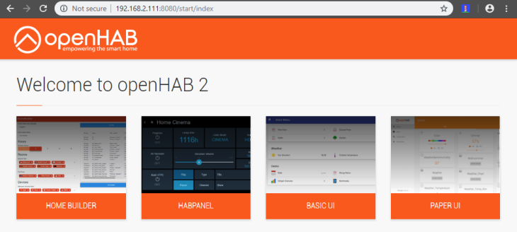

---


## OpenHAB Configuration though Paper UI

The Paper UI is a new interface that helps setting up and configuring your openHAB instance. It does not (yet) cover all aspects, so you still need to resort to textual configuration files.


__Add-on management__: Easily install or uninstall [openHAB add-ons](https://www.openhab.org/docs/configuration/%7B%7Bdocu%7D%7D/addons/uis/paper/readme.html):


### MQTT Binding

Go to the __Add-Ons__ Menu and click on the __Bindings Tab__. We are going to use the MQTT protocol to communicate with our INSTAR IP camera from OpenHAB. To be able to connect to the Mosquitto MQTT Server we need to install the [MQTT Binding](https://www.openhab.org/addons/bindings/mqtt/) - make sure that you choose the __Version 2__ (at the moment of writing this is the _2.4.0_ version).


---

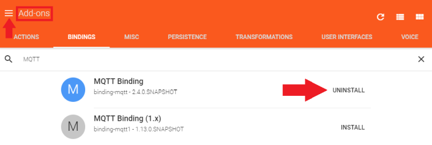

---


Now switch to your OpenHAB Inbox:


---

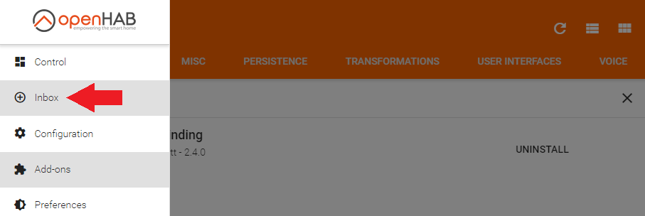

---


Click on the __+__ icon to add the MQTT Binding:


---

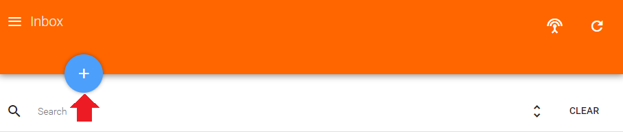

---


Find the MQTT Binding inside the list and select it:


---


---


Click on __Add Manually__:


---

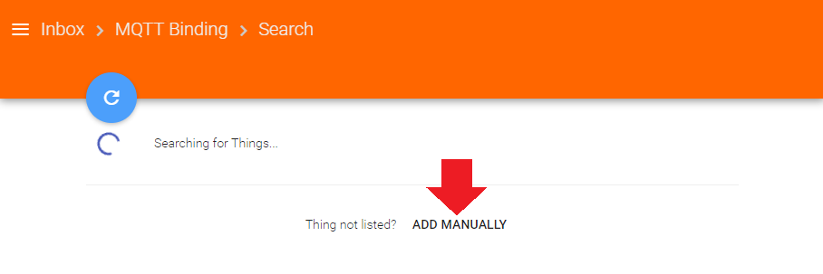

---


And choose the __MQTT Broker__:


---

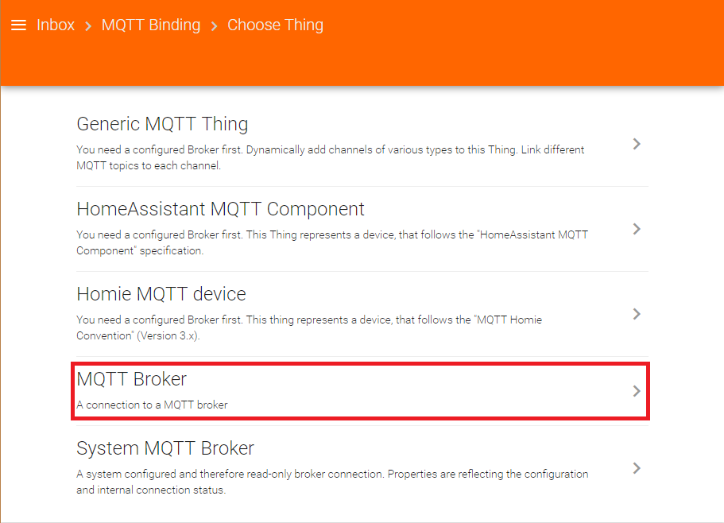

---


With the newest Firmware for your INSTAR Full HD camera, you can use the camera as MQTT Broker. For older cameras models please install a MQTT broker like Mosquito first. Add your brokers IP address and the broker port - by default this is __1883__. Note that we are first not going to use [TLS encryption](https://community.openhab.org/t/mqtt-binding-and-ssl/40622). We will add it once we are able to establish the connection:


---


---


Your INSTAR Full HD cameras MQTT default login is the Administrator login you added to your camera (if you are using Mosquitto). Then save your setting by clicking on the blue confirmation button:


---

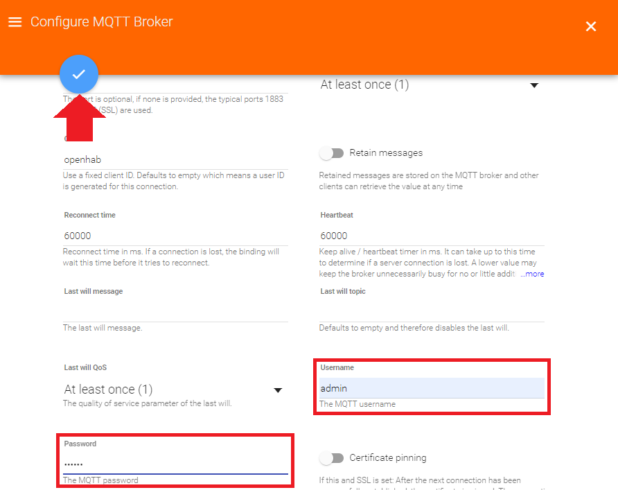

---


Back in the __Things Menu__ click on __+__ again - this time to add a __Thing__ that we can use for an _PaperUI_ button later on:


---

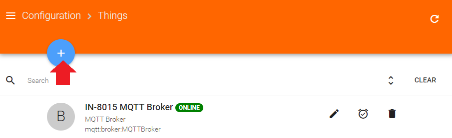

---


Click on __MQTT Binding__:


---

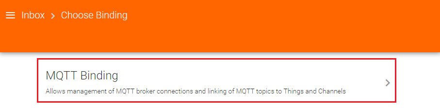

---


And __Add Manually__:


---

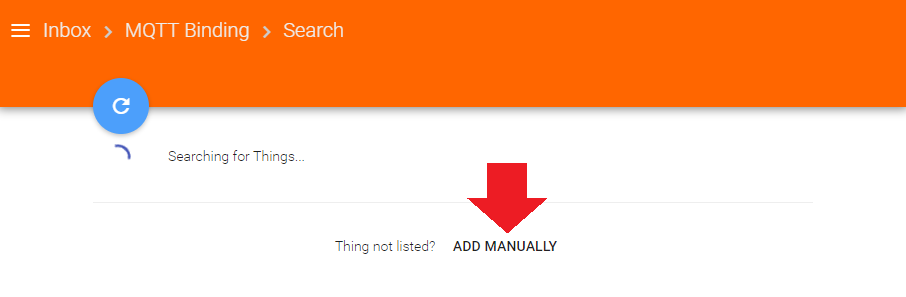

---


This time we need to add a __Generic MQTT Thing__:


---

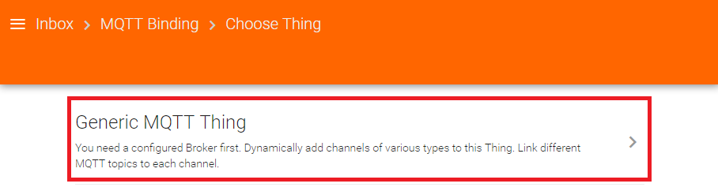

---


I am going to create a button that triggers the alarm on my INSTAR Full HD camera and name it here accordingly. As __Bridge__ you need to select the MQTT broker you just created. Click on the blue button to confirm:


---

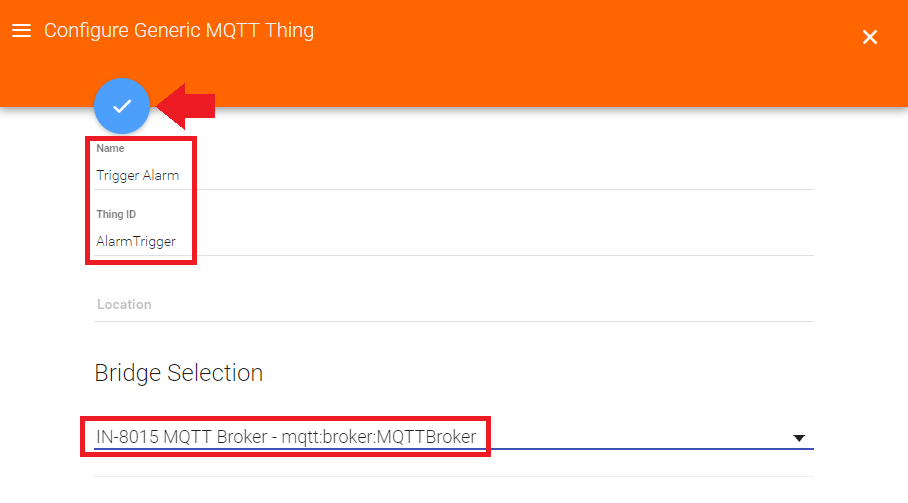

---


Back in the __Thing Menu__ click to edit the __Thing__ you just created:


---

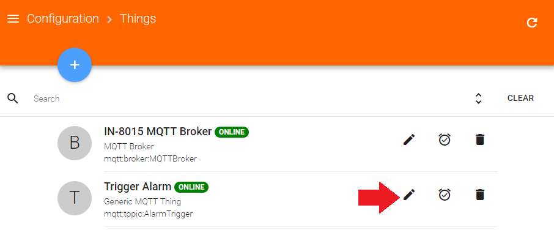

---


Click on the blue __+__ button to add a __Channel__ to the __Thing__:


---

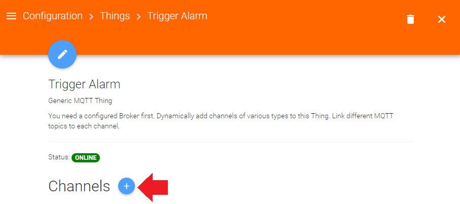

---


I am going to use an __On/Off Switch__ which is not ideal for the function - the Alarm-Trigger command does not have an On/Off state. Unfortunately OpenHab does not offer a simple button. The MQTT topic to trigger the alert is `alarm/pushalarm` and as message payload we need to add `{"val":"1"}`. Click on __Save__ to confirm:


---

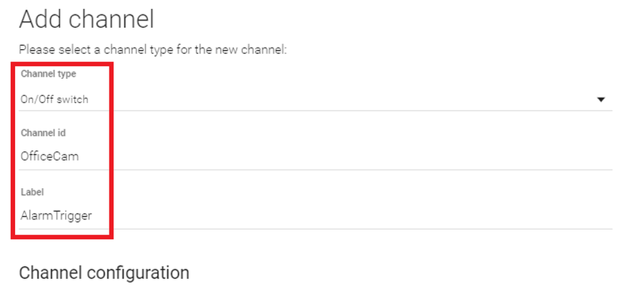
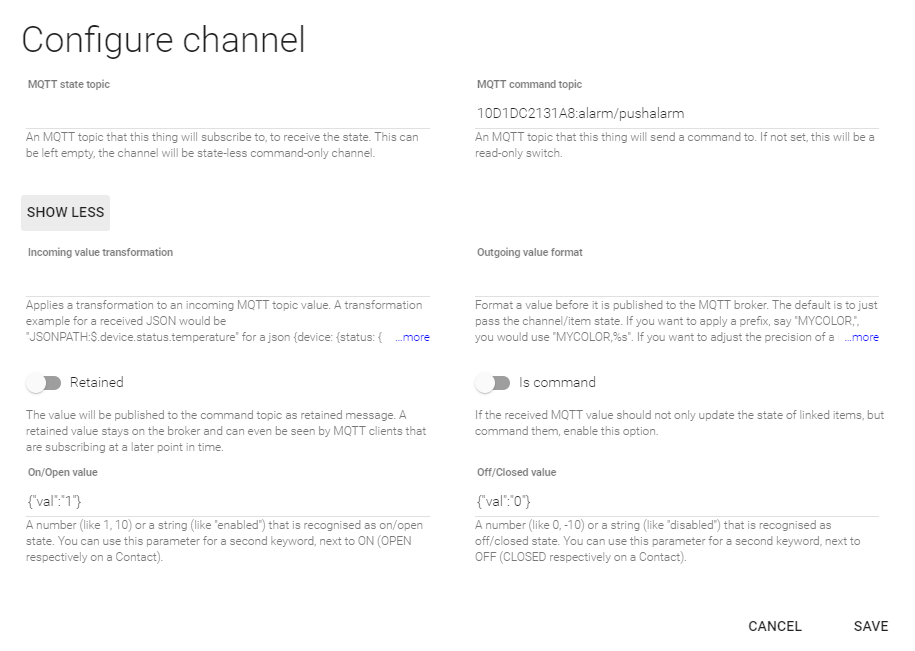

---


By clicking on the blue icon in front of the created channel we are now able to link it to a switch in the __OpenHAB PaperUI__:


---

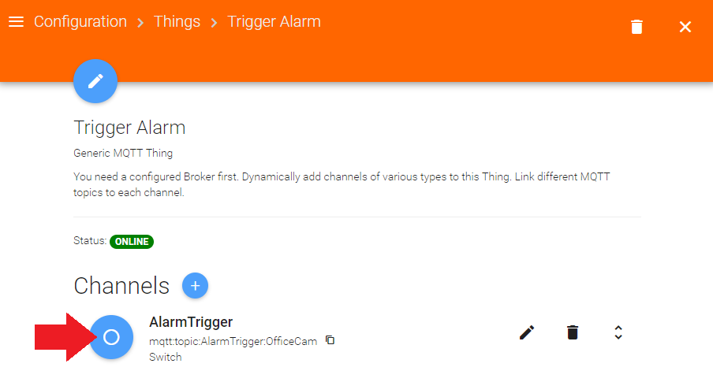

---


Click on __Create new item...__:


---

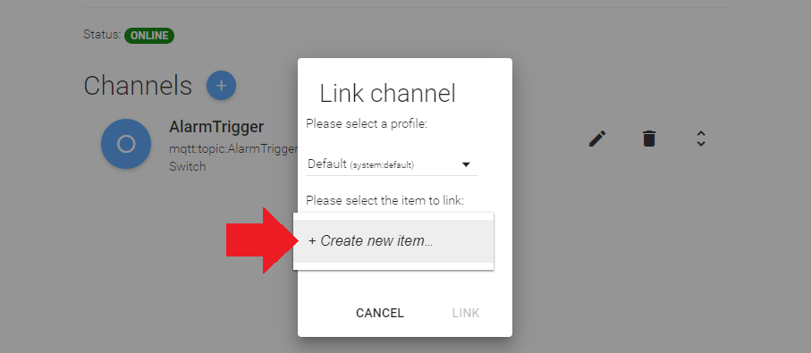

---


Click on __Link__:


---

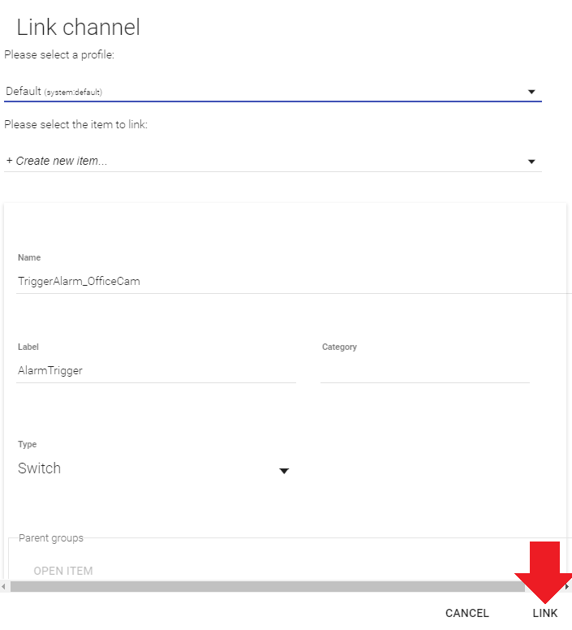

---


You can now click on __Control__ to open the __PaperUI__:


---

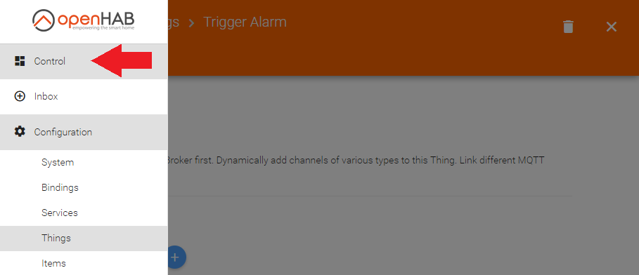

---


Our Alarm Trigger now appears in the __Paper UI__ and clicking the switch will send the MQTT message to our MQTT server that is going to notify our camera to trigger an alert. Note the MQTT.fx program at the bottom of the frame can be used to verify that the command was actually send - but the installation __is optional__:


---

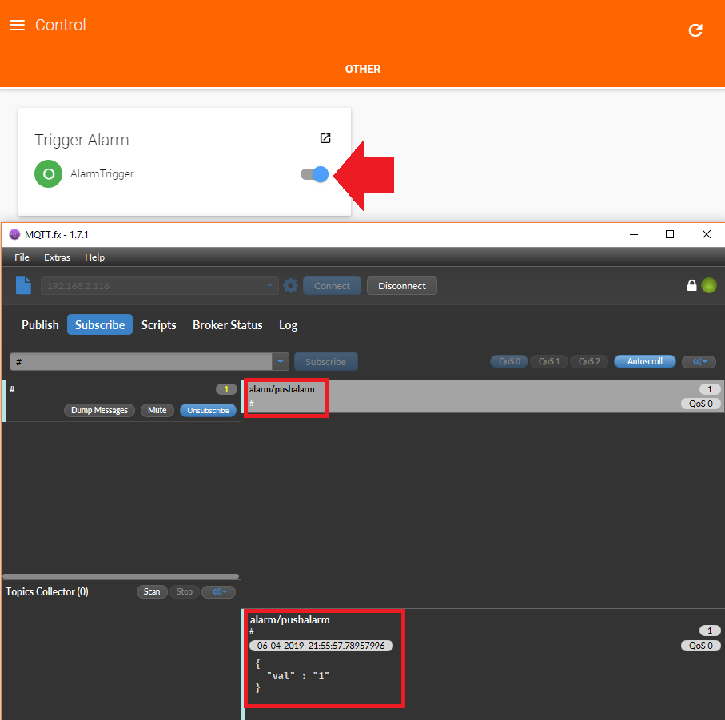

---


Instead of using MQTT.fx you can also just check your cameras log book that should now show an __Audio Alarm__ (the manual alarm trigger uses the audio alarm to trigger all your programmed Alarm Actions):


---

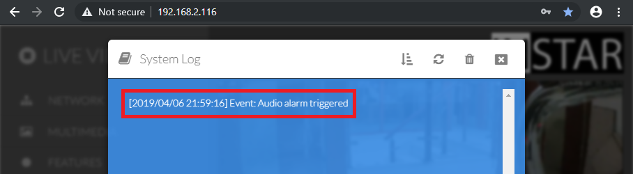

---


All right that's it - the Binding was successfully added and we are now able to control all of our camera functions with the MQTT interface.


### OpenHAB Cloud Connector


You can use the OpenHAB Cloud to access your Smarthome over the internet. First we need to install __openHAB Cloud Connector__ that can be found in the __Add-ons Menu__ in the __Miscellaneous__ section:


---

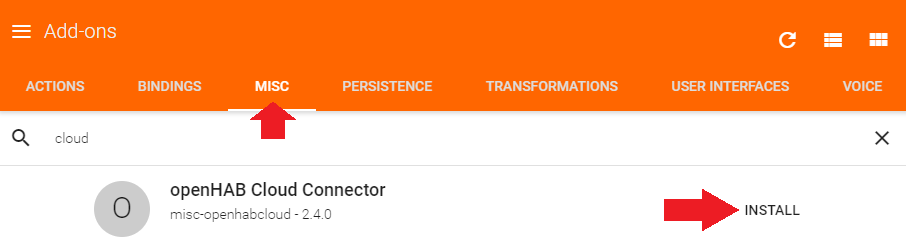

---


Now you need to create a free account on the OpenHAB Cloud Service. Once your account is set up and you are signed in, go to the [Account Page](https://myopenhab.org/account). Here you need to add your __OpenHAB UUID__ and __OpenHAB Secret__. Those can be found on your OpenHAB installation under the following paths (make sure that you install the __Cloud Connector__ first for them to be generated):


```bash
cat /var/lib/openhab2/uuid
cat /var/lib/openhab2/openhabcloud/secret
```


Add your UUID and Secret on your [Account Page](https://myopenhab.org/account) and update your configuration:


---

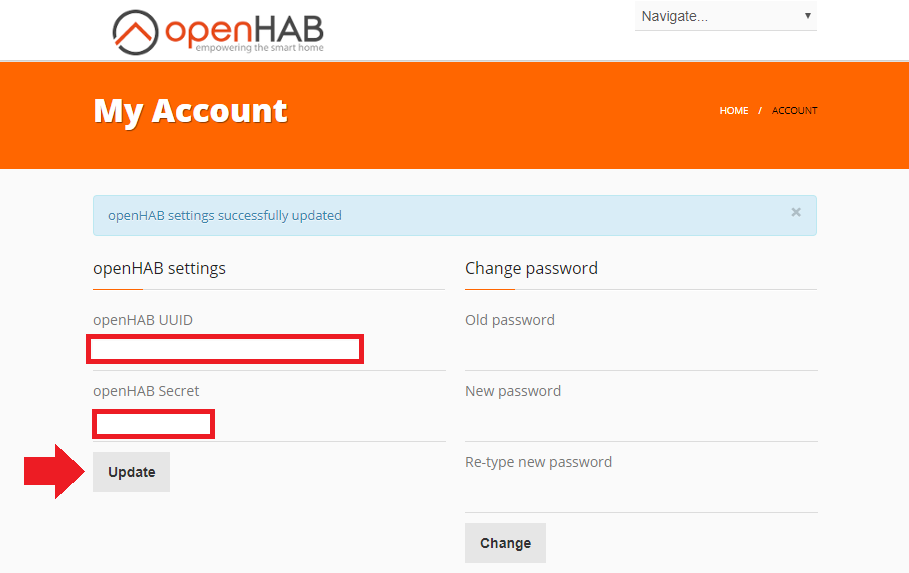

---


Now back to the __Paper UI__ go to __Configuration__ and __Services__:


---

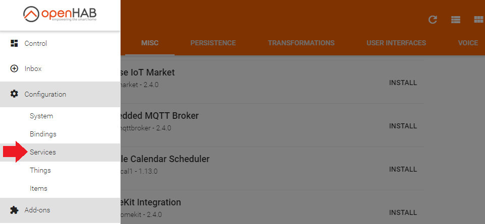

---


You can find the __Cloud Connector__ in the __IO Section__. Click to configure it:


---

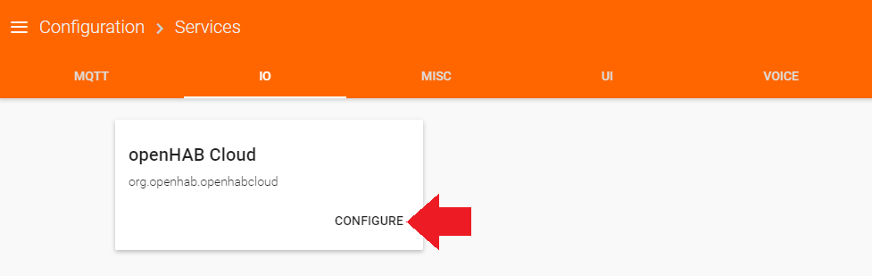

---


And make sure that the __Remote Access__ is active and the __Base URL__ is set to `https://myopenhab.org/`:


---

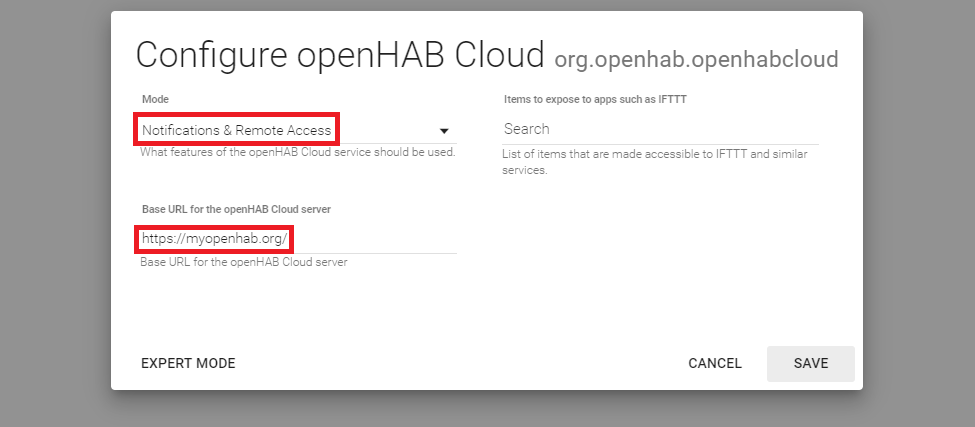

---


Now go back to your terminal and reboot your Linux system that is running OpenHab with `sudo reboot`. Once OpenHAB is back up refresh the [Cloud Page](https://myopenhab.org/events?source=openhab) - you should see that your status is now set to __ONLINE__:


---

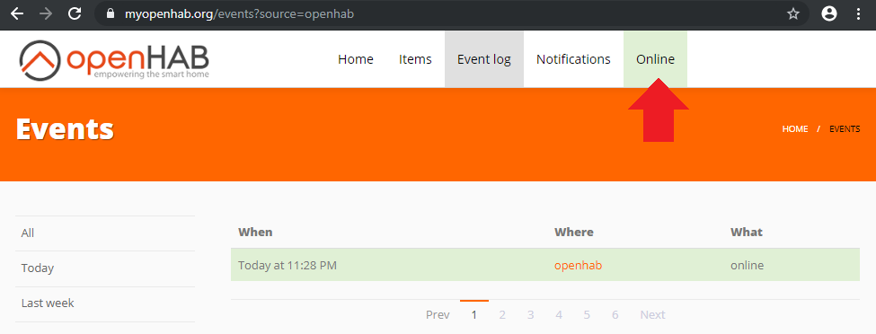

---


When you now switch to the [dashboard URL](https://home.myopenhab.org/start/index) you will be able to see your regular OpenHAB interface. And this URL will work from anywhere where you have internet access:


---

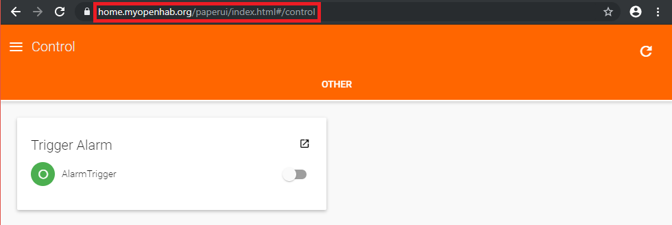

---