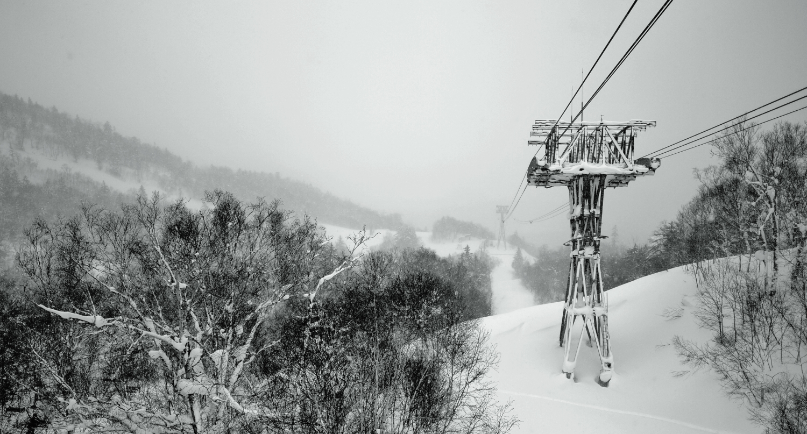


<!-- TOC -->

- [Shinobi Installation](#shinobi-installation)
- [Shinobi Configuration](#shinobi-configuration)
- [Adding an INSTAR Full HD Camera](#adding-an-instar-full-hd-camera)
- [Setting up Motion Detection for your INSTAR IP Camera](#setting-up-motion-detection-for-your-instar-ip-camera)
- [Default Motion Detection Settings](#default-motion-detection-settings)
  - [Global Detector Settings Primary Engine : Pixel Array](#global-detector-settings-primary-engine--pixel-array)
  - [Motion Detection Primary Engine : Pixel Array](#motion-detection-primary-engine--pixel-array)
  - [Traditional Recording](#traditional-recording)

<!-- /TOC -->


[Shinobi](https://shinobi.video) is Open Source, written in Node.js, and real easy to use. It is the future of CCTV and NVR for developers and end-users alike. It is catered to by professionals and most importantly by the one who created it.


## Shinobi Installation


<div class="dangerbox">
    <h3>Amendment:</h3>
    <p>Please note that <a href="https://nodejs.org/en/download/package-manager/">Node.js 8 or 9</a> must be present on your system before installation.</p>
    <p>If Node.js 8/9 is missing, it will be installed by the installation script, but the installation of FFMPEG will fail and the program will not start at the end.</p>
    <p>If this happens to you, you can <a href="https://www.npmjs.com/package/ffmpeg">reinstall FFMPEG via npm</a>. Go to the installation directory of Shinobi <code>cd /home/Shinobi</code> and start the installation via <code>npm install ffmpeg</code>. After that you should be able to start Shinobi via PM2 <code>pm2 restart all</code>, <code>pm2 list</code>.</p>
</div>

The easiest way to install, directly on metal, is through git. The following operating systems are supported:

* Ubuntu 17.10.1
* CentOS 7
* MacOS 10.7(+)

Become root to use the installer and run Shinobi. Use one of the following to do so.

Ubuntu 17.10.1:

```bash
sudo su
```

CentOS 7:

```bash
su
```

MacOS 10.7(+):

```bash
su
```

Download and run the installer:

```bash
bash <(curl -s https://gitlab.com/Shinobi-Systems/Shinobi-Installer/raw/master/shinobi-install.sh)
```


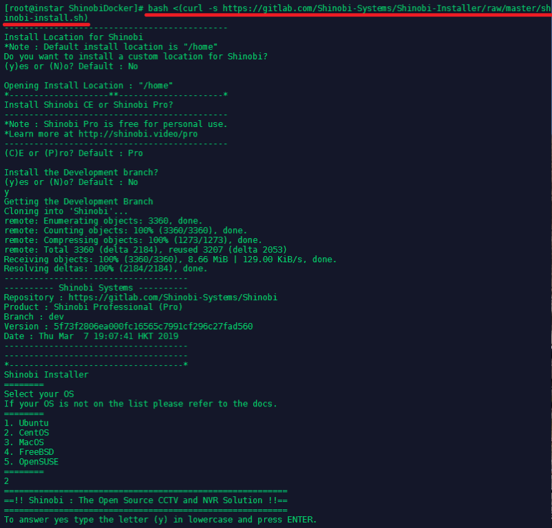


<div class="dangerbox">
    <h3>Changing the WebUI Port:</h3>
    <p>By default the Shinobi WebUI uses the port <code>8080</code>. Due to a port conflict we were forced to change that port to <code>8888</code>. The following tutorial will keep referring to the default port - but all screenshots will show the changed port.</p>
    <p><strong>OPTIONAL</strong>: In case you need to change the port as well, this can be done in the software installation directory (default: <code>/home/Shinobi</code>) by editing both the <code>conf.json</code> and <code>conf.sample.json</code> file:</p>
</div>


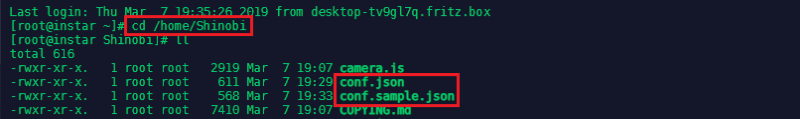


## Shinobi Configuration


Create a Shinobi user by accessing `http://<IP Address>:8080/super` and login with:


```bash
user: admin@shinobi.video
password: admin
```


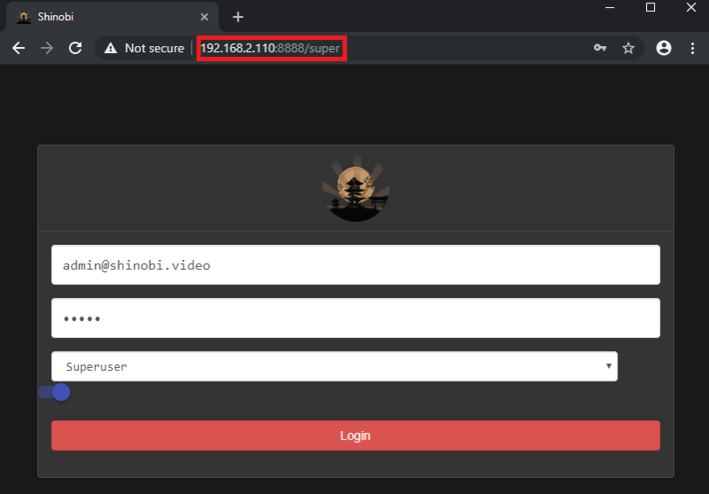


Click on __Add User__ and create a default user for your Shinobi installation:


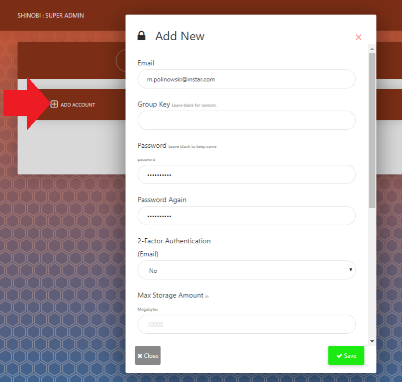


You can now switch to `http://<IP Address>:8080/` and login with the default user you just created:


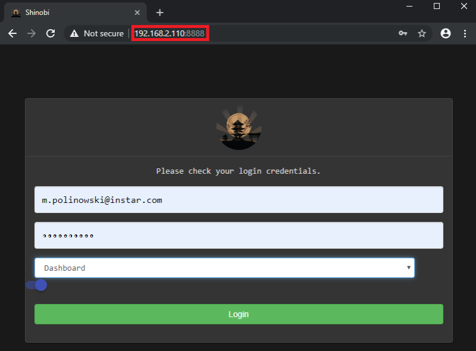


## Adding an INSTAR Full HD Camera


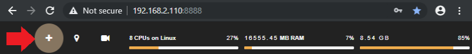


We can start using Shinobi by clicking on the __+__ Symbol in the top left and adding an ID and a readable Name for the camera we want to add in the __Identity__ section. It is important to choose the __Watch Only__ mode if you want to use the integrated Motion Detection:


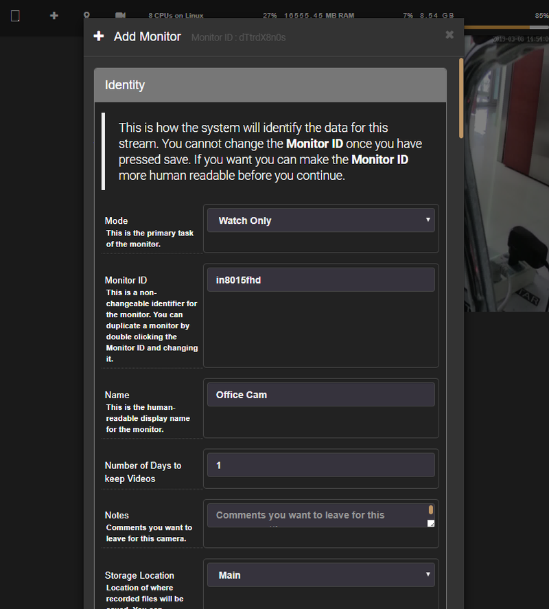


For the __Connection__ part we need to choose _h.264_ and the Video (RTSP) Path for our camera model (__Note__: that we are choosing the `11` path that represents the full resolution for INSTAR cameras. If you are experiencing issues - like a stuttering video stream or high CPU loads - you can switch to `12` or `13` instead to set a lower resolution):


```bash
rtsp://<Camera IP Address>/11
```


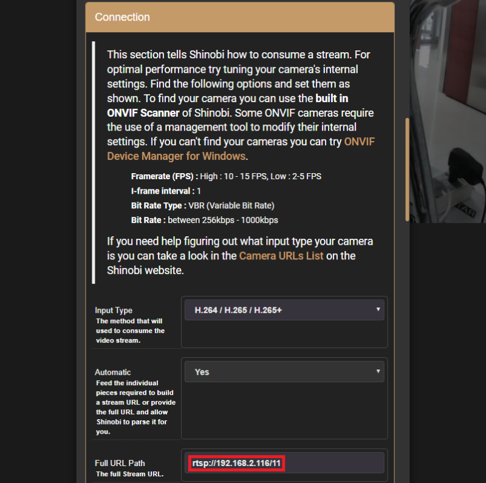


Now close the configuration menu to save your settings. Open the side menu by clicking on the hamburger icon in the top left and click on the camera you just added. The video stream should show up in a floating viewport on the right (might take a few seconds - if it takes too long, consider using a smaller RTSP stream as stated above):


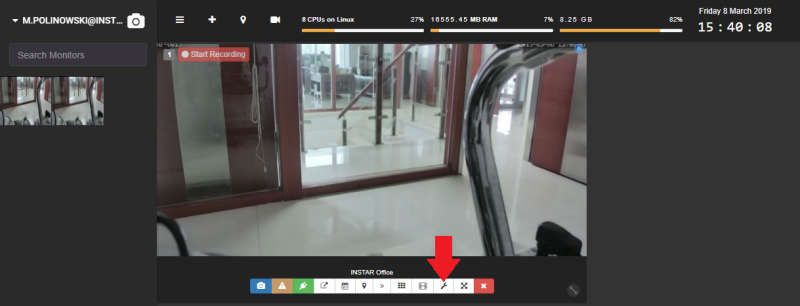


## Setting up Motion Detection for your INSTAR IP Camera


Now click on the __Wrench Button__ to get back to the configuration menu and switch the menu to __Advanced Mode__ at the bottom of the floating window:


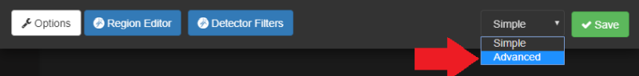


The menu will now offer a couple of additional configuration option - a couple of the relate to alarm features:


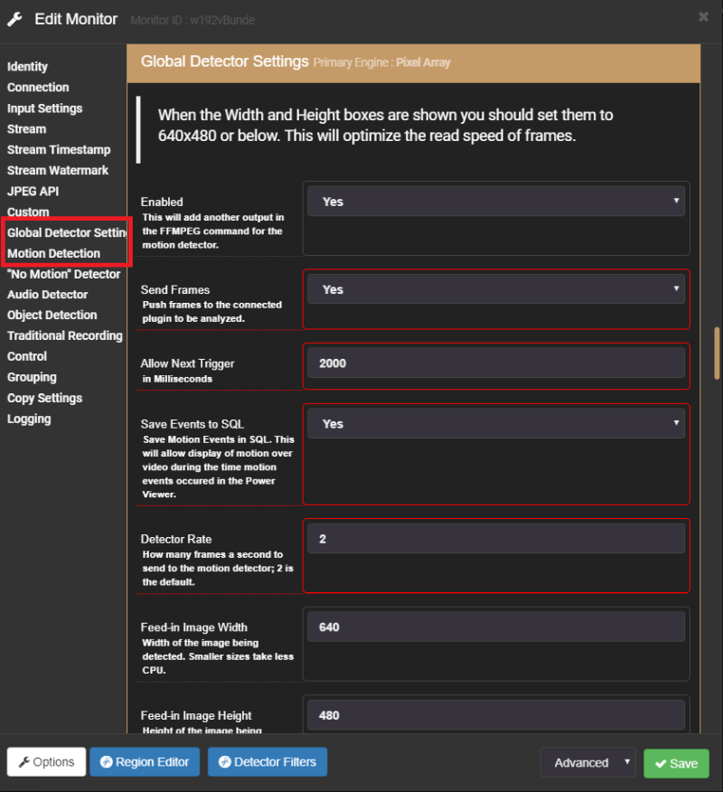


* __Global Detector Settings__: It is best to leave everything at it's [default values](#default-motion-detection-settings) - you can come back to it later to add some performance fine tuning here.
* __No Motion Detector__: An interesting feature is the inverted motion detection - do you want to make sure that your machine is working at all time? Set up Shinobi to notify you when it stopped.
* __Audio Detector__: Our RTSP stream contains both the video as well as the audio stream from our camera. Use the audio to trigger a recording in Shinobi.
* __Object Detection__: This function requires the [additional installation](https://shinobi.video/docs/object) of [OpenCV](https://opencv.org) and is out of the scope of this tutorial.


And last but not least, we have the classic __Motion Detection__:


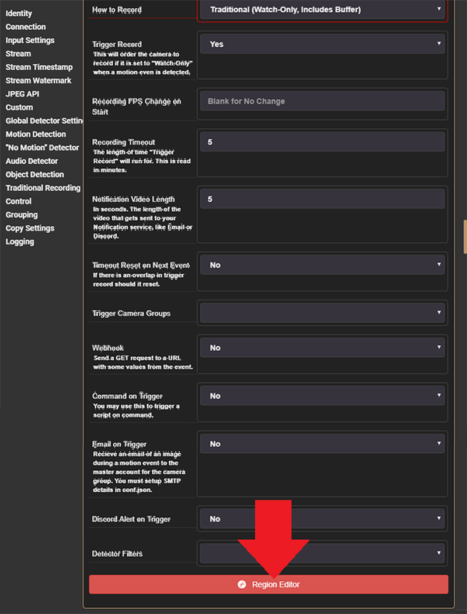


__Correction__: the screenshot above set's the __Recording Timeout__ to 5min - it is much more sensible to choose a value of 0.2, resulting in 12s alarm videos.

Here, again, we will leave most at the [default settings](#default-motion-detection-settings) and move on the __Region Editor__ that allows us to define Motion Detection Areas that will be used to limit the area that will be watched by the detection algorithm:


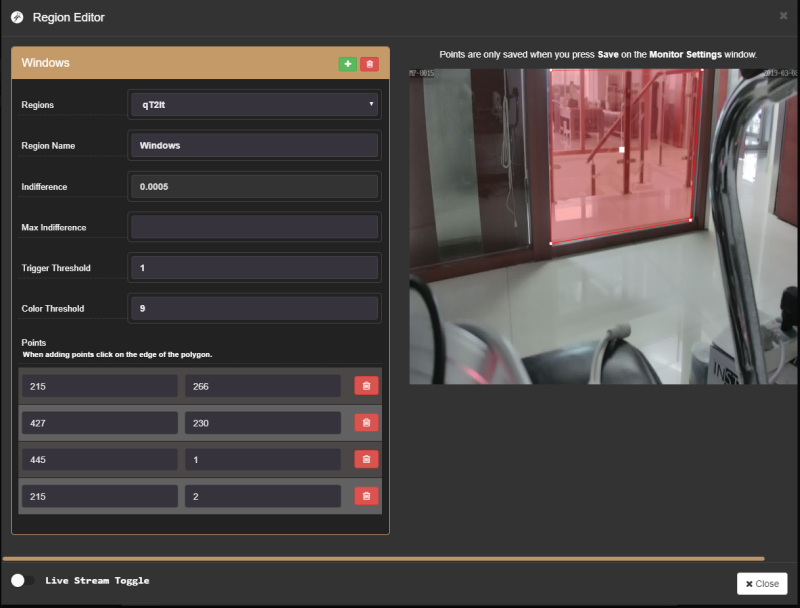


Klick on the green __+ Button__ to add an area - the new area will be displayed in the top left corner of the camera video image. You can drag&drop each of the white anchor points to reposition them. Or click on the red line to add a new anchor (a right-click deletes a point). Klick on __Close__ to save your settings.


When you scroll further down the config menu you will reach the rest of the motion detection settings - again, we will leave most of them at their [default settings](#default-motion-detection-settings) for now (to be further fine-tuned later on):


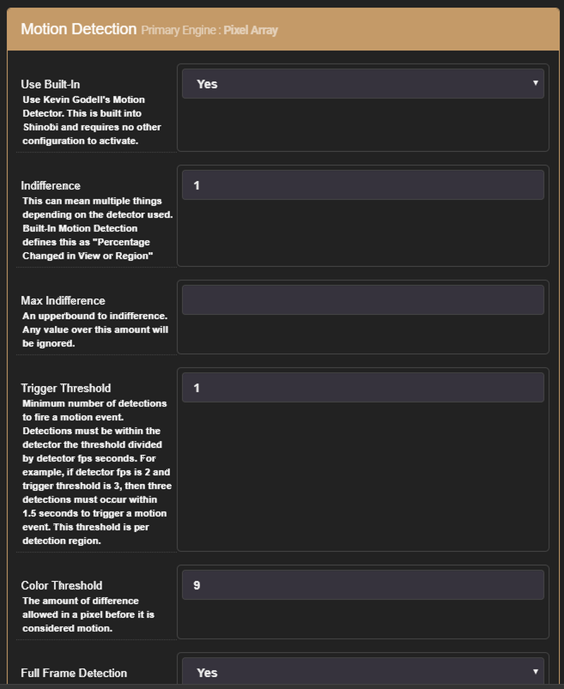


Close the configuration menu now and walk in front of your camera to trigger a few alarm recordings. The Shinobi offers a couple of ways to view our alarm videos:

* Event Log
* Video Grid
* Video List
* Time Lapse Recordings
* Power Viewer

We are going to show you the __Power Viewer__ as seen in the screenshots below. Click on the button marked with the red arrow:


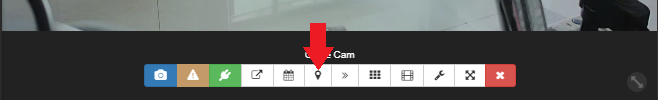


The Power Viewer will show you a timeline of all alarm recording events - the higher the red bars, the more motion was detected inside the video. Clicking on a bar in the timeline opens the recorded video.


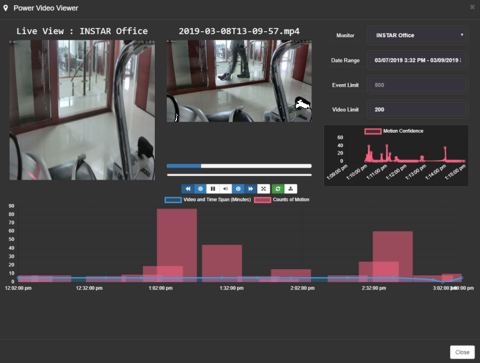


## Default Motion Detection Settings

### Global Detector Settings Primary Engine : Pixel Array

<br/>

| Detector Settings | Recommended Option | Description |
| --- | --- | --- |
| Enabled | Yes | Enable to reveal and use the other options. |
| Send Frames | Yes | Push frames to the connected plugin to be analyzed. |
| Allow Next Trigger | 2000 | The amount of milliseconds that needs to pass before allowing the next event registration. |
| Save Events to SQL | Yes | Save Motion Events in SQL. This will allow display of events over video during the time events occurred in the Power Video Viewer. |
| Detector Rate | 2 | How many frames per second to send to the motion detector. |
| Feed-In Image Width | 640 | Width of the image being detected. Smaller sizes take less CPU. |
| Feed-In Image Height | 480 | Height of the image being detected. Smaller sizes take less CPU. |
| How to Record | Traditional | There are multiple methods to record. Read below on why that is. |
| Trigger Record | Yes | When enabled it will give the command to start the recording process. |
| Recording FPS Change on Start |  | Leave blank for no change - when you are using a low frame rate in your live video, use this option to increase the frame rate everytime when an alarm recording is running. |
| Recording Timeout | 0.2 | The amount of time, in minutes, that the video will record for. |

<br/><br/>

### Motion Detection Primary Engine : Pixel Array

<br/>

| Motion Detection Settings | Recommended Option | Description |
| --- | --- | --- |
| Use Built-In | Yes | Use Kevin Godell's Motion Detector. This is built into Shinobi and requires no other configuration to activate. |
| Indifference | 1 | When using Kevin's Detector Indifference means "minimum percentage changed in region". This option varies based on camera, start with 1 and work your way up. |
| Max Indifference (leave blank until comfortable with minimum first) |  | As the name suggests it is a max value for Indifference. |
| Trigger Threshold | 1 | Minimum number of detections to fire a motion event. Detections. Default is 1. Don't adjust it until tuning begins. |
| Color Threshold | 9 | The amount of difference allowed in a pixel before it is considered motion. Default is 9. |
| Full Frame Detection | No | Enabling Full Frame Detection will create a region that covers the entire frame. Only enable this if you aren't using regions made in the Region Editor. |
| Noise Filter | No | Remove false detections due to "noisy backgrounds" |
| Noise Filter Range | 6 |  |

<br/><br/>

### Traditional Recording

<br/>

| Traditional Recording Settings | Recommended Option | Description |
| --- | --- | --- |
| Video Encoder | Auto | The video writer. Shinobi will try to choose the best option for you when selecting Auto. For Manual Selection :  RTSP cameras will generally take copy. MJPEG cameras will take libx264. |
| Audio Encoder | No Audio | RTSP cameras will generally use aac. MJPEG cameras must be set to No Audio.  |
| Segment Length | 2 | Set this to 2 for a buffer of ~5 seconds. |