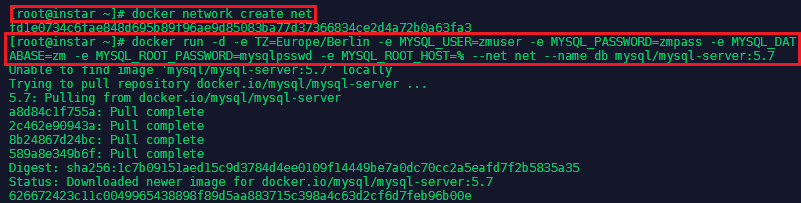
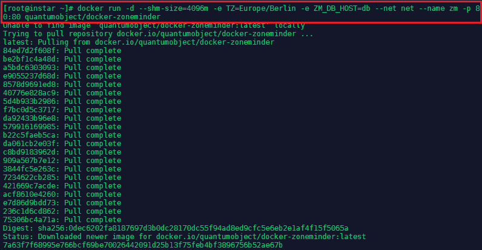
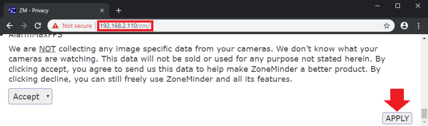
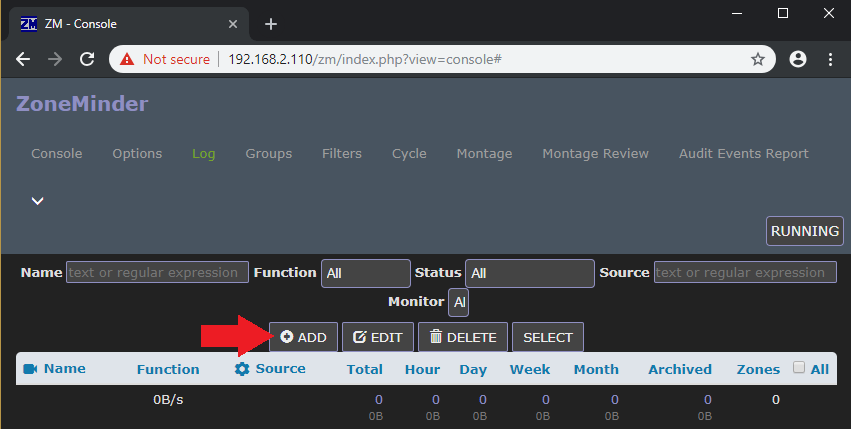
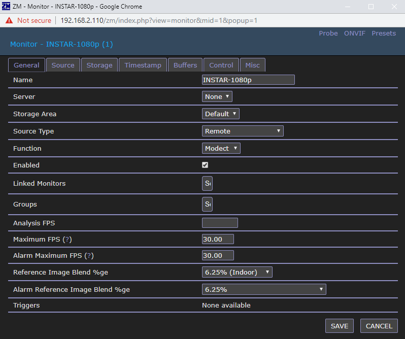
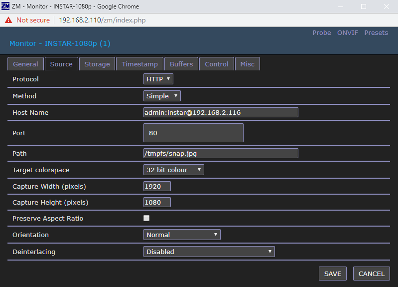
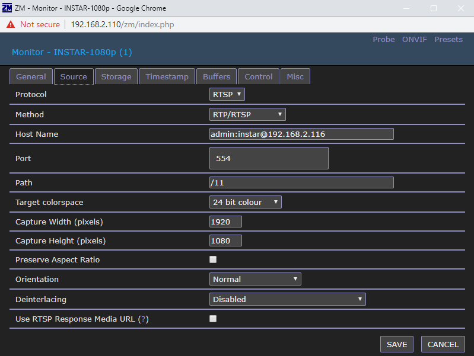
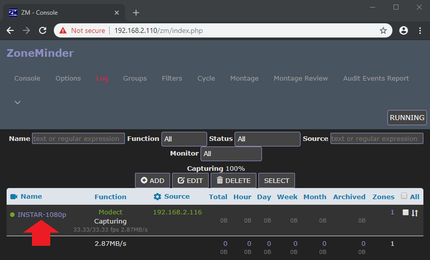
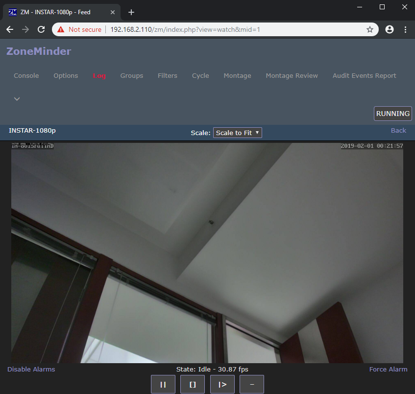

<!-- TOC -->

- [Installation of Docker on CentOS](#installation-of-docker-on-centos)
- [Zoneminder and MySQL](#zoneminder-and-mysql)
- [Accessing the Zoneminder applications](#accessing-the-zoneminder-applications)
- [Configuring ZoneMinder](#configuring-zoneminder)
  - [FirewallD](#firewalld)
  - [Adding a INSTAR 1080p Camera](#adding-a-instar-1080p-camera)
    - [Adding your cameras MJPEG Stream](#adding-your-cameras-mjpeg-stream)
    - [Adding your cameras RTSP Stream](#adding-your-cameras-rtsp-stream)
- [Accessing your Camera](#accessing-your-camera)

<!-- /TOC -->


ZoneMinder is intended for use in single or multi-camera video security applications, including commercial or home CCTV, theft prevention and child, family member or home monitoring and other domestic care scenarios such as nanny cam installations. It supports capture, analysis, recording, and monitoring of video data coming from one or more video or network cameras attached to a Linux system. ZoneMinder also support web and semi-automatic control of Pan/Tilt/Zoom cameras using a variety of protocols. It is suitable for use as a DIY home video security system and for commercial or professional video security and surveillance. It can also be integrated into a home automation system via X.10 or other protocols. If you're looking for a low cost CCTV system or a more flexible alternative to cheap DVR systems, then why not give ZoneMinder a try?


## Installation of Docker on CentOS

Docker can be installed on Linux, Windows and macOS. In this example we will use CentOS Linux - for other operating systems, please [check the official documentation](https://docs.docker.com/install/).


First we need to add the repository to pull the Docker code from - type `nano /etc/yum.repos.d/virt7-docker-common-release.repo` and add:


```yaml
[virt7-docker-common-release]
name=virt7-docker-common-release
baseurl=http://cbs.centos.org/repos/virt7-docker-common-release/x86_64/os/
gpgcheck=0
```


Then install [Docker](https://www.docker.com/) on Centos server:


```bash
yum update
yum -y install --enablerepo=virt7-docker-common-release docker
systemctl enable docker 
systemctl start docker
```


## Zoneminder and MySQL

We will use the [Zoneminder](https://hub.docker.com/r/quantumobject/docker-zoneminder) from [QuantumObject](https://github.com/QuantumObject) that requires a MySQL v5.7 server. To run with MySQL in a separate container use the command below:


```bash
docker network create net
docker run -d -e TZ=Europe/Berlin -e MYSQL_USER=zmuser -e MYSQL_PASSWORD=zmpass -e MYSQL_DATABASE=zm -e MYSQL_ROOT_PASSWORD=mysqlpsswd -e MYSQL_ROOT_HOST=% --net net --name db mysql/mysql-server:5.7
echo "wait until MySQL startup..."
```


---



---


Then download and run the ZoneMinder container:


```bash
docker run -d --shm-size=4096m -e TZ=Europe/Berlin -e ZM_DB_HOST=db --net net --name zm -p 80:80 quantumobject/docker-zoneminder
```


---



---


You can verify that both containers are running with - `docker ps`:


---


---


## Accessing the Zoneminder applications

After that check with your browser at addresses plus the port assigned by docker:


---



---


```
http://host_ip:port/zm/
```


Them log in with login/password : admin/admin , Please change password right away and check on-line [documentation](http://www.zoneminder.com/wiki/index.php/Documentation) to configure ZoneMinder.


To access the container from the server that the container is running:


```bash
docker exec -it container_id /bin/bash
```


## Configuring ZoneMinder

### FirewallD

Before adding a camera make sure that the ports 80 and 554 are accessible on your server. If you are running [FirewallD](https://firewalld.org/documentation/) use the following commands to open these ports:


```bash
firewall-cmd --permanent --add-port=554/tcp
firewall-cmd --permanent --add-port=80/tcp
firewall-cmd --reload
```


### Adding a INSTAR 1080p Camera 

Open the __Console__ tab and click on __Add__:


---



---


On the __General__ tab give your camera a name and choose __Remote__ as __Source Type__:


---



---


#### Adding your cameras MJPEG Stream

For the JPG stream choose:

|   |   |
|---|---|
| Protocol | HTTP |
| Host Name | username:password@camera-ip |
| Port | 80 |
| Path | /tmpfs/snap.jpg |
| Width | 1920 |
| Height | 1080 |


---



---


#### Adding your cameras RTSP Stream

For the JPG stream choose:

|   |   |
|---|---|
| Protocol | RTSP |
| Method | RTP/RTSP |
| Host Name | username:password@camera-ip |
| Port | 554 |
| Path | /11 |
| Width | 1920 |
| Height | 1080 |


---



---


## Accessing your Camera


---




---