<!-- TOC -->

- [Homeautomation Miniserver](#homeautomation-miniserver)
  - [Installation of the Miniserver](#installation-of-the-miniserver)
  - [Smart Home App and WebUI](#smart-home-app-and-webui)
  - [Control INSTAR IP camera via the Loxone Miniserver](#control-instar-ip-camera-via-the-loxone-miniserver)
    - [Example 1: Triggering an alarm](#example-1-triggering-an-alarm)
    - [Example 2: Go to a saved position](#example-2-go-to-a-saved-position)
  - [Display your camera video on alarm](#display-your-camera-video-on-alarm)
- [Integrating the alarm output relay of the camera](#integrating-the-alarm-output-relay-of-the-camera)
- [Integrating the alarm input of the camera](#integrating-the-alarm-input-of-the-camera)
- [Use the Loxone Miniserver as alarm server](#use-the-loxone-miniserver-as-alarm-server)

<!-- /TOC -->


## Homeautomation Miniserver

The home automation [miniserver from Loxone](https://www.loxone.com/dede/produkte/hausautomation-miniserver/) connects all smart components in your apartment or house. All strings run together to the Miniserver to enable communication between the individual components: Light, shading, heating, buttons as well as your INSTAR IP camera.


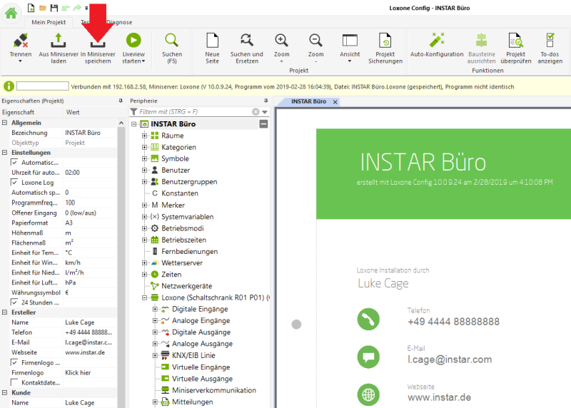


### Installation of the Miniserver

1. First, the Miniserver must be installed and connected in your distributor. The LAN cable must be [connected](https://www.loxone.com/dede/kb/inbetriebnahme-miniserver/) to the network router (e.g. Internet W-LAN router) and the miniserver must be connected to power. After approx. 1 minute the Miniserver should [be operational](https://www.loxone.com/dede/kb/checkliste-miniserver-startet-nicht-mehr/):


__Miniserver: The left LED flashes green regularly. The right LED is off.__


1. To configure the Miniserver you need a PC on which the program [Loxone Config](https://www.loxone.com/dede/produkte/loxone-config/) is installed. This PC must be connected to the same network router (W-LAN or LAN) to which the Miniserver was connected.

2. To create a new project in the software by clicking on __New Project__, select the miniserver and enter the appropriate project data in the following input masks.


3. By clicking on the arrow below the _Connect_ button in the software, the search dialog can be opened. After the [Miniserver appears](https://www.loxone.com/dede/kb/miniserver-erstkonfiguration/#diagnosenetzwerk), it must be selected and enter the user data - __Default: user name: `admin` and password: `admin`__. By clicking on _Setup_ you get an overview of the configuration. After confirming this, you will come to the __Network Settings__ - specify here a static IP address that is available on your local network.


4. As a last point of the initial configuration the just created project must be saved in the Miniserver:


### Smart Home App and WebUI

From this point it is possible to use the [Smart Home App](https://www.loxone.com/dede/produkte/apps/) to connect to the Miniserver with your mobile phone, tablet, PC as long as you are in your home network. Download the apps directly from the [here](https://www.loxone.com/dede/support/downloads/), or in the respective APP Store and log in to the Miniserver with the user data that you specified in the steps before during the initial configuration.


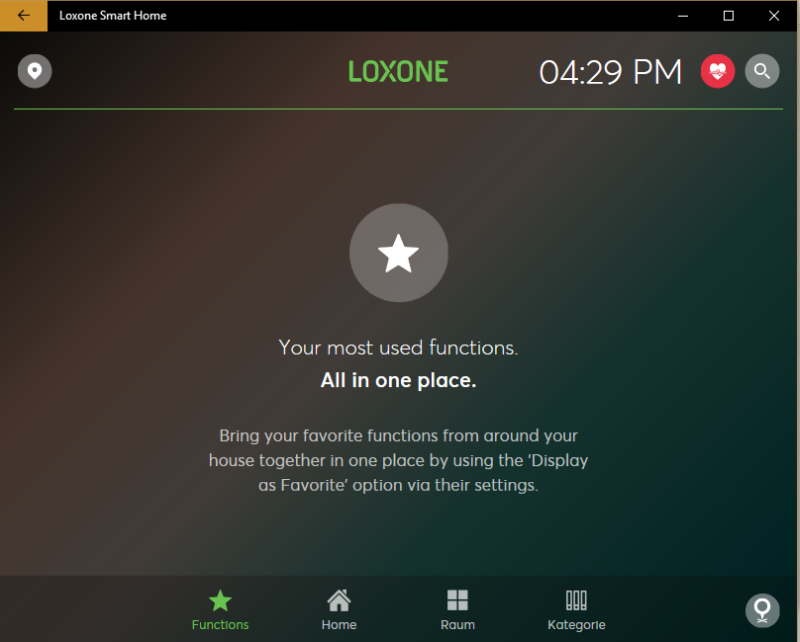


The web interface of the miniserver is via the local IP of the server in your network and the login you entered in the setup for the item __Visualizations__:


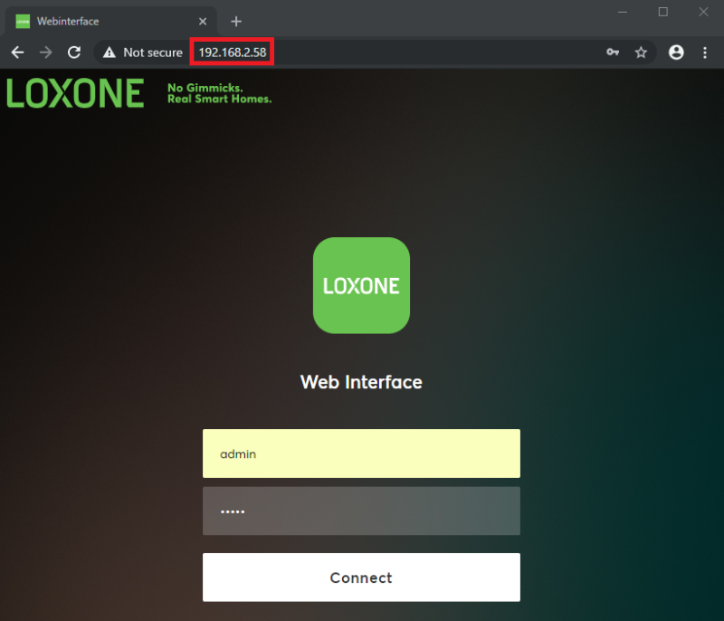


### Control INSTAR IP camera via the Loxone Miniserver

In order to control our IP camera via the Loxone server, we need to create a virtual output and assign it a button in the UI and a CGI command for the camera:


#### Example 1: Triggering an alarm


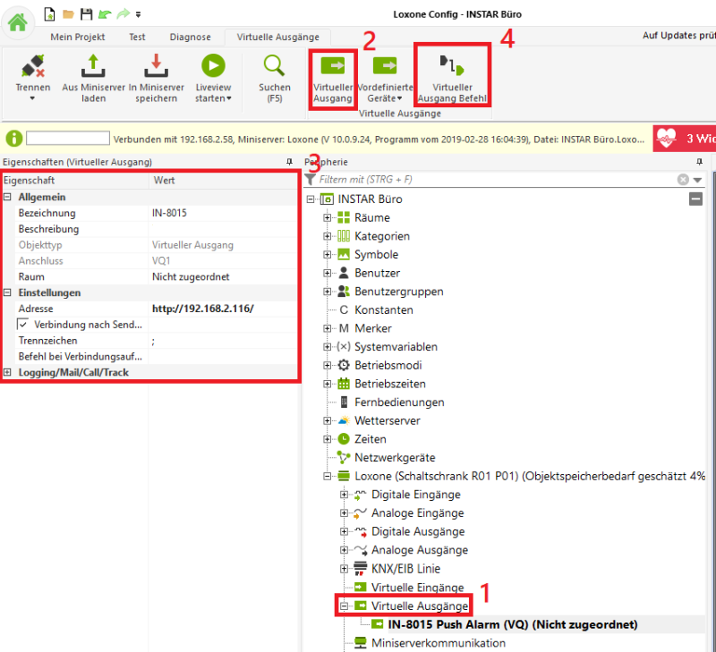


1. Access your __Project__ on the Loxone Miniserver and click on __Virtual Outputs__.
2. Now a button will appear at the top of the menu bar where you can create a __Virtual Output__.
3. Clicking on this button opens the configuration page where you can assign a camera to the output via its IP address.
4. Then click __Virtual Exit Command__ to assign the output a command that you want to send to the camera when you press the button.


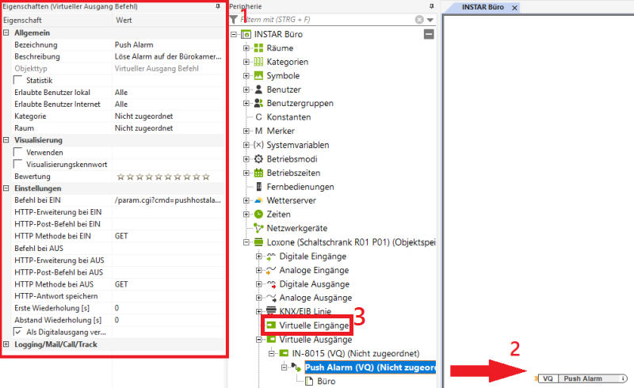


1. Enter a name for the function you want to use with the CGI command. In the example we take the command that triggers an alarm on the camera. __Please note__ that this command only works with INSTAR Full HD cameras. However, if you have a camera from another series, you can easily exchange the command for another CGI command for your camera. The command requires the username and password of the administrator user to be appended to the back of the camera - in the example, this is _username = admin_ and _password = instar_ (if you select a CGI command here that can turn something on or off on the camera) these are to be entered accordingly with __command at ON__ and at __command at OFF__, with the respective parameter.)


```
/param.cgi?cmd=pushhostalarm&-usr=admin&-pwd=instar
```

2. Then click on the exit, hold down the left mouse button and drag the object onto the work surface on the right.
3. Afterwards we can create a __Virtual input__ with which we want to trigger the virtual output.


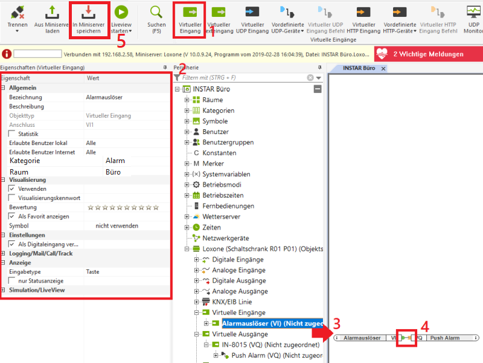


1. Click __Virtual input__ to create an input.
2. In the opening configuration window you can give a __name__ to the input, select it in the __Visualization__ (WebUI) and as __Input Type__ choose __key__ (if you have chosen another CGI command next to the one on the camera) and turns off, you should instead choose a __switch__ here).
3. Then pull the Input onto the work area.
4. And connect the two elements.
5. Save the change by clicking on the floppy disk icon in the top left corner and transfer the program with the __Save in Miniserver__ button.


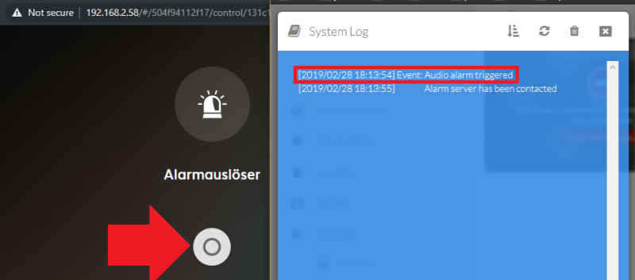


Now when we access the web interface of the miniserver again, we can see that a button has appeared there. If we select this and press it, an __Audio Alarm__ is triggered on our camera and thus all programmed alarm actions are started - in the example the Alarm server was contacted.


#### Example 2: Go to a saved position

For the second example, we can now recycle a lot of the previous one.


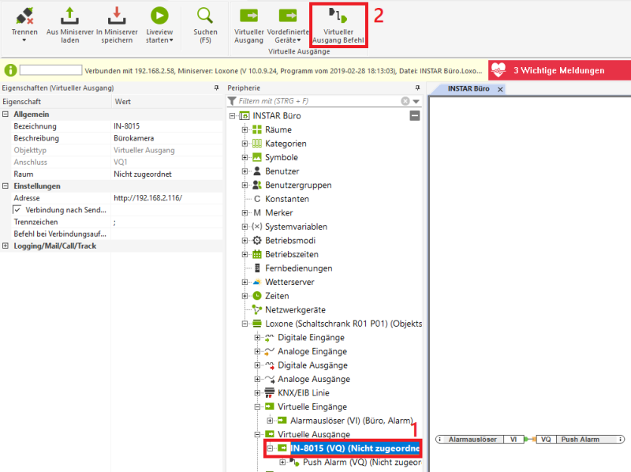


1. First click on the __Virtual output__ that we created for our camera.
2. And then on the __Virtual Output command__ to add another command.


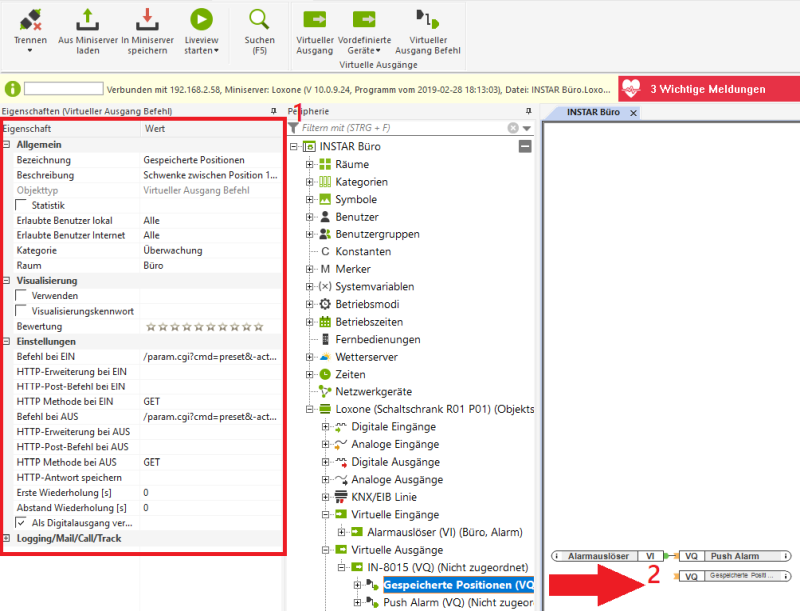


1. Here you can store the stored position 1 for the __command for ON__ and the stored position 2 for __command for OFF__:


```
/param.cgi?cmd=preset&-act=goto&-number=0&-usr=admin&-pwd=instar
/param.cgi?cmd=preset&-act=goto&-number=1&-usr=admin&-pwd=instar
```


2. And drag the configured output to the work area.


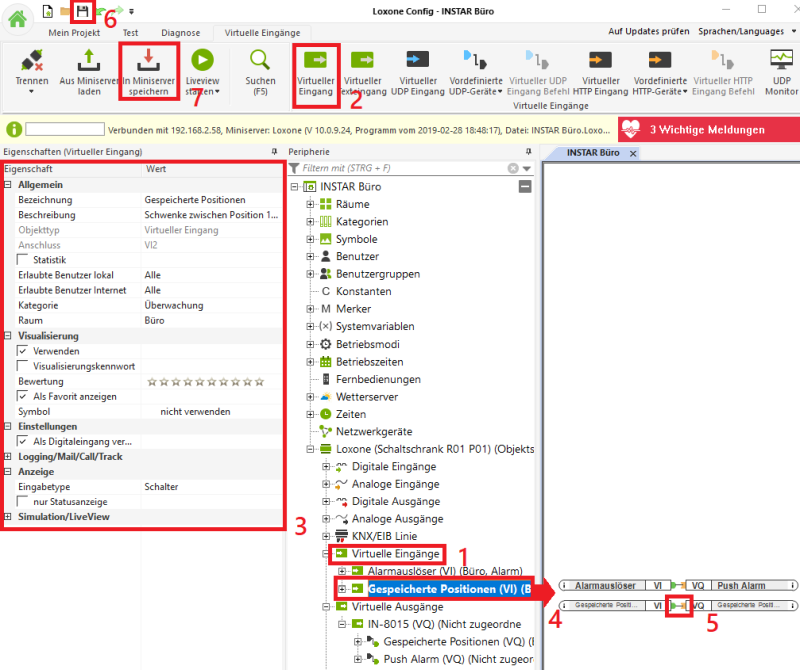


1. Now click on __Virtual Inputs__.
2. And on __Virtual Inputs__.
3. As display in the visualization (WebUI) we select a __Switch__ here.
4. Then pull the entrance onto the work surface.
5. And connect both outputs (from the virtual input) to the previously created virtual output.
6. Save the settings.
7. And transfer the program to the miniserver.


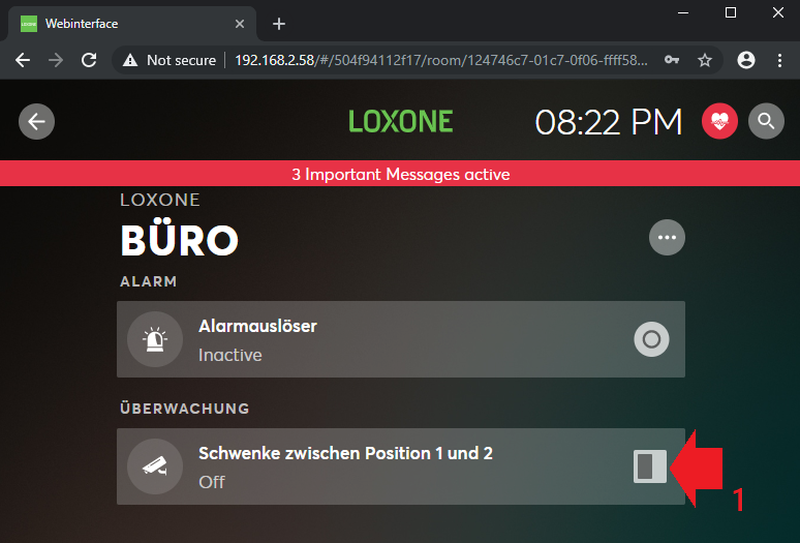


1. Click the button in the WebUI to pan the camera between the two positions.


### Display your camera video on alarm

To display the camera image in the Loxone Miniservers WebUI, we can add a __Custom Intercom__ from the list of __Networks__: 


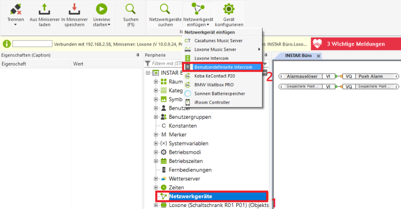


In the configuration of the _Intercoms_ enter the JPG path of your camera - this is the IP address of the camera followed by `/tmpfs/snap.jpg` and the administrator login to the camera (example s. below) and then drag it to the desktop:


```
http://192.168.2.116/tmpfs/snap.jpg?usr=admin&pwd=instar
```


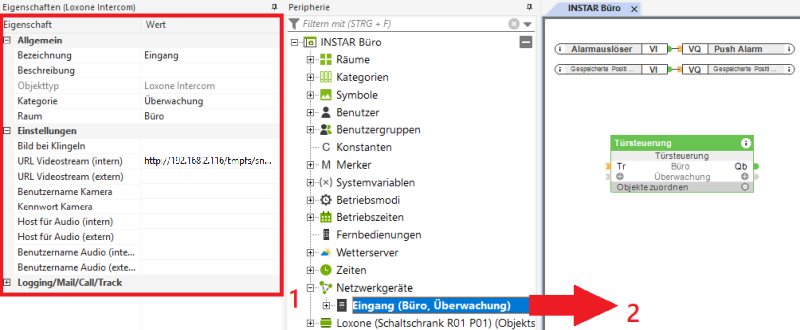


For testing, we create again a __Virtual input__ in the form of a _Button_ and connect it to our _Intercom_. Save the setting and transfer the program to the Miniserver:


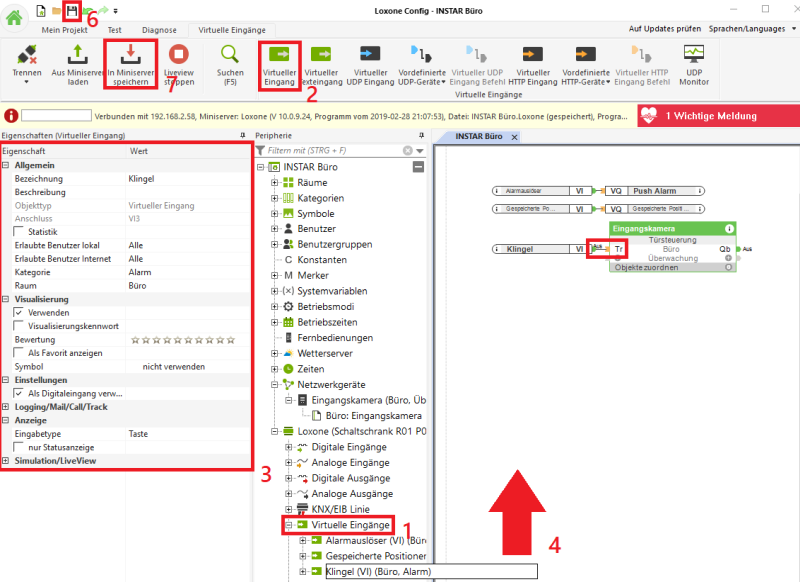


We now have a virtual bell button that when pressed shows the live video of the camera:


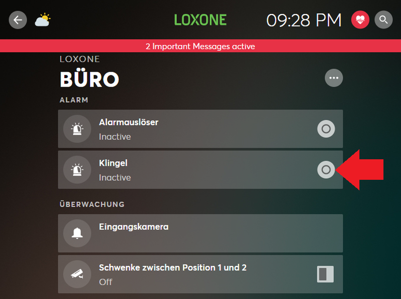


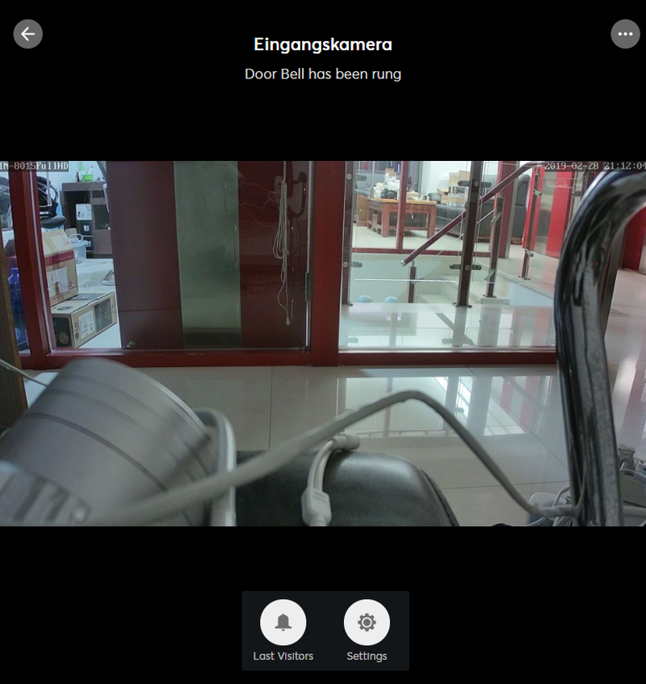


Now all you have to do is replace this virtual bell with Loxone physical accessories. In the following example we have connected the [motion detector](https://shop.loxone.com/dede/bewegungsmelder.html) and the [Touch Control Element](https://shop.loxone.com/dede/loxone-touch.html) with the _Intercom_. If you operate the control or be detected by the motion detector, the ringer will be immediately resolved and all displays running the Loxone software will show you the live video of the embedded camera:


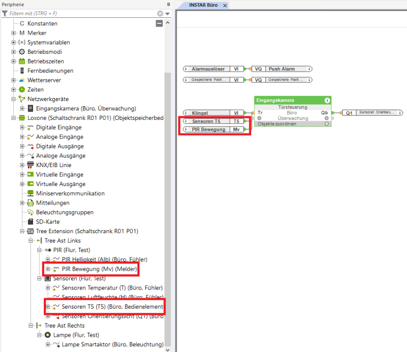


The output on the right side of the _Intercoms_ can in turn connect other devices that are to be triggered when ringing.


To the output on the right side of the _Intercom_ you can connect further devices, which are to be triggered during the ringing. In the example we have connected the orientation light of the Touch control. The end result is:

1. You press the virtual bell button in the WebUI __OR__ you click on the Loxone Touch control __OR__ you trigger the Loxone motion detector and the _Intercom module_ is activated.
2. When activated, the miniserver WebUI and the Loxone Smartphone Apps will automatically display the video image of the camera and play a ringtone.
3. As an example for another action we have connected the orientation light of the touch control with the _Intercom_ and see that it is activated when the _Intercom_ is activated (e.g. you could install a gong here).

---
<br/><br/>


## Integrating the alarm output relay of the camera

The __most__ INSTAR IP cameras have an alarm output:

1. For indoor cameras (such as the INSTAR IN-8015 FullHD, this is usually port 1 and 2 of the four green connectors on the rear panel of the camera.
2. For outdoor cameras, you will usually find the connection on the cable harness of the camera.


We would now like to use this alarm output to report an alarm on the camera in the [Loxone Miniserver](https://www.loxone.com/dede/kb/inbetriebnahme-miniserver/) and trigger a reaction there. In the following example we take the IN-8015 Full HD indoor camera and connect it to the [digital input (potential free)](https://www.loxwiki.eu/display/LOX/Potentialfrei+und+potentialbehaftet) of the Loxone Miniserver:


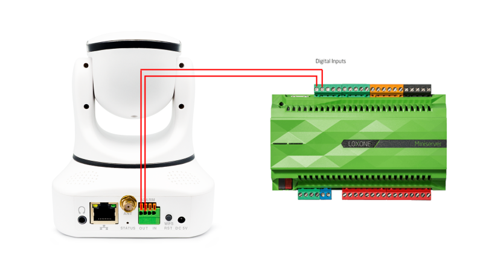


In the [Loxone Config](https://www.loxone.com/dede/produkte/loxone-config/) Software, we can now drag the __first digital input__ onto the work surface and - for testing - connect it to the orientation light of the [Touch control](https://shop.loxone.com/dede/loxone-touch.html) we had previously used:


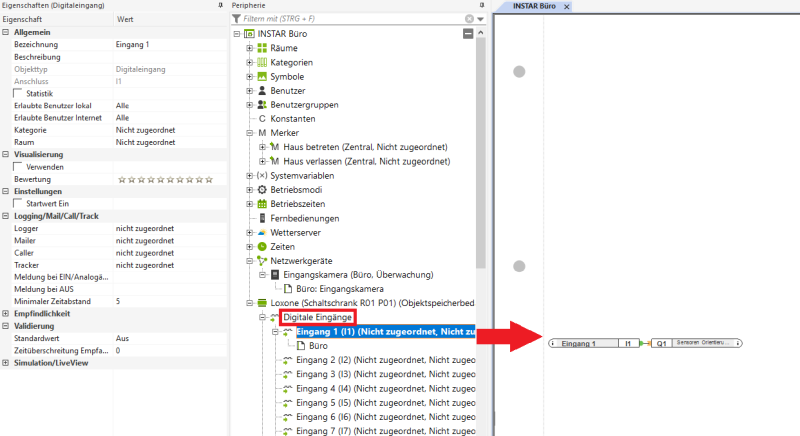


If we now trigger an alarm on the camera via the [Loxone WebUI or App](#example-1-triggering-an-alarm) we want the camera to send a pulse via the __alarm output__ to the __digital input__ of the Loxone Miniserver. We can set this in the alarm actions in the WebUI of the camera:


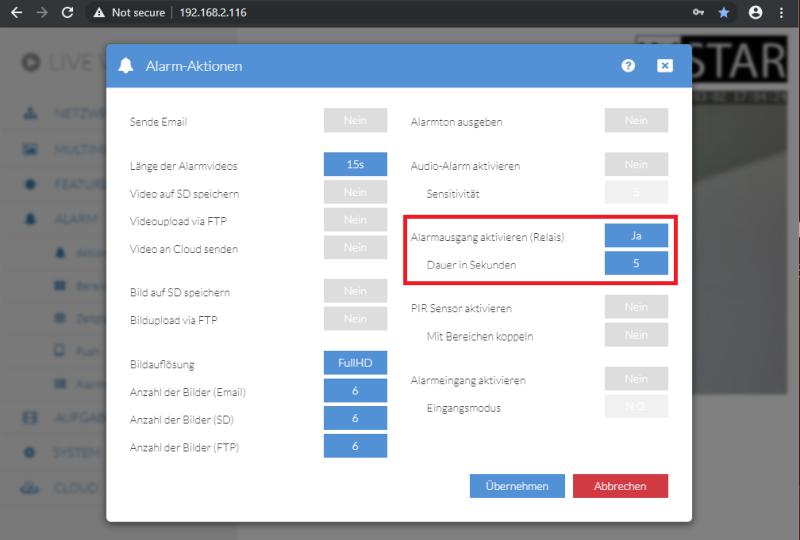


The __duration in seconds__ indicates how long the alarm output relay remains open after an alarm. The 5s set here mean that the orientation lamp lights up for `5s` after an alarm and then goes out again.

---
<br/><br/>


## Integrating the alarm input of the camera


We can now look at the opposite way and address the alarm input of the INSTAR IP camera via the [Loxone Miniserver](https://www.loxone.com/dede/kb/inbetriebnahme-miniserver/). Therefore we connect the first [digital output](https://www.loxwiki.eu/display/LOX/Potentialfrei+und+potentialbehaftet) of the miniserver with the alarm input of the IN-8015 Full HD:


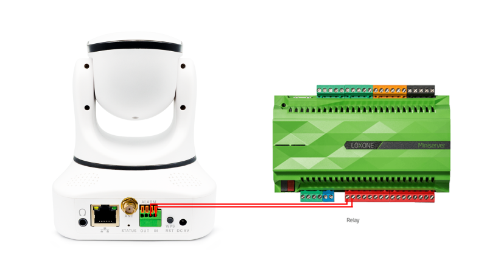


In the [Loxone Config](https://www.loxone.com/dede/produkte/loxone-config/) software we now have to add a __button module__. Make sure that you are on the _My Project_ tab (1) and then select the button under __Insert button__ in the Operation category and place it on the desktop:


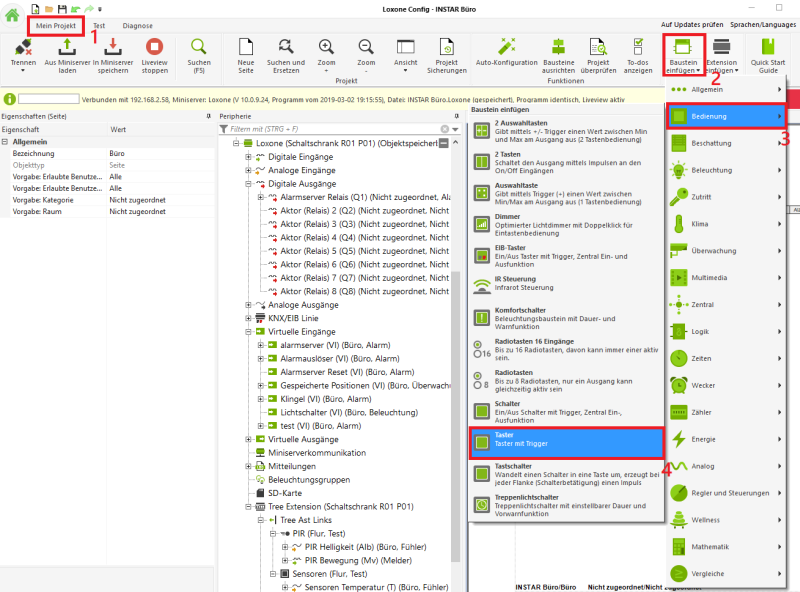


Then pull the first __Digital output__ onto the work surface and connect it to the output of the button:


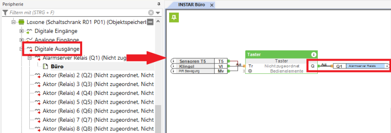


You can now use any actuator or sensor as an input - as well as virtual inputs that can be operated via the Loxone App or WebUI. In the example we have - as before - connected the [Motion detector](https://shop.loxone.com/dede/bewegungsmelder.html) and the [Touch control](https://shop.loxone.com/dede/loxone-touch.html) as well as our virtual bell button to the input of the button.


If one of these three elements is now triggered, a pulse is sent to the alarm input of the camera. We can now activate the alarm input again in the Alarm actions in the camera's WebUI:


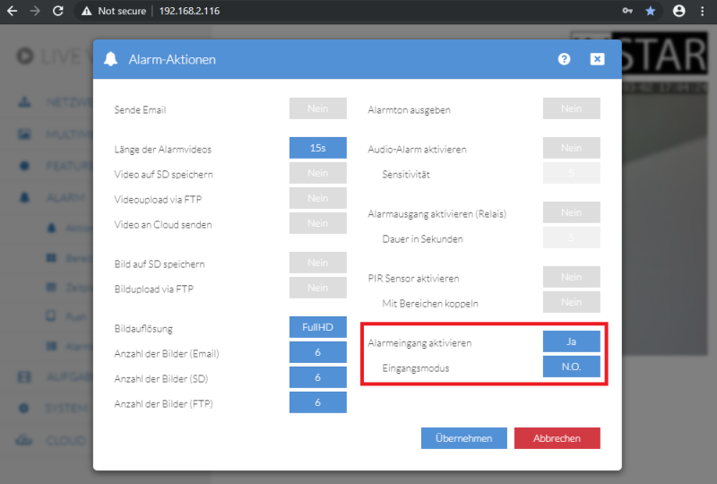


Note that the relay works in the [Loxone Miniserver](https://www.loxone.com/dede/kb/inbetriebnahme-miniserver/) __N.O.__ (_normally open_). If you switch the input mode to N.C., you would receive a continuous alarm accordingly! Accept these settings and trigger one of the 3 inputs (motion detector, touch control or the virtual bell) and you will see an alarm input in the Logbook of your camera:


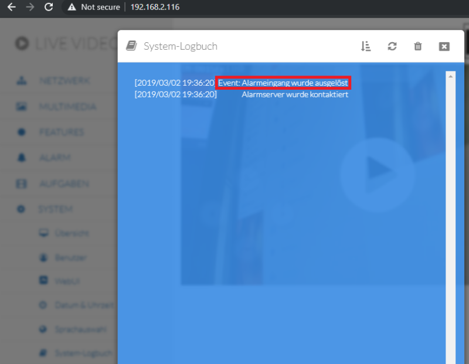


The alarm input then triggers all alarm actions that you have activated in the Alarm actions in the camera's WebUI - in the example above, the Alarm server was contacted.

---
<br/><br/>


## Use the Loxone Miniserver as alarm server

All INSTAR HD and Full HD cameras have an Alarm Server Function which can be used to contact an external alarm server via a web request (_HTTP GET_ to the [REST API of the server](https://www.loxwiki.eu/display/LOX/REST+Webservice)) in case of an alarm on the camera.


As receiver for the alarm server request of the camera we can use in the [Loxone Config](https://www.loxone.com/dede/produkte/loxone-config/) software a __Virtual input__:


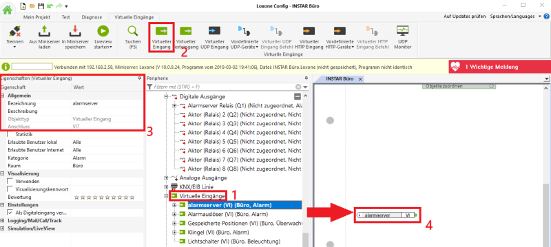


1. select the __Virtual inputs__ for this.
2. click on __Virtual input__ to create a new one.
3. give the new input a name - this will be needed afterwards for the alarm server request (you should use a simple name, without spaces - or special characters).
4. drag the new input onto the desktop.


You can now connect the new input to anything you want to trigger by the alarm event on the camera. We will use the bell/Intercom we created in a [previous step](#display-your-camera-video-on-alarm):


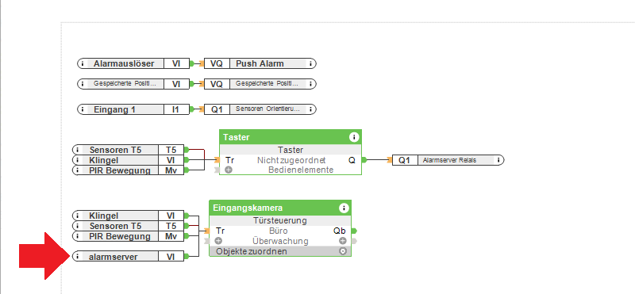


Connect the input to the input of the _Intercom Module_, save the configuration and transfer it to the Loxone Miniserver.


To use this input, we must now configure the Alarm Server on the camera. Therefore we have to know that the __Virtual Input__ in the Loxone Miniserver can be reached via the [REST API](https://www.loxwiki.eu/display/LOX/REST+Webservice) under the path `/dev/sps/io/<Name of the Virtual Input>/`. This path must be preceded by the IP address of the Loxone Miniserver - e.g. `192.168.2.58` - and the state we want to switch the input to must be appended at the end:


* `http://192.168.2.58/dev/sps/io/alarmserver/ON` (permanently on)
* `http://192.168.2.58/dev/sps/io/alarmserver/OFF` (permanently off)
* `http://192.168.2.58/dev/sps/io/alarmserver/Pulse` (briefly on and then off again)


We want the camera to send a pulse to the alarm server only for a short time and it will immediately jump back into the __OFF state__ and _armed_ again for the next alarm. We therefore select the last of the three commands above and enter it into the Web interface of our camera:


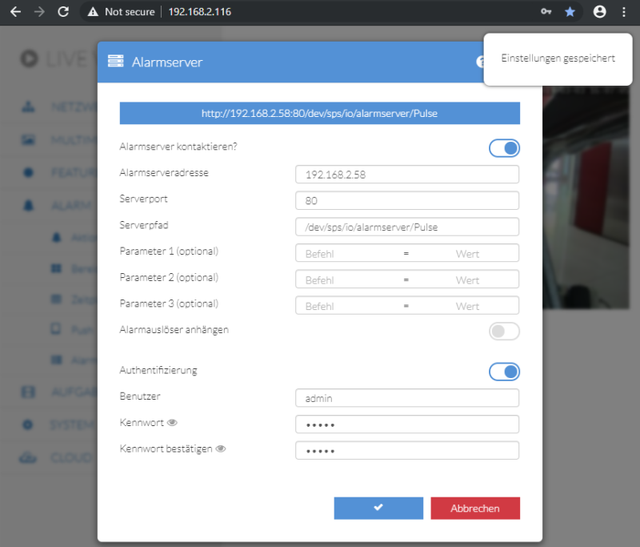


Please note that you have to enter the login below to connect to the miniserver via Loxone Config!


Accept these settings and trigger an alarm on the camera - e.g. with the [virtual button we created before](#example-1-triggering-an-alarm):


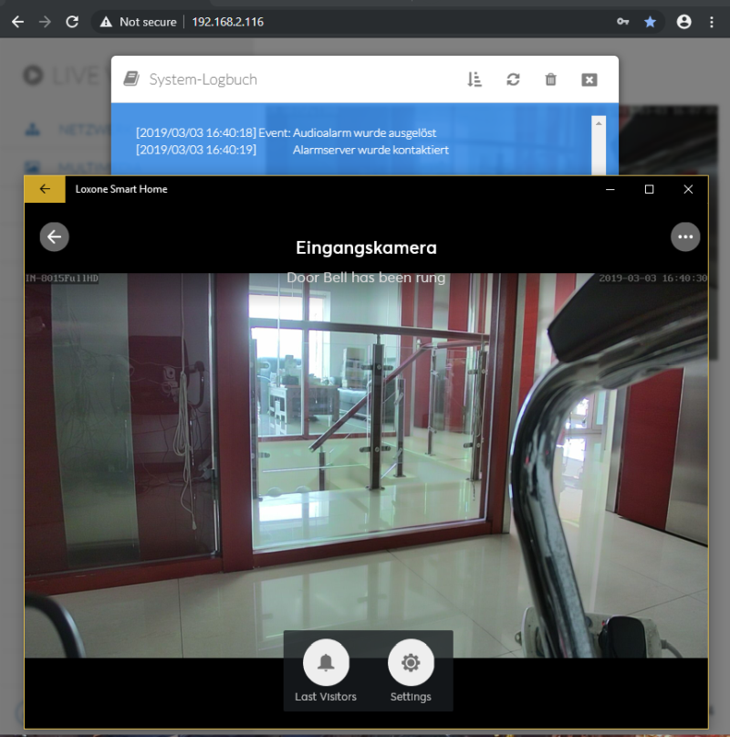


The alarm is triggered on the camera and the alarm server is contacted. The Loxone Miniserver receives the message and activates the intercom - on all screens where the [Loxone WebUI or App](#smart-home-app-and-webui) is opened, the live video of the triggering camera is shown to you immediately.