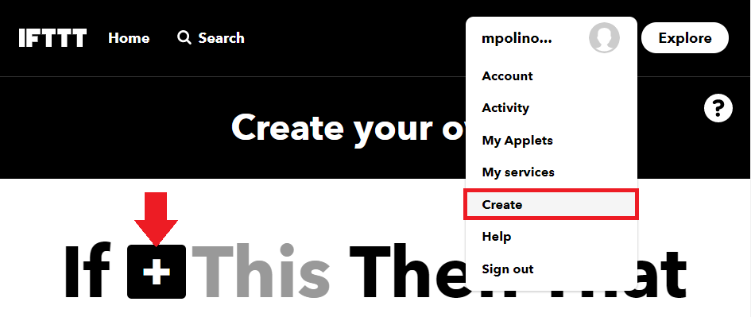
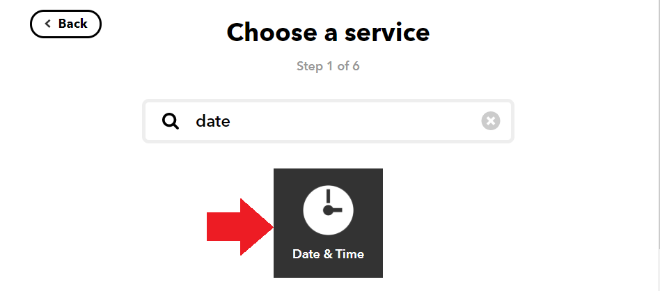
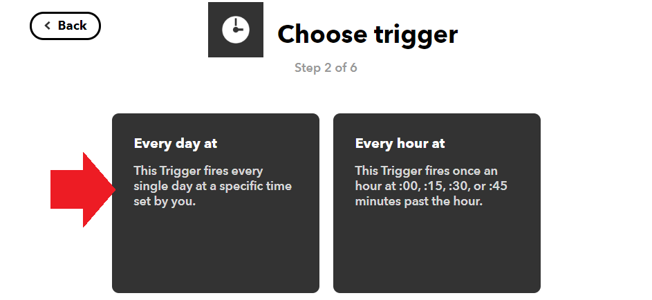
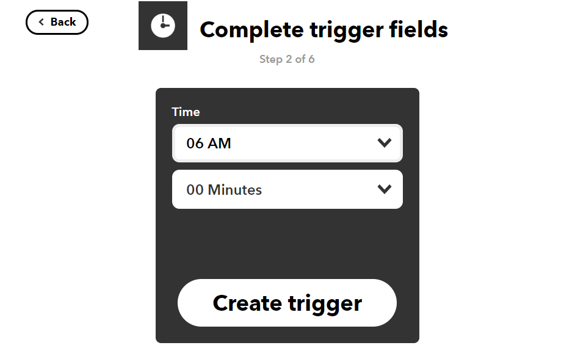
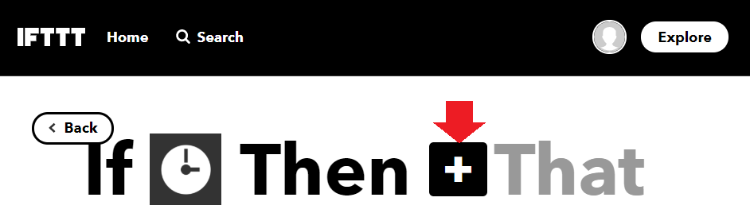
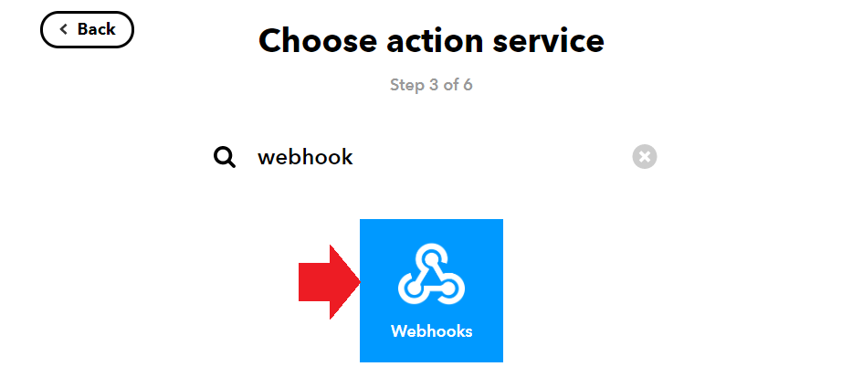
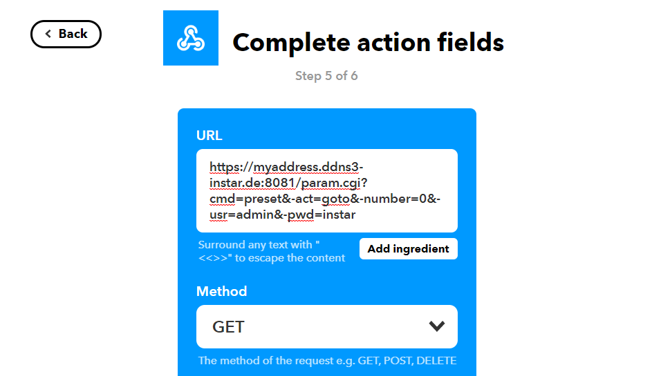
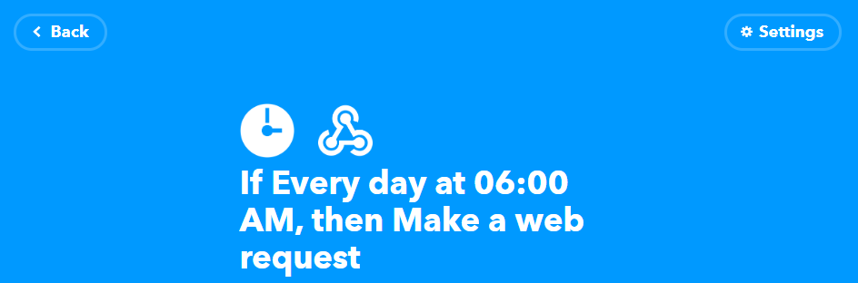

<!-- TOC -->

- [Basic Setup](#basic-setup)
- [IFTTT](#ifttt)

<!-- /TOC -->


## Basic Setup

_If This Then That_, also known as [IFTTT](https://ifttt.com/) is a free web-based service to create chains of simple conditional statements, called applets. Build your own applets to connect web services with your INSTAR IP Camera.


## IFTTT

1. First you need to [create an account](https://ifttt.com/join) on IFTTT and [login to your account](https://ifttt.com/login?wp_=1). Then go to the __Create__ and click on __IF + This__:


---



---


2. We now want to set up the [Date & Time](https://ifttt.com/services/maker_webhooks) service to send scheduled commands to our camera. Search for _date_ and select the __Date & Time__:


---



---


3. We want to automate a daily camera function, for this we have to choose __Every day at__ as a trigger for our applet.


---



---


4. For example we set the trigger to _every day at 6am_:


---



---


5. Now we can add an action that is triggered by our schedule:


---



---


6. We now want to add a [webhook service](https://ifttt.com/services/maker_webhooks) - which is basically a service that contacts a web address when triggered. That address will be the INSTAR DDNS address of our INSTAR Full HD camera and carry a [CGI Command](/1080p_Series_CGI_List/) to activate/deactivate functions on our camera. (__Note__ that the camera has to be available via the internet for this to work - this means you will have to set up a [port forwarding rule inside your router](/Internet_Access/Port_Forwarding/)).


Search for _web_ and select the __Webhooks Service__:


---



---


7. We now need to add our cameras DDNS address, e.g. `myaddress.ddns3-instar.de` with the `https://` prefix followed by the [HTTPS Port](/Web_User_Interface/1080p_Series/Network/IP_Configuration/) ([that has to be forwarded inside your router](/Internet_Access/Port_Forwarding/)), e.g. `8081`.


---



---


We now want that our camera moves to the Preset Position 1 when our applet is triggered. The [CGI Command](/1080p_Series_CGI_List/) to do this is `/param.cgi?cmd=preset&-act=goto&-number=0` followed by your camera login `&-usr=admin&-pwd=instar`.


```
https://myaddress.ddns3-instar.de:8081/param.cgi?cmd=preset&-act=goto&-number=0&-usr=admin&-pwd=instar
```

Save your settings and you are done.


---



---