import GifContainer from "../../src/components/ImageContainer";


<!-- TOC -->

- [Basic Setup](#basic-setup)
  - [IFTTT Setting up a Webhook](#ifttt-setting-up-a-webhook)
  - [Choosing an Action (Telegram Messenger)](#choosing-an-action-telegram-messenger)
  - [Alarmserver Setup](#alarmserver-setup)

<!-- /TOC -->


## Basic Setup

_If This Then That_, also known as [IFTTT](https://ifttt.com/) is a free web-based service to create chains of simple conditional statements, called applets. Build your own applets to connect web services with your INSTAR IP Camera.


### IFTTT Setting up a Webhook

1. First you need to [create an account](https://ifttt.com/join) on IFTTT and [login to your account](https://ifttt.com/login?wp_=1). Then go to the __Create__ and click on __IF + This__:


---

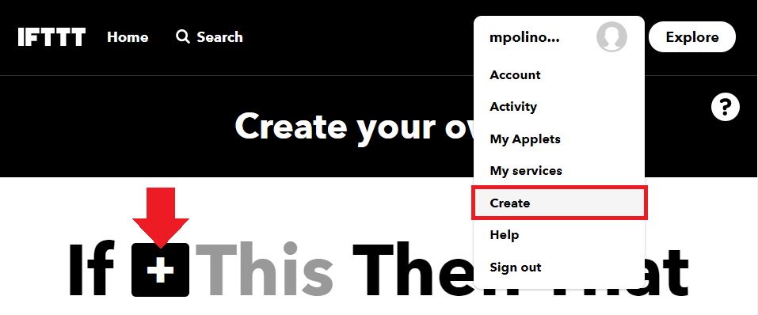

---


2. We now want to set up a [webhook service](https://ifttt.com/services/maker_webhooks) - which is basically just a web address that our INSTAR Full HD camera can contact in case of an alarm to trigger an IFTTT applet. Search for _web_ and select the __Webhooks Service__:

---

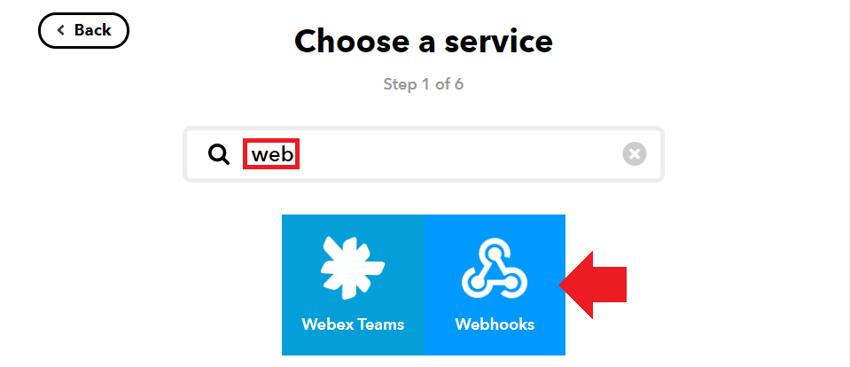

---


3. Then name the event - this will be part of the URL that we will later have to contact with with our camera to trigger the event:


---

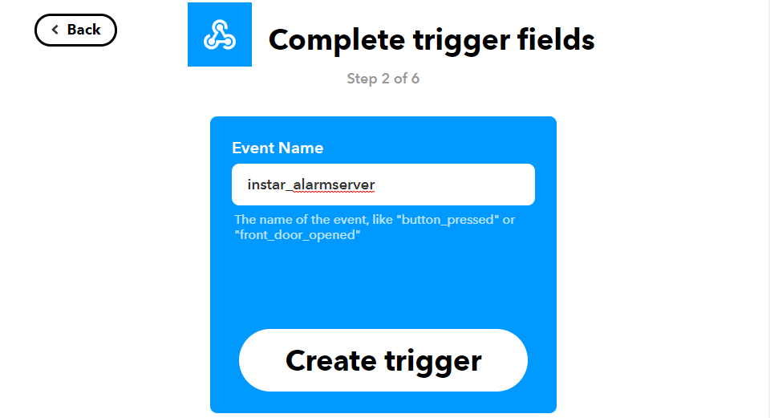

---


4. With the trigger set up we now need to assign an IFTTT service we want to trigger. To do this click on __that__:


---

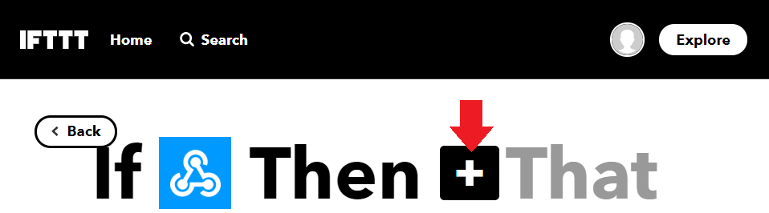

---


5. As you can see from the list we have a large variety of services that we can now trigger with the webhook we created:


<GifContainer gifUrl="/assets/gif/IFTTT_for_INSTAR_Alarmserver_05.gif" alt="IFTTT for INSTAR Alarmserver" />


### Choosing an Action (Telegram Messenger)


6. Let's use the __Telegram service__ - when the URL (webhook) for this applet is contacted we want to receive a text message on [Telegram Messenger](https://telegram.org/):


---

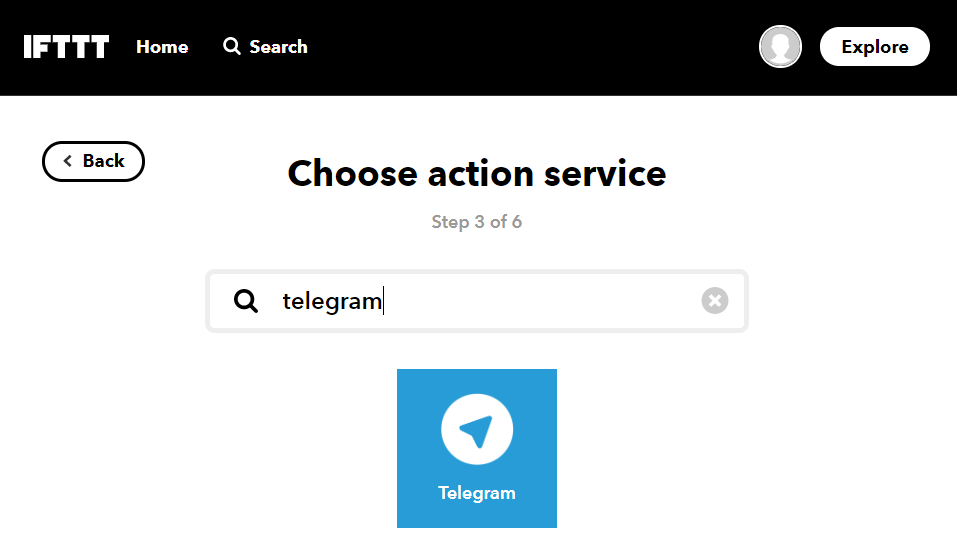

---


7. Now you need to connect the IFTTT service to your Telegram account to allow the IFTTT bot to send you messages:


---

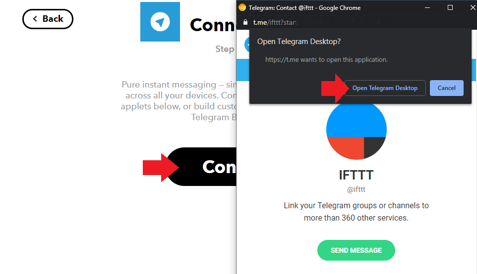

---


__Note__: I experienced issues doing this with the IFTTT web interface on a Windows desktop with the Telegram desktop app. Switching to an Android phone solved those issues for me:


---

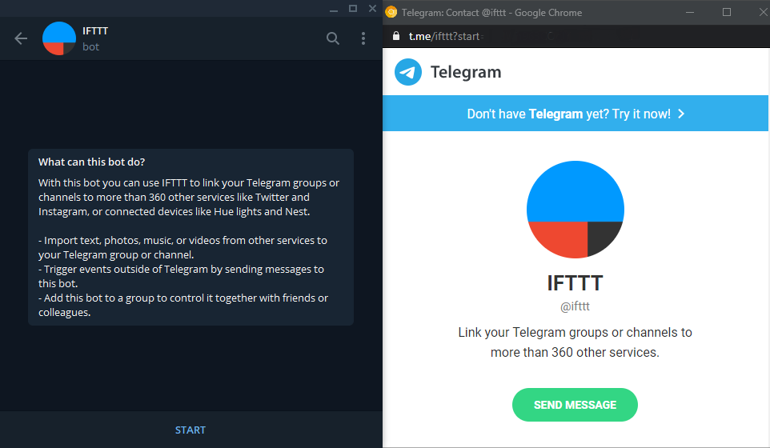

---


8. Once the IFTTT bot is we can choose that we want to receive a text message, when the applet is triggered:


---

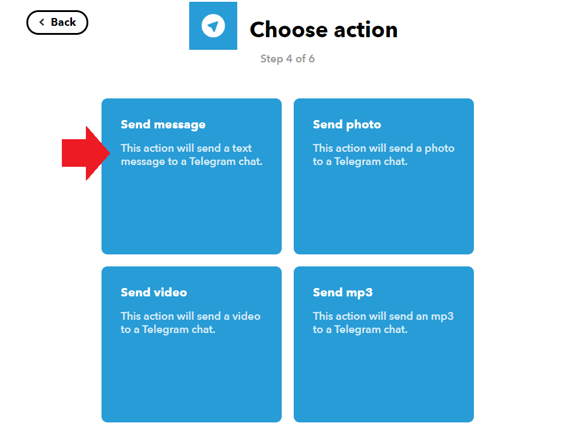

---


9. Now we can configure the subject and body text the email should have. Notice the words that are highlighted in white - these are variables that will be filled with data before the mail is sent. __EventName__ will be the name that you choose in step 4 above, __OccuredAt__ will be filled with a time stamp. The __Value 1-3__ below are variables that we can define in the Alarmserver setup in our camera's webUI and are send them whenever a alarm is triggered:


---

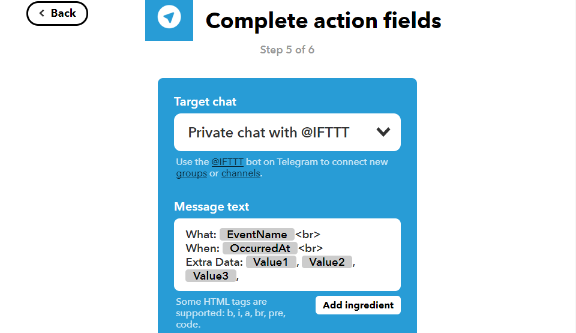

---


### Alarmserver Setup 


10. Now we have to configure the Alarmserver in our camera's webUI so that the URL for our IFTTT Webhook receives a __POST__ message from our camera every time an alarm is triggered:


```
https://maker.ifttt.com/trigger/instar_alarmserver/with/key/API_KEY
```


__Note__ that this is using the __Event Name__ that we set as name for our Webhook `instar_alarmserver`. To identify our IFTTT account we first need to find out our personal __API_KEY__ and add it at the end of the URL.


To get access to our personal API key we first have to sign in to our IFTTT account and open the following page `https://ifttt.com/services/maker_webhooks/settings`. Copy the alpha-numeric key in the Account Info - e.g. if you find the `URL: https://maker.ifttt.com/use/c3oL9WnAbz8Z08KumJWS`, then `c3oL9WnAbz8Z08KumJWS` is your API key:

---

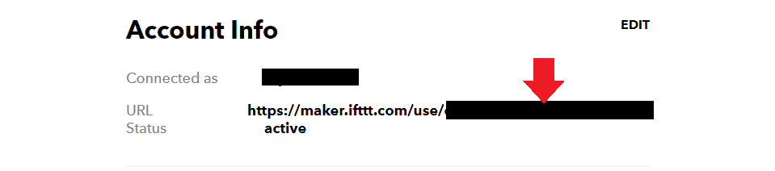

---


We can now test our webhook and URL query parameter by copying the following URL (just replace your personal `API_Key`) and pasting it into the address bar of a web browser:


```
https://maker.ifttt.com/trigger/instar_alarmserver/with/key/c3oL9WnAbz8Z08KumJWS?value1=Office&value2=Entrance_Left&value3=Alarm
```


You should get a reply that you triggered the __instar_alarmserver__ applet and shortly afterwards receive a message on Telegram:


---

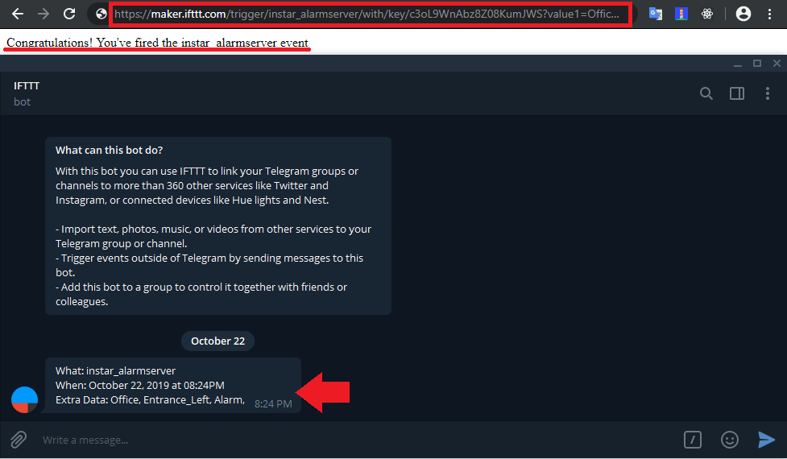

---


11. Now we have to copy&paste all the parts from this URL into the Alarmserver configuration in our camera's webUI:


---

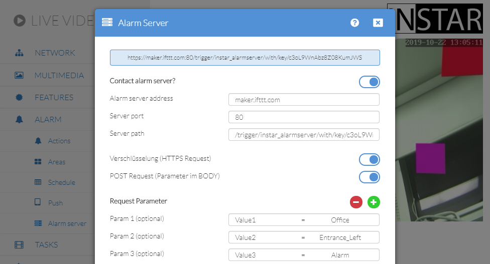

---