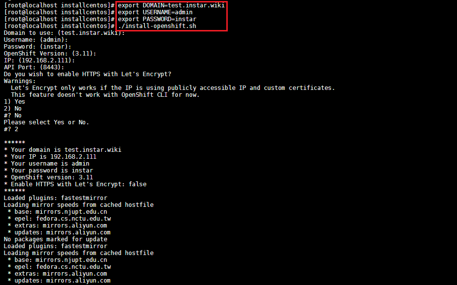

<!-- TOC -->

- [Installation](#installation)

<!-- /TOC -->


[OKD](https://www.okd.io) is a distribution of Kubernetes optimized for continuous application development and multi-tenant deployment. OKD adds developer and operations-centric tools on top of Kubernetes to enable rapid application development, easy deployment and scaling, and long-term lifecycle maintenance for small and large teams. OKD is the upstream Kubernetes distribution embedded in Red Hat OpenShift.

OKD embeds Kubernetes and extends it with security and other integrated concepts. OKD is also referred to as [Origin in github](https://github.com/openshift/origin) and in the [documentation](https://docs.okd.io/latest/welcome/index.html). An OKD release corresponds to the Kubernetes distribution - for example, OKD 1.10 includes Kubernetes 1.10.


## Installation

Let's start with the prerequisites:


```bash
yum update
yum install -y git docker net-tools
```

We can now use the [install script](https://github.com/gshipley/installcentos) by [Grant Shipley](https://github.com/gshipley/) to set up RedHat OKD 3.11 on your own server. This install method is targeted for a single node cluster that has a long life.


This repository is a set of scripts that will allow you easily install the latest version (3.11) of OKD in a single node fashion. What that means is that all of the services required for OKD to function (master, node, etcd, etc.) will all be installed on a single host. The script supports a custom hostname which you can provide using the interactive mode.


We will start by cloning the repository:


```bash
git clone https://github.com/gshipley/installcentos.git
cd installcentos
```


Define mandatory variables for the installation process:


```
# Domain name to access the cluster
export DOMAIN=<public ip address>.nip.io

# User created after installation
export USERNAME=<current user name>

# Password for the user
export PASSWORD=password
```


Define optional variables for the installation process:


```bash
# Instead of using loopback, setup DeviceMapper on this disk.
# !! All data on the disk will be wiped out !!
$ export DISK="/dev/sda"
```


And then execute the installation script:


```bash
./install-openshift.sh
```


