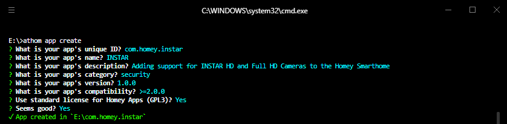
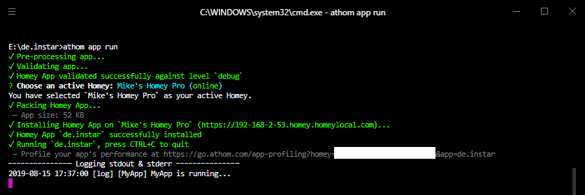

## Setting up the Development Environment

A [Homey App](https://apps.developer.athom.com/index.html) is software that runs on [Homey](https://www.athom.com/en/homey/), similar to apps on a smartphone. Homey connects all your devices at home, even different brands and technologies. Control your home from one app.

Automate your home with Flow, play your favorite Music and save energy with Insights. Homey is the central hub for your smart home.


#### Install Node.js

Apps are written in JavaScript, and run on Node.js. To develop an app for Homey we first have to Download Node.js from the [Node.js website](https://nodejs.org/en/) and install it on your computer.


#### Install athom-cli

Open a command line, and install the [athom-cli program](https://www.npmjs.com/package/athom-cli) by running the following command:


```bash
npm install -g athom-cli
```


#### Log-in

In the command-line, log in with your [Athom account](https://accounts.athom.com/login):


```
athom login
```


#### Create an app

Now create your first app by running:


```
athom app create
```





#### Run your project

You are now ready to run your first app:


```
athom app run
```





Exit your app by pressing `CTRL + C`.


When using `athom app run`, the App will be removed when Homey is restarted. Run `athom app run --clean` to run the app and erase all previous settings. Run `athom app install` to keep the app running for a longer time without debugger attached.