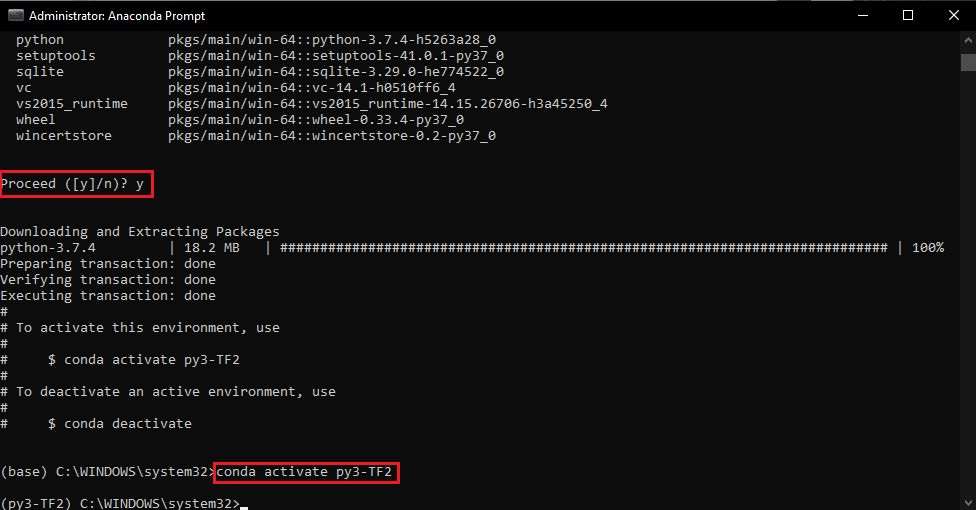
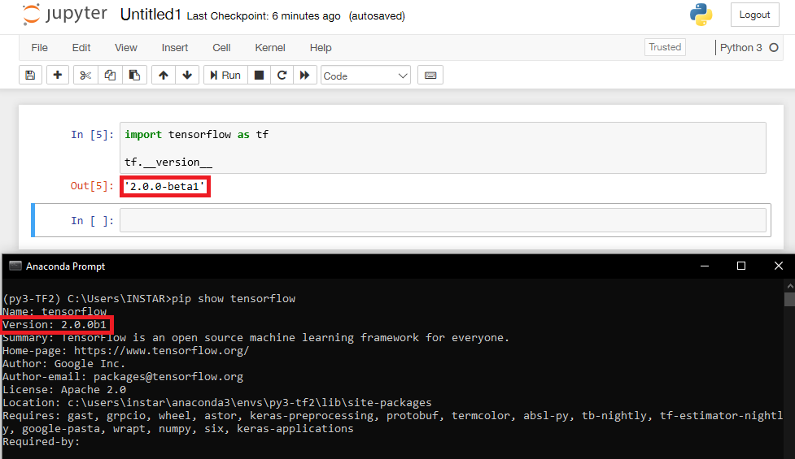
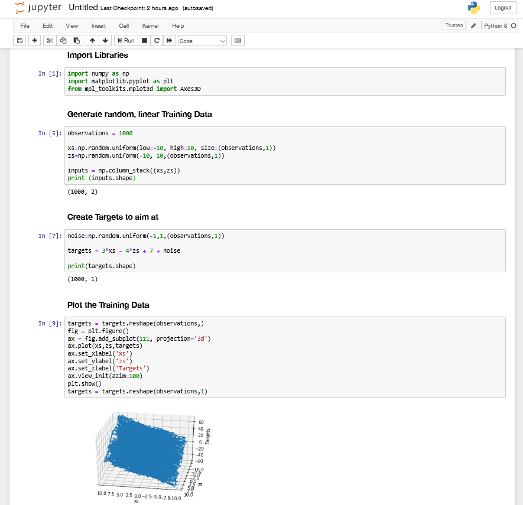
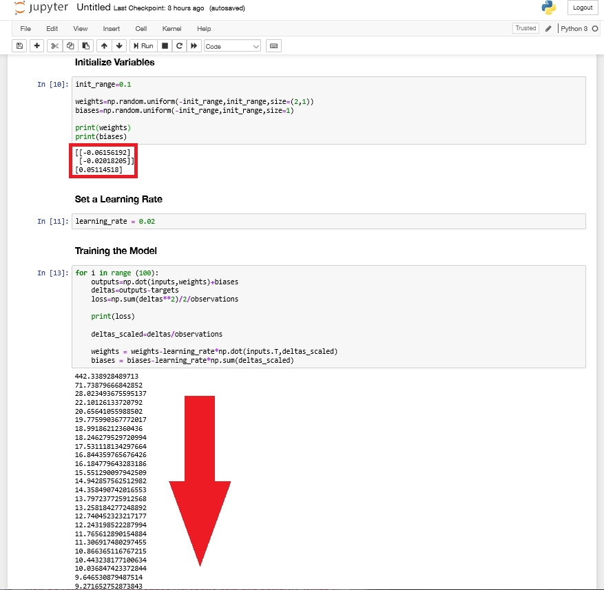
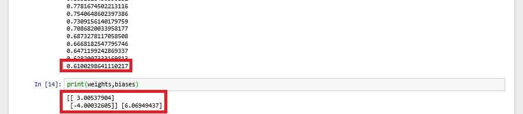
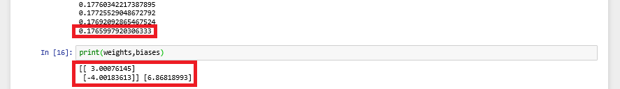
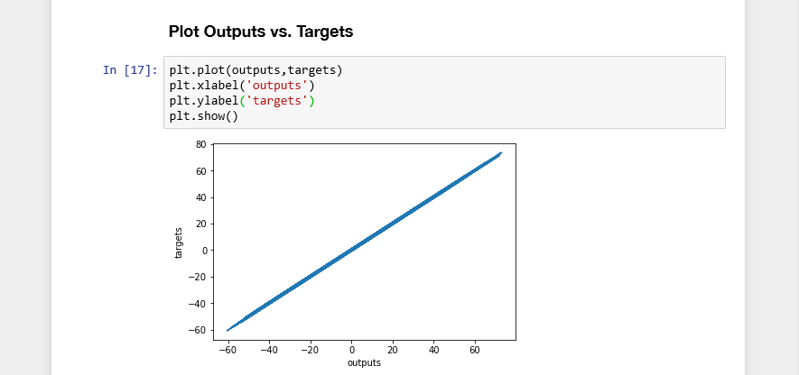
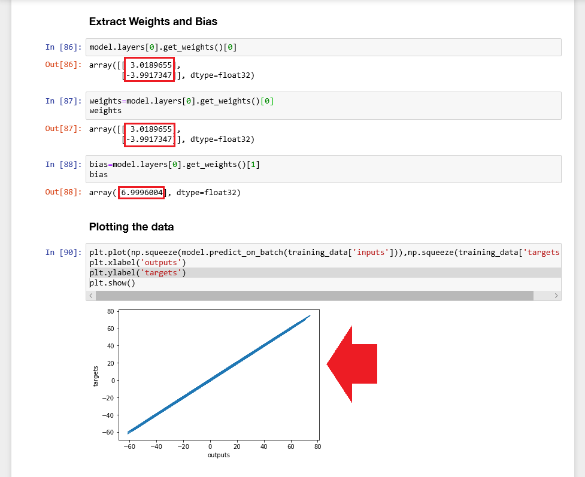

## Installation of Tensorflow

You can install TensorFlow directly through `pip3 install tensorflow` or with GPU support `pip3 install tensorflow-gpu` (make sure you have [Python v3](https://www.python.org/downloads/) installed).

I have [Anaconda](https://docs.anaconda.com/anaconda/install/windows/) set up on my computer and am going to use it for this instead. If you already have Anaconda installed, make sure that it is up to date (make sure that you start the [Anaconda Prompt](https://docs.anaconda.com/anaconda/user-guide/getting-started/#write-a-python-program-using-anaconda-prompt-or-terminal) with Admin privileges):


```bash
conda update conda
conda update anaconda
```


Anaconda allows us to create a virtual environment in which we can run our TensorFlow program. To create the environment with the name `py3-TF2` run the following command in the Anaconda Prompt - hit `y` when prompted:


```bash
conda create --name py3-TF2 python=3
conda activate py3-TF2
```





We can now continue installing TensorFlow inside this virtual environment. At the time of writing TensorFlow 2 is still in Beta and the exact version needs to be specified to prevent pip from using version 1 - please check the [latest version](https://www.tensorflow.org/install/) before running the command below:


```bash
pip install tensorflow==2.0.0-beta1
```

<!-- pip install matplotlib -->


To be able to use the virtual environment in [Jupyter Notebook](https://docs.anaconda.com/anaconda/user-guide/getting-started/#run-python-in-a-jupyter-notebook) we need to install `ipykernel` and `nb_conda_kernels` inside it:


```bash
pip install ipykernel
conda install nb_conda_kernels
```


Open a new Python 3 project file inside Jupyter Notebook and verify that Tensorflow is up-and-running:


```bash
import tensorflow as tf

tf.__version__
```





Your research environment is now ready for use!


## Convolutional Neural Networks ([CNNS](https://www.tensorflow.org/beta/tutorials/images/intro_to_cnns))

* Classify an Image (e.g. a plane)
* Classify and Segment (getting the outline of an object - e.g. a plane - inside an image for further analysis)
* Recognize an Image (e.g. a Sukhoi SU-25T)


[Underfitting](https://missinglink.ai/guides/neural-network-concepts/neural-network-bias-bias-neuron-overfitting-underfitting/): Our model has been trained on a data set that is too small. It can not be used to generalize or recognize. If our data set is too small we can use [Transfer Learning](http://cs231n.github.io/transfer-learning/) to adapt a external model by retraining it's outer layer with our training data.

[Overfitting](https://missinglink.ai/guides/neural-network-concepts/neural-network-bias-bias-neuron-overfitting-underfitting/): The model was trained with a very specific data set and reaches a high percentage in recognizing fits. But it fails to generalize and will only be useful with your specific sample data.


## Picking a model

There are three different types of Machine Learning:

* __Supervised Learning__: We train our model with a set of labeled data before letting it have a go in the wild.
* __Unsupervised Learning__: The model trains itself with unlabeled data and splits the set into a given number of groups based on similarity. The groups can afterwards be labeled by us based on the goal we are persuing.
* __Reinforced Learning__: We let the model train unsupervised but add a reward system to make sure that the training goes into the direction we need it to go.


In the following we will concentrate on __Supervised Learning__.


### Linear Model

The simplest model is always the Linear Model where we just have to feed the learning process a few x- and y-values and have it interpolate data points in between:


```bash
f(x) = xw + b
```

With `x` being the input, `w` the __Weight__ and `b` the __Bias__ for our model. Training the model would mean finding values for the weight and bias that the value of __y__ - with a given set of values for __x__ - comes as close to observed values as possible.

An example would be a model that calculates the rent for an apartment based on the size of the apartment:


```bash
rent = size * weight + bias
```

When we know more then one observation that would affect the prize of the apartment, we can simply add them up:


```bash
Rent = (Size*Weight) + (Proximity to Subway*Weight) - (Proximity to City Center*Weight) + Bias
```


To assess the quality of our linear model we can use the squard-loss (__L2-norm__) that weights the distance of each datapoint from the position it should have according to our model. The smaller the sum over all those distances the more accurate represents our model the give dataset.


### Example: Simple Linear Regression


#### Creating the Model using Numpy

As an example we will create fake data with a linear relationship using `numpy` to help us to create and train a linear model. We will then use `matplotlib` and `mplot3d` to visualize the results we are getting:


```py
observations = 1000

xs=np.random.uniform(low=-10, high=10, size=(observations,1))
zs=np.random.uniform(-10, 10,(observations,1))

inputs = np.column_stack((xs,zs))
```

Note that the `size` is defined by the number of observations times the number of variables for our linear function - here we only use one variable `x` or `z`. The resulting matrix `inputs` consits of 2 columns each holding 1000 random values.


We now need to create a target for our algorithm - a function that our model should find given the random but linear dataset, e.g.:


```bash
f(x,y) = 3x - 4z + 7 + noise
```

The weights 3 and 4 as well as the bias 7 are randomly chosen and the noise is again generated using Numpy:


```py
noise=np.random.uniform(-1,1,(observations,1))

targets = 3*xs - 4*zs + 7 noise
```

We can now plot this data and will receive a plane inside a threedimensional space:





We can now set an initial range for the algorithm to pick weights and biases from at random to find a good fit: 


```py
init_range=0.1

weights=np.random.uniform(-init_range,init_range,size=(2,1))
biases=np.random.uniform(-init_range,init_range,size=1)
```

In this example our initial weights and biases will be picked randomly from the interval [-0.1,0.1].


Last preparation needed is setting a learning rate - the smaller the number, the smaller the increments that are used by the learning algorithm. This will lead to a more accurate value but will slow the algorithm down. In the example we will set the learning rate to a value of:


```py
learning_rate = 0.02
```


#### Training the Model

We now can use a for loop to iterate through our data (in TensorFLow 1 iteration is called an __Epoch__, see further down), calculate outputs and compare them to targets using the loss function. Every interation should refine the weights and biases of our model and minimize the result of the loss function for the next run.


```py
for i in range (100):
    outputs=np.dot(inputs,weights)+biases
    deltas=outputs-targets
    loss=np.sum(deltas**2)/2/observations
    
    print(loss)
    
    deltas_scaled=deltas/observations
    
    weights = weights-learning_rate*np.dot(inputs.T,deltas_scaled)
    biases = biases-learning_rate*np.sum(deltas_scaled)
```

This function runs 100-times, optimizing the value for our weights and biases with each run. Printing the result of the loss function shows us a smaller value with each run:





In the initialization step we can see that the algorithm starts out with the following weights and biases:


```py
print(weights)
print(biases)

[[-0.06156192]
 [-0.02018205]]
[0.05114518]
```

After running training the algorithm with 100 iterations those values change to:


```py
print(weights,biases)

[[ 3.00537904]
 [-4.00032605]] [6.06949437]
 ```




This is already very close to our target of 3&4 and 7 - but not close enough yet. We can increase the number of iterations in the learning step to improve the outcome. Or simply rerun the training step to add another 100 iterations:


```py
print(weights,biases)

[[ 3.00076145]
 [-4.00183613]] [6.86818993]
 ```





Plotting the Outputs of our Model against the Target value shows us a linear function at an angle close to 45 degrees. Our model, almost perfectly, represents the training data:





## Introduction to TensorFlow

We can start by creating the same dataset as before only this time we will store the generated test dataset in a file format that supports storage of tensor data (n-dimensional arrays) (`.npz`)  with the help of Numpy:


```py
import numpy as np
import matplotlib.pyplot as plt
import tensorflow as tf

observations = 1000

xs = np.random.uniform(low=-10, high=10, size=(observations,1))
zs = np.random.uniform(-10, 10, (observations,1))

generated_inputs = np.column_stack((xs,zs))

noise = np.random.uniform(-1, 1, (observations,1))

targets = 3*xs - 4*zs + 7 + noise

np.savez('tf-model-data-example', inputs=generated_inputs, targets=generated_targets)
```


Running this code will create a file `tf-model-data-example.npz` that holds our training data.


In the next step we can load this data set with Numpy and use a Keras function to calculate the output (y) of our function (`output=np.dot(input,weights)+bias`):


```py
training_data=np.load('tf_model_data_example.npz')

input_size=2
output_size=1

model=tf.keras.Sequential([
    tf.keras.layers.Dense(output_size)
])

model.compile(optimizer='sgd',loss='mean_squared_error' )

model.fit(training_data['inputs'],training_data['targets'],epochs=100,verbose=2)
```


You can display the Weights and Bias using the following code:


```py
weights=model.layers[0].get_weights()[0]
bias=model.layers[0].get_weights()[1]

weights
bias
```

Those values should now be close to our target as defined above `targets = 3*xs - 4*zs + 7 + noise` - Weights `3` & `-4` and `7` as the Bias.


### Making Predictions

We can now use our model to make predictions `model.predict_on_batch(data)` for output values:


```py
model.predict_on_batch(training_data['inputs'])
```

This will show you the outputs that have been calculated for the training data and previously compared to the target values to calculate the loss function.

Plotting those values against the targets will again result in a line graph close to a 45 degrees angle:


```py
plt.plot(np.squeeze(model.predict_on_batch(training_data['inputs'])),np.squeeze(training_data['targets']))
plt.xlabel('outputs')
plt.ylabel('targets')
plt.show()
```


### Customizing your Model


In the Numpy model earlier we set an initial range (`init_range=0.1`) to define the step size between epochs. But with TensorFlow we left everything at it's default, letting Keras choose for us - let's take control.


#### Adding Initializers

Here is how you add kernel and bias initializers to `tf.keras.layers.Dense(output_size, kernel_initializer, bias_initializer)`:


```py
model=tf.keras.Sequential([
    tf.keras.layers.Dense(
      output_size,
      kernel_initializer=tf.random_uniform_initializer(minval=-0.1, maxval=0.1),
      bias_initializer=tf.random_uniform_initializer(minval=-0.1, maxval=0.1)
      )
])
```


#### Setting the Learning rate

We can also set the learning rate for our model, which in our Numpy model we defined with `learning_rate = 0.02`. In TensorFlow this is done by customizing the optimizer - we choose the `SGD` optimizer (Stochastic Gradient Descent optimizer) that supports a couple of modifiers, including the __Learning Rate__, __Momentum__, __Decay__, etc.


```py
custom_optimizer=tf.keras.optimizers.SGD(learning_rate=0.02)

model.compile(optimizer=custom_optimizer,loss='mean_squared_error' )
```


