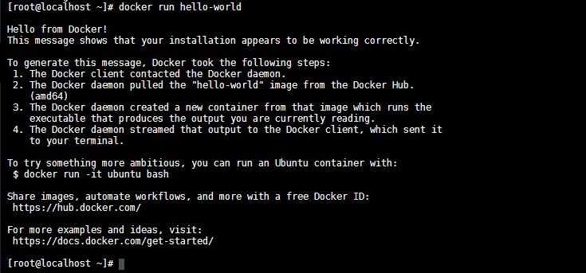

## Docker ?

The latest release of the RHEL 8 / CentOS 8 introduces buildah and podman, which aim to be compatible with existing docker images and work without relying on a daemon, allowing the creation of containers as normal users, without the need of special permissions. Some specific tools, however, are still missing: an equivalent of docker-compose, for example does not exists yet. In this tutorial we will see how to install and run the original Docker CE on CentOS 8.

The `dnf config-manager` utility let us enable or disable a repository in our distribution. We can use it to add and enable the docker-ce repo:


```bash
sudo dnf config-manager --add-repo=https://download.docker.com/linux/centos/docker-ce.repo
```


We can verify that the repository has been enabled, by looking at the output of the following command:


```bash
sudo dnf repolist -v
```

The docker-ce-stable repository is now enabled on our system. To display all of them, we can run:


```bash
dnf list docker-ce --showduplicates | sort -r
```

Now we need to install `containerd.io` manually. As there isn't a version for CentOS 7 (yet?) we need to install the following:


```bash
sudo dnf install https://download.docker.com/linux/centos/7/x86_64/stable/Packages/containerd.io-1.2.6-3.3.el7.x86_64.rpm
```


## Install Docker-CE

After the package is installed, we can simply install the latest docker-ce:


```bash
sudo dnf install docker-ce
```

In order to make DNS resolution work inside Docker containers, we must disable firewalld (really?):


```bash
sudo systemctl disable firewalld
```


## Start and enable the Docker Daemon

Once docker-ce is installed, we must start and enable the docker daemon, so that it will be also launched automatically at boot:


```bash
sudo systemctl enable --now docker
```


At this point, we can confirm that the daemon is active by running:


```
systemctl is-active docker
systemctl is-enabled docker
```


## Installing Docker-Compose

Download the binary from the [github page of the project](https://github.com/docker/compose/releases/latest):


```bash
curl -L "https://github.com/docker/compose/releases/download/1.24.1/docker-compose-$(uname -s)-$(uname -m)" -o docker-compose
```


Once the binary is downloaded, we move it into `/usr/local/bin` and we make it executable:


```bash
sudo mv docker-compose /usr/local/bin && sudo chmod +x /usr/local/bin/docker-compose
```


## Testing Docker


```bash
docker pull hello-world
docker run hello-world
```


