<!-- TOC -->

- [Windows Powershell](#windows-powershell)
  - [Running Powershell Commands](#running-powershell-commands)
  - [Powershell Scripting](#powershell-scripting)

<!-- /TOC -->


## Windows Powershell

We can access the Microsoft Windows Powershell directly from the [Windows Admin Center](/getting-started-with-windows-server-2019#windows-admin-center). Connect the Admin Center to your Windows Server and search for __Powershell__ under __Tools__ you will be asked to log in with your account.


### Running Powershell Commands

You can all [Powershell Commands](https://devblogs.microsoft.com/scripting/table-of-basic-powershell-commands/) directly from this web interface, e.g. creating a new user on your server with `New-LocalUser -Name Peter`:


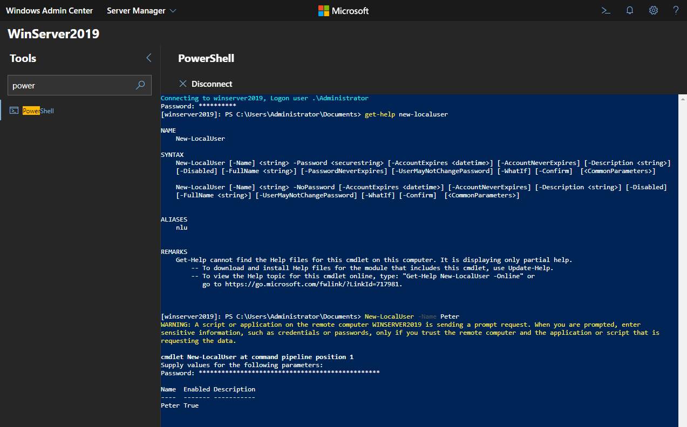


Search for __Local user & groups__ under tools inside the Admin Center and _right-ctrl-click_ it to open the user management in a new tab. You will see that the user has been created:


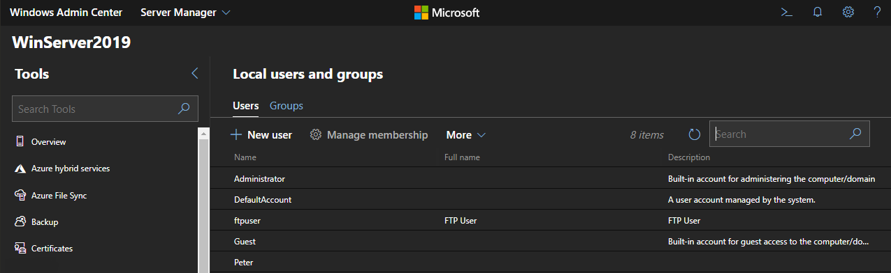


Working with the filesystem works the same way - listing directories, creating folders and files and copying them to other locations:


```powershell
Get-ChildItem -Path C:\
New-Item -Path 'C:\scripts' -ItemType Directory
New-Item -Path 'C:\scripts\test' -ItemType Directory
New-Item -Path 'C:\scripts\test\helloworld.ps1' -ItemType File
Copy-Item -Path 'C:\scripts\test\helloworld.ps1' -Destination 'C:\scripts\hello.ps1'
Remove-Item -Path 'C:\scripts\test\helloworld.ps1'
```


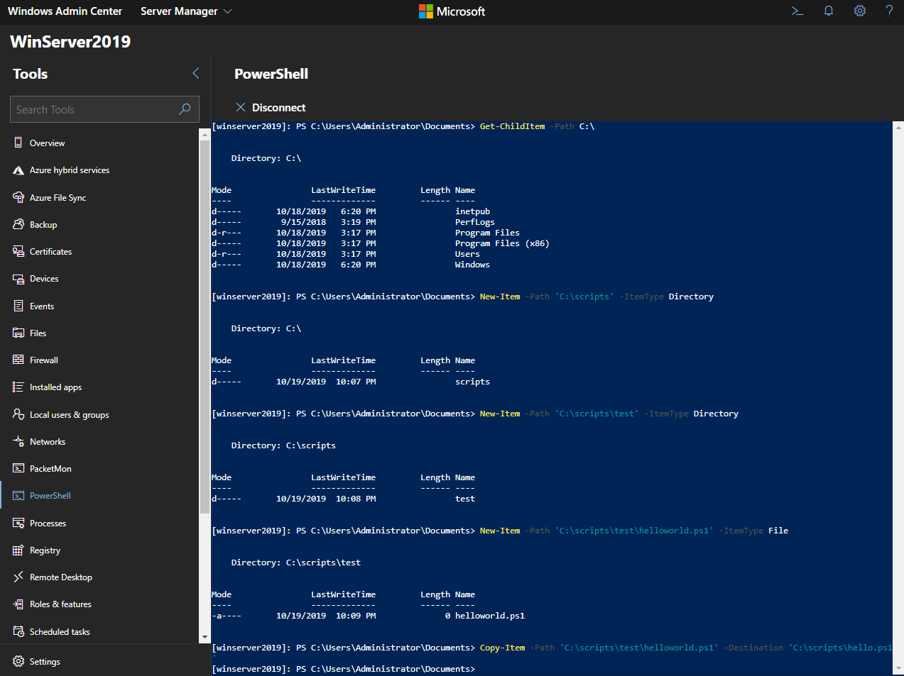


Run the following commands to get an overview over all processes and services:

```powershell
Get-Process
Get-Service
```


### Powershell Scripting

We can also run local shell scripts through Powershell on our server. Those scripts can be stored on our server with the `.ps1` file extension. Here is a __Hello World__:


```powershell
echo 'Hello World'

sleep 10
```


Save the file with the name `helloworld.ps1`, navigate your into the directory and run the script as `.\helloworld.ps1`:


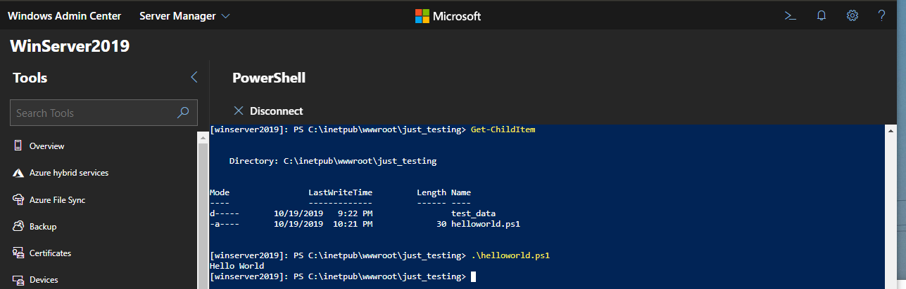


__Hello World__ will be displayed for 10 seconds and then disappear.


An example for a useful shell script would be:


```powershell
Class DirToBackup
{
    [String]$path
    DirToBackup([String]$path) {
      $this.path = $path
    }
}
$defaultListOfExcluded = "C:\inetpub\wwwroot\just_testing\listOfBackupExcluded.txt"
$pathFromPrefix = "C:\inetpub\wwwroot\just_testing\test_data\"
$pathToPrefix = "C:\inetpub\wwwroot\just_testing\backup_data\"
Write-Output "Plug external disk drive."
pause
$dirsToBackup = @(
    New-Object DirToBackup "backup"
    New-Object DirToBackup "development"
)
$dirsToBackup | ForEach-Object {
    mkdir -Path $($pathToPrefix + $_.path) -Force
    xcopy $($pathFromPrefix + $_.path) $($pathToPrefix + $_.path) /D /S /Y /H /EXCLUDE:$defaultListOfExcluded
}
pause
```


The file `listOfBackupExcluded.txt` in the same directory as our script lists all files, file extensions and directories that we want to exclude from our backup:


```
\build\
\.gitignore\
.secret\
\notes
\node_modules\
```

This will exclude the directories `build` and `node_modules`, the `.gitignore` file, every file with the extension `.secret` and files who's name starts with `notes`.


The script will then copy the content of the directory `test_data` to `backup_data`. Ideally `backup_data` has to be on an external drive - so we added a prompt for the user to plugin the backup drive. But for testing we will leave both directories on the same harddrive. The main part of the script is a loop that goes through all dirsToBackup elements and executes mkdir and xcopy functions. mkdir creates directories in the target location. Flag -Force makes possible to not error the script when directory’s already exists.


There are few flags that are very important:


* __/D__ — Copies only those files whose source time is newer than the destination time.
* __/S__ — Copies directories and subdirectories except empty ones.
* __/Y__ — Suppresses prompting to confirm you want to overwrite an
existing destination file.
* __/H__ — Copies hidden and system files also.


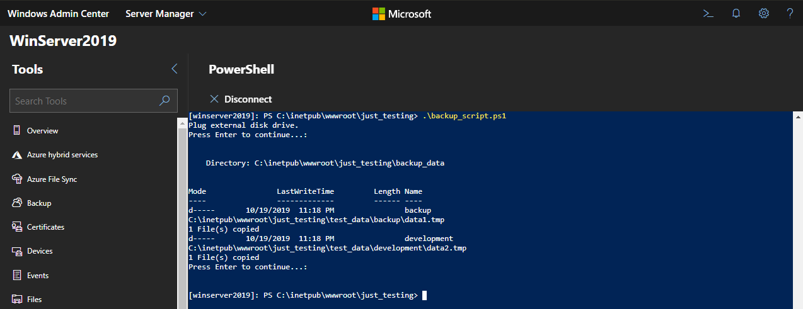


## Creating a Samba Share


This time we want to use the [Microsoft Remote Desktop App](https://www.microsoft.com/en-us/p/microsoft-remote-desktop/9wzdncrfj3ps) to connect to our Windows Server and enable the __Samba Share Functionality__. To be able to connect we first have to ensure that __Remote Desktop__ is enabled on our server:


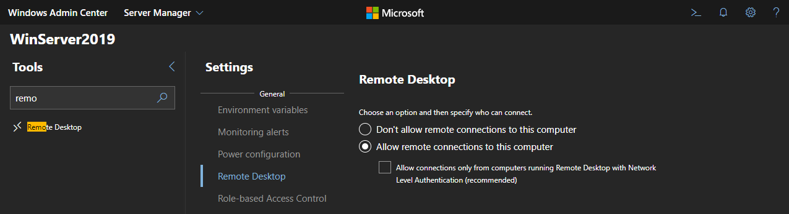


Now we can __Add a Desktop__ on our host machine inside __Remote Desktop__. Type in the server name or IP address and add the user account you want to use to connect to the remote server:


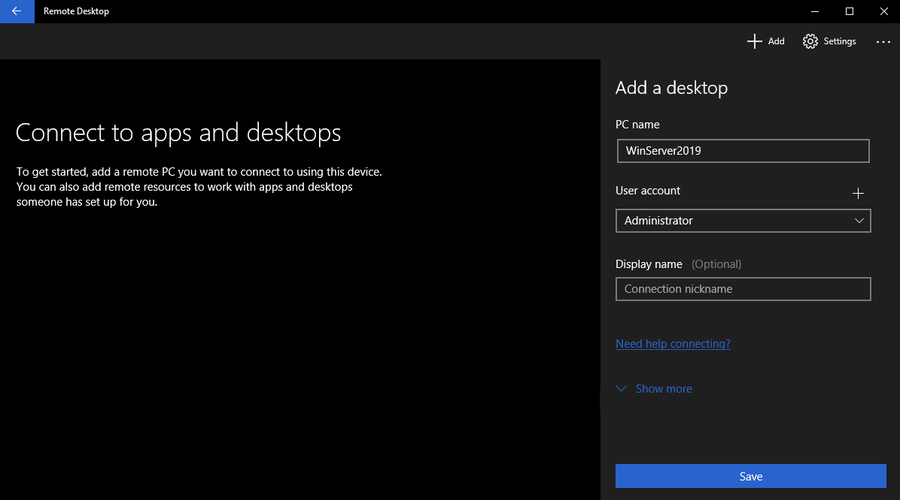


Then click to connect to the remote server. If the connection fails, try to ping your server from your command prompt, e.g. `ping WINSERVER2019`. You should be able to get a ping here - if not you need to troubleshoot your network:


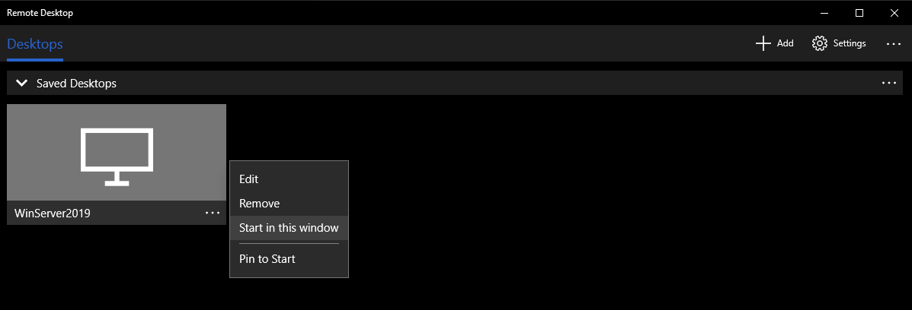


Accept the self-signed certificate we used for our server and you should be able to see the server desktop in front of you:


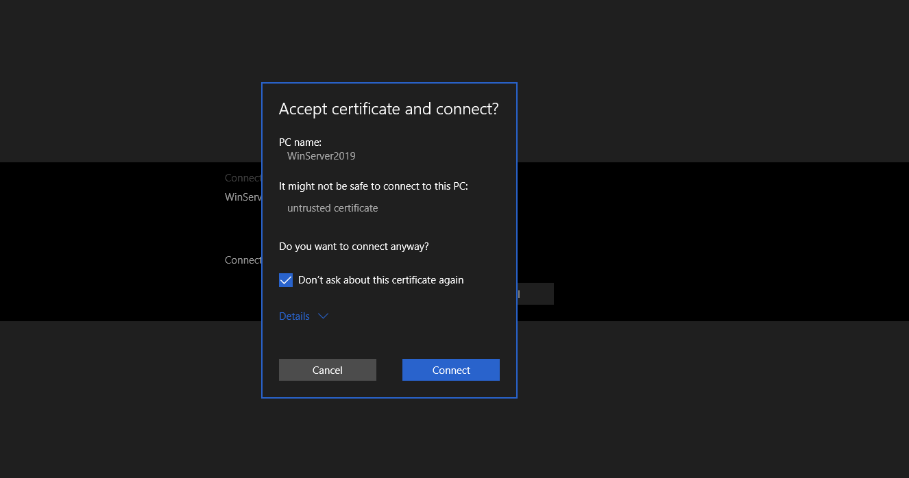


On the server right-click the directory you want to share, choose __Properties__, __Sharing__ __Advanced Sharing__:


Name the share and click on __Permissions__:


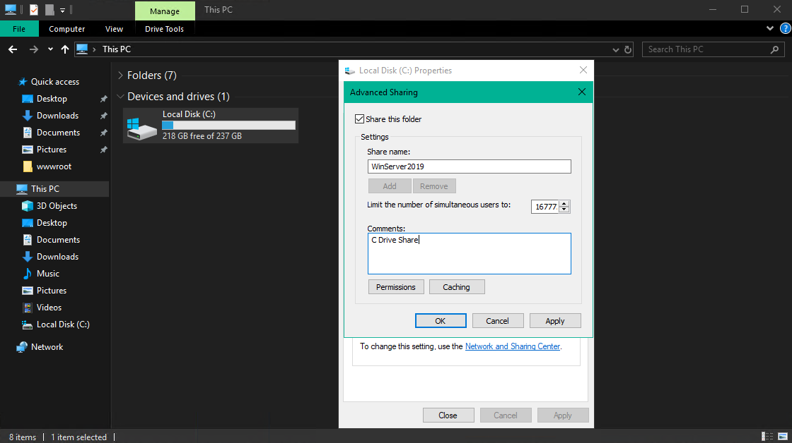


Add the user you want to use to connect to the share:


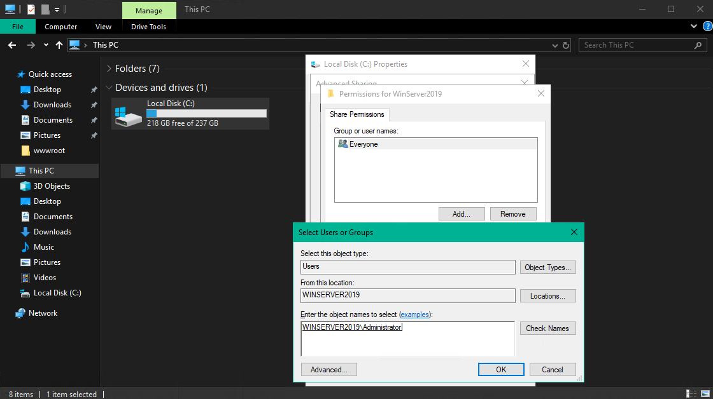


And give him the __Full Control__ over the share:


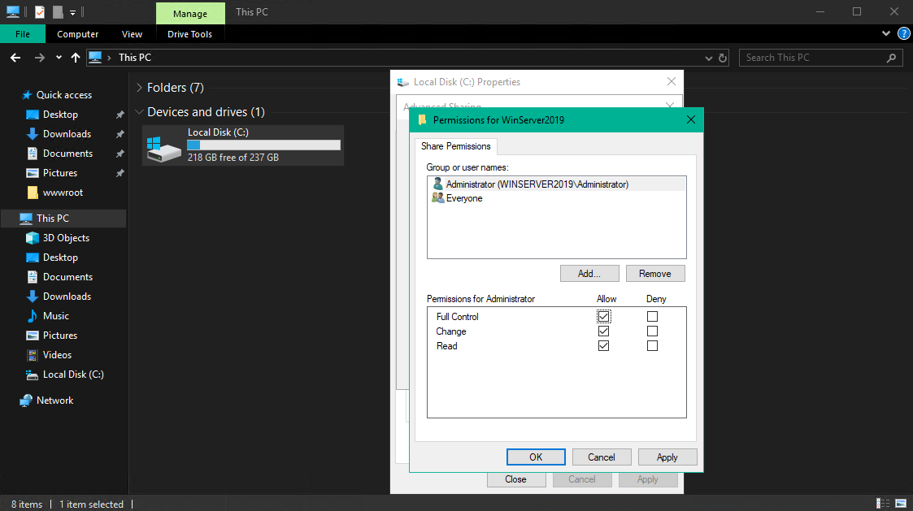


Everything is set up and you should be able to discover the share from your host machine and connect to it with the user you specified:


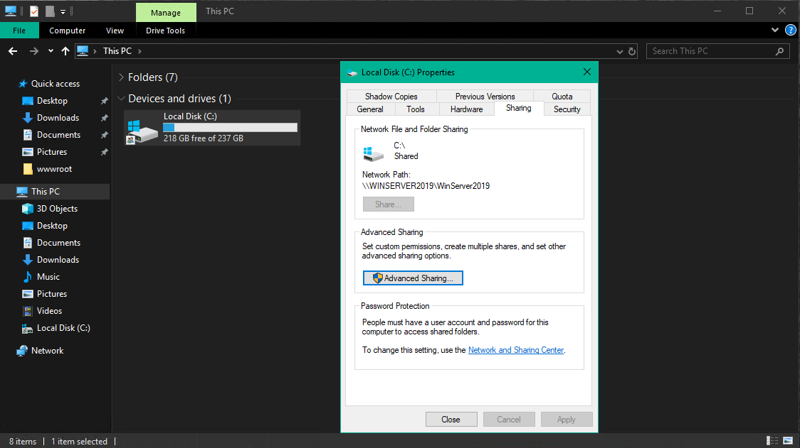


Back on your host machine right-click __This PC__ and click on __Add a network location__ and follow the assistant:


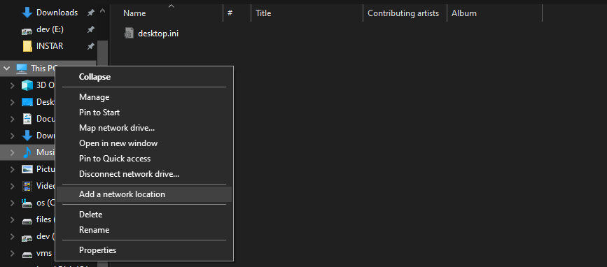

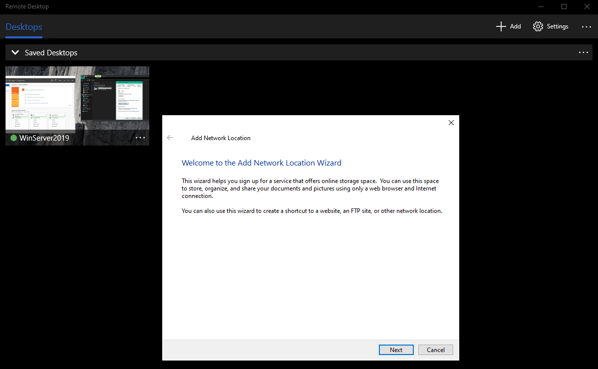

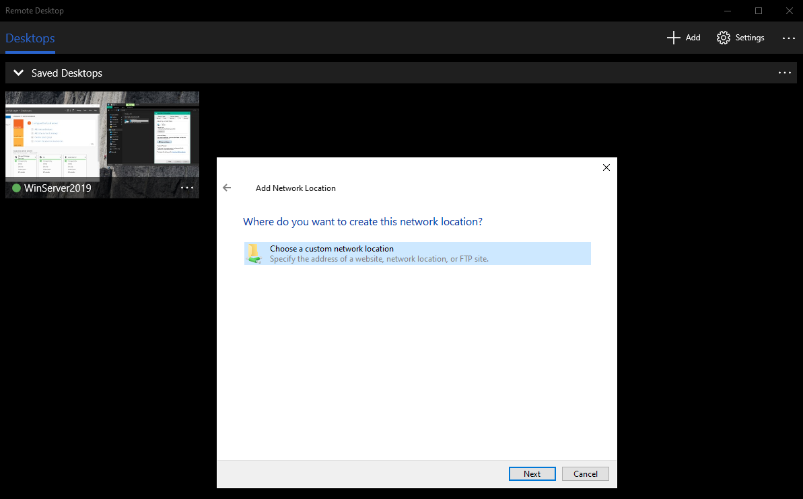


Type in the network address as follows:

1. 2 x `\`
2. Your server name in capital letters, e.g. `WINSERVER2019` followed by a `\`
3. The name you gave the share, e.g. `WinServer2019`


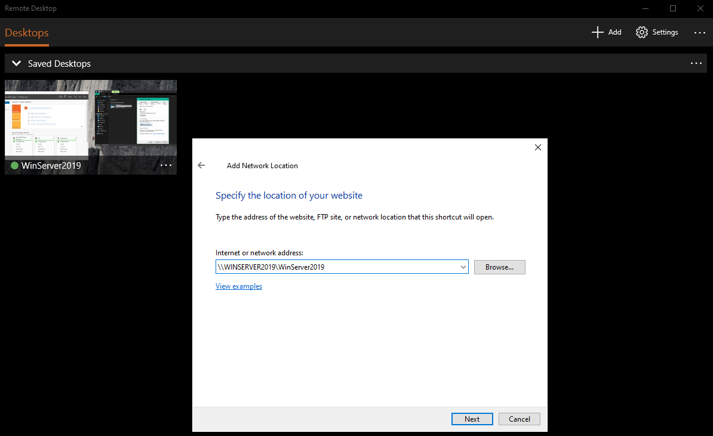


After confirming you will be asked to sign in - use the user login that you specified in the share options and click on __Finish__:


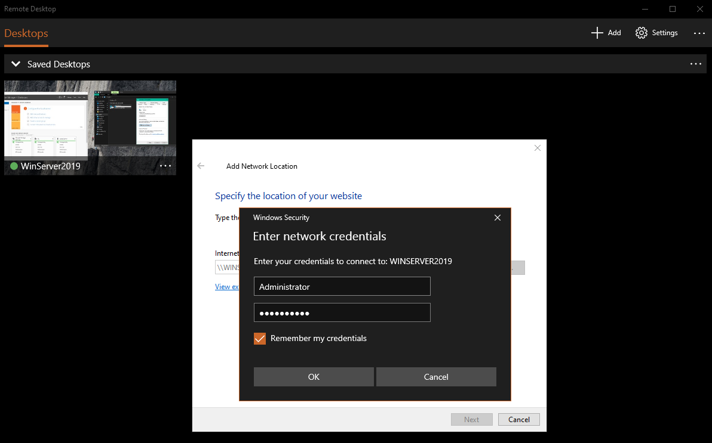

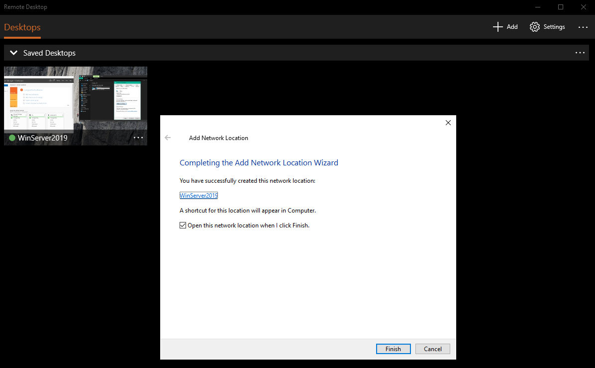


The share should now be listed under __Network__:


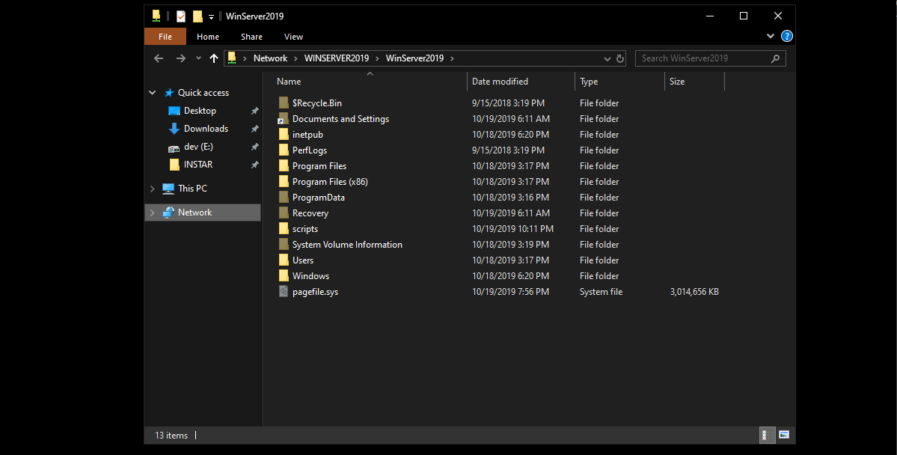