<!-- TOC -->

- [Prerequisites](#prerequisites)
- [Installation](#installation)

<!-- /TOC -->

## Prerequisites

To be able to set up an __Active Directory__ on our domain controller we have to first set up:

* A DNS service
* A static IP address for our Server
* A name for our domain controller that can be resolved by the DNS service
* A NetBIOS Domain Name that has to be prepend to every username on login

Let's start with adding a static IP. This setting can be found under __Network & Internet__. Click on __Change adapter options__ and in the next window on __Properties__. Open the __Internet Protocol Version 4__ settings and assign an IP address from your personal local network that is not currently in use:

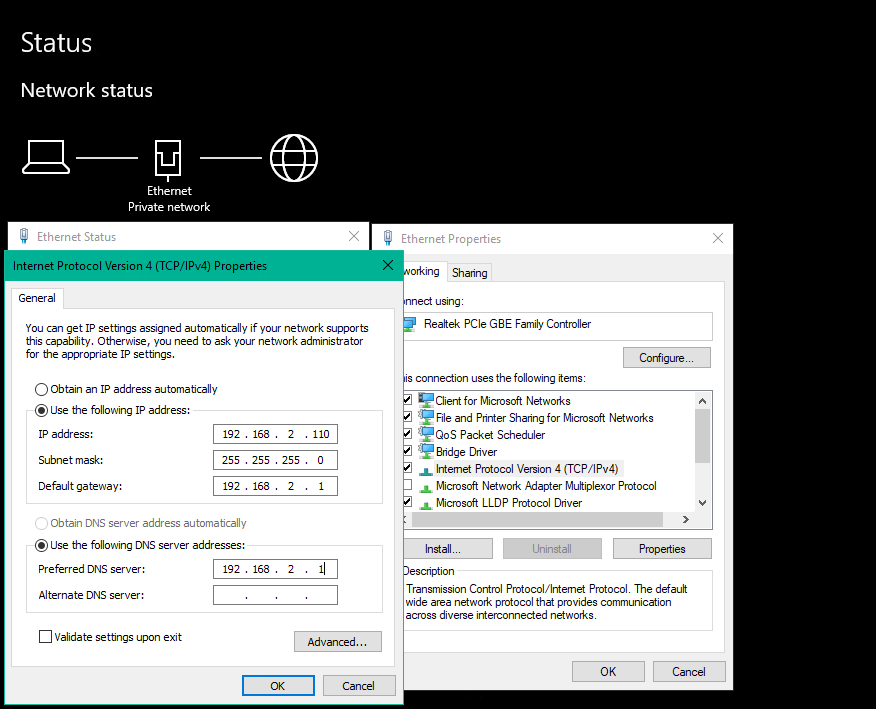

## Installation

Now we are able to add __Active Directory__ to our domain controller by opening the __Server Manager__ and clicking on __Add roles and features__:

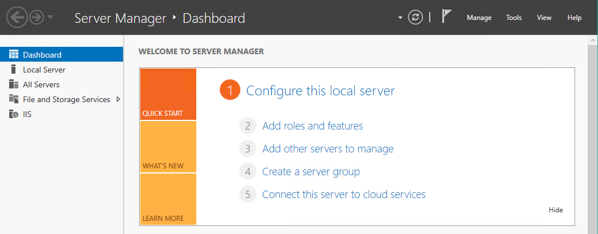

Checking __Active Directory Domain Services__ will show you a list of all the features that are required. Click on __Add Features__. Secondly we need to add the __DNS Server__ in the same way:

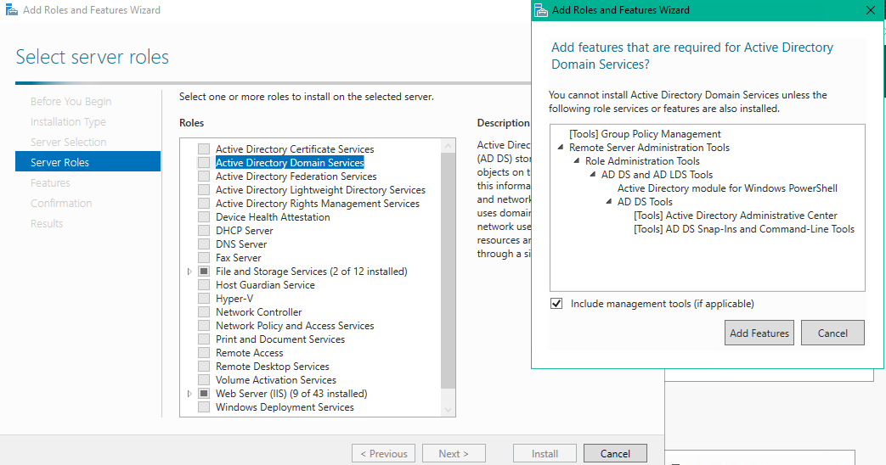

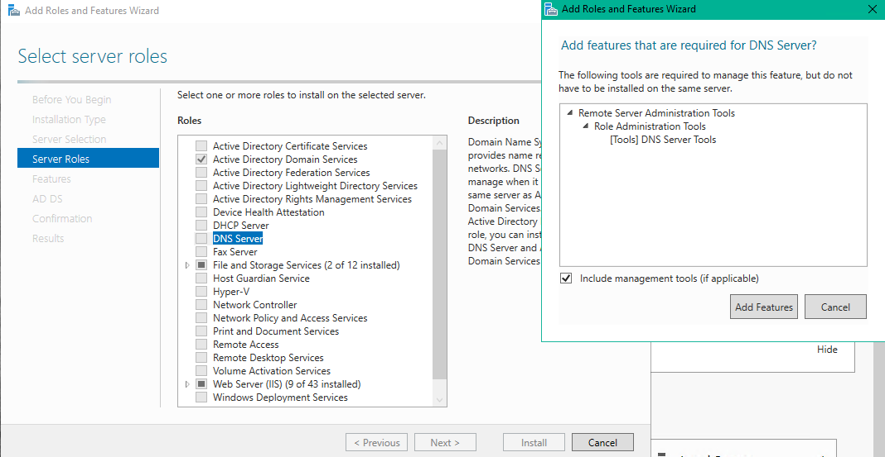

Now click __Next__ until you reached the __Confirmation__ tab then click __Install__. Once the Installation process is done head back to the __Server Manager__ and click on the notification button. You should see a notification that you now have to promote your server to __Domain Controller__.

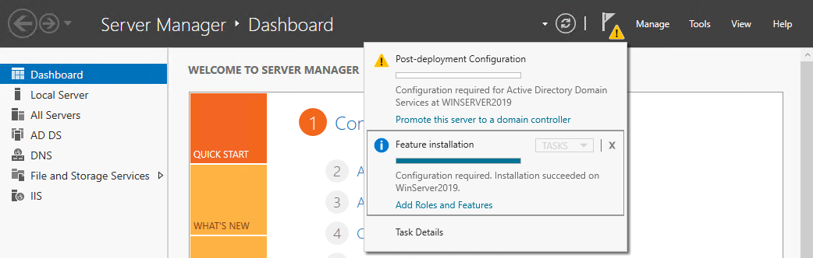

Now choose a Domain Name for your network:

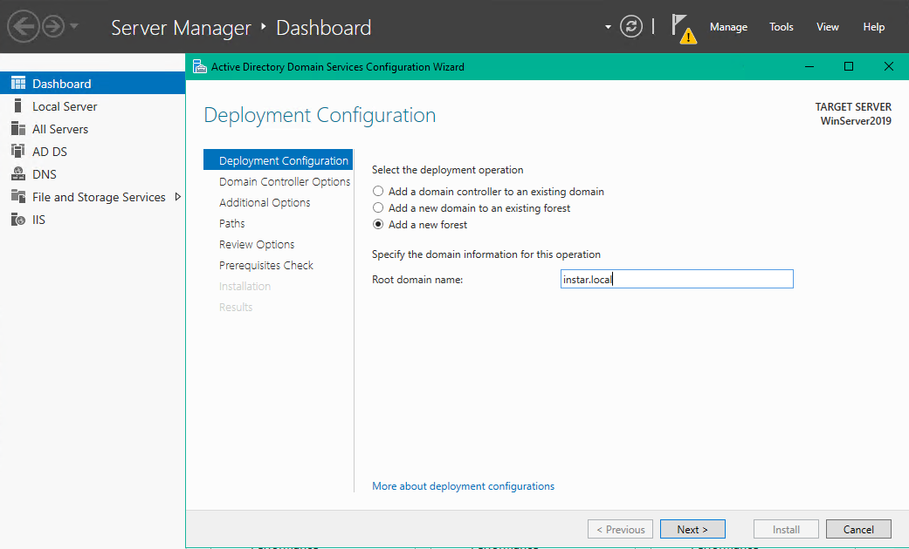

Type in a Directory Service Restore Mode (__DSRM__) password:

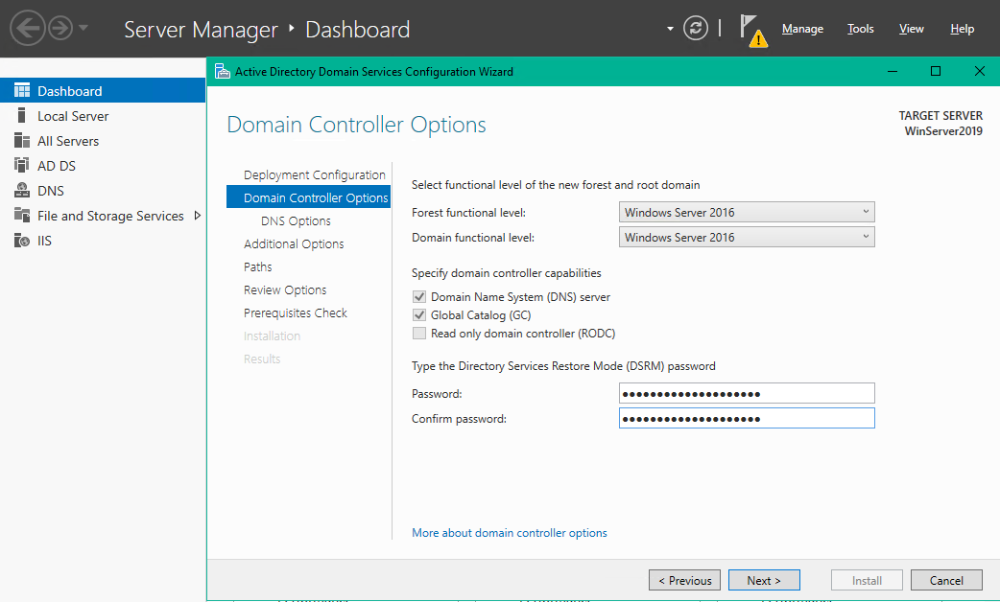

Now click __Next__ a couple of times (only change the NetBIOS domain name, if desired):

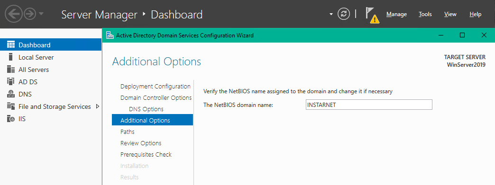

Hit __Install__ once your _Prerequisite Check_ gives you a green light:

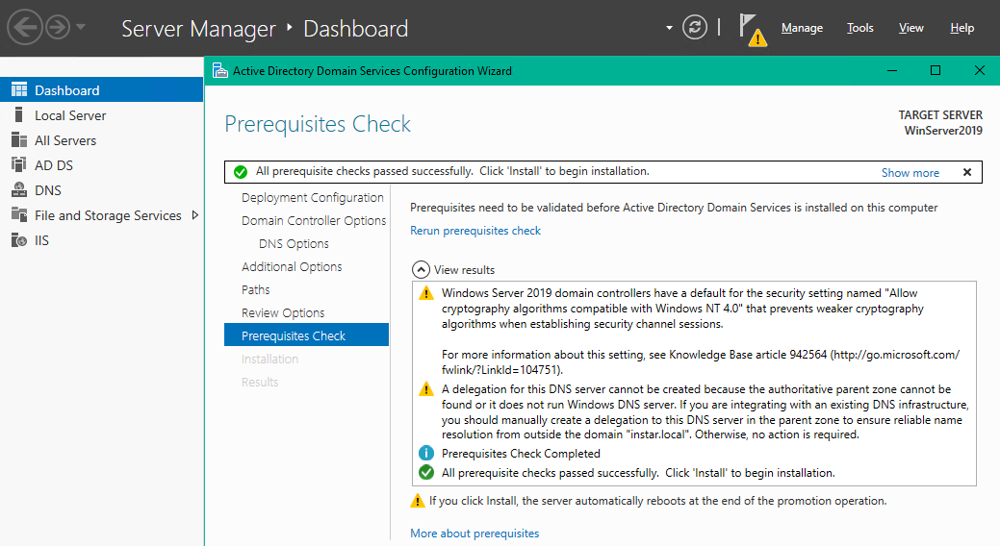

Your server should restart automatically once the installation finished and you have to reconnect to your server afterwards:

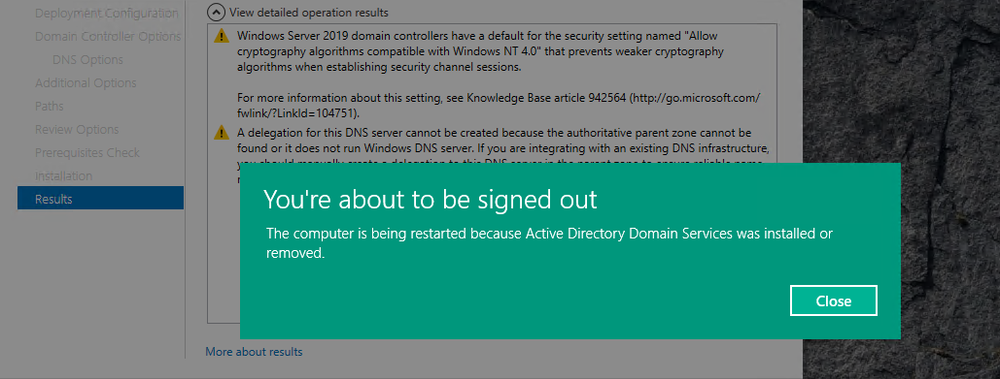

Once you are back in verify that Active Directory was installed successfully - you should now be able to find the __Active Directory Administrative Center__ in your start menu:

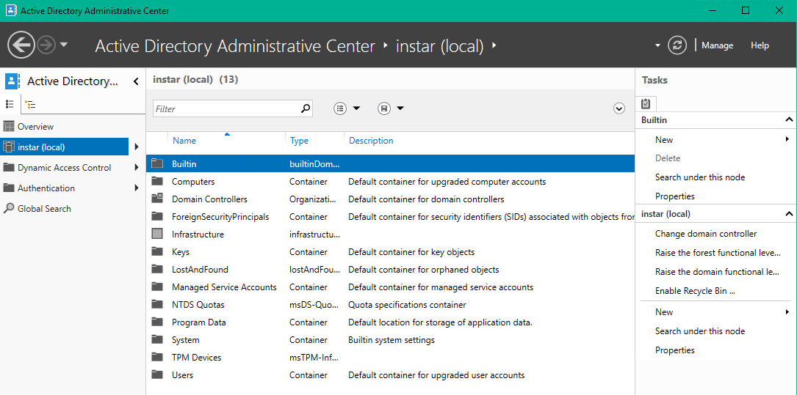

Searching for `DNS` inside the start menu should also bring up the __DNS Manager__. A quick ping should show you that the server name is resolved correctly:

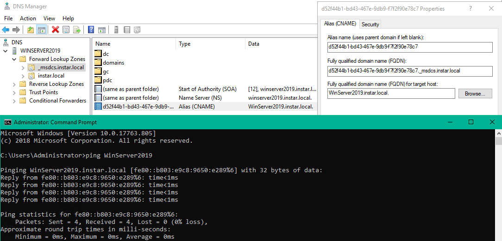