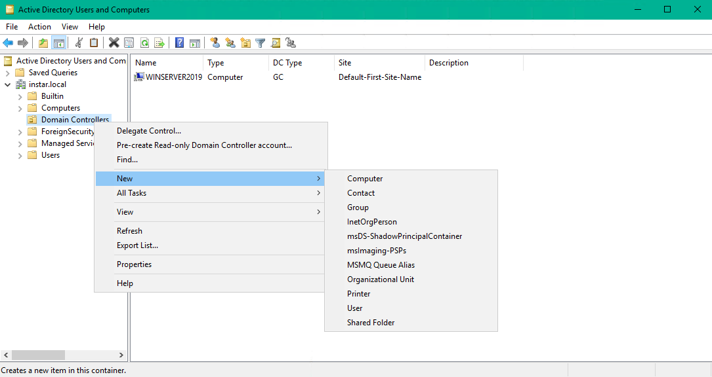
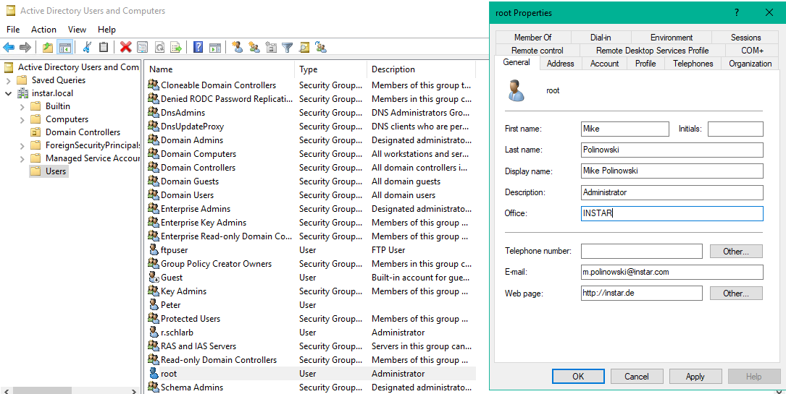
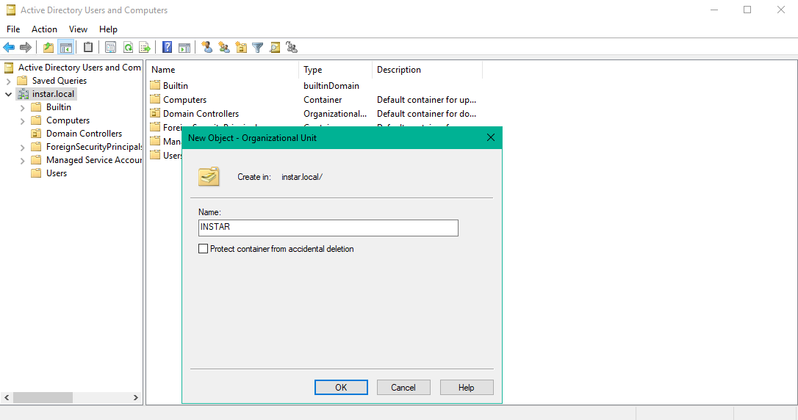
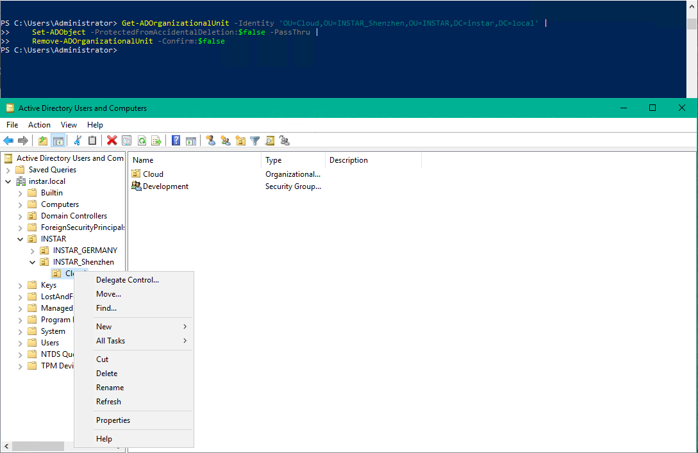
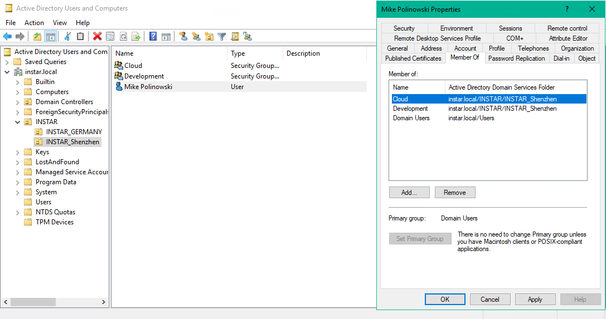

<!-- TOC -->

- [Windows Powershell](#windows-powershell)
  - [Running Powershell Commands](#running-powershell-commands)
  - [Powershell Scripting](#powershell-scripting)

<!-- /TOC -->


## Organization Units

The main task for __Active Directory__ is to group __Objects__ (users, groups, contacts, computers, printers, shared folders, etc.) with __Attributes__ (name, email address, phone number, etc.) into __Organization Units__ (OU) and to manage access rights for each object.

* Organization Unit
  * Sub-OU
    * Group
      * Objects (e.g. Users)







## User Account Management

We can now start to map our company structure in units, sub-units and groups inside our active directory:





Every time you create a OU you have the option to _Protect it from accindential deletion_. If it so happens that you made a mistake and this option was checked, you have to use Powershell to remove that protection before deleting it. In the example below I added a OU instead of a group. To delete it I had to run the following commands:





```powershell
 Get-ADOrganizationalUnit -Identity 'OU=Cloud,OU=INSTAR_Shenzhen,OU=INSTAR,DC=instar,DC=local' | Set-ADObject -ProtectedFromAccidentalDeletion:$false -PassThru | Remove-ADOrganizationalUnit -Confirm:$false
```

Finish the hirachy by adding groups and users to map structures e.g. based on offices, projects, etc.


