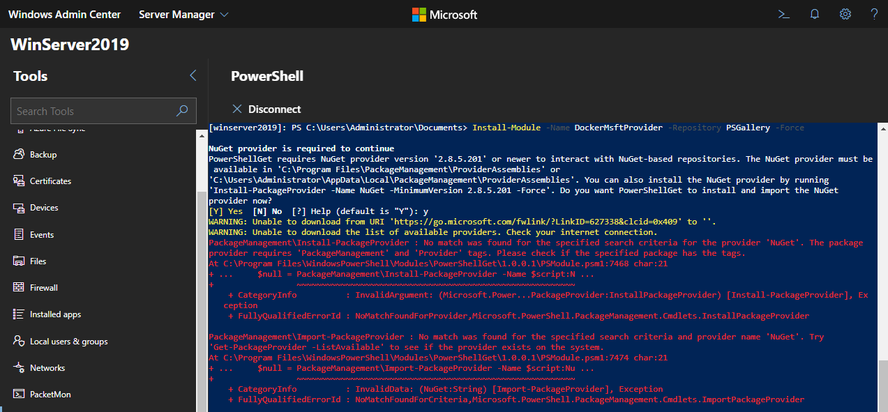
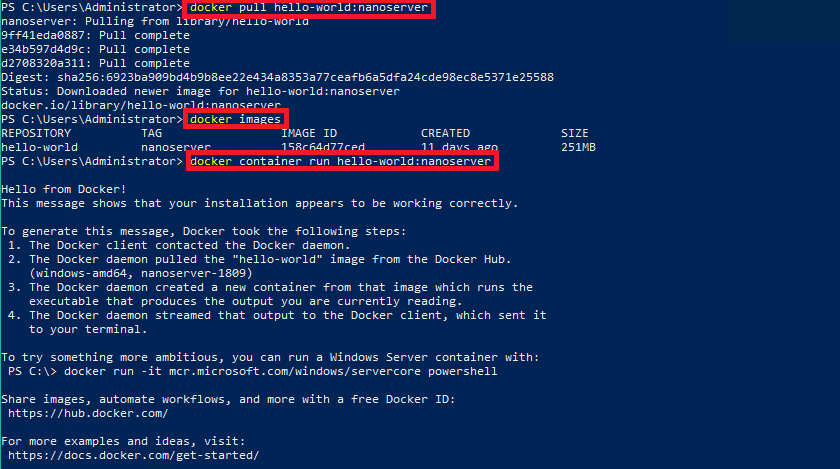

<!-- TOC -->

- [Installing Docker](#installing-docker)
  - [Downloading Docker Manually](#downloading-docker-manually)

<!-- /TOC -->


Windows containers allow users to package applications with their dependencies and leverage operating system-level virtualization to provide fast, fully isolated environments on a single system. Learn how to use Windows containers with our quick start guides, deployment guides, and samples.


## Installing Docker

Docker is required in order to work with Windows containers. Docker consists of the Docker Engine and the Docker client. To install Docker, we'll use the OneGet provider PowerShell module. The provider will enable the containers feature on your machine and install Docker, which will require a reboot.


1. Install the OneGet PowerShell module.


```powershell
Install-Module -Name DockerMsftProvider -Repository PSGallery -Force
```


2. Use OneGet to install the latest version of Docker.


```powershell
Install-Package -Name docker -ProviderName DockerMsftProvider
```


3. When the installation is complete, reboot the computer.


```powershell
Restart-Computer -Force
```


In countries that fears the internet you might end up with a screaming powershell at this point though:





### Downloading Docker Manually

Use the [following guide](https://docs.docker.com/install/windows/#use-a-script-to-install-docker-ee) if you wanted to install the Docker Engine - Enterprise manually, via a script, or on air-gapped systems.


1. In a PowerShell command prompt, download the installer archive on a machine that has a connection.


```powershell
# On an online machine, download the zip file.
Invoke-WebRequest -UseBasicParsing -OutFile docker-19.03.3.zip https://download.docker.com/components/engine/windows-server/19.03/docker-19.03.3.zip
```

This installs the latest version of docker at the moment - `19.03.3`. If you need to download a specific Docker EE Engine release, all URLs can be found on this [JSON index](https://dockermsft.blob.core.windows.net/dockercontainer/DockerMsftIndex.json).


2. In a PowerShell command prompt, use the following commands to extract the archive, register, and start the Docker service.


```powershell
# Stop Docker service if eralier version of Docker is already installed
Stop-Service docker
    
# Extract the archive.
Expand-Archive docker-19.03.3.zip -DestinationPath $Env:ProgramFiles -Force

# Clean up the zip file.
Remove-Item -Force docker-19.03.3.zip

# Install Docker. This requires rebooting.
$null = Install-WindowsFeature containers

Restart-Computer -Force

# Add Docker to the path for the current session.
$env:path += ";$env:ProgramFiles\docker"

# Optionally, modify PATH to persist across sessions.
$newPath = "$env:ProgramFiles\docker;" +
[Environment]::GetEnvironmentVariable("PATH",
[EnvironmentVariableTarget]::Machine)

[Environment]::SetEnvironmentVariable("PATH", $newPath,
[EnvironmentVariableTarget]::Machine)

# Register the Docker daemon as a service.
dockerd --register-service

# Start the Docker service.
Start-Service docker
```


3. Test your Docker EE installation by running the `hello-world` container.


```powershell
docker pull hello-world:nanoserver
docker images
docker container run hello-world:nanoserver
```


