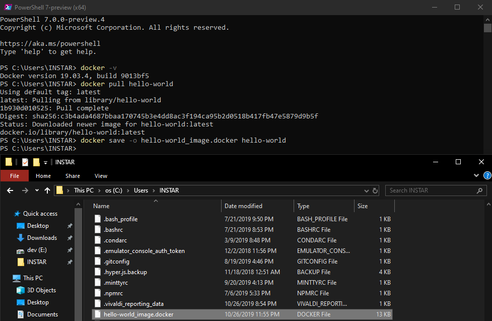
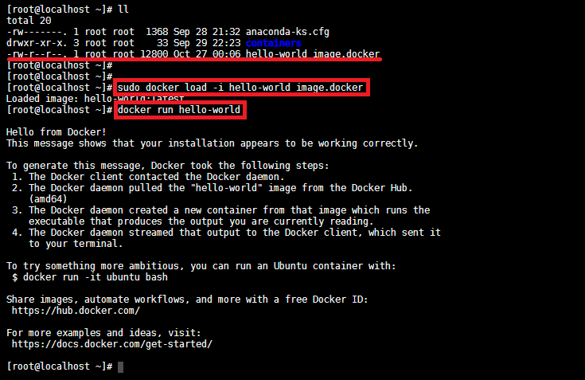

## Why would you want to do it?

I am planning to use a Windows or macOS Computer that is connected to a company VPN to download images from the Docker Hub. Those images need to be transfered to a local LINUX server (behind a firewall that makes downloading large file impossible, due to constant slow downs and disconnects) that cannot be connected to the VPN.


## Docker Save


For this I want to use the [docker save](https://docs.docker.com/engine/reference/commandline/save/) function to download the [hello-world](https://hub.docker.com/_/hello-world) image:


```bash
docker pull hello-world
docker save -o hello-world_image.docker hello-world
```





Now transfer the file to the offline computer and load the image from the file:


```bash
sudo docker load -i hello-world_image.docker
sudo docker run hello-world
```





## How to use offline Docker Images on CentOS8/Podman

The `load` command is identical in Podman. But I keep having the problem that with the `podman run` command the system want's to download the latest version of the image first before running it (I think I should have pulled a specific version instead of using the `:latest`).


```bash
podman load -i hello-world_image.docker
podman run hello-world
podman images
podman container commit hello IMAGE:ID
podman run hello
```


