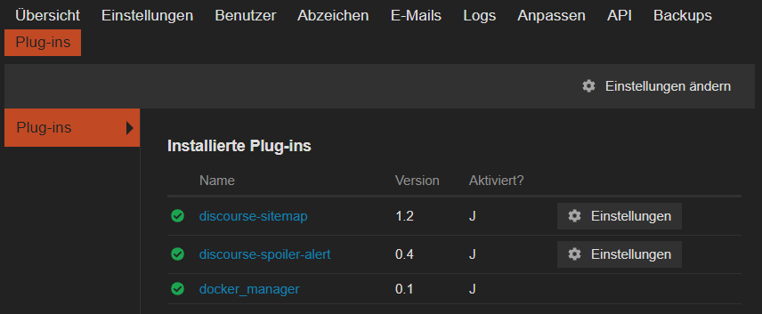
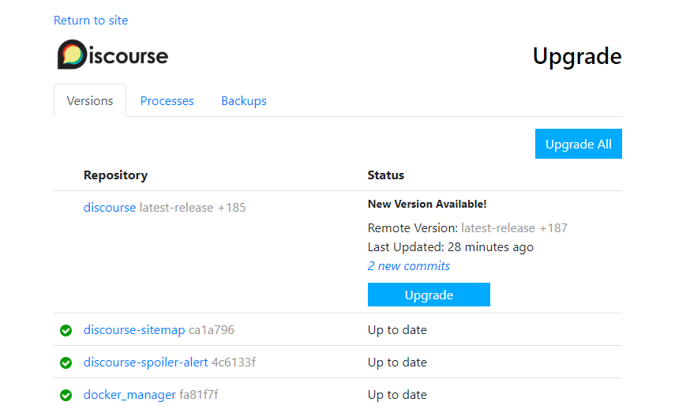

<!-- TOC -->

- [Download Discourse from Github](#download-discourse-from-github)
- [Configure Discourse](#configure-discourse)
  - [Set Mail Credentials](#set-mail-credentials)
  - [Set Domain](#set-domain)
  - [Optional: Tune Memory Settings](#optional-tune-memory-settings)
- [Bootstrap Discourse](#bootstrap-discourse)
- [Access Discourse](#access-discourse)
- [Sign Up and Create Admin Account](#sign-up-and-create-admin-account)
- [Upgrade](#upgrade)
- [Install Plugins](#install-plugins)

<!-- /TOC -->


## Download Discourse from Github

Create a `/opt/discourse` folder, where all the Discourse-related files will reside:


```bash
sudo mkdir /opt/discourse
```


Clone the [official Discourse Docker Image](https://github.com/discourse/discourse_docker) into this /opt/discourse folder:


```bash
sudo git clone https://github.com/discourse/discourse_docker.git /opt/discourse
```


## Configure Discourse

In this section we will configure your initial Discourse settings.

Switch to the `/opt/discourse` directory:


```bash
cd /opt/discourse
```


Copy the `samples/standalone.yml` file into the containers folder as `app.yml`:


```bash
sudo cp samples/standalone.yml containers/app.yml
```


Edit the Discourse configuration in the `app.yml` file:


```bash
sudo nano containers/app.yml
```


### Set Mail Credentials

Enter your SMTP credentials in the lines for `DISCOURSE_SMTP_ADDRESS`, `DISCOURSE_SMTP_PORT`, `DISCOURSE_SMTP_USER_NAME`, and `DISCOURSE_SMTP_PASSWORD`. (Be sure you remove the comment # character from the beginnings of these lines as necessary.)


```yaml
env:
  LANG: en_US.UTF-8
  ## TODO: How many concurrent web requests are supported?
  ## With 2GB we recommend 3-4 workers, with 1GB only 2
  #UNICORN_WORKERS: 3
  ##
  ## TODO: List of comma delimited emails that will be made admin and developer
  ## on initial signup example 'user1@example.com,user2@example.com'
  DISCOURSE_DEVELOPER_EMAILS: 'myaddress@example.com'
  ##
  ## TODO: The mailserver this Discourse instance will use
  DISCOURSE_SMTP_ADDRESS: smtp.mail.com              # (mandatory)
  DISCOURSE_SMTP_PORT: 587                           # (optional)
  DISCOURSE_SMTP_USER_NAME: myaddress@example.com    # (optional)
  DISCOURSE_SMTP_PASSWORD: mypassword                # (optional)
```


The SMTP settings are required to send mail from your Discourse instance; for example, to send registration emails, password reset emails, reply notifications, etc.

Having trouble setting up mail credentials? See the [Discourse Email Troubleshooting guide](https://meta.discourse.org/t/troubleshooting-email-on-a-new-discourse-install/16326).

Setting up mail credentials is required, or else you will not be able to bootstrap your Discourse instance. The credentials must be correct, or else you will not be able to register users (including the admin user) for the forum.


### Set Domain

Set `DISCOURSE_HOSTNAME` to discourse.example.com. This means you want your Discourse forum to be available at http://discourse.example.com/. You can use an IP address here instead if you don’t have a domain pointing to your server yet. Only one domain (or IP) can be listed here.


```bash
DISCOURSE_HOSTNAME: 'discourse.example.com'
```


### Optional: Tune Memory Settings

Also in the env section of the configuration file, set `db_shared_buffers` to 128MB and `UNICORN_WORKERS` to 2 so you have more memory room.


```yaml
db_shared_buffers: "128MB"
UNICORN_WORKERS: 2
```


Save the `app.yml` file, and exit the text editor.


## Bootstrap Discourse

Now use the bootstrap process to build Discourse and initialize it with all the settings you configured in the previous section. This also starts the Docker container.


```bash
sudo /opt/discourse/launcher bootstrap app
```


At this point I got an error message `/usr/bin/env: ‘bash\r’: No such file or directory` which suggests that the file `launcher` has Windows-style __\r\n__ line endings instead of the __\n-only__ line endings bash expects. To remove the \r chars run the following command:


```bash
sed $'s/\r$//' /opt/discourse/launcher > /opt/discourse/launcher-unix
chmod u+x /opt/discourse/launcher-unix
```


The `chmod` command makes the script executable. Then rerun the command above `sudo /opt/discourse/launcher-unix bootstrap app`.


At this point I ran into the problem that Docker was unable to download the discourse base image. And I had to [download and save it on a different machine](/downloading-docker-images-for-offline-use):


```bash
docker pull discourse/base:2.0.20191013-2320
docker save -o discourse.docker discourse/base:2.0.20191013-2320
```

The image file can then be transfered to the CentOS 8 machine and be loaded with the following command `sudo docker load -i discourse.docker`


This command will take about 8 minutes to run while it configures your Discourse environment. (Early in this process you will be asked to generate a SSH key; press Y to accept.)

After the bootstrap process completes, start Discourse:


```bash
sudo /opt/discourse/launcher start app
```


## Access Discourse

Visit the domain or IP address (that you set for the Discourse hostname previously) in your web browser to view the default Discourse web page.


If you receive a 502 Bad Gateway error, try waiting a minute or two and then refreshing so Discourse can finish starting.


## Sign Up and Create Admin Account

Use the Sign Up button at the top right of the page to register a new Discourse account. You should use the email address you provided in the `DISCOURSE_DEVELOPER_EMAILS` setting previously. Once you confirm your account, that account will automatically be granted admin privileges.


Once you sign up and log in, you should see the Staff topics and the [Admin Quick Start Guide](https://github.com/discourse/discourse/blob/master/docs/ADMIN-QUICK-START-GUIDE.md). It contains the next steps for further configuring and customizing your Discourse installation.

You can access the admin dashboard by visting `/admin`.


If you don’t get any email from signing up, and are unable to register a new admin account, please see the [Discourse email troubleshooting checklist](https://meta.discourse.org/t/troubleshooting-email-on-a-new-discourse-install/16326).

If you are still unable to register a new admin account via email, see the [Create Admin Account from Console](https://meta.discourse.org/t/create-admin-account-from-console/17274) walkthrough, but please note that you will have a broken site until you get normal SMTP email working.


## Upgrade

To upgrade Discourse to the latest version, visit `/admin/upgrade` and follow the instructions.


## Install Plugins

In this tutorial, we’ll install [Discourse Spoiler Alert](https://meta.discourse.org/t/discourse-spoiler-alert/12650) and [Discourse Sitemap](https://meta.discourse.org/t/discourse-sitemap-plugin/40348) plugin.


To install a [plugin in Discourse](https://meta.discourse.org/tags/plugins), it needs to be placed in `/var/www/discourse/plugins`. However, this is inside the container - and changes to the container are wiped when it is rebuilt! So, the container definition is what needs to be edited.


1. On your Centos system enter the Discourse directory: `cd /opt/discourse`.
2. Edit the app configuration file: `nano containers/app.yml`.
3. Access the Github page ([discourse-sitemap](https://github.com/discourse/discourse-sitemap), [discourse-spoiler-alert](https://github.com/discourse/discourse-spoiler-alert)) of each plugin you want to install, click on the green __Clone or download__ button and copy the web URL.
4. Now paste the URLs into the plugin section of the `app.yml` file:


```yaml
## Plugins go here
## see https://meta.discourse.org/t/19157 for details
hooks:
  after_code:
    - exec:
        cd: $home/plugins
        cmd:
          - git clone https://github.com/discourse/docker_manager.git
          - git clone https://github.com/discourse/discourse-spoiler-alert.git
          - git clone https://github.com/discourse/discourse-sitemap.git
```

5. And rebuild the container: `./launcher rebuild app`


What to do when you receive this error message:


```bash
[root@localhost discourse]# ./launcher rebuild app
Ensuring launcher is up to date
Fetching origin
remote: Enumerating objects: 3, done.
remote: Counting objects: 100% (3/3), done.
remote: Compressing objects: 100% (3/3), done.
remote: Total 3 (delta 0), reused 2 (delta 0), pack-reused 0
Unpacking objects: 100% (3/3), done.
From https://github.com/discourse/discourse_docker
   b637998..20e812e  master     -> origin/master
Updating Launcher
Updating b637998..20e812e
error: Your local changes to the following files would be overwritten by merge:
        discourse-setup
Please commit your changes or stash them before you merge.
Aborting
failed to update
```


Stash your changes and rerun the rebuild command:


```bash
cd /opt/discourse
git stash
git pull
./launcher rebuild app
```


Once the rebuild process is done open Discourse again inside your browser and head to `/admin/plugins` to activate your new plugins:





All Plugins are update through `/admin/upgrade`:





The sitemap plugin publishes two files:


1. `/sitemap.xml` : the regular Google Sitemap format
2. `/news.xml` : special sitemap for Google News containing all new topics in the last three days


To test the spoiler plugin start a new thread and post:


```
[spoiler]This is a spoiler[/spoiler] 
```