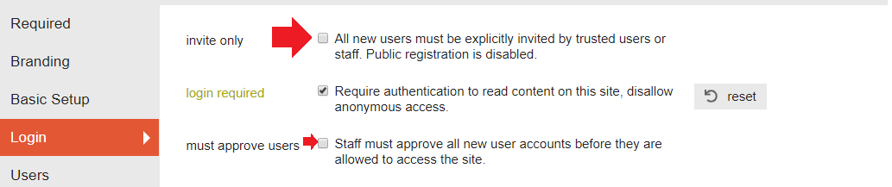

<!-- TOC -->

- [Preparation](#preparation)
- [Get a SQL Dump](#get-a-sql-dump)
- [Prepare the Docker Container](#prepare-the-docker-container)
- [Install Dependencies](#install-dependencies)
- [Import the Database](#import-the-database)
  - [Update](#update)
- [Run the Import Script](#run-the-import-script)

<!-- /TOC -->


## Preparation

Setup your production environment by [following the installation guide](/installing-discourse-on-centos-8). Then go to the Admin section and configure a few settings.


1. Start with backing up your settings (if you already made changes to your installation):


2. The guide mentions that you should change your slug settings - but does not say to what. The default ASCII version works fine for me ¯\\\_(ツ)_/¯  :


3. Enable login_required (recommended. At least to finish the importing):


4. If you enabled `download_remote_images_to_local` you should enable `disable_edit_notifications` to prevent your users from becomming bombarded by edit notifications.


## Get a SQL Dump

Export the database dump from your __vBulletin__ server:


```sql
mysqldump -u [:user-name] -p [:name-of-database] > vb5_dump.sql
```


Copy the database to your Discourse server.


Now we have to get the dumped file into our discourse container. We can do this by using the `docker cp` command:


```bash
docker cp vb5_dump.sql mycontainerID:/vb5_dump.sql
```


You can find your Docker container ID with `docker ps -a`. In my case this ID is `8c0066364a7a` and the name of my SQL dump is `Forum_DE_2019-10-31.sql` inside the folder `/oldbackup` - the corresponding command looks like this:


```bash
docker cp /oldbackup/Forum_DE_2019-10-31.sql 8c0066364a7a:/Forum_DE_2019-10-31.sql
```


The attachments of your forum can be exported from the SQL database onto the file system:


We can also copy this folder to our Discourse host and then copy it into the Discourse container:


```bash
docker cp /oldbackup/anhang/. 8c0066364a7a:/vb5-attachments
```


If your forum has custom avatars do the same with them and store them in `./vb5-avatars` inside the container.


## Prepare the Docker Container

1. Start by entering the __Discourse__ container:


```bash
cd /opt/discourse
./launcher enter app # Now your are inside the container.
```


2. Install the MariaDB server:


```bash
apt-get update && apt-get install libmariadb-dev mariadb-server-10.3
```


After finishing installing MariaDB check its status:


```bash
sudo service mysql status
```


If MySQl service is not running/active:


```bash
sudo service mysql start
```


## Install Dependencies


```bash
echo "gem 'mysql2', require: false" >> /var/www/discourse/Gemfile
echo "gem 'php_serialize', require: false" >> /var/www/discourse/Gemfile
cd /var/www/discourse
echo "discourse ALL = NOPASSWD: ALL" >> /etc/sudoers
su discourse -c 'bundle install --no-deployment --without test --without development --path vendor/bundle'
```


## Import the Database

Now we need to create a database inside MariaDB and import the dumped SQL data we copied into the Discourse container:


```bash
mysql -uroot -p -e 'CREATE DATABASE vb5'
mysql -uroot -p vb5 < /Forum_DE_2019-10-31.sql
```


__You will be asked for a password - just leave it__ _blank_ [MariaDB Default Password](https://mariadb.com/kb/en/library/mysql_secure_installation/).


We can verify that our database was created successfully with the following command:


```bash
mysqlcheck -c vb5  -u root -p
```


When successful you should now see a list of all tables inside your database:


### Update

__Create missing tables that the later import script is requiring__:


```
mysql
MariaDB [(none)]> use vb5;
MariaDB [vb5]> CREATE TABLE customprofilepic (userid INT(11), customprofileid INT(11), thumbnail VARCHAR(255));
```


__Make sure that the discourse user has access to the database before running the import script__


```bash
su discourse
mysql -u root
ERROR 1698 (28000): Access denied for user 'root'@'localhost'
```


```bash
mysql -u root -p
*enter your password*
UPDATE mysql.user SET plugin = 'mysql_native_password' WHERE User='root';
FLUSH PRIVILEGES;
EXIT;
```


* MySQL Native Password

Basically, mysql_native_password is the traditional method to authenticate- it is not very secure (it uses just a hash of the password), but it is compatible with older drivers. If you are going to start a new mysql service, you probably want to use the new plugin from the start (and TLS). If you have special needs, you can use other method- you can even program one if you have certain special needs).

You can chose a different method for each individual user- for example, your normal applications can use mysql_native_password or the new sha2 one, but you can make sure your admin accounts use a 2-factor authentication token, and unix_socket for a monitoring user gathering statistics on the mysql server. Those other authentication methods may or may not use the password field on the mysql.user table, like the native one does (they may store the password elswhere, or they may not even have a concept of a password!).


```sql
ALTER USER 'root'@'localhost' IDENTIFIED WITH mysql_native_password BY '<password>';
```

and

```sql
ALTER USER 'root'@'localhost' IDENTIFIED BY '<password>';
```


Are essentially the same, mysql_native_password is normally the default authentication method. With WITH you can decide which method to use. For example, if you use GRANT USAGE ON *.* TO root@localhost IDENTIFIED WITH socket_auth, you are setting that user to use unix socket authentication. MariaDB uses a slightly different syntax: VIA unix_socket. Running those command mainly results in an update of the mysql.user table.

Note ALTER / GRANT works automatically on next user login, while UPDATEing directly the mysql.user table may require a FLUSH PRIVILEGES, and has some issues on certain scenarios (Galera, etc.).


__Activate Public Registration__

If you have activated the __Invite Only__ mode during development it might be a good idea to deactivate it during the import, if you don't want to have to verify each added user:





## Run the Import Script

Create your import script based on the [official Discourse vBulletin5 Script](https://github.com/discourse/discourse/blob/master/script/import_scripts/vbulletin5.rb):


```bash
nano script/import_scripts/instarvb5.rb
```


```ruby
# frozen_string_literal: true

require 'mysql2'
require File.expand_path(File.dirname(__FILE__) + "/base.rb")
require 'htmlentities'

class ImportScripts::VBulletin < ImportScripts::Base
  BATCH_SIZE = 1000
  DBPREFIX = "vb5."
  ROOT_NODE = 2

  # CHANGE THESE BEFORE RUNNING THE IMPORTER
  DATABASE = "vb5"
  TIMEZONE = "Europe/Berlin"
  ATTACHMENT_DIR = '/vb5-attachments/'
  AVATAR_DIR = '/vb5-avatars/'

  def initialize
    super

    @old_username_to_new_usernames = {}

    @tz = TZInfo::Timezone.get(TIMEZONE)

    @htmlentities = HTMLEntities.new

    @client = Mysql2::Client.new(
      host: "localhost",
      username: "root",
      database: DATABASE,
      password: ""
    )

  end
```


Run the importer and wait until the import is done. You can restart it if it slows down.


```bash
cd /var/www/discourse
su discourse -c 'bundle exec ruby script/import_scripts/instarvb5.rb'
```


You should run the script in a detachable terminal - as it might run for a loooong time. See [tmux](https://mpolinowski.github.io/working-with-tmux) for example.


```bash
su discourse -c 'bundle exec ruby script/import_scripts/instarvb5.rb'
Loading existing groups...
Loading existing users...
Loading existing categories...
Loading existing posts...
Loading existing topics...

importing groups...
       17 / 17 (100.0%)  [2293583 items/min]  
importing users
    20180 / 20180 (100.0%)  [4186 items/min]   
importing top level categories...
        5 / 5 (100.0%)  [2612785 items/min]  
importing child categories...

importing topics...

importing posts...
        5 / 5 (100.0%)  [17209 items/min]  
importing attachments...
    16116 / 5 (322320.0%)  
Closing topics...

Postprocessing posts...
    16116 / 16116 (100.0%)  

Updating topic status

Updating bumped_at on topics

Updating last posted at on users

Updating last seen at on users

Updating topic reply counts...
    20181 / 20181 (100.0%)  [19936 items/min]  ]  
Updating first_post_created_at...

Updating user post_count...

Updating user topic_count...

Updating topic users

Updating post timings

Updating featured topic users

Updating featured topics in categories
        9 / 9 (100.0%)  [6411 items/min]  ]  
Updating user topic reply counts
    14439 / 20181 ( 71.5%)  [62 items/min]     ]  
```
