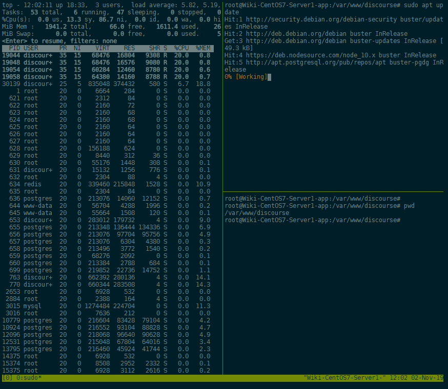

<!-- TOC -->

- [Installing tmux](#installing-tmux)
- [Shell Splitting](#shell-splitting)
- [Working with Windows](#working-with-windows)
- [Detachment](#detachment)

<!-- /TOC -->


[tmux](http://tmux.sourceforge.net/) is a terminal multiplexer. It allows you to access a tmux terminal using multiple virtual terminals. tmux takes advantage of a client-server model, which allows you to attach terminals to a tmux session. This means that you can run several terminals at once concurrently off of a single tmux session without spawning any new actual terminal sessions.

This also means that sudden disconnects from a cloud server running tmux will not kill the processes running inside the tmux session.


## Installing tmux

Before installing tmux first update apt to ensure we have the latest packages. Then install tmux:


```bash
sudo apt-get update
sudo apt-get install tmux
```


## Shell Splitting

To begin a new tmux session:


```bash
tmux
```


As it is, you can treat this like a completely new terminal. In fact, it really is just a new terminal running from inside tmux. This new terminal is called a window in the context of tmux. Let's split our window into two panes.

tmux can be controlled using a prefix key (by default, Ctrl-b) and a command key. The command key to split into two panes is `%`. From within tmux. We can also split our second pane horizontally with `"`:


```
Ctrl-b %
Ctrl-b "
```


To switch to the next pane (panes are numbered left-to-right, top-down):

```
Ctrl-b o
```

Exiting out of a shell with `exit` will destroy the associated pane. Adjacent panes will expand to make use of the freed space.

Closing the last pane will end tmux.





## Working with Windows

A step in context above panes are windows. Windows behave similarly to tabs in a browser. To create a new window:


```
Ctrl-b c
```


tmux will switch to the new window automatically. You can see the new window indicated in the status-line. Windows are numbered from 0, so our new window is number 1. Now you can create panes and treat this window like we did before. We can even create another window. Our three windows are numbered 0, 1, and 2.

To move to the next window in the index:


```
Ctrl-b n
```


To move backwards in the index:


```
Ctrl-b p
```


## Detachment


When you exit the last shell in the last pane in the last window of a session, the session will terminate. Instead of exiting from the session entirely, you can _detach_ from the session.

A session will continue to run in the background, running whatever shells were on it when you detached.

When you re-attach to the session later, you will return to the session in the same state it was when you detached. All windows and panes are retained by the session.


To detach from a session:


```bash
Ctrl-b d
```


To re-attach to a session:


```bash
tmux attach -t [session]
```


Sessions, like windows, are numbered beginning from 0. If you forgot which session you wanted to attach to, you can view active sessions:


```bash
tmux list-sessions
```


A list of all command keys is accessible with:


```bash
Ctrl-b ?
```