<!-- TOC -->

- [Creating a new Google Cloud Platform Project](#creating-a-new-google-cloud-platform-project)
- [Setup OAuth2](#setup-oauth2)
- [Verify your Domain](#verify-your-domain)

<!-- /TOC -->

Configure Discourse to allow login and registration with Google OAuth2.

## Creating a new Google Cloud Platform Project

Open the [Google Developer Console](https://console.developers.google.com) and Select to __Create a new Project__:

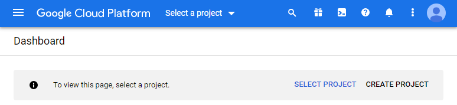

Fill in the Project Name field, then click on __Create__:

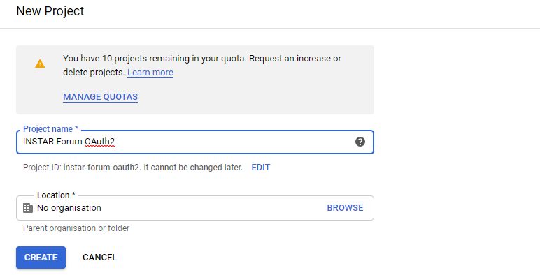

## Setup OAuth2

Under __APIs and Services__ and select the __OAuth consent screen__:

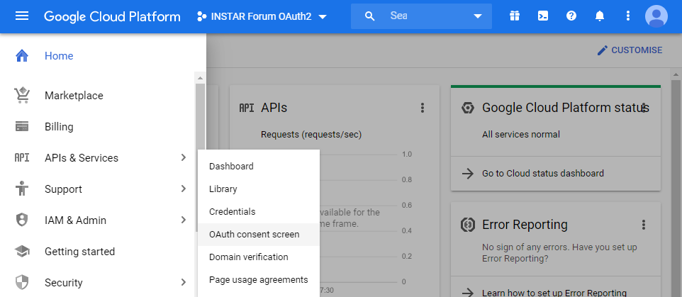

Select __External__ and then click on __Create__:

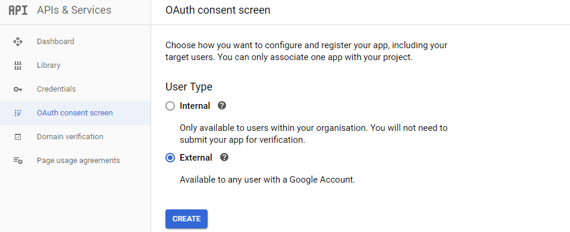

Fill out the form then click Save:

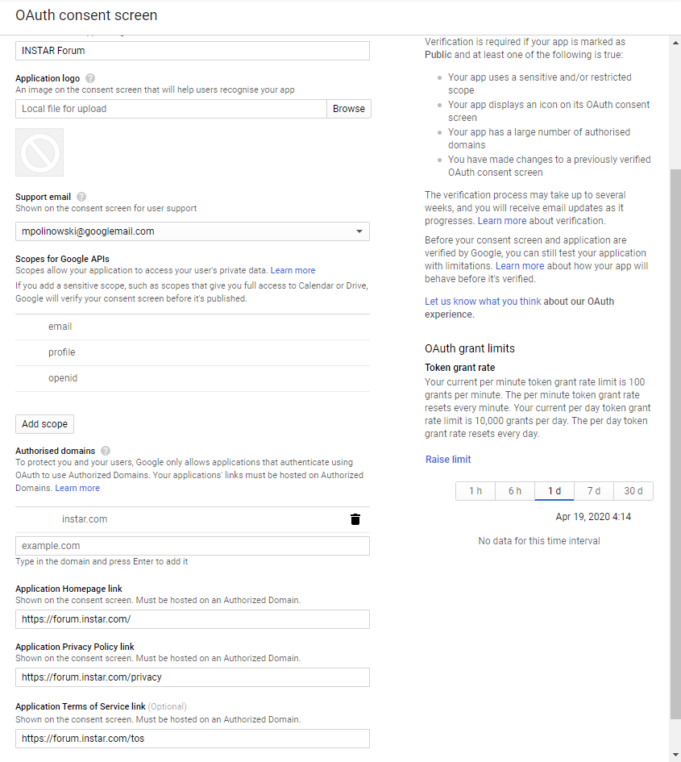

Go to the __Credentials__ tab on the left, click on __+ CREATE CREDENTIALS__ then click on __OAuth client ID__:

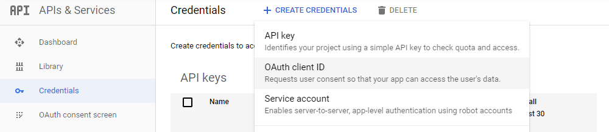

Choose __Web application__ as the Application Type. In the __Authorized JavaScript Origins__ section, add your site’s base url, including http:// or https://. In the __Authorized Redirect URI__ section, add the base url with `/auth/google_oauth2/callback`. Click the __Create__ button:

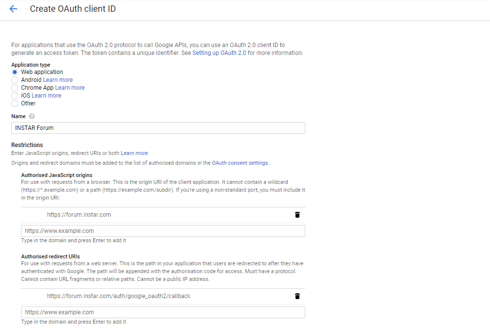

The OAuth client dialog will appear with client ID and secret:

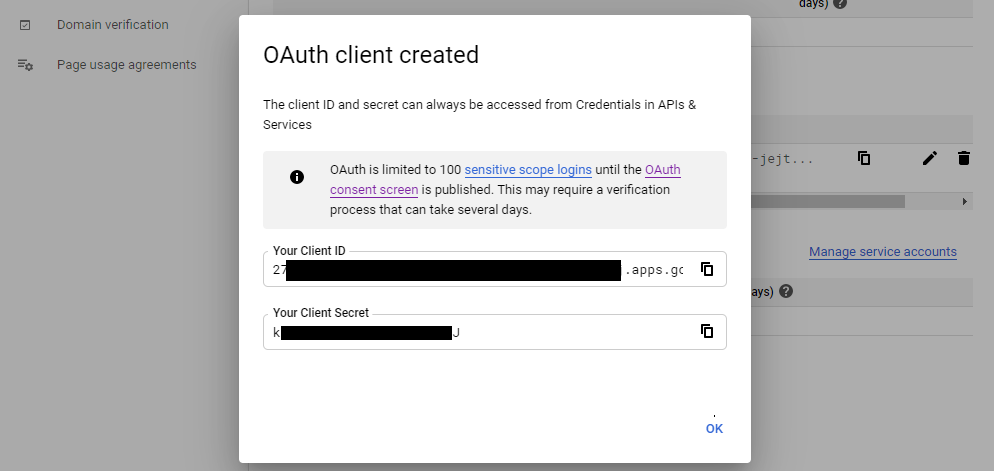

In your Discourse site settings, check enable google oauth2 logins, and fill in your google oauth2 client id and google auth2 client secret provided earlier:

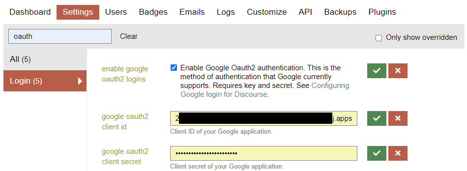

## Verify your Domain

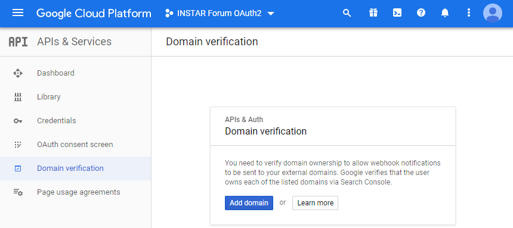

Your site must be registered on [Search Console](https://www.google.com/webmasters/tools)  with an `https://` URL or with the domain name provider verification method __before you can proceed__:

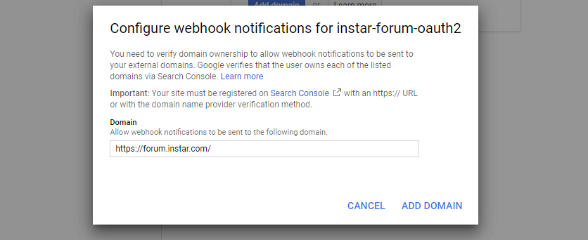

Add your domain to your [Search Console](https://www.google.com/webmasters/tools) properties:

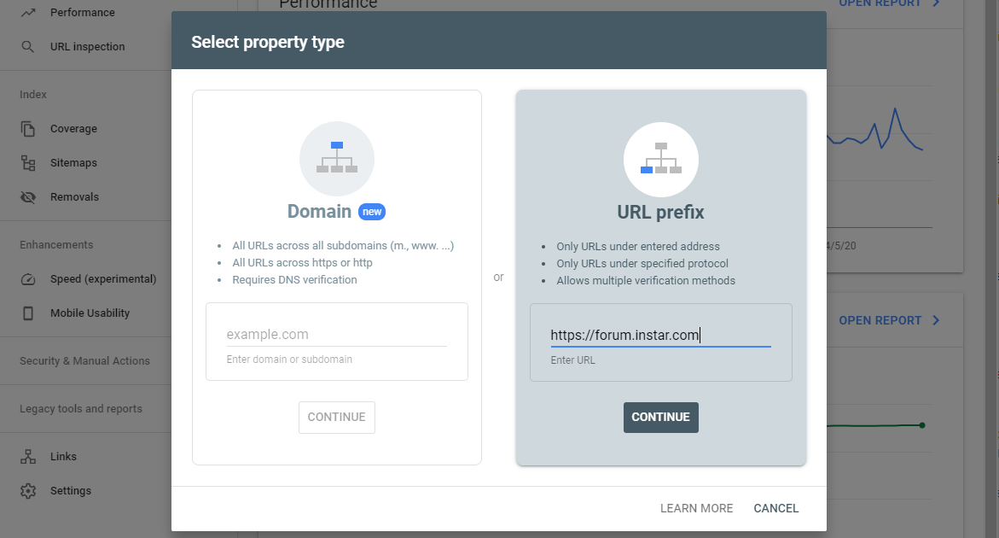

You can now add a HTML Tag to your Discourse page template to verify your ownership over the domain. To do this copy the meta tag Google provides for you:

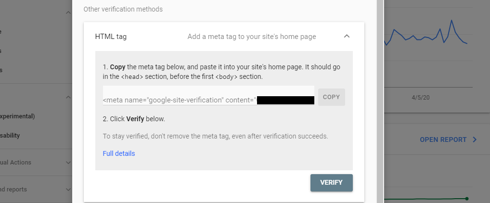

Go to the Discourse Admin and go to the following page: `Admin>Customize>Themes`, then select __Components__. Click on __Install__, then __+ Create new__:

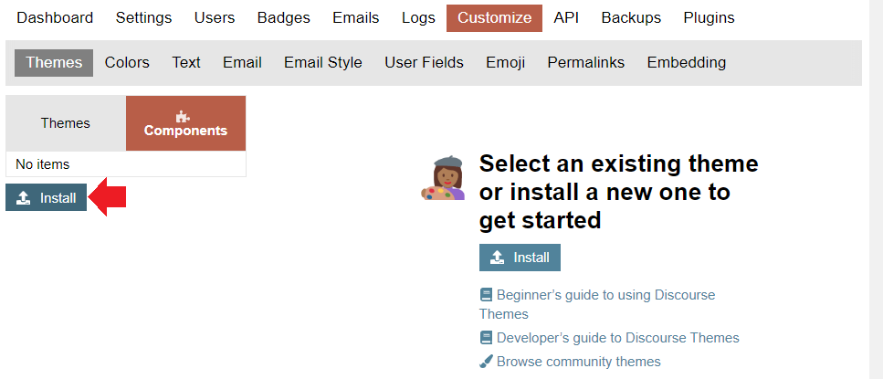

Give it a meaningful name (i.e. `GoogleSearchConsoleVerification`):

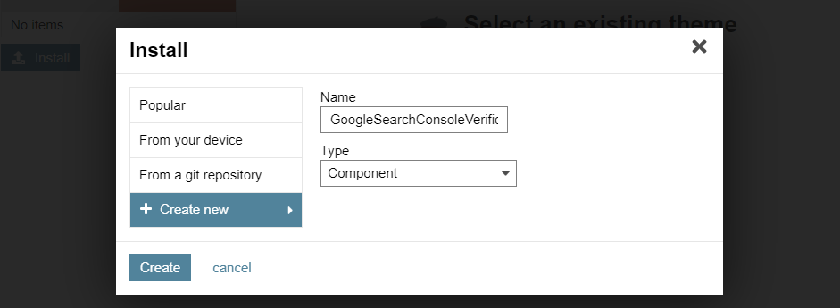

In your new component, select __Edit CSS/HTML__, under __Custom CSS/HTML__. In the `</head>` section, paste the HTML tag generated by GSC Verification Wizard, then Save this change:

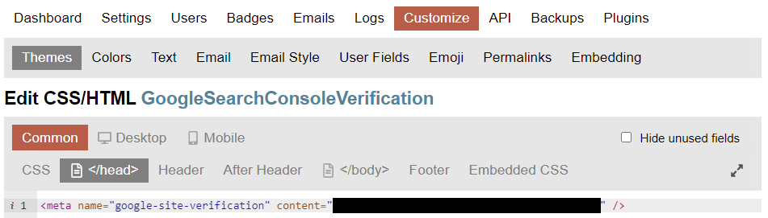

Back in the Theme menu add your new component to your default Discourse theme:

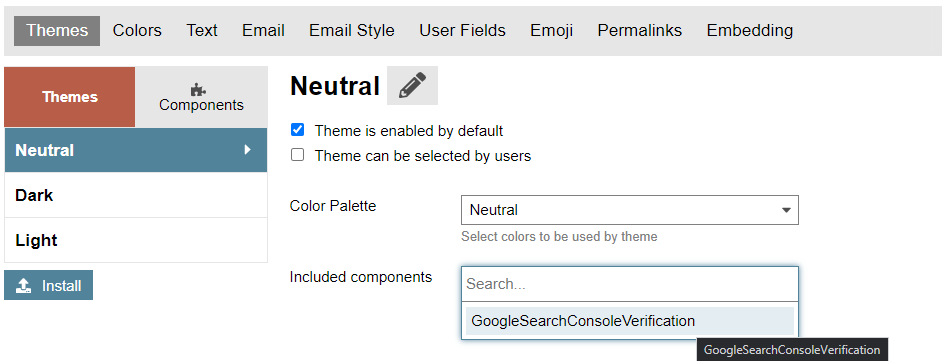

Back in GSC click on __Verify__ to add your domain to your properties:

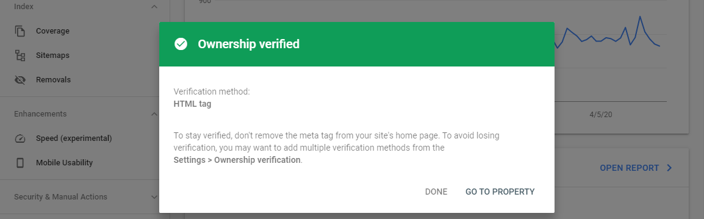

Back in the OAuth2 configuration you can now add your verified domain without further issues!

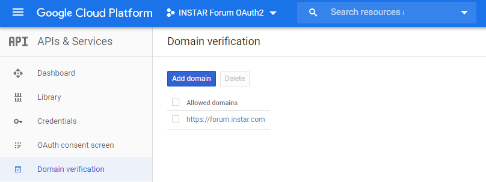