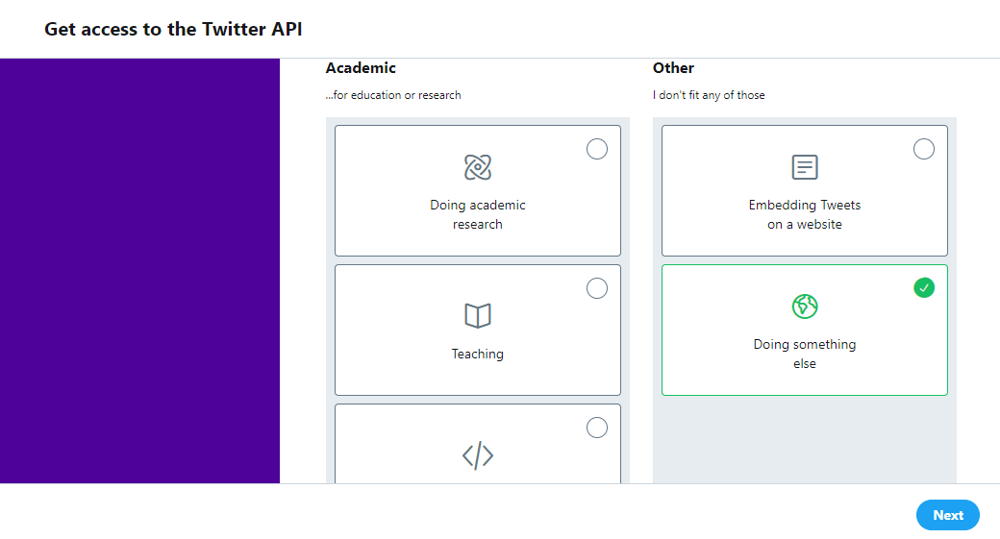
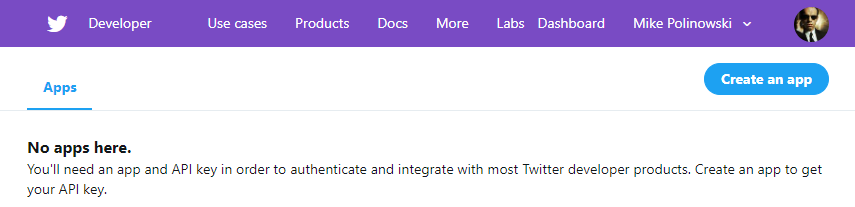
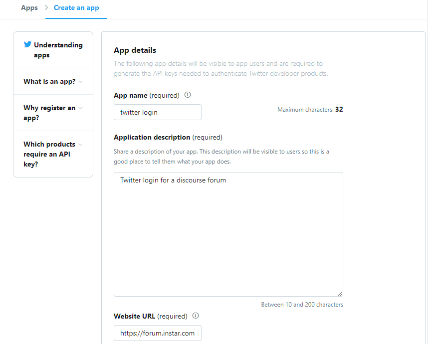
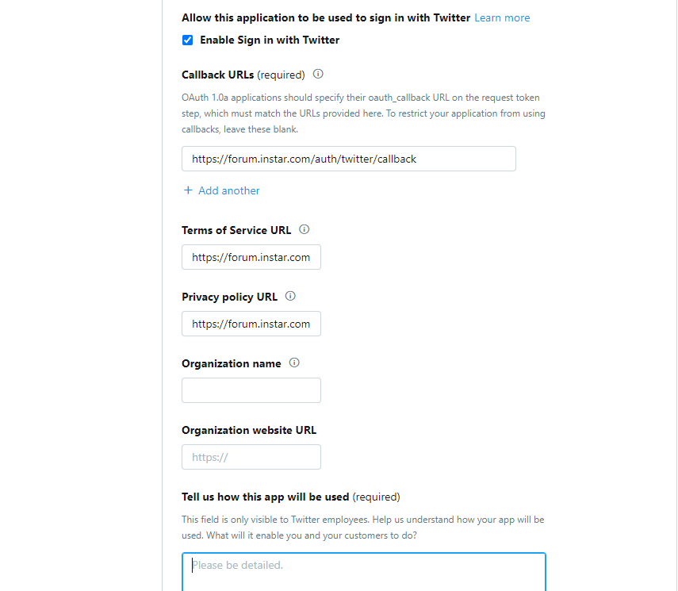
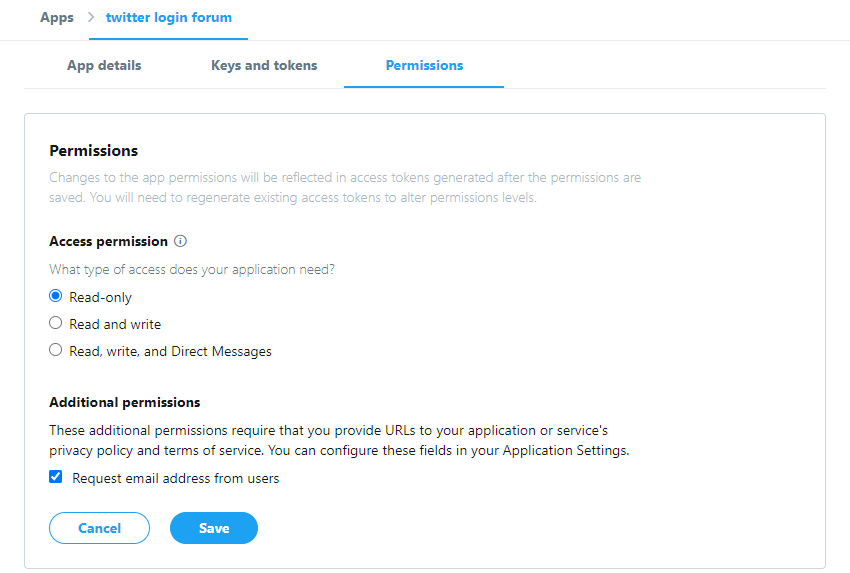
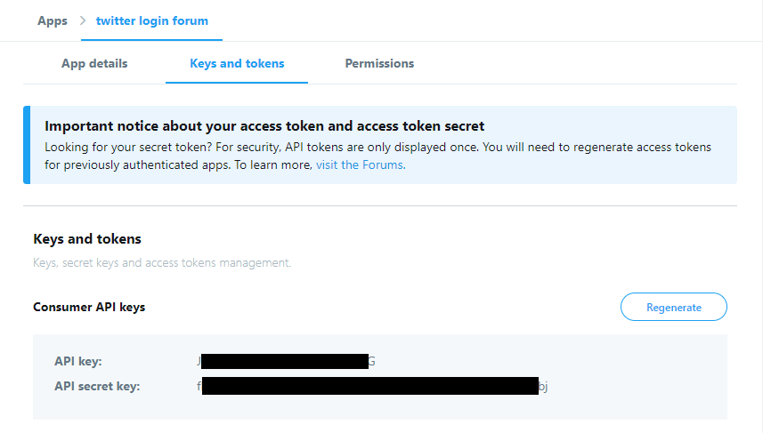
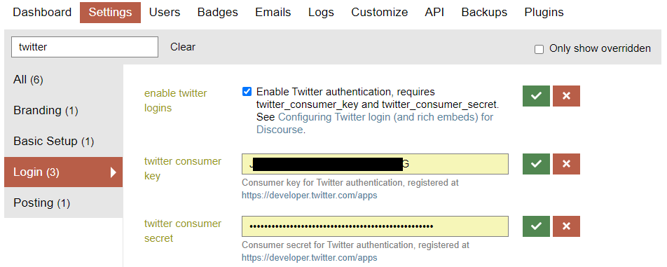

<!-- TOC -->

- [Create a Twitter Developer Account](#create-a-twitter-developer-account)
- [Add a Authentication App](#add-a-authentication-app)

<!-- /TOC -->

## Create a Twitter Developer Account

Go to [Twitter Developer](https://developer.twitter.com/en/apps) and sign in with your Twitter account and apply for a developer account:

## Add a Authentication App

Click the Create An App button:

Enter a name and description for your forum and enter the address in the Website Url field:

Put the check to Enable Sign in with Twitter. Enter `https://forum.instar.com/auth/twitter/callback` in the Callback URLs field. Enter the URLs for your `tos` and `policy` stuff. If you have an organization, also fill in the fields related to it:

Go to the Permissions tab, choose `Read Only`, and `Request email addresses from users`, then click on __Save__:

Click on the Keys and tokens tab:

Copy the API key and generate the API secret and paste them in the twitter_consumer_key and twitter_consumer_secret settings in the Login section of your Discourse site (/admin/site_settings/category/login):

