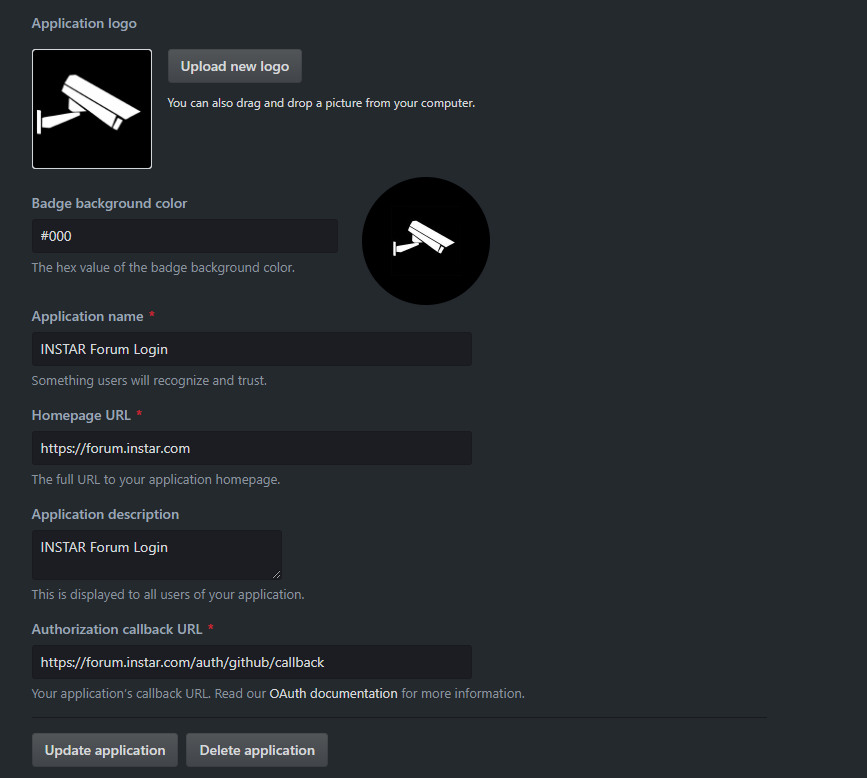
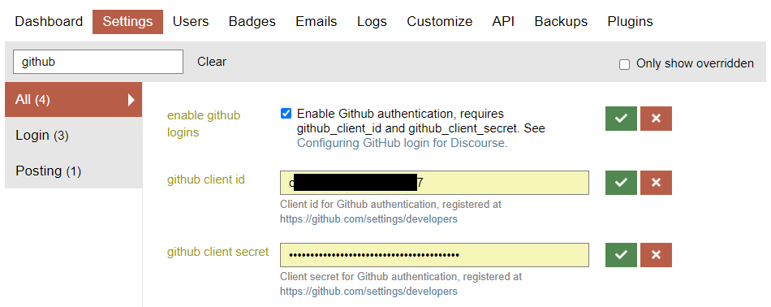

Go to the [Github Developer page](https://github.com/settings/developers), then look for OAuth Apps in the left menu. Select New OAuth App. Fill in the required fields:





Be sure to set the Callback URL to use the path `/auth/github/callback` at your site domain. e.g., `https://forum.instar.com/auth/github/callback`.


After creating your application, you should see the Client ID and Client Secret. Enter those in the Discourse fields:


```
github_client_id
github_client_secret
```


