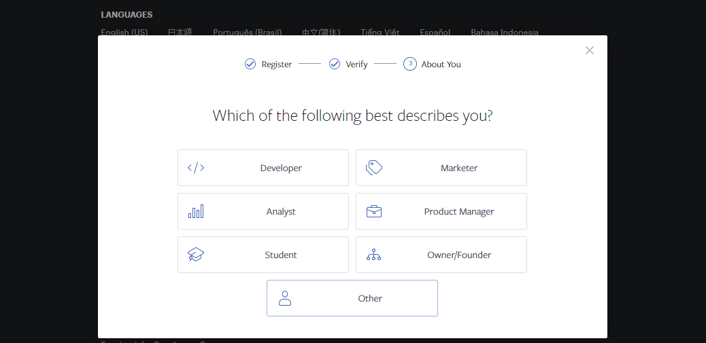
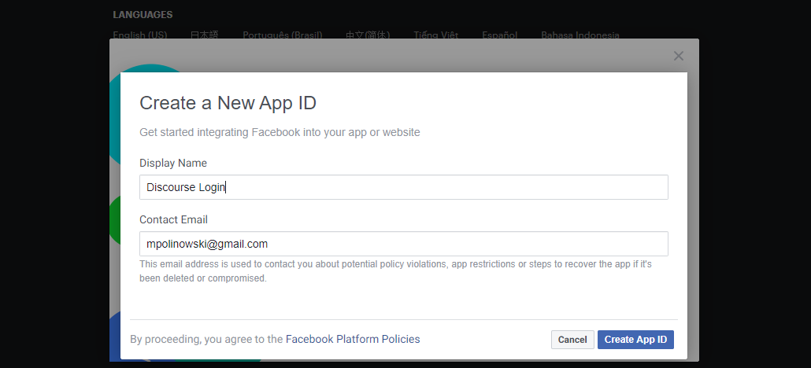
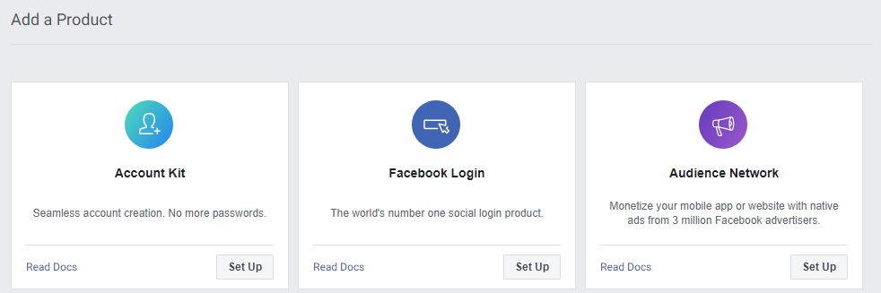
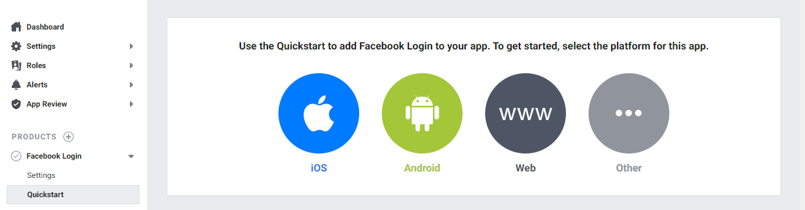
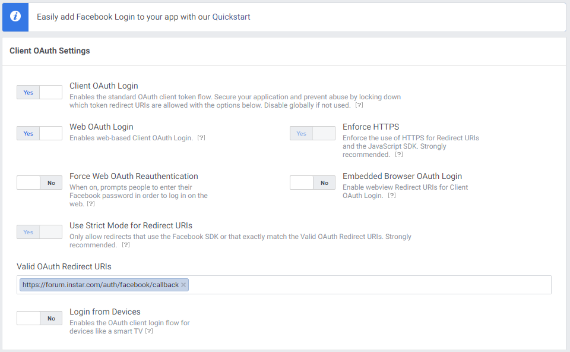
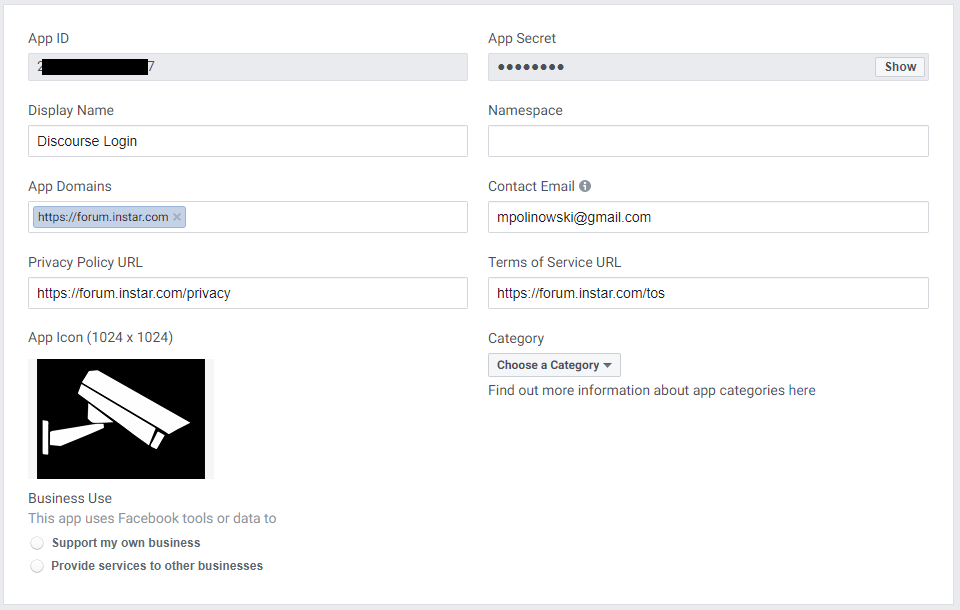
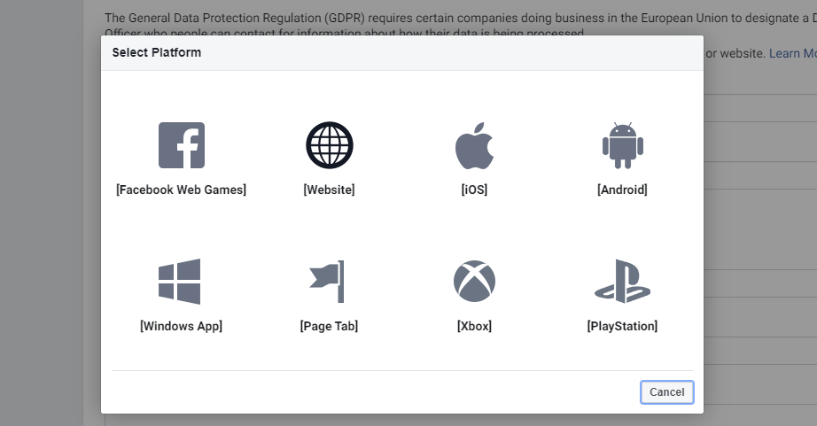
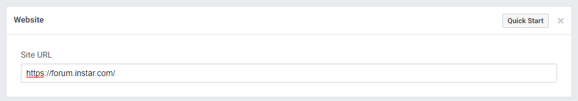
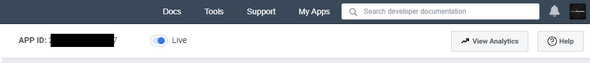
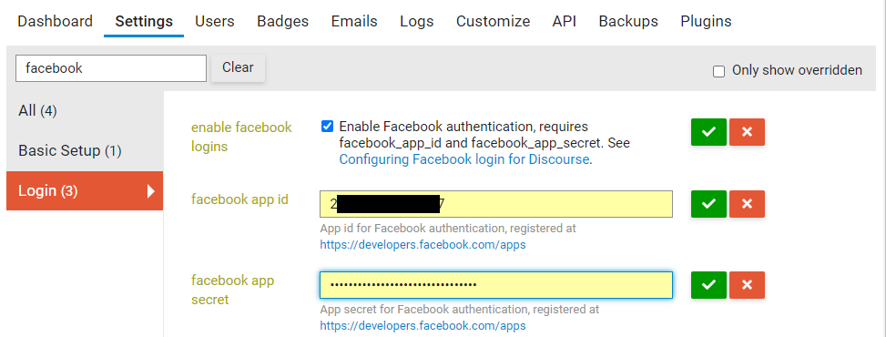

Go to the [Facebook Developer page](https://developers.facebook.com/apps) Login with the credentials of the account you want to connect to Discourse, click on __Get Started__ and follow the wizard:

Select Developer:

Provide a name for the app, for example `Discourse Login` and click on __Create App ID__:

Click Set Up below __Facebook Login__:

From the menu on the left, exit Quickstart by clicking on Settings under Facebook Login:

Setup the Valid OAuth redirect URI field, entering e.g. `https://forum.instar.com/auth/facebook/callback`:

Navigate to __Settings/Basic__, enter your Discourse URL (`https://forum.instar.com`) in the __App Domains__ field and also enter the URL for your Discourse site privacy policy and Terms of Service in the appropriate fields and also upload the icon of your site:

At the bottom of the page click on __+ Add Platform__ and select __Website__:

Enter your Discourse URL here, for example `https://forum.instar.com` and click __Save Changes__:

Click on the Status button to change your app from in development to public:

In Discourse site settings, enter your Facebook app’s __App ID__ and __App Secret__ in the `facebook_app_id` and `facebook_app_secret` fields:

