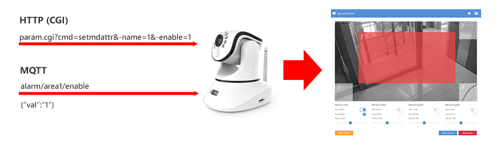
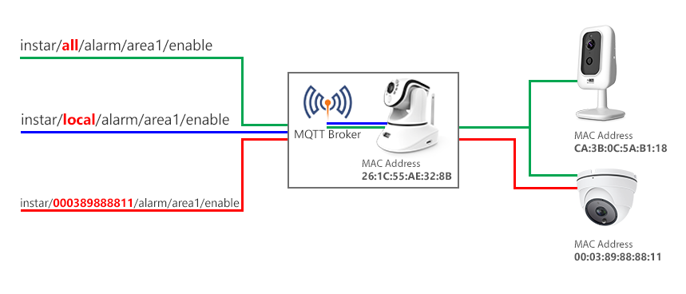
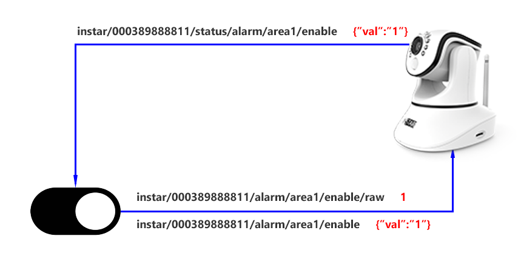

## The Interface

All camera functions of INSTAR Full HD cameras can be controlled through the HTTP/S CGI interface. But in the Smarthome and Internet-of-Things (IoT) realm there is another protocol that is widely in use and that offers a few advantages over the classic HTTP - this protocol is called MQTT (Message Queuing Telemetry Transport). Adding an MQTT interface to our Full HD cameras makes adding those cameras to an existing Smarthome - almost - too easy :)

In MQTT you control your camera by publishing updates to MQTT Topics. The value you want to update such a topic to is formatted in JSON and added to the Message Payload. So instead of sending a CGI command like `param.cgi?cmd=setmdattr&-name=1&-enable=$val` to either activate (val=1) or deactivate (val=0) Motion Detection Area 1 you publish this update to the topic alarm/area1/enable formatted like {"val":"1"} or {"val":"0"}.

### Addressing the right Camera

To make sure that this update is received by the correct device on your MQTT network, we first have to prefix the topic with instar - this makes sure that your camera will try to match the update to an internal function - like updating the state of an detection area. Secondly, we have to state what camera we want to address by either saying all to update all INSTAR cameras on your network or picking a specific one by it's MAC address, e.g. `000389888811`. You can find the MAC address of your camera under System/Overview - simply remove the colons, e.g. __00:03:89:88:88:11__.

If you want to address the camera that is running your MQTT broker, you can also use the prefix local instead. The complete topic will then look like this:

* `instar/all/alarm/area1/enable` - to address all INSTAR Full HD cameras on your MQTT network (all have to be connected to the same MQTT broker).
* `instar/000389888811/alarm/area1/enable` - to address a camera with the (LAN) MAC address __00:03:89:88:88:11__.
* `instar/local/alarm/area1/enable` - to address the cameras that runs the MQTT broker on your network.
You can find the allowed payloads for each MQTT topic in the table below. The second table below that displays the corresponding CGI command to each topic (if you are already familiar with the HTTP API and are looking for a specific command).

### Status, Command or Raw Topics

Once you update a __COMMAND__ Topic like `instar/000389888811/alarm/area1/enable` you will see that you receive an update on the __STATUS__ Topic `instar/000389888811/status/alarm/area1/enable` once you camera received the command and updated its settings.

If your application doesn't support sending command payloads in the JSON format, you can use the RAW Topic by adding raw to the end of the topic and use the value as a string directly:

* `instar/000389888811/alarm/area1/enable/raw` - the message payload here is simply either `1` or `0` instead of `{"val":"1"}` or `{"val":"0"}`.

## Update your first MQTT Topic

To update a topic you can use a desktop software like the MQTT Explorer or MQTT.fx for Windows, macOS or LINUX. Or one of the many available Smartphone Apps. These allow you to try out the MQTT API without the need of additional Hardware (Smarthome Gateways) and quickly debug your MQTT network.