<!-- TOC -->

- [Debugging MQTT Networks](#debugging-mqtt-networks)
  - [Windows and macOS Networks](#windows-and-macos-networks)
- [MQTT Explorer](#mqtt-explorer)
  - [Connect to your Cameras Broker](#connect-to-your-cameras-broker)
  - [Controlling your Camera](#controlling-your-camera)
- [MQTT.fx](#mqttfx)

<!-- /TOC -->

### Windows and macOS Software

There are plenty of free tools available that you can use to test a MQTT network and to keep an eye on all messages that are processed through it. This is extremely useful when connecting new clients. In the following we are going to take a look at two of these tools that are both available for Windows, macOS and Linux:

* [MQTT Explorer by Thomas Nordquist](http://mqtt-explorer.com)
* [MQTT.fx](https://mqttfx.jensd.de)

## MQTT Explorer

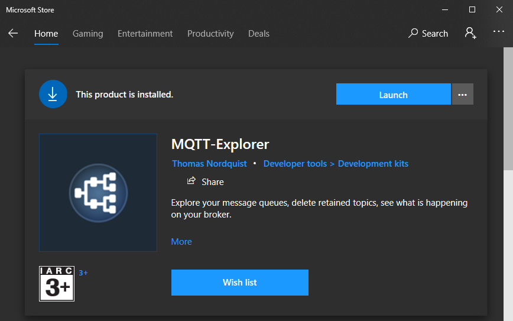

Once you [downloaded](http://mqtt-explorer.com), installed and started the app click on the __Plus__ icon in the top left to add your MQTT broker - in our case, our INSTAR Full HD camera.

### Connect to your Cameras Broker

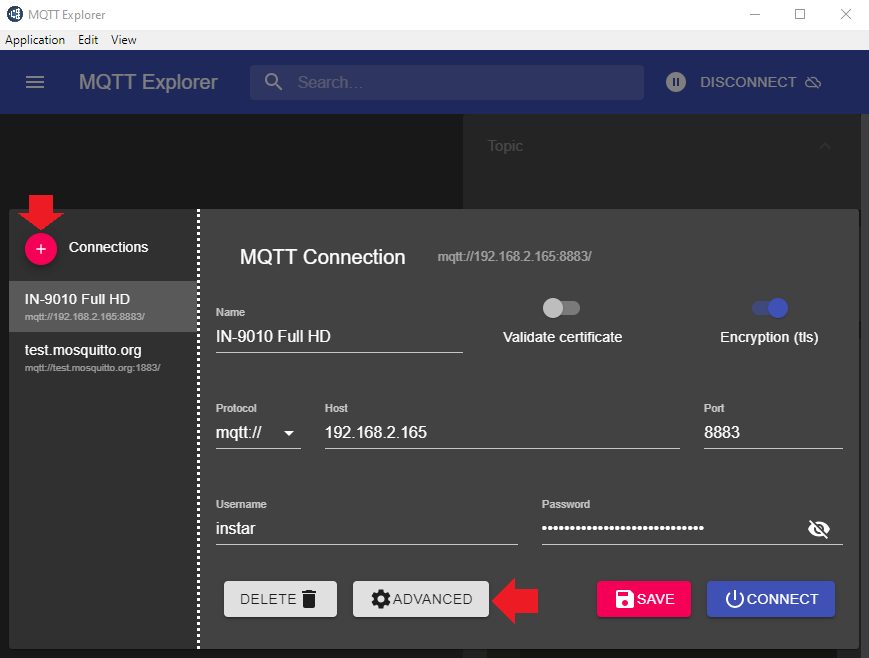

Type in your cameras local IP address as __Host__, e.g. `192.168.2.165`, with the __Port__ `8883` (with __Encryption (tls)__ enabled) or `1883`  (_without encryption_). The last line is your MQTT broker login that you have set in your cameras WebUI:

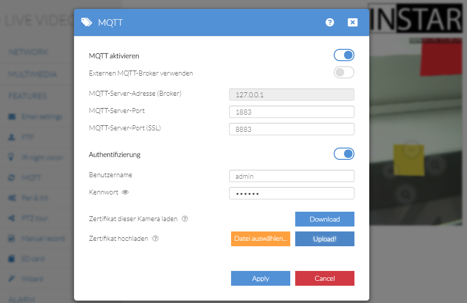

If you have chosen to use the __TLS Encryption__ you now have to click on __Advanced__ back inside the MQTT Explorer broker setup:

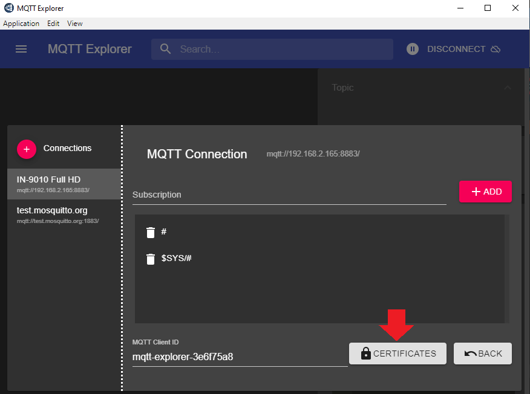

In the screenshot above you can see that we already have a wildcard (`#`) subscription by default. That means that once we connect to our MQTT Broker we will receive updates for every MQTT Topic that has been registered with the Broker.

In the following window click on __Client Certificate__ and select the __INSTAR Trusted Client Certificate__ that you can download from your cameras WebUI:

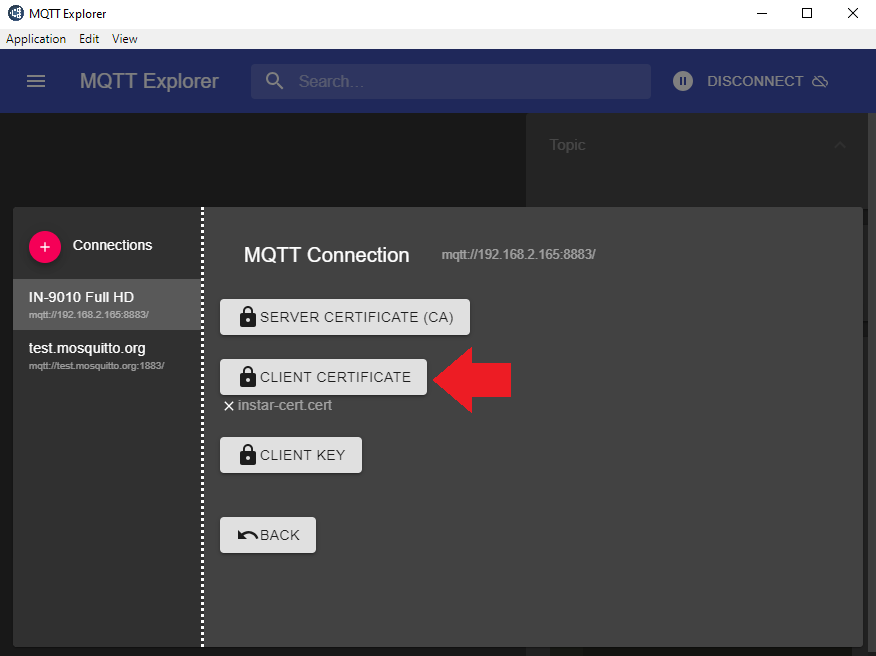

Once you uploaded the certificate you are able to connect to your MQTT broker. Click on __Back__ twice and then __Connect__:

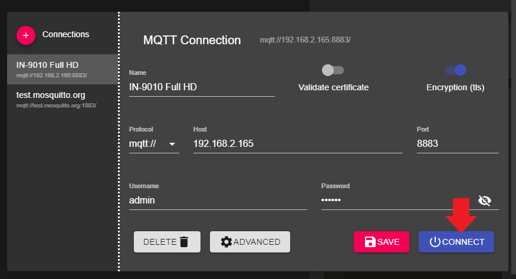

Once connected you are able to see all MQTT Topics that are registered with the server. The important once are `instar/all` and `instar/000389888811`, where the number __000389888811__ represents the MAC address of our camera and will be different on every camera you connect to.

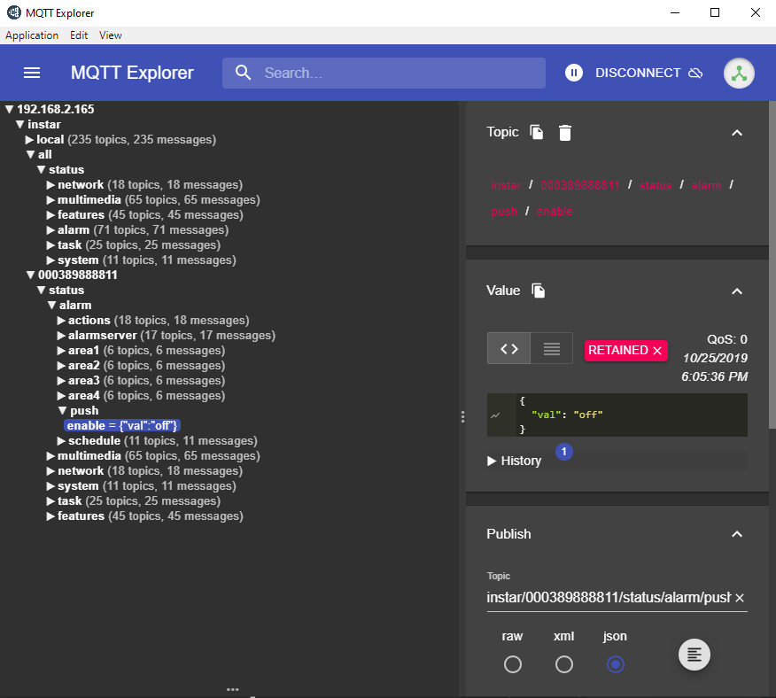

You can find your cameras MAC address by opening the web user interface and going to __System__ / __Overview__:

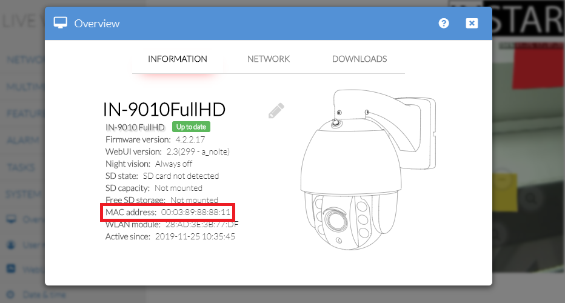

All topics under `instar/all` will affect all INSTAR Full HD cameras that are connected to your MQTT broker - if an topic is updated here all cameras will be switched accordingly.

All topics under `instar/000389888811` only affect the camera with the MAC address corresponding with the number __000389888811__. If you want to send a command to the camera that is running the active MQTT broker, you can either use the MAC address, or simply use the `instar/local` prefix instead.

### Controlling your Camera

To control your camera select a topic you want to update:

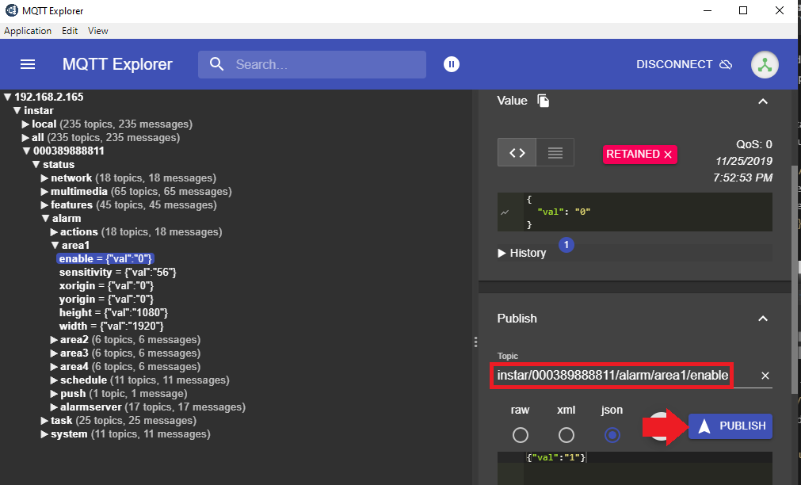

In this case we choose the topic `alarm/area1/enable` to activate the motion detection area 1 on our camera. Note that the topics that are listed on the left are the __STATUS topics__ that display the current status on our camera. In our example the topic is `instar/000389888811/status/alarm/area1/enable` and it's current value is `{"val":"0"}`. To update this status topic and activate our detection area we have to send an update to the __COMMAND Topic__. This is identical to the status topic minus the word _status_: `instar/000389888811/alarm/area1/enable`. Copy this command into the topic field and add the payload `{"val":"1"}` and hit __PUBLISH__:

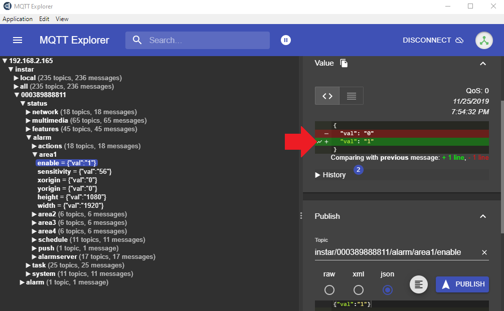

You can see that the __STATUS topic__ was updated to the value 1. When you open your cameras webUI you will also find that the detection area 1 is now active! Congratulations, you have successfully taken control over your camera using the MQTT interface.

## MQTT.fx

Once you [downloaded](https://mqttfx.jensd.de), installed and started the app click on the __Cog Wheel__ icon in the top center to add your MQTT broker - in our case, our INSTAR Full HD camera.

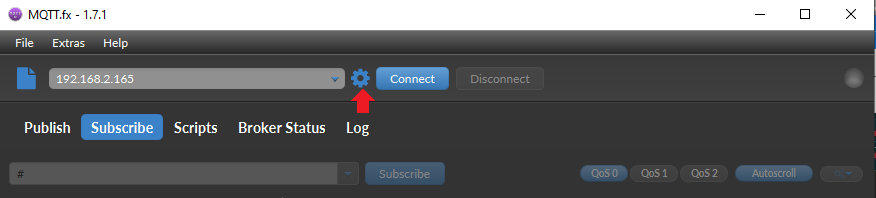

Choose the __MQTT Broker__ as __Profile Type__ and type in your cameras local IP address as __Broker Address__, e.g. `192.168.2.165`, with the __Broker Port__ `8883` (with __Encryption (SSL/TLS)__ enabled) or `1883`  (_without encryption_).

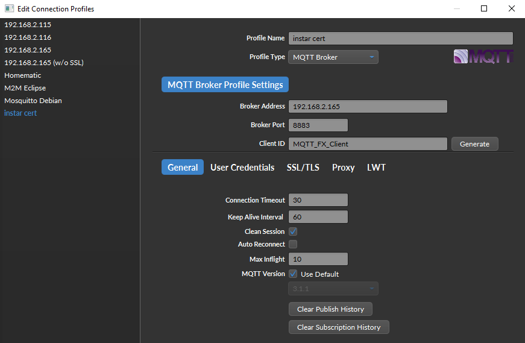

Under __User Credentials__ type in your MQTT broker login that you have set in your cameras WebUI:

If you have chosen to use the __TLS Encryption__ via __Broker Port__ `8883` you now have to switch to the __SSL/TLS__ tab:

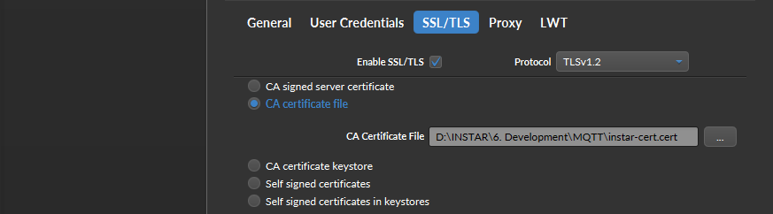

__Enable SSL/TLS__ and click on __CA Certificate file__ and select the __INSTAR Trusted Client Certificate__ that you can download from your cameras WebUI:

Click on __Ok__ and back on the main Window select the broker you just set up and click on __Connect__:

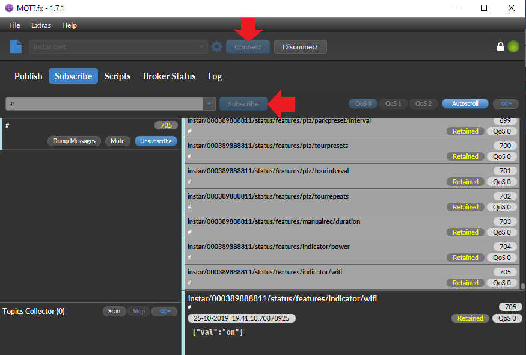

By typing `#` into the input field and clicking on __Subscribe__ inside the __Subscribe__ tab you get a wildcard subscription for all MQTT topics that are registered on your MQTT broker.

You can also use the __Publish__ tab to update a MQTT topic and switching the corresponding function on your camera.

For example the topic `instar/000389888811/alarm/area1/enable`, where the number __000389888811__ represents the MAC address of our camera and will be different on every camera you connect to, can have the payload `{"val":"1"}` or `{"val":"0"}` to either switch the alarm detection area 1 __on__ or __off__.

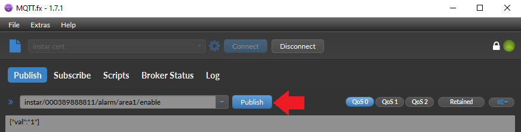

Switching back the __Subscribe__ tab shows you that your MQTT broker received your topic update for `instar/000389888811/alarm/area1/enable`, your camera received the command to switch on the alarm detection area on and in turn updated the topic `instar/000389888811/status/alarm/area1/enable` with the new status the camera is now in:

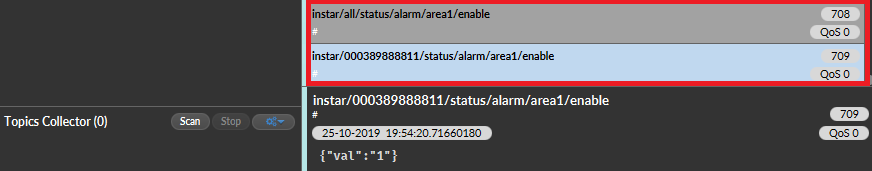