<!-- TOC -->

- [MQTT Dash (IoT, Smarthome)](#mqtt-dash-iot-smarthome)
- [Mqtt Dashboard IoT and Node-RED controller](#mqtt-dashboard-iot-and-node-red-controller)

<!-- /TOC -->

There are a couple of MQTT apps available on the [Google Play Store](https://play.google.com/store/apps/collection/cluster?clp=ggEGCgRNUVRU:S:ANO1ljJ06xs&gsr=CgmCAQYKBE1RVFQ%3D:S:ANO1ljJL5rU) that allow you to control your INSTAR Full HD IP camera.

They all offer, more or less, the same functions and similar interfaces. In the following we are going to take a look at two of them - the [MQTT Dash (IoT, Smarthome)](https://play.google.com/store/apps/details?id=net.routix.mqttdash) and [MQTT Dashboard - IoT and Node-RED controller](https://play.google.com/store/apps/details?id=com.app.vetru.mqttdashboard).

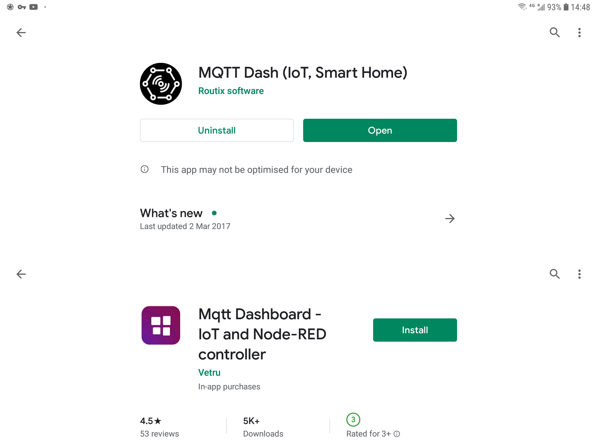

## MQTT Dash (IoT, Smarthome)

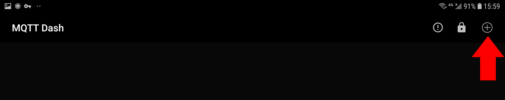

Once you [downloaded](https://play.google.com/store/apps/details?id=net.routix.mqttdash), installed and started the app click on the __Plus__ icon in the top right to add your MQTT broker - in our case, our INSTAR Full HD camera.

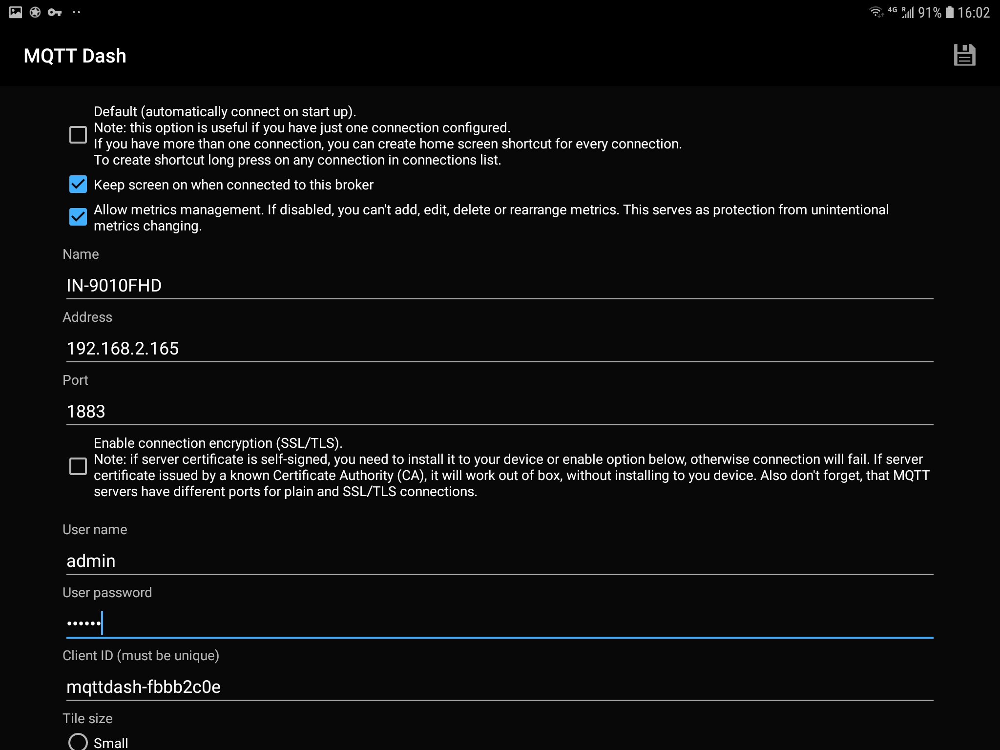

First, name your broker and type in the IP address of your camera. The default port to communicate with the MQTT Broker on your camera is __1883__. Add the username and password you set for your broker.

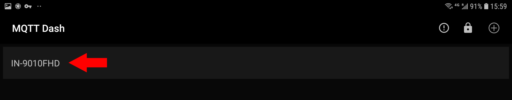

Once you saved your settings you will now see your new broker on the frontpage of your dashboard. Select it to continue.

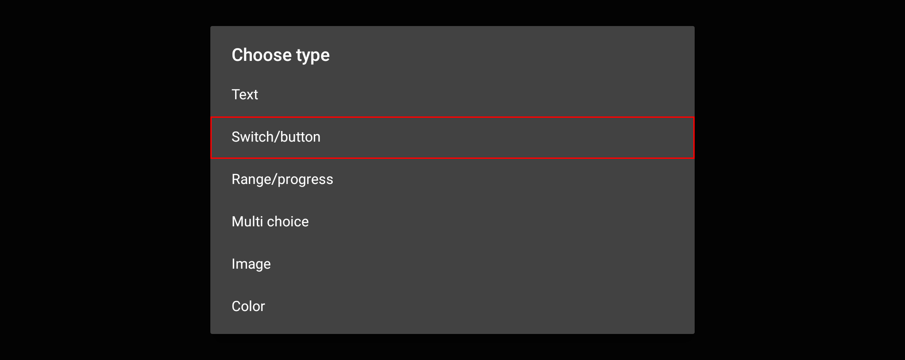

We can now add an UI element to interact with our camera. In this first example we will choose a __Switch/Button__.

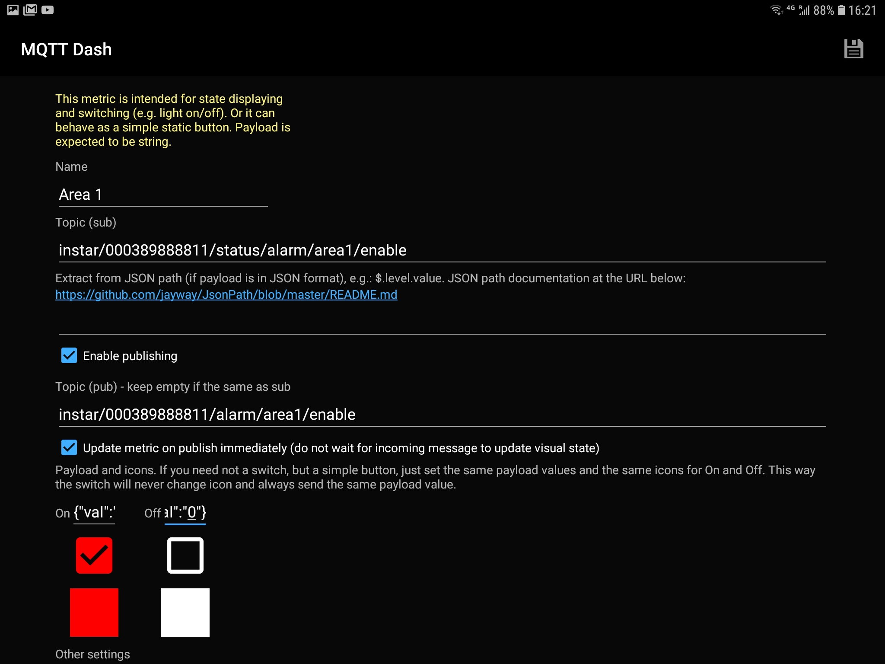

After naming your switch, you have to add the MQTT Topic that you want to update every time the switch is used. In this case we choose to activate/deactivate the __Alarm Area 1__ of our camera. The corresponding MQTT Topic for this function is `alarm/area1/enable`. To access this topic on our broker we have to add the keyword `instar` and the __LAN MAC Address__ of our camera - in my case this is `000389888811` (you can find your cameras LAN MAC address in the Web User Interface.

Now we have to __subscribe__ to the __Status Topic__ and __publish__ Updates to the __Command Topic__ (every time an topic is updated and the function on our camera triggered we receive an status update from MQTT broker to see that everything had worked.) The resulting topics look the following:

* __Command Topic__: `instar/000389888811/alarm/area1/enable` (_for publishing_)
* __Status Topic__: `instar/000389888811/status/alarm/area1/enable` (_for subscriptions_)

In some cases we have to use a different __Command Topic__ that allows us to send the message payload raw, without the JSON formating. So we are just sending `1` as the message payload instead of the `{"val":"1"}`. For this we have to add `raw` to the topic that we want to update:

* __Command Topic__ (RAW): `instar/000389888811/alarm/area1/enable/raw` (_for publishing_)

The switch now can have 2 states - the area 1 is either active or not. You can check what values are available for a specific MQTT topic in our MQTT API documentation. The topic `alarm/area1/enable` can either be `{"val":"0"}` or `{"val":"1"}`. We have to assign the first one to the _OFF State_ of our switch and the second to the _ON State_.

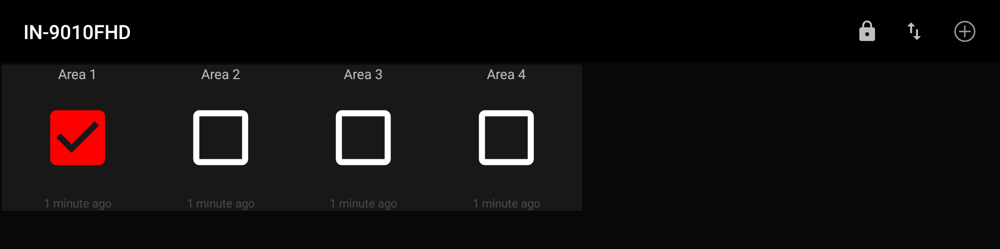

Save those settings and repeat it for all 4 areas (Tip: press & hold the switch for area 1 to clone it 3 times. Now you just have to edit each clone and replace every `area1` with the `area2`, `area3` or `area4`, respectively).

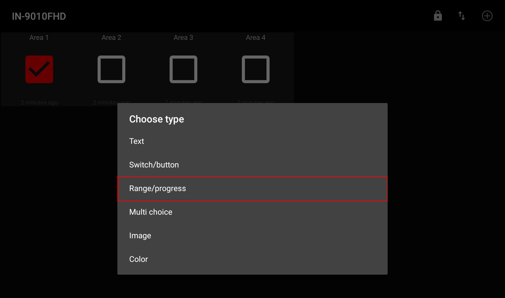

To show a different UI element we now want to add the alarm detection area __Sensitivity__ to our UI. For this click on __Plus__ and select __Range/progress__.

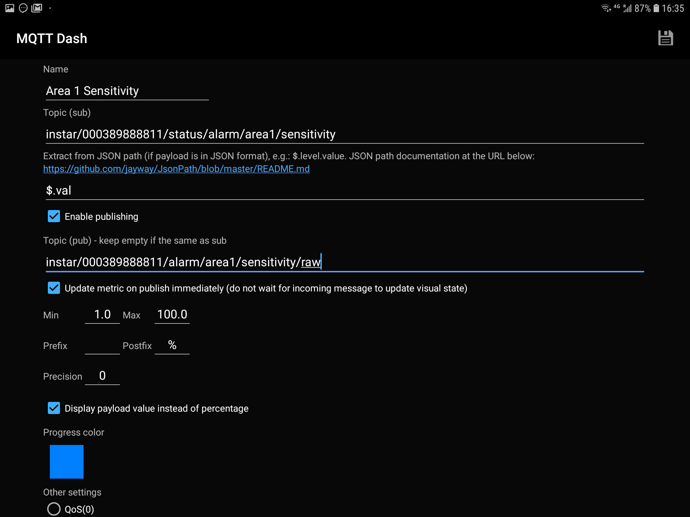

The sensitivity can be accessed by the MQTT Topic `alarm/area1/sensitivity`. The value here can be between `{"val":"1"}` and `{"val":"100"}`. To extract the number from this JSON expression we have to define the __JSON Path__ `$.val`. Now add the minimal (1) and maximal (100) value and make sure that precision is set to `0`!

Note that we are using the Status Topic `instar/000389888811/status/alarm/area1/sensitivity`, that will give use the current state in the JSON format. For the Command Topic we have to use `instar/000389888811/alarm/area1/sensitivity/raw` - the __raw__ at the end means that we are able to send our data non-JSON formated.

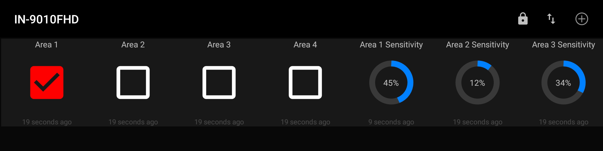

After saving your settings you can now again clone the UI element for all 4 areas.

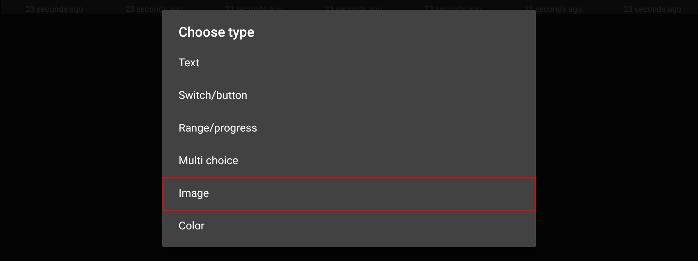

In a last step we can now add our cameras live image to our dashboard.

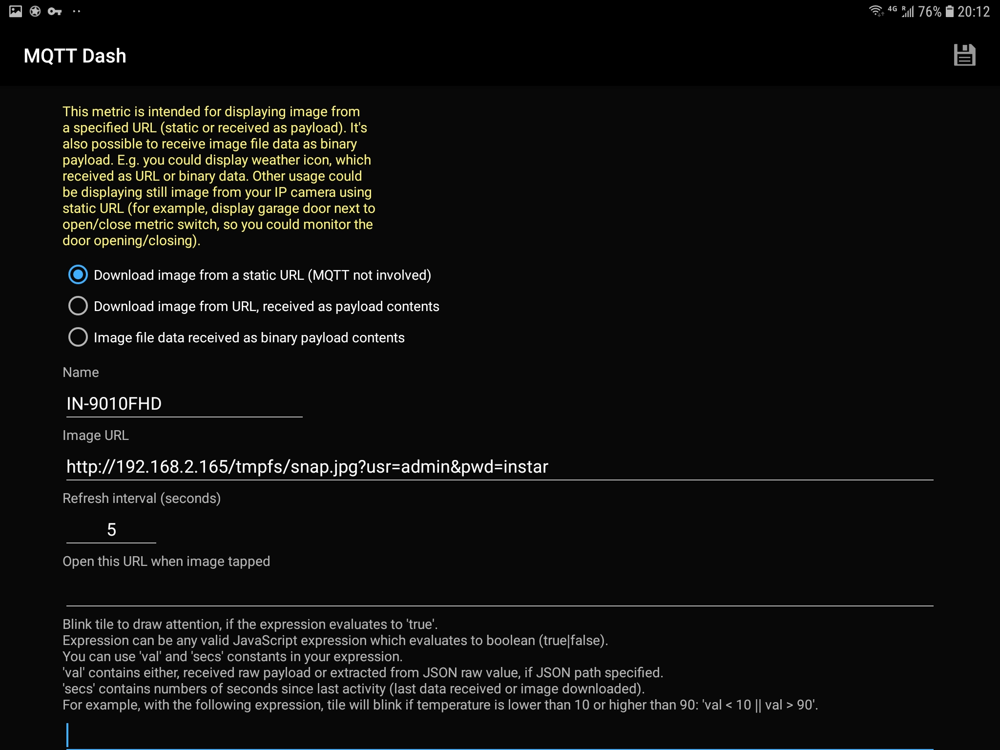

Here we simply have to add our cameras snapshot path (just add your IP address and camera login):

* `http://IP-Address:Port/tmpfs/snap.jpg?usr=admin&pwd=instar` Snapshot (1080p)
* `http://IP-Address:Port/tmpfs/auto.jpg?usr=admin&pwd=instar` Snapshot (320p)
* `http://IP-Address:Port/tmpfs/auto2.jpg?usr=admin&pwd=instar` Snapshot (160p)

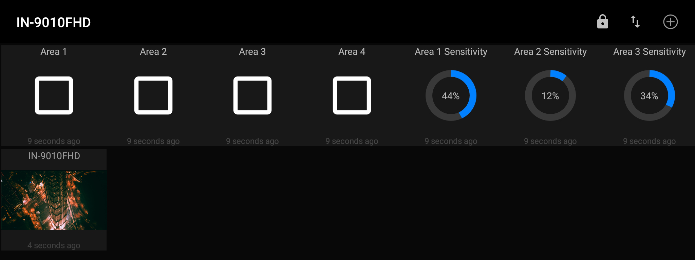

After setting the update interval and saving your settings, you should now be able to see your cameras live image on your MQTT dashboard. If you don't like the arrangement of the UI elements on your dash, click on the lock icon in the top right. When unlocked, you are able to rearrange each element.

## Mqtt Dashboard IoT and Node-RED controller

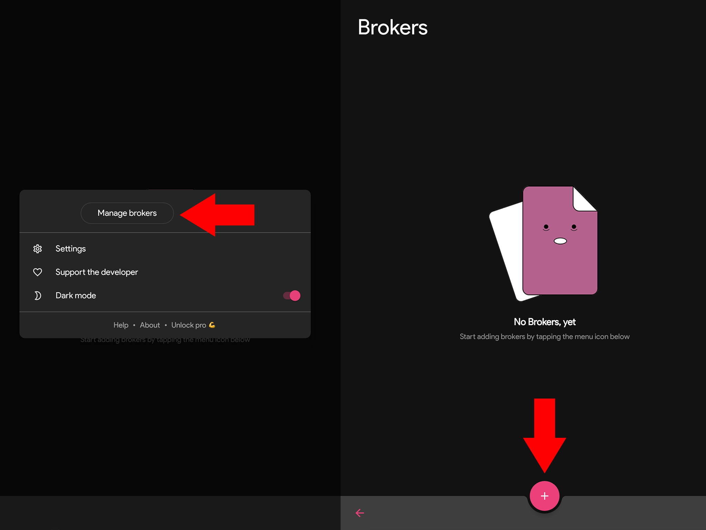

As mentioned above, the functions as well as the UI of all those MQTT apps is very similar. Just click to add your broker.

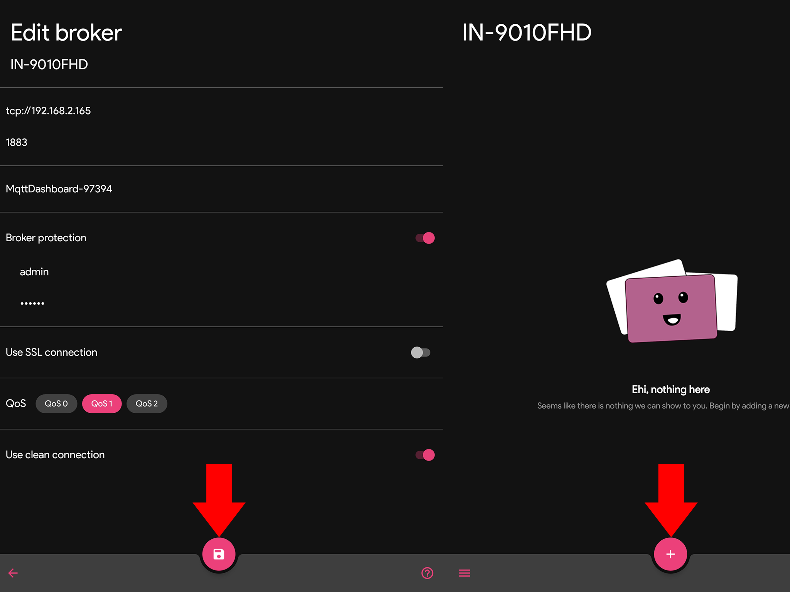

Add your cameras MQTT service.

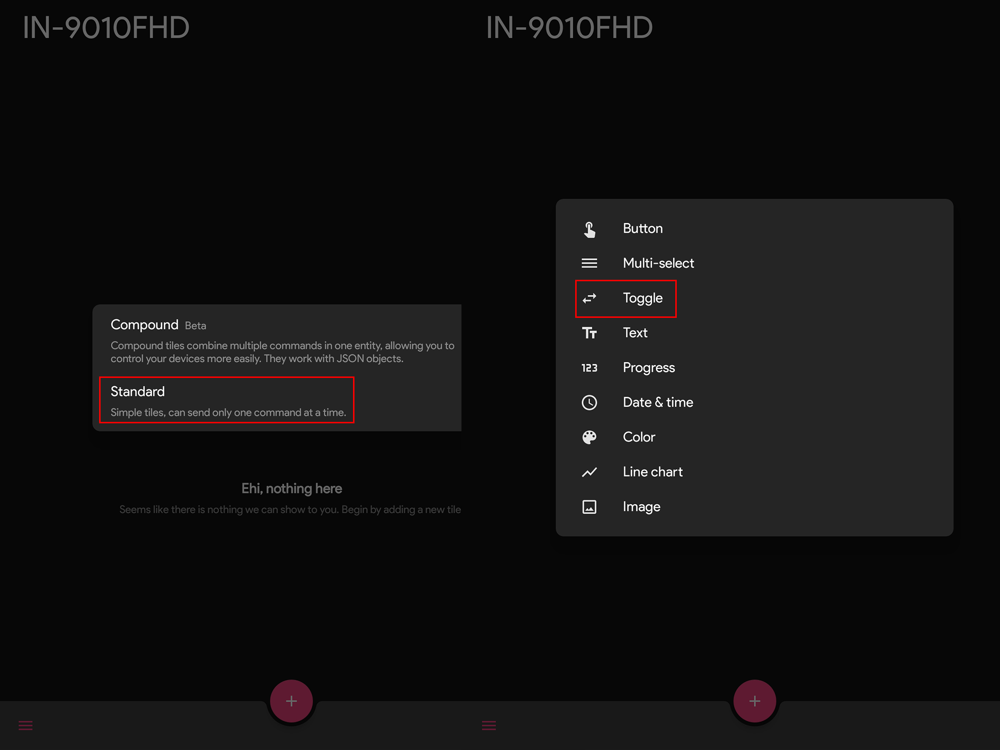

Now add a switch (__Toogle__) to switch on/off your cameras alarm areas.

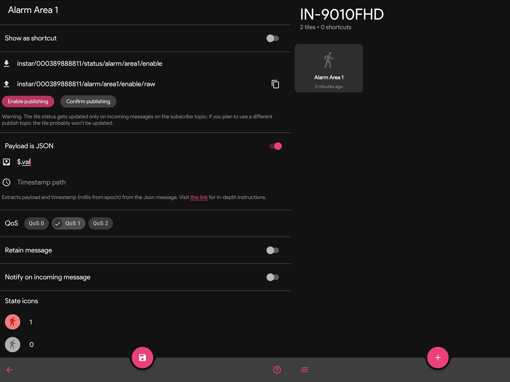

Add the MQTT Topic and the available values this switch can have.

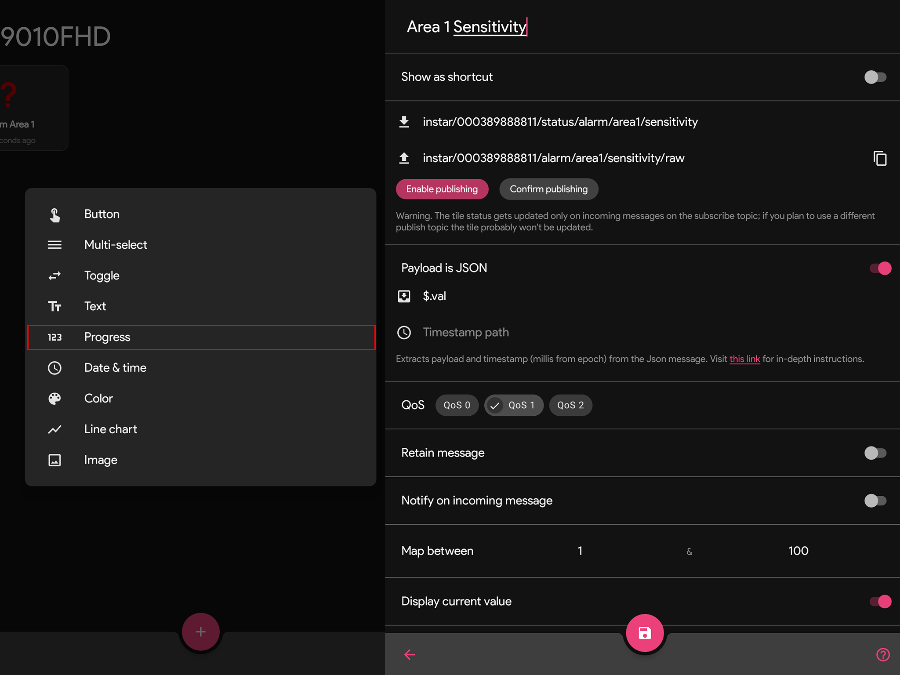

For the Area sensitivity we can use the __Progress__ UI element. And again, add the MQTT Topic and the available values this switch can have.

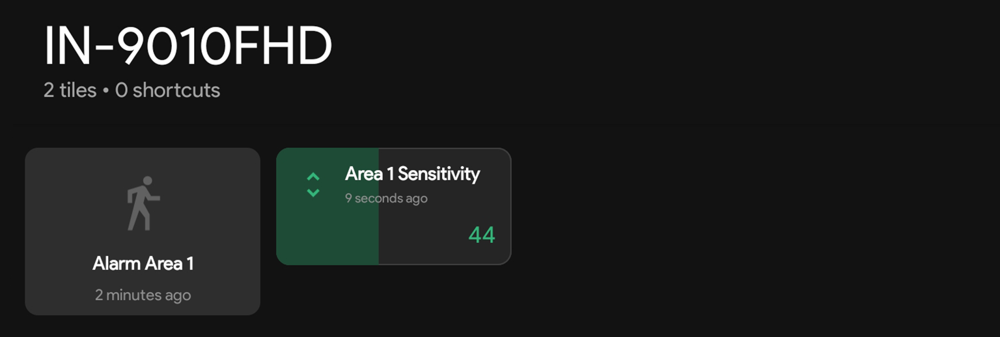