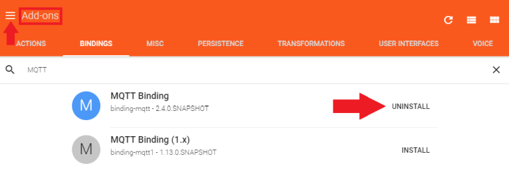
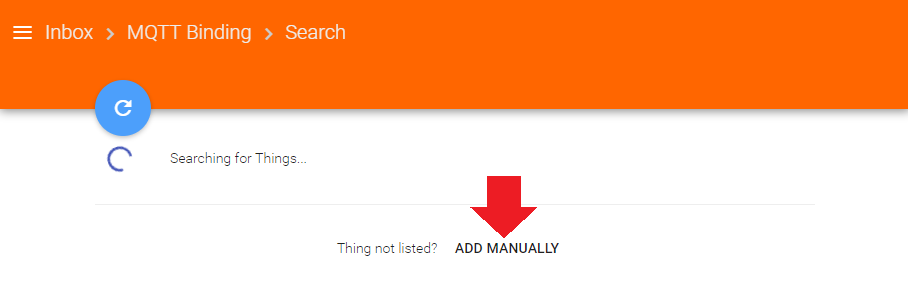
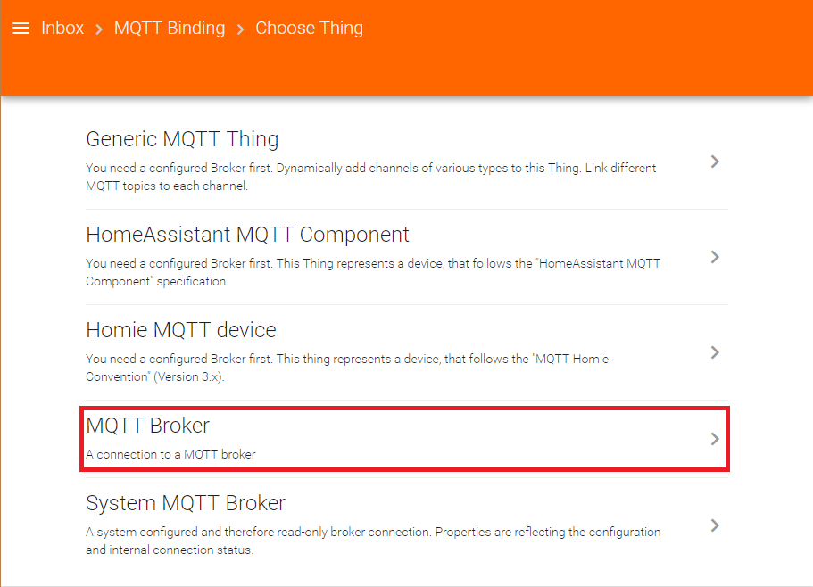
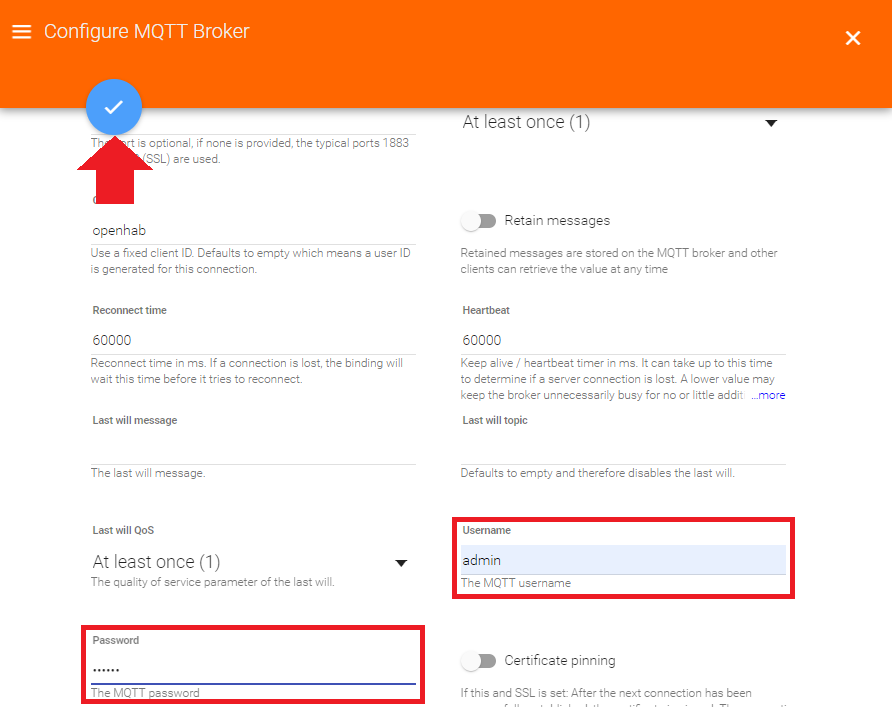
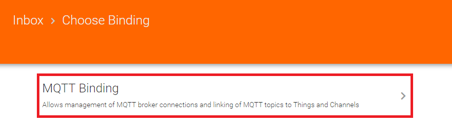
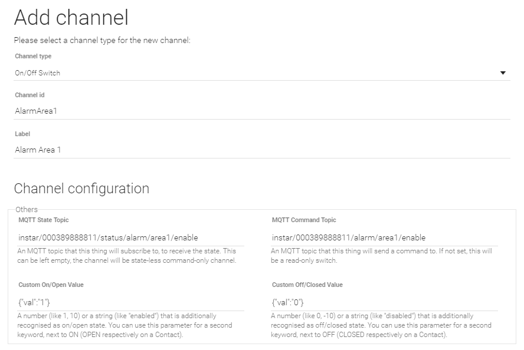
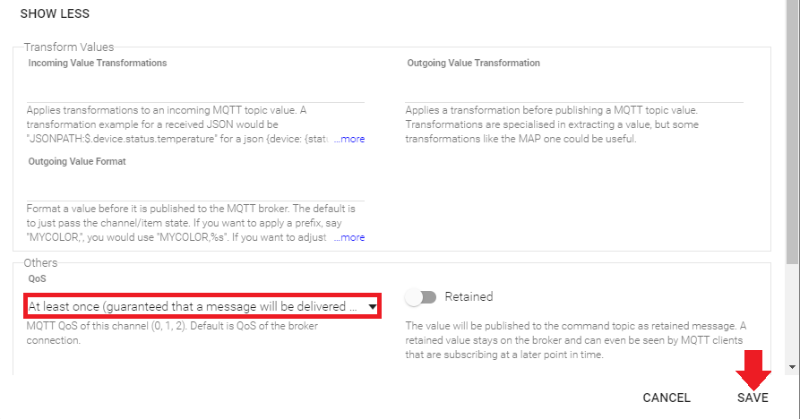

<!-- TOC -->

- [OpenHAB Configuration though Paper UI](#openhab-configuration-though-paper-ui)
  - [MQTT Binding](#mqtt-binding)

<!-- /TOC -->

## OpenHAB Configuration though Paper UI

The Paper UI is a new interface that helps setting up and configuring your openHAB instance. It does not (yet) cover all aspects, so you still need to resort to textual configuration files.

__Add-on management__: Easily install or uninstall [openHAB add-ons](https://www.openhab.org/docs/configuration/%7B%7Bdocu%7D%7D/addons/uis/paper/readme.html):

### MQTT Binding

Go to the __Add-Ons__ Menu and click on the __Bindings Tab__. We are going to use the MQTT protocol to communicate with our INSTAR IP camera from OpenHAB. To be able to connect to the [INSTAR MQTT Server](https://wiki.instar.com/Advanced_User/INSTAR_MQTT_Broker) we need to install the [MQTT Binding](https://www.openhab.org/addons/bindings/mqtt/) - make sure that you choose the __Version 2__ (at the moment of writing this is the _2.5.0_ version).

---

---

Now switch to your OpenHAB Inbox:

---

---

Click on the __+__ icon to add the MQTT Binding:

---

---

Find the MQTT Binding inside the list and select it:

---

---

Click on __Add Manually__:

---

---

And choose the __MQTT Broker__:

---

---

Add your brokers IP address and the broker port - by default this is __1883__. Note that we are first not going to use [TLS encryption](https://community.openhab.org/t/mqtt-binding-and-ssl/40622). We can add it once we are able to establish the connection:

---

---

Your INSTAR Full HD cameras MQTT login is the one you added in the [MQTT Menu](https://wiki.instar.com/Advanced_User/INSTAR_MQTT_Broker/). Then save your setting by clicking on the blue confirmation button:

---

---

Back in the __Things Menu__ click on __+__ again - this time to add a __Thing__ that we can use for an _PaperUI_ button later on:

---

---

Click on __MQTT Binding__:

---

---

And __Add Manually__:

---

---

This time we need to add a __Generic MQTT Thing__:

---

---

I am going to create switch that activates or deactivates the alarm areas of an INSTAR IN-8015FHD camera. The `Thing ID` represents the MQTT topic that we will have to address to send the command to the selected camera. As __Bridge__ you need to select the MQTT broker you just created. Click on the blue button to confirm:

---

---

Back in the __Thing Menu__ click to edit the __Thing__ you just created:

---

---

Click on the blue __+__ button to add a __Channel__ to the __Thing__:

---

---

I am going to use an __ON/Off Switch__. The MQTT topic to go to switch the first alarm area is created by adding the prefix `instar` and your cameras [LAN MAC Address](https://wiki.instar.com/Web_User_Interface/1080p_Series/System/Info/) (e.g. `00:03:89:88:88:11` - without the colons) to the corresponding [INSTAR MQTT topic](https://wiki.instar.com/Advanced_User/INSTAR_MQTT_Broker/) `alarm/area1/enable` -> `instar/000389888811/alarm/area1/enable` for the __COMMAND Topic__ and as message payload we need to add `{"val":"1"}` and `{"val":"0"}` to either switch the area on or off. To set the state of our switch, we can use the __STATUS Topic__ `instar/000389888811/status/alarm/area1/enable`:

---

---

In the expanded settings we have to set up the Quality-of-Service `QoS` to deliver every update __At-least-once__. Now click on Save to continue.

By clicking on the blue icon in front of the created channel we are now able to link it to a switch in the __OpenHAB PaperUI__:

---

---

Click on __Create new item...__:

---

---

Click on __Link__:

---

---

You can now click on __Control__ to open the __PaperUI__:

---

---

Our Alarm Areas can now be switched from the OpenHAB __Paper UI__. Clicking the switch will send the MQTT message to our MQTT server that is going to notify our camera to either switch [ area 1 on or off](https://wiki.instar.com/Web_User_Interface/1080p_Series/Alarm/Areas/).

All right that's it - the Binding was successfully added and we are now able to control all of our camera functions with the MQTT interface.