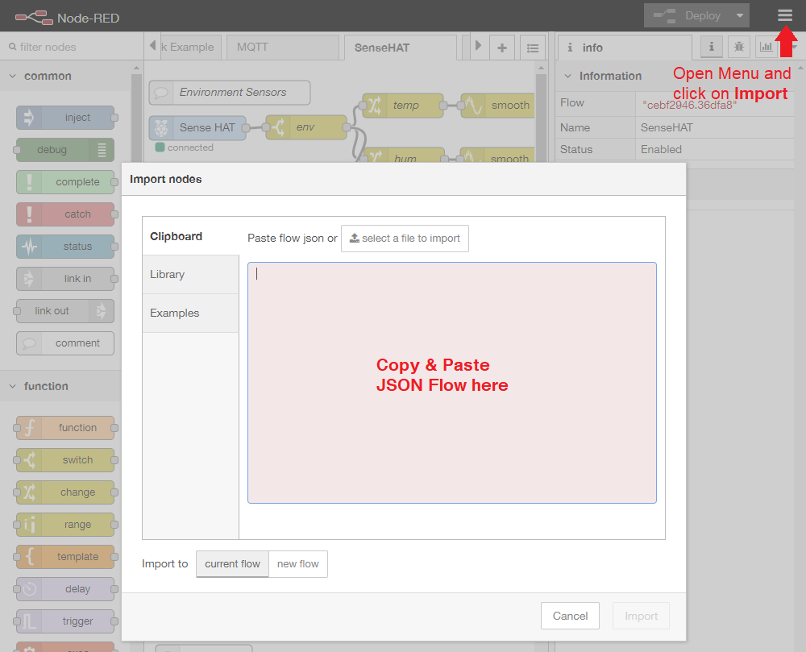
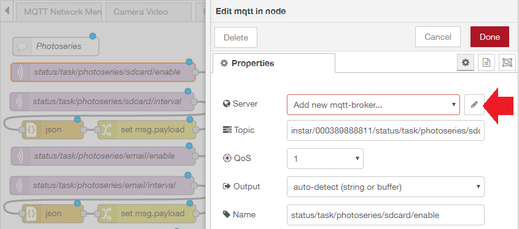
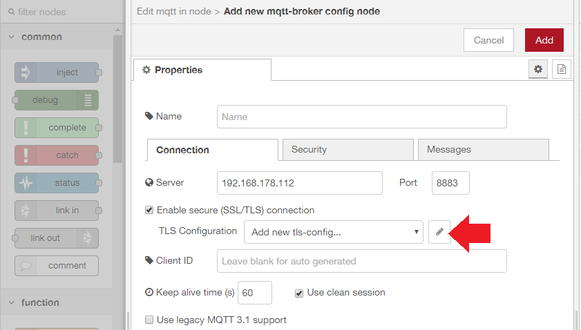
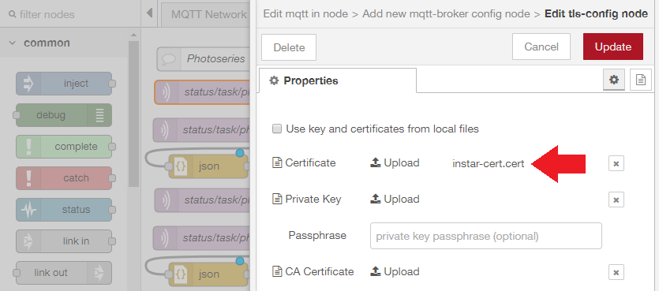
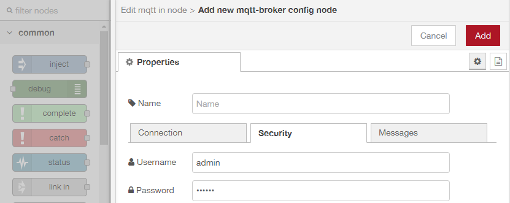
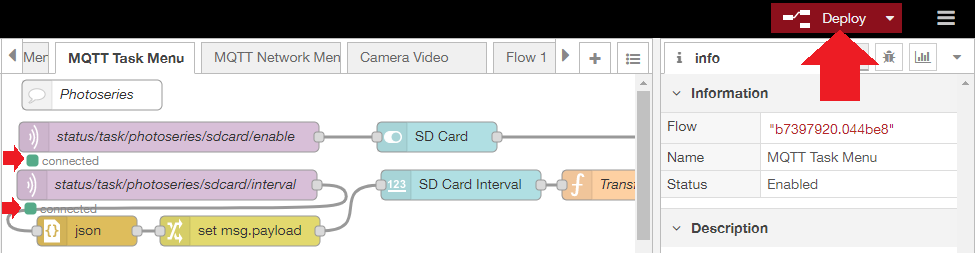
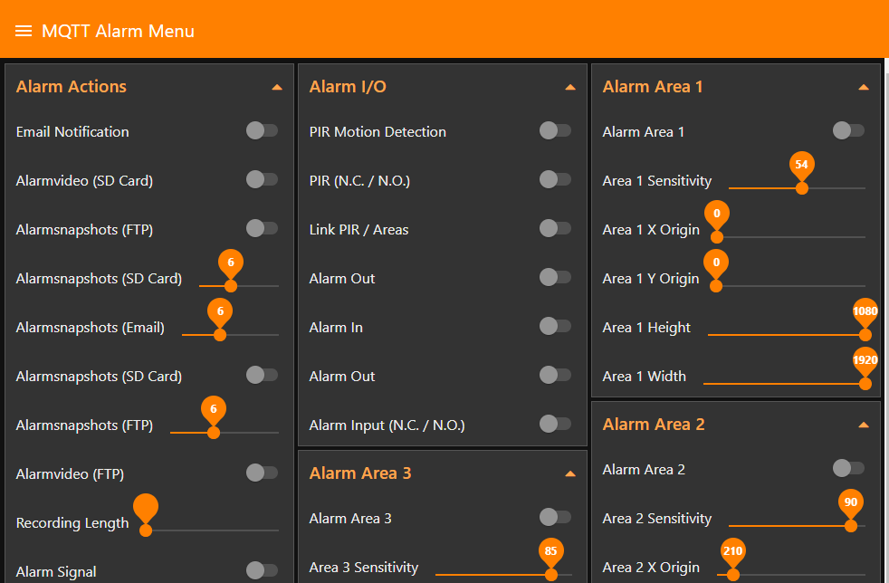

import GifContainer from "../../src/components/ImageContainer";

<!-- TOC -->

- [Node-RED Configuration](#node-red-configuration)
  - [Node-RED JSON Flows](#node-red-json-flows)
- [Node-RED User Interface](#node-red-user-interface)

<!-- /TOC -->

## Node-RED Configuration

We prepared Node-RED flows for you that give you access to all camera functions through the MQTT Broker. All you need to do, is to click on the flow you want to use ([see below](#node-red-json-flows)), copy it and paste it into the Node-RED import dialogue:

---

---

### Node-RED JSON Flows

* [Alarm Menu](https://wiki.instar.com/Node-RED_Flows/MQTT-alarm-menu.json)
* [Features Menu](https://wiki.instar.com/Node-RED_Flows/MQTT-features-menu.json)
* [Multimedia Menu](https://wiki.instar.com/Node-RED_Flows/MQTT-multimedia-menu.json)
* [Network Menu](https://wiki.instar.com/Node-RED_Flows/MQTT-network-menu.json)
* [System Menu](https://wiki.instar.com/Node-RED_Flows/MQTT-system-menu.json)
* [Recording Task Menu](https://wiki.instar.com/Node-RED_Flows/MQTT-task-menu.json)

__Note__: It makes sense to delete every sequence inside those flows that you are not going to use.

Now double-click the first MQTT Node (the first on the left) and assign your INSTAR MQTT Broker to Node-RED:

---

---

Type in your camera's IP address as MQTT Server. Choose the MQTT Server Port that you have set in the MQTT Menu inside your camera's WebUI - the default value is `1883`.

---

---

If you want to use the TLS encryption, choose the SSL Port instead - default is `8883`. Now you have to open your camera's MQTT Menu and download the Certificate (Client Key). And upload the certificate to Node-RED and save it:

---

---

Now add the user login that you have set up in the MQTT Menu:

---

---

Click on add to add the INSTAR MQTT Broker to Node-RED and make sure that every MQTT Node of the flow is using the broker. After clicking on __Deploy__ all MQTT Nodes should show that they successfully connected:

---

---

## Node-RED User Interface

You are currently using the Node-RED admin panel under an URL looking something like this: `http://<IP Address>:1880/#flow/b7397920.044be8`. To switch to the Node-RED dashboard simply add a __ui__ to the end of it like `http://<IP Address>:1880/ui/`:

---

---

Every flow that you have imported above will be on it's own board. Clicking on toggles and swiping sliders allows you to change the settings on your camera.

__Note__ that the changes happen instantly, but some settings require a restart of your camera to become active - e.g. when changing a camera port, WDR settings, etc. As the WebUI is using the HTTP interface changes will not be reflected there unless you reload the menu.

<GifContainer gifUrl="/assets/gif/Node-RED_MQTT_Camera_05.gif" alt="Node-RED with your INSTAR IP Camera" />