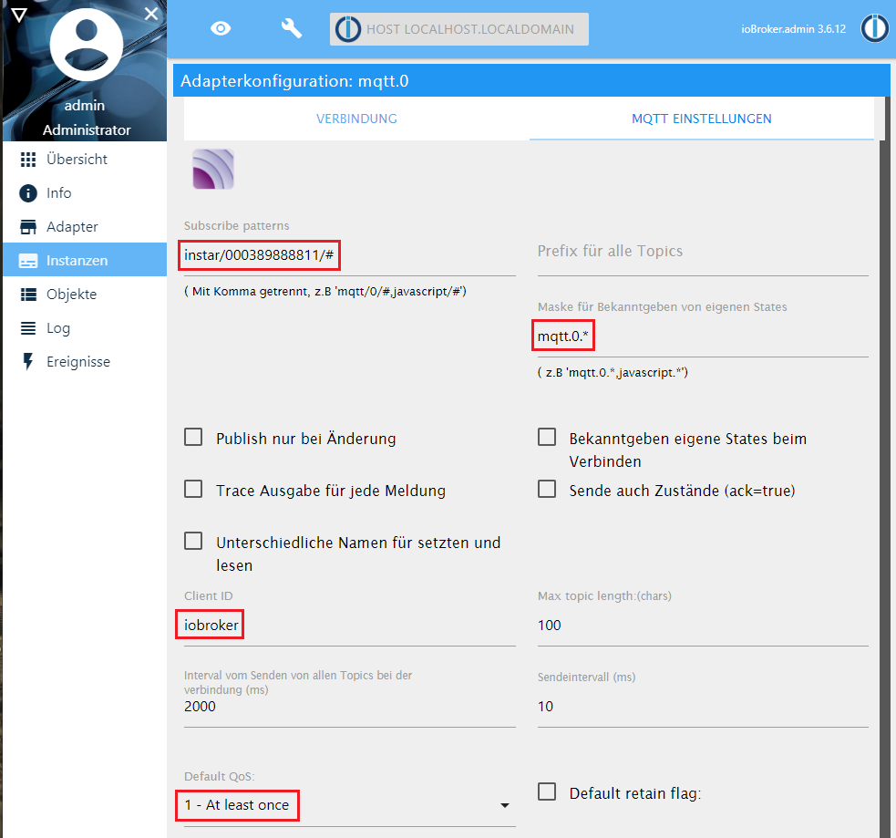
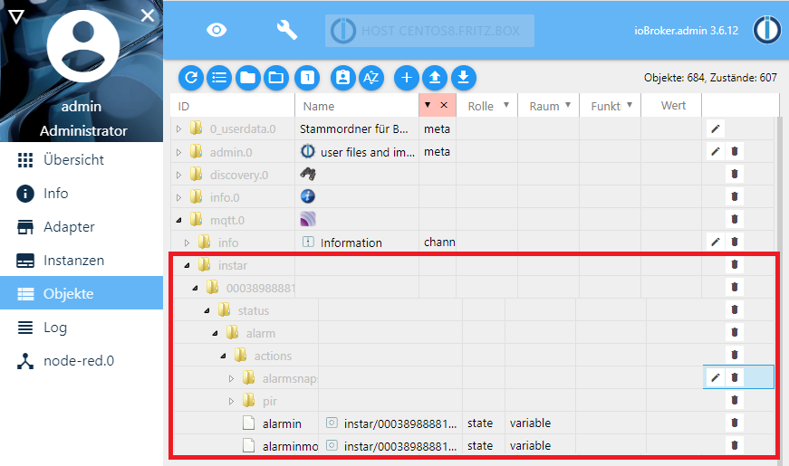

import GifContainer from "../../src/components/ImageContainer";


<!-- TOC -->

- [Install ioBroker on CentOS 8](#install-iobroker-on-centos-8)
  - [Setting up Node.js](#setting-up-nodejs)
  - [ioBroker Install Script](#iobroker-install-script)
- [Connecting to the MQTT Broker](#connecting-to-the-mqtt-broker)
  - [Node-RED Adapter](#node-red-adapter)
    - [Example Flow](#example-flow)
  - [MQTT Adapter](#mqtt-adapter)
- [Visualization](#visualization)
  - [JSON Flow for Node-RED](#json-flow-for-node-red)
- [Live Video](#live-video)
- [Alarmserver and Webhooks](#alarmserver-and-webhooks)
  - [Contact ioBroker when your Camera triggers an Alarm](#contact-iobroker-when-your-camera-triggers-an-alarm)

<!-- /TOC -->


## Install ioBroker on CentOS 8

If you are are running a different system, please follow the [official documentation](https://github.com/ioBroker/ioBroker/wiki/Installation) to help you getting started.


### Setting up Node.js

We will start by installing [ioBroker](https://github.com/ioBroker/ioBroker/wiki/Installation) on with the [official Install Script](https://www.iobroker.net/#en/download) inside [Node.js v10](https://nodejs.org/en/).


Running `yum module list nodejs` tells us what version of Node.js will be installed by default. The output - as shown below - shows us that we will get __Version 10__.


```bash
CentOS-8 - AppStream
Name         Stream       Profiles                                    Summary                
nodejs       10 [d]       common [d], development, minimal, s2i       Javascript runtime     

Hint: [d]efault, [e]nabled, [x]disabled, [i]nstalled
```


So all we need to do is running the following command to set up our environment:


```bash
yum module install nodejs
```


### ioBroker Install Script

Now all you need to do is to run the following script:


```bash
curl -sL https://iobroker.net/install.sh | bash -
```


---


---


After the script finishes you will be able to access the ioBroker interface on your servers IP address with the port `8081`:


---


---


## Connecting to the MQTT Broker

ioBroker offers a couple of adapters that you can use to connect the software to your camera's MQTT interface. A few examples are:


### Node-RED Adapter

You can [install Node-RED](https://github.com/ioBroker/ioBroker.node-red/blob/master/README.md) as a adapter directly from the ioBroker UI:


---


---


You can set the Node-RED webserver port - default `1880`, a user login for the interface and a URL root path, e.g. `/nodered`:


---


---


The Node-RED adapter should be up and running after saving your settings:


---


---


Now you can access the Node-RED UI via your servers IP address, with the port, root URL and the login that you set earlier - e.g. `http://192.168.2.111:1880/nodered/`:


---


---


#### Example Flow

Start with an __MQTT Input__ node and add the Status Topic for the function you want to switch - e.g. `instar/000389888811/status/alarm/area1/enable` would return the current state (__on__ `{"val":"1"}` or __off__  `{"val":"0"}`) of the first alarm detection area:


---


---


Now add a dashboard switch and assign it the two possible states `{"val":"1"}` or `{"val":"0"}` that the detection area can take on:


---


---


And finish the sequence by adding a __MQTT Output__ node with the add the corresponding Command Topic `instar/000389888811/alarm/area1/enable`:


---


---


The resulting flow looks like this and can be imported from the JSON code below:


---


---


```json
[{"id":"b99baf44.25272","type":"mqtt in","z":"c2e5509e.eb938","name":"area1","topic":"instar/000389888811/status/alarm/area1/enable","qos":"1","datatype":"auto","broker":"b0e646ce.236148","x":70,"y":68,"wires":[["9158f257.9f7fc"]]},{"id":"7ec111e1.da923","type":"mqtt out","z":"c2e5509e.eb938","name":"area1","topic":"instar/000389888811/alarm/area1/enable","qos":"1","retain":"","broker":"b0e646ce.236148","x":340,"y":68,"wires":[]},{"id":"9158f257.9f7fc","type":"ui_switch","z":"c2e5509e.eb938","name":"Alarm Area 1","label":"Alarm Area 1","tooltip":"","group":"bb4da677.e6f318","order":0,"width":0,"height":0,"passthru":false,"decouple":"false","topic":"","style":"","onvalue":"{\"val\":\"1\"}","onvalueType":"str","onicon":"","oncolor":"","offvalue":"{\"val\":\"0\"}","offvalueType":"str","officon":"","offcolor":"","x":204,"y":68,"wires":[["7ec111e1.da923"]]},{"id":"b0e646ce.236148","type":"mqtt-broker","z":"","name":"IN-9010FHD","broker":"192.168.2.165","port":"8883","tls":"4a5bc5a5.6ceddc","clientid":"","usetls":true,"compatmode":false,"keepalive":"60","cleansession":true,"birthTopic":"","birthQos":"0","birthPayload":"","closeTopic":"","closeQos":"0","closePayload":"","willTopic":"","willQos":"0","willPayload":""},{"id":"bb4da677.e6f318","type":"ui_group","z":"","name":"Alarm Area 1","tab":"b5b7854e.b8db58","disp":true,"width":"6","collapse":false},{"id":"4a5bc5a5.6ceddc","type":"tls-config","z":"","name":"","cert":"","key":"","ca":"","certname":"instar-cert.cert","keyname":"","caname":"","servername":"","verifyservercert":true},{"id":"b5b7854e.b8db58","type":"ui_tab","z":"","name":"MQTT","icon":"dashboard","disabled":false,"hidden":false}]
```


You can access the Node-RED dashboard by adding a `ui` to the URL your Node-RED is using - e.g. `http://192.168.2.111:1880/nodered/` -> `http://192.168.2.111:1880/nodered/ui`:


---


---


### MQTT Adapter

To be able to communicate with our camera using the MQTT Protocol directly through ioBroker, we can also install the MQTT Broker/Client Adapter from the lists of available adapters. You can use this adapter to both publish and subscribe to MQTT messages (Client) as well as to act as your primary MQTT Server for all your INSTAR Full HD cameras.


---


---


After the installation, you will be greeted by the configuration screen. As you can see in the screenshot below, we did not opt to use the server, but we want to use the INSTAR MQTT Broker on our camera. If you want ioBroker to be the default MQTT Server, choose `Server/broker` instead of `Client/subscriber`. The server runs on the default port on 1883 and - in our case - requires the login that we set in our Broker Configuration.


---


---


We only want to connect one camera with the MAC address __00:03:89:88:88:11__ to ioBroker - so we know for sure that every message that is meant to control our camera starts with `instar/000389888811/#`, so we can set a general wildcard subscription here.


---



---


Now with everything set we can save everything and activate the MQTT adapter:


---


---


The MQTT Broker installed on your camera retains the latest status update for each MQTT topic and will push all updates into the ioBroker object tree - because we created the wildcard subscription `instar/000389888811/#` above:


---



---


So we now know what state the camera is in and can use this in one of the [UI / Visualization](/Advanced_User/IOBroker_on_Raspberry_Pi/Visualisation/) that ioBroker offers. But the interesting part is still missing - the __Command Topics__ that allow us to switch functions on our camera on or off. The ioBroker Vis UI requires the [RAW Topics](/Advanced_User/INSTAR_MQTT_Broker/) to connect with our camera and and we can use [MQTT.fx](/Advanced_User/INSTAR_MQTT_Broker/Windows_macOS_and_LINUX_Apps/) to add them to the ioBroker object tree:


<GifContainer gifUrl="/assets/gif/ioBroker_INSTAR_MQTT_Broker.gif" alt="ioBroker with your INSTAR IP Camera" />


Connect [MQTT.fx](/Advanced_User/INSTAR_MQTT_Broker/Windows_macOS_and_LINUX_Apps/) with your MQTT broker and publish the topics that you want to add. For example publishing the number `1` under the topic `instar/000389888811/alarm/area1/sensitivity/raw` will set the sensitivity for [Alarm Area 1](/Web_User_Interface/1080p_Series/Alarm/Areas/) to the value `1`. Updating the topic `instar/000389888811/alarm/area1/enable/raw` will enable `1` or disable `0` the area.


Publishing the topic will automatically add it to object tree giving us access to those command topics in the visualization of our choice:


---


---


## Visualization

The vis adapter allows you to build your personal admin dashboard inside ioBroker. Head over to the Adapter tab and install Visualization to get started:

---


---


You can open the __Vis__ configuration panel on port `8082` (be default) or you can click on this button in Instances overview:


---


---


ioBroker will greet you with a demo view like this:


---


---


We can now create an new view and drag a __Radio Button__ widget onto the canvas. Just assign the MQTT RAW Topics that you want to be updated when the button is used:


---


---


Clicking the button will either send a `1` or `0` to the chosen topic - in my case `instar/000389888811/alarm/area2/enable/raw`. Once the camera - with the MAC address _00:03:89:88:88:11_ - receives this update, it will activate or deactivate the motion detection area 2.


To change the sensitivity of this area we can use a __Horizontal Slider__ widget and assign it the corresponding MQTT RAW Topics - in my case `instar/000389888811/alarm/area2/sensitivity/raw`:


---


---


To test your widgets you can now switch to the Vis dashboard by clicking on the arrow button in the top right. __Note__ that you need a license to use the Visualization that is free for private use.


<GifContainer gifUrl="/assets/gif/ioBroker_INSTAR_MQTT_Broker_23.gif" alt="ioBroker with your INSTAR IP Camera" />


The animation above shows the ioBroker Vis dashboard on the right and the Node-RED dashboard - we created in a previous step - on the left. Activating the alarm area or changing it's sensitivity on the Vis dashboard is automatically pushed to Node-RED and reflected on the dashboard.


### JSON Flow for Node-RED


```json
[{"id":"b99baf44.25272","type":"mqtt in","z":"c2e5509e.eb938","name":"area2","topic":"instar/000389888811/status/alarm/area2/enable","qos":"1","datatype":"auto","broker":"b0e646ce.236148","x":70,"y":60,"wires":[["9158f257.9f7fc"]]},{"id":"7ec111e1.da923","type":"mqtt out","z":"c2e5509e.eb938","name":"area2","topic":"instar/000389888811/alarm/area2/enable","qos":"1","retain":"false","broker":"b0e646ce.236148","x":658,"y":60,"wires":[]},{"id":"9158f257.9f7fc","type":"ui_switch","z":"c2e5509e.eb938","name":"Alarm Area 2","label":"Alarm Area 2","tooltip":"","group":"bb4da677.e6f318","order":0,"width":0,"height":0,"passthru":false,"decouple":"true","topic":"","style":"","onvalue":"{\"val\":\"1\"}","onvalueType":"str","onicon":"","oncolor":"","offvalue":"{\"val\":\"0\"}","offvalueType":"str","officon":"","offcolor":"","x":517,"y":60,"wires":[["7ec111e1.da923"]]},{"id":"2df6850f.0faa9a","type":"mqtt in","z":"c2e5509e.eb938","name":"area2","topic":"instar/000389888811/status/alarm/area2/sensitivity","qos":"1","datatype":"auto","broker":"b0e646ce.236148","x":70,"y":160,"wires":[["f6880ca3.226b4"]]},{"id":"2b08d32a.75d44c","type":"mqtt out","z":"c2e5509e.eb938","name":"area2","topic":"instar/000389888811/alarm/area2/sensitivity","qos":"1","retain":"false","broker":"b0e646ce.236148","x":854,"y":161,"wires":[]},{"id":"4d19ae3.73a4a5","type":"change","z":"c2e5509e.eb938","name":"","rules":[{"t":"set","p":"payload","pt":"msg","to":"payload.val","tot":"msg"}],"action":"","property":"","from":"","to":"","reg":false,"x":347,"y":161,"wires":[["20fc6702.9f70c8"]]},{"id":"f6880ca3.226b4","type":"json","z":"c2e5509e.eb938","name":"","property":"payload","action":"","pretty":false,"x":194,"y":161,"wires":[["4d19ae3.73a4a5"]]},{"id":"d054f844.49d928","type":"function","z":"c2e5509e.eb938","name":"Transform","func":"msg.payload = '{\"val\":\"'+msg.payload+'\"}';\nreturn msg;","outputs":1,"noerr":0,"x":710,"y":161,"wires":[["2b08d32a.75d44c"]]},{"id":"20fc6702.9f70c8","type":"ui_slider","z":"c2e5509e.eb938","name":"","label":"Area Sensitivity","tooltip":"","group":"bb4da677.e6f318","order":1,"width":0,"height":0,"passthru":false,"outs":"all","topic":"","min":0,"max":"100","step":1,"x":544,"y":161,"wires":[["d054f844.49d928"]]},{"id":"1f9ab059.2a762","type":"json","z":"c2e5509e.eb938","name":"","property":"payload","action":"","pretty":false,"x":192,"y":60,"wires":[["1a86a3d8.30000c"]]},{"id":"1a86a3d8.30000c","type":"change","z":"c2e5509e.eb938","name":"","rules":[{"t":"set","p":"payload","pt":"msg","to":"payload.val","tot":"msg"}],"action":"","property":"","from":"","to":"","reg":false,"x":343,"y":60,"wires":[[]]},{"id":"b0e646ce.236148","type":"mqtt-broker","z":"","name":"IN-9010FHD","broker":"192.168.2.165","port":"8883","tls":"4a5bc5a5.6ceddc","clientid":"","usetls":true,"compatmode":false,"keepalive":"60","cleansession":true,"birthTopic":"","birthQos":"0","birthPayload":"","closeTopic":"","closeQos":"0","closePayload":"","willTopic":"","willQos":"0","willPayload":""},{"id":"bb4da677.e6f318","type":"ui_group","z":"","name":"Alarm Area 2","tab":"b5b7854e.b8db58","disp":true,"width":"6","collapse":false},{"id":"4a5bc5a5.6ceddc","type":"tls-config","z":"","name":"","cert":"","key":"","ca":"","certname":"instar-cert.cert","keyname":"","caname":"","servername":"","verifyservercert":true},{"id":"b5b7854e.b8db58","type":"ui_tab","z":"","name":"MQTT","icon":"dashboard","disabled":false,"hidden":false}]
```


## Live Video

You can add your cameras live video with an __Image Widget__. All you need to add is the snapshot path for your camera and a desired refresh interval. For a camera on IP _192.168.2.165_ and the login _admin/instar_ the snapshot paths are (ordered in decreasing resolution):


```bash
http://192.168.2.165/tmpfs/snap.jpg?usr=admin&pwd=instar
http://192.168.2.165/tmpfs/auto.jpg?usr=admin&pwd=instar
http://192.168.2.165/tmpfs/auto2.jpg?usr=admin&pwd=instar
```


---


---


To add a live video stream you can also use tools like MotionEye to re-stream the video directly to your ioBroker Vis.


* [MotionEye Tutorial](/motion-eye-video-surveillance)


## Alarmserver and Webhooks

### Contact ioBroker when your Camera triggers an Alarm


The easiest way to connect your cameras alarmserver to ioBroker is through the Node-RED adapter. Please check out our tutorial:


* [Alarmserver Queries for your Smarthome](/webhooks-with-url-queries)