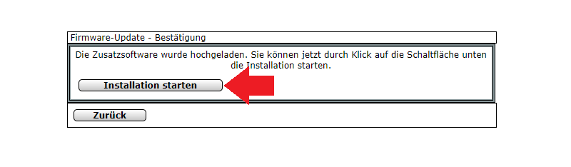

<!-- TOC -->

- [Redmatic](#redmatic)
  - [Getting Started with Node-RED](#getting-started-with-node-red)
- [Homematic Sensors (Motion Detector)](#homematic-sensors-motion-detector)
  - [Motion Detection](#motion-detection)
    - [Download the Node-RED Flow](#download-the-node-red-flow)
  - [System Variables](#system-variables)
    - [Download the Node-RED Flow](#download-the-node-red-flow-1)

<!-- /TOC -->


## Redmatic

We already prepared a tutorial on how to install Redmatic - [Node-RED](https://nodered.org) for Homematic - and take control over your camera via it's HTTP Interface. You can find all the information there that you need to connect Homematic sensors to your CCU and how to set up your Homematic software to communicate with your INSTAR IP camera.


This time we are going to use the same tools, but will connect them to MQTT interface of your INSTAR Full HD camera.


### Getting Started with Node-RED

We have already worked with Node-RED and in conjunction with the __MQTT protocol__ automated our IP Camera. Node-RED is very easy to install on the Homematic control panel using the [RedMatic](https://github.com/HM-RedMatic/RedMatic) addon.

RedMatic combines several software components into one CCU add-on, a software package that can be conveniently installed on a Homematic CCU3 as additional software via the WebUI.


The Node-RED version installed comes with the CCU nodes for Node-RED, making it possible to implement rules, automation's, scripts and connections of external services and systems for a homematic system in a simple, visual way - and this largely without any programming knowledge.


The visualization and control includes RedMatic WebApp and Node-RED Dashboard. RedMatic WebApp is a user interface that can be used immediately without further configuration.


1. First, we need to download the latest version [from Github](https://github.com/HM-RedMatic/RedMatic/releases). You need the file `redmatic-<version>.tar.gz`: 


---


---


2. In the Homematic WebUI, go to Control Panel Add-on Software:


---


---


3. Select and install the downloaded file (__can take up to 10min__): 


---




---


4. Then wait until the CCU restarts - patience is required. The installation of RedMatic takes some time. Node-RED will be reachable under `http://<ccu-adresse>/addons/red`. And the Node-RED Dashboard under `http://<ccu-adresse>/addons/red/ui`:


---


---


__The default login is `Admin` (with a capital `A`) and the admin password on your CCU3!__


## Homematic Sensors (Motion Detector)


### Motion Detection

We now want to use a Homematic Motion Detector to have our Pan&Tilt camera pan to __Preset Position 2__ when a motion is detected. After the Motion Detector falls back to it's idle state, we want our camera to pan back to __Position 1__.


1. We start by dragging a CCU Value Node onto the workspace and double-clicking on it to open the configuration page.
2. Select BidCos-RF as an interface to embed your Homematic PIR motion detector.
3. If you click in the Channel field, you will see all RF devices connected to your Homematic center. When we trained our motion detector to the control panel, we saw that the name of the detector begins with NEQ1545018. We have two entries at our disposal - the first ends at :0 and the second at :1. We'll pick the second one here (if you take the first one and you'll see that there are other variables available, including LOWBAT, which includes a low battery warning that we could include in our Node-RED flows.)
4. As data point we choose Motion. This will always give us a message payload of true once the sensor has detected a movement.


---


---


The motion sensor will either send a `false` or `true` when his state changes - detected motion triggers the `true` state and after a cooldown it will fall back to `false`. To use this information we will add a __Switch Node__ that separates those two messages:


---


---


In case that we receive a `true` from our sensor (__Alarm__) we want to change this message payload to `{"val":"1"}`. A `false` signifies that the sensor went back to sleep (__Idle__) and we have to change the message to `{"val":"0"}`:


---


---


This payload we can now use to trigger a preset on our camera through the MQTT interface. A value of `0` represents the first and a value of `1` the second preset position on our camera. The MQTT topic we have to send this information to is called `features/ptz/preset`. We can use a __MQTT Out__ node to send this status update to our camera:


---


---


For Node-RED to be able to connect to your camera's MQTT Broker you first have to define the server. Type in your camera's IP address and MQTT port, that you set inside your camera's WebUI. If you choose the regular port (default `1883`) skip the following step. But if you want to use the TLS encryption for your MQTT network, choose the SSL port instead (default `8883`) and click to add your camera's SSL certificate below:


---


---


Open your camera's webUI and navigate to the MQTT Broker configuration menu under __Features__. There click on the __Download__ button to download the client certificate file from your camera.


Back in Node-RED click on __Upload__ to upload the certificate:


---


---


With the TLS configuration set switch to the __Security__ tab and enter the login you set in your MQTT broker configuration menu:


---


---


Ok, you are all set. Every time the motion sensor is triggered your camera will now receive a command to go to __Preset Position 2__ and return to __Position 1 when the sensor switches back to idle.


We can repeat the same steps for the door sensor we previously added to our Homematic system and send our camera to __Preset Position 3__ to check out who opened the garage door:


---


---


#### Download the Node-RED Flow

You can download the complete flow and import it into your Node-RED admin panel. Copy the JSON code below and, in Node-RED, click on the hamburger menu in the top right. Choose __Import__ and copy the code into the input field. Click on red __Import__ button and drag the flow in position.


```json
[{"id":"d6b5f7c8.7183e8","type":"ccu-value","z":"427fc89b.e34038","name":"Motion Detector","iface":"BidCos-RF","channel":"NEQ1545018:1 HM-Sen-MDIR-O-2 NEQ1545018:1","datapoint":"MOTION","mode":"","start":true,"change":true,"cache":false,"queue":false,"on":0,"onType":"undefined","ramp":0,"rampType":"undefined","working":false,"ccuConfig":"38263145.35ea0e","topic":"${CCU}/${Interface}/${channel}/${datapoint}","x":100,"y":100,"wires":[["2471cac0.29f4d6"]]},{"id":"d3434bbe.05fa58","type":"change","z":"427fc89b.e34038","name":"Alarm","rules":[{"t":"set","p":"payload","pt":"msg","to":"{\"val\":\"1\"}","tot":"json"}],"action":"","property":"","from":"","to":"","reg":false,"x":380,"y":76,"wires":[["a8958f92.4cb8c"]]},{"id":"a8958f92.4cb8c","type":"mqtt out","z":"427fc89b.e34038","name":"features/ptz/preset","topic":"instar/000389888811/features/ptz/preset","qos":"1","retain":"false","broker":"6df4e12a.0c747","x":556,"y":99,"wires":[]},{"id":"2471cac0.29f4d6","type":"switch","z":"427fc89b.e34038","name":"","property":"payload","propertyType":"msg","rules":[{"t":"true"},{"t":"false"}],"checkall":"true","repair":false,"outputs":2,"x":252,"y":100,"wires":[["d3434bbe.05fa58"],["6197b16.f4d705"]]},{"id":"6197b16.f4d705","type":"change","z":"427fc89b.e34038","name":"Idle","rules":[{"t":"set","p":"payload","pt":"msg","to":"{\"val\":\"0\"}","tot":"json"}],"action":"","property":"","from":"","to":"","reg":false,"x":380,"y":127,"wires":[["a8958f92.4cb8c"]]},{"id":"c7056a66.400448","type":"ccu-value","z":"427fc89b.e34038","name":"Door Sensor","iface":"BidCos-RF","channel":"OEQ1985716:1 HM-Sec-SCo OEQ1985716:1","datapoint":"STATE","mode":"","start":true,"change":true,"cache":false,"queue":false,"on":0,"onType":"undefined","ramp":0,"rampType":"undefined","working":false,"ccuConfig":"38263145.35ea0e","topic":"${CCU}/${Interface}/${channel}/${datapoint}","x":90,"y":200,"wires":[["1e91dd74.85f263"]]},{"id":"daa36829.abb308","type":"change","z":"427fc89b.e34038","name":"Alarm","rules":[{"t":"set","p":"payload","pt":"msg","to":"{\"val\":\"2\"}","tot":"json"}],"action":"","property":"","from":"","to":"","reg":false,"x":380,"y":176,"wires":[["7de0a4c1.0f702c"]]},{"id":"7de0a4c1.0f702c","type":"mqtt out","z":"427fc89b.e34038","name":"features/ptz/preset","topic":"instar/000389888811/features/ptz/preset","qos":"1","retain":"false","broker":"6df4e12a.0c747","x":556,"y":199,"wires":[]},{"id":"1e91dd74.85f263","type":"switch","z":"427fc89b.e34038","name":"","property":"payload","propertyType":"msg","rules":[{"t":"true"},{"t":"false"}],"checkall":"true","repair":false,"outputs":2,"x":252,"y":200,"wires":[["daa36829.abb308"],["10361ae7.7e6fb5"]]},{"id":"10361ae7.7e6fb5","type":"change","z":"427fc89b.e34038","name":"Idle","rules":[{"t":"set","p":"payload","pt":"msg","to":"{\"val\":\"0\"}","tot":"json"}],"action":"","property":"","from":"","to":"","reg":false,"x":380,"y":227,"wires":[["7de0a4c1.0f702c"]]},{"id":"28e6bcd8.29e804","type":"comment","z":"427fc89b.e34038","name":"Homematic Sensors","info":"","x":110,"y":40,"wires":[]},{"id":"38263145.35ea0e","type":"ccu-connection","z":"","name":"localhost","host":"localhost","regaEnabled":true,"bcrfEnabled":true,"iprfEnabled":true,"virtEnabled":true,"bcwiEnabled":false,"cuxdEnabled":false,"regaPoll":true,"regaInterval":"30","rpcPingTimeout":"60","rpcInitAddress":"127.0.0.1","rpcServerHost":"127.0.0.1","rpcBinPort":"2047","rpcXmlPort":"2048"},{"id":"6df4e12a.0c747","type":"mqtt-broker","z":"","name":"IN-9010 Full HD","broker":"192.168.2.165","port":"8883","tls":"95eab325.77ade","clientid":"","usetls":true,"compatmode":false,"keepalive":"60","cleansession":true,"birthTopic":"","birthQos":"0","birthPayload":"","closeTopic":"","closeQos":"0","closePayload":"","willTopic":"","willQos":"0","willPayload":""},{"id":"95eab325.77ade","type":"tls-config","z":"","name":"","cert":"","key":"","ca":"","certname":"instar-cert.cert","keyname":"","caname":"","servername":"","verifyservercert":true}]
```

* You can use this flow with your own sensors - just change the selected sensor in the first node of each flow.


---


---


### System Variables

We can also use a __System Variable__ to send a MQTT update to our camera. As an example we want to create a variable that `Daheim` (_home_) that we want to trigger every time we enter our our home. When this happens we want the motion detection on our camera's to be deactivated.


Lets start by creating this variable by clicking on __Einstellungen__ and __System Variable__. The variable should be `true` when I am at home and `false` when I am away:


---


---


Now we can switch to Node-RED and drag a __SysVar__ node onto the canvas. Select the `Daheim` variable we just created and check that you want it's value to be emitted on change:


---


---


The rest of this flow is identical to the 2 we created earlier. We have to distinguish between a message with payload `true` or `false`, change the payload according to the command we want to send and assign the MQTT topic.


If you are using the internal PIR sensor of your camera to detect motion, you can use the `alarm/actions/pir/enable` topic to switch it on or off by either sending `{"val":"1"}` or `{"val":"o"}`.


__Note__ this works for the camera models IN-8015 FHD and IN-9008 FHD. The camera model IN-9020 FHD uses the `alarm/actions/alarmin` command instead to switch the PIR.


---


---


#### Download the Node-RED Flow

You can download the complete flow and import it into your Node-RED admin panel. Copy the JSON code below and, in Node-RED, click on the hamburger menu in the top right. Choose __Import__ and copy the code into the input field. Click on red __Import__ button and drag the flow in position.


```json
[{"id":"e23a5982.cd37b8","type":"ccu-sysvar","z":"427fc89b.e34038","name":"Daheim","ccuConfig":"38263145.35ea0e","topic":"ReGaHSS/${Name}","change":true,"cache":true,"x":80,"y":320,"wires":[["1bc1f6f2.fbf029"]]},{"id":"f36b8a95.38f2b8","type":"change","z":"427fc89b.e34038","name":"home","rules":[{"t":"set","p":"payload","pt":"msg","to":"{\"val\":\"0\"}","tot":"json"}],"action":"","property":"","from":"","to":"","reg":false,"x":340,"y":296,"wires":[["91a19433.03d868"]]},{"id":"91a19433.03d868","type":"mqtt out","z":"427fc89b.e34038","name":"alarm/actions/pir/enable","topic":"instar/000389888811/alarm/actions/pir/enable","qos":"1","retain":"false","broker":"6df4e12a.0c747","x":536,"y":319,"wires":[]},{"id":"1bc1f6f2.fbf029","type":"switch","z":"427fc89b.e34038","name":"","property":"payload","propertyType":"msg","rules":[{"t":"true"},{"t":"false"}],"checkall":"true","repair":false,"outputs":2,"x":212,"y":320,"wires":[["f36b8a95.38f2b8"],["da80c0a1.e74de"]]},{"id":"da80c0a1.e74de","type":"change","z":"427fc89b.e34038","name":"away","rules":[{"t":"set","p":"payload","pt":"msg","to":"{\"val\":\"1\"}","tot":"json"}],"action":"","property":"","from":"","to":"","reg":false,"x":340,"y":347,"wires":[["91a19433.03d868"]]},{"id":"38263145.35ea0e","type":"ccu-connection","z":"","name":"localhost","host":"localhost","regaEnabled":true,"bcrfEnabled":true,"iprfEnabled":true,"virtEnabled":true,"bcwiEnabled":false,"cuxdEnabled":false,"regaPoll":true,"regaInterval":"30","rpcPingTimeout":"60","rpcInitAddress":"127.0.0.1","rpcServerHost":"127.0.0.1","rpcBinPort":"2047","rpcXmlPort":"2048"},{"id":"6df4e12a.0c747","type":"mqtt-broker","z":"","name":"IN-9010 Full HD","broker":"192.168.2.165","port":"8883","tls":"95eab325.77ade","clientid":"","usetls":true,"compatmode":false,"keepalive":"60","cleansession":true,"birthTopic":"","birthQos":"0","birthPayload":"","closeTopic":"","closeQos":"0","closePayload":"","willTopic":"","willQos":"0","willPayload":""},{"id":"95eab325.77ade","type":"tls-config","z":"","name":"","cert":"","key":"","ca":"","certname":"instar-cert.cert","keyname":"","caname":"","servername":"","verifyservercert":true}]
```