import GifContainer from "../../src/components/ImageContainer";


<!-- TOC -->

- [Node-RED Configuration](#node-red-configuration)
- [Connecting the homee Gateway](#connecting-the-homee-gateway)
  - [Using homee Environment Variables](#using-homee-environment-variables)
    - [Flow Download](#flow-download)
  - [Connecting a Sensor to your Camera](#connecting-a-sensor-to-your-camera)
    - [Flow Download](#flow-download-1)

<!-- /TOC -->


## Node-RED Configuration

If you are using a Raspberry Pi to run Node-RED, you can use the [official installation script](https://nodered.org/docs/getting-started/raspberrypi) to have the program set up automatically for you.


## Connecting the homee Gateway


### Using homee Environment Variables


First we are going to use the homee __Webhook__ service to trigger a Node-RED Flow for us. As a trigger I want to use the homee system variables, like `away`, `home`, `vacation`. Let's start by creating a webhook in Node-RED that we can contact from the homee gateway:


---

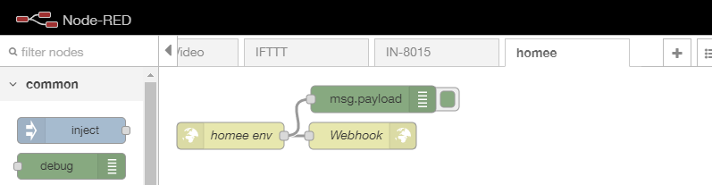

---


You can import this flow to your Node-RED panel with the following JSON code:


```json
[{"id":"181fefd6.961e6","type":"http in","z":"4ea30e4c.29d4","name":"homee env","url":"/homee/environment/","method":"post","upload":false,"swaggerDoc":"","x":80,"y":340,"wires":[["405534e7.66348c","bec44bcd.5eb548"]]},{"id":"405534e7.66348c","type":"http response","z":"4ea30e4c.29d4","name":"Webhook","statusCode":"","headers":{"content-type":"application/json"},"x":228,"y":340,"wires":[]},{"id":"bec44bcd.5eb548","type":"debug","z":"4ea30e4c.29d4","name":"","active":true,"tosidebar":true,"console":false,"tostatus":false,"complete":"false","x":240,"y":299,"wires":[]}]
```


The webhook we created will wait to receive a __POST__ request on the URL `/homee/environment/`:


---

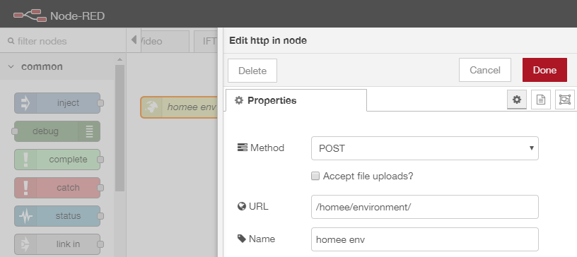

---


Great! Now we can switch to the home dashboard and create a automation that is able to utilize this webhook. Click to create a new __Homeegram__:


---

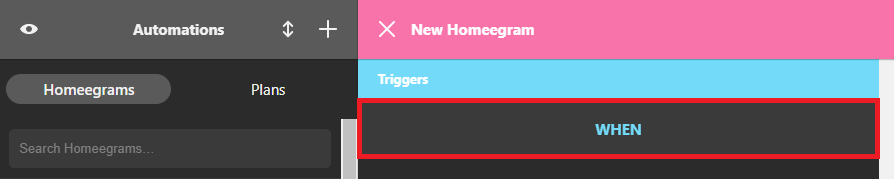

---


Click on __When__ to set the condition that should be met for the action to be triggered and select __Mode__:


---

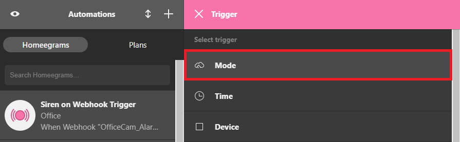

---


Select __Mode is set to Home__ and click on done to save the condition:


---

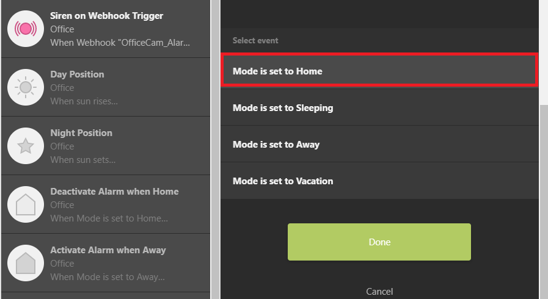

---


Now we need to add an __Then__ action we want to be triggered when the condition is met:


---

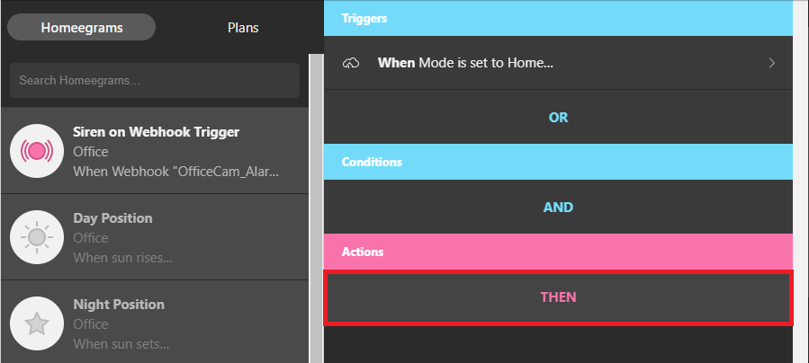

---


Here we will choose the __Webhook__ and type in the URL of the hook we just created in Node-RED. We set this to be `/homee/environment/`. So if your Node-RED installation is running on a computer with the IP _192.168.2.48_ and is using the default port _1880_ the complete URL is:


```bash
http://192.168.2.48:1880/homee/environment/
```


Select the POST method and add a JSON body payload `{"val":"home"}`. This way we can reuse the webhook for all environment variables and add different actions in Node-RED depending on what value was posted - `home`, `away`, `sleeping`, `vacation`.


---

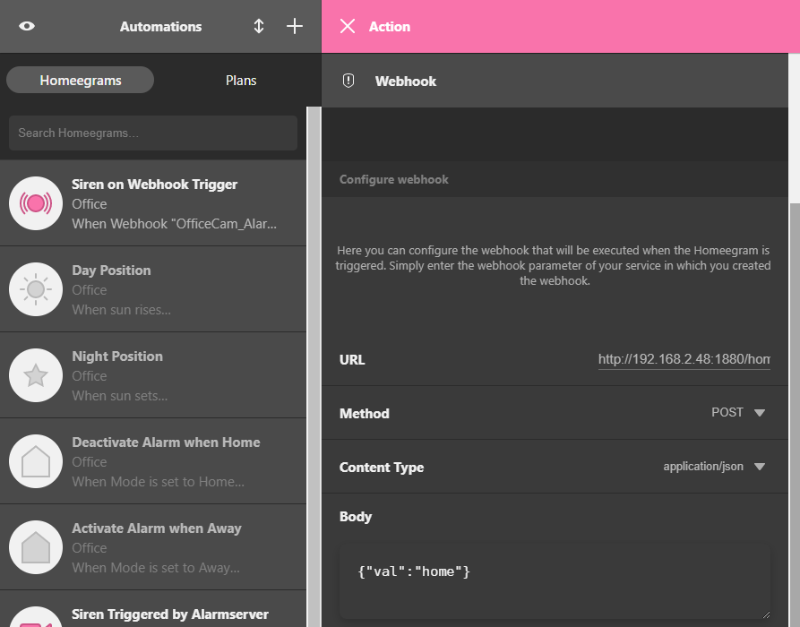

---


After saving our Homeegram we can now give it a test run. The webhook we created in Node-RED had a debug node connected. So if you switch on the debug panel in Node-RED (small bug icon in the top right) we should be able to our POST request come in when we change our homee variable to `home`:


<GifContainer gifUrl="/assets/gif/homee_node-red-mqtt_13.gif" alt="homee Node-RED MQTT connection to your INSTAR IP Camera" />


Now we can repeat those steps to create Homeegrams for every environment variable we want to use in Node-RED. To differentiate between those cases we will use a switch node in Node-RED and attach it to our webhook node (the complete [flow can be downloaded below](#flow-download) and imported to Node-RED):


---

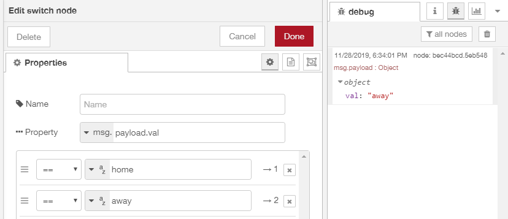

---


The switch node will check the message that was send and look for the value `val`. If it is `home` the message will be forwarded through exit 1 and every message that carries an `away` will leave the node through exit 2.

We need to set the message to the value that we need and connect it to a MQTT Out node for the command topic we want to update:


---


---


In this example we want to disable the motion detection area 1 when the `home` environment variable is activated. This is done by sending `{"val":"0"}` to the `alarm/area1/enable` topic.


---

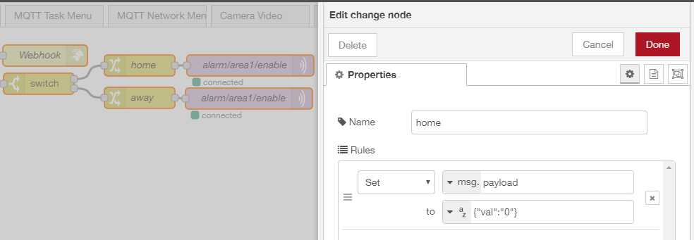

---


#### Flow Download

```json
[{"id":"181fefd6.961e6","type":"http in","z":"4ea30e4c.29d4","name":"homee env","url":"/homee/environment/","method":"post","upload":false,"swaggerDoc":"","x":80,"y":80,"wires":[["405534e7.66348c","97d88190.082db"]]},{"id":"405534e7.66348c","type":"http response","z":"4ea30e4c.29d4","name":"Webhook","statusCode":"","headers":{"content-type":"application/json"},"x":238,"y":40,"wires":[]},{"id":"97d88190.082db","type":"switch","z":"4ea30e4c.29d4","name":"","property":"payload.val","propertyType":"msg","rules":[{"t":"eq","v":"home","vt":"str"},{"t":"eq","v":"away","vt":"str"}],"checkall":"true","repair":false,"outputs":2,"x":229,"y":80,"wires":[["8a63a528.e6e3f8"],["80d7c418.063f58"]]},{"id":"8a63a528.e6e3f8","type":"change","z":"4ea30e4c.29d4","name":"home","rules":[{"t":"set","p":"payload","pt":"msg","to":"{\"val\":\"0\"}","tot":"str"}],"action":"","property":"","from":"","to":"","reg":false,"x":372,"y":54,"wires":[["e86399a7.4e76e8"]]},{"id":"80d7c418.063f58","type":"change","z":"4ea30e4c.29d4","name":"away","rules":[{"t":"set","p":"payload","pt":"msg","to":"{\"val\":\"1\"}","tot":"json"}],"action":"","property":"","from":"","to":"","reg":false,"x":372,"y":100,"wires":[["f96ffbe7.2eca78"]]},{"id":"e86399a7.4e76e8","type":"mqtt out","z":"4ea30e4c.29d4","name":"alarm/area1/enable","topic":"instar/000389888811/alarm/area1/enable","qos":"1","retain":"false","broker":"9e4e460d.640f18","x":529,"y":54,"wires":[]},{"id":"f96ffbe7.2eca78","type":"mqtt out","z":"4ea30e4c.29d4","name":"alarm/area1/enable","topic":"instar/000389888811/alarm/area1/enable","qos":"1","retain":"false","broker":"9e4e460d.640f18","x":527,"y":101,"wires":[]},{"id":"9e4e460d.640f18","type":"mqtt-broker","z":"","name":"IN-9010FHD","broker":"192.168.2.165","port":"8883","tls":"b55f9f2e.fe529","clientid":"","usetls":true,"compatmode":true,"keepalive":"60","cleansession":true,"birthTopic":"","birthQos":"0","birthPayload":"","closeTopic":"","closeQos":"0","closePayload":"","willTopic":"","willQos":"0","willPayload":""},{"id":"b55f9f2e.fe529","type":"tls-config","z":"","name":"","cert":"","key":"","ca":"","certname":"instar-cert.cert","keyname":"","caname":"","servername":"","verifyservercert":false}]
```

* __Note__ that this flow uses the MQTT topic `instar/000389888811/alarm/area1/enable` - you will have to swap _000389888811_ with the MAC address of your camera to make this work. See the MQTT Introduction for more details.


### Connecting a Sensor to your Camera

Start by creating a new Homeegram and defining the __When__ condition:


---

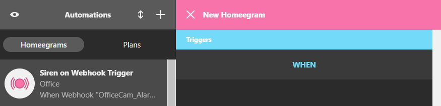

---


This time we have to choose a __Device__ as the trigger for our action:


---

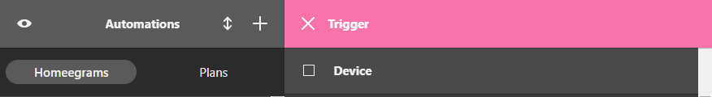

---


We choose a ZigBee motion detector that has been connected to our homee gateway:


---

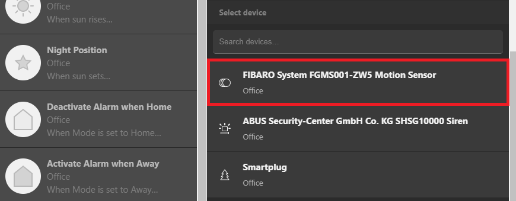

---


The action of this automation should trigger when the ZigBee sensor reports a motion:


---

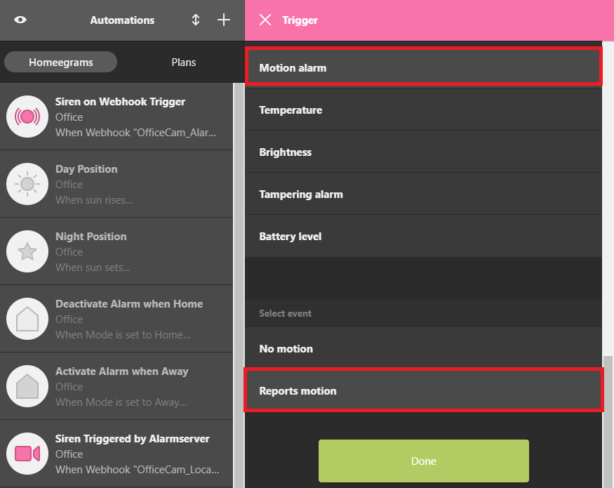

---


As action we choose a webhook `http://192.168.2.48:1880/homee/motionsensor/` and POST a `{"val":"1"}` to it:


---

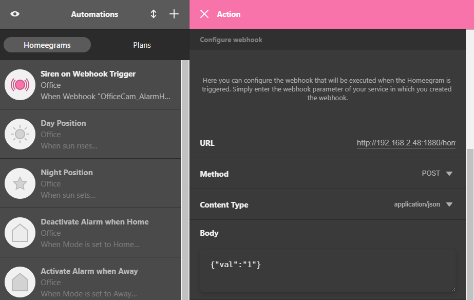

---


The corresponding webhook in Node-RED is even simpler this time:


---


---


homee sends us a POST request with the payload `{"val":"1"}` through the webhook. All we need to do is to connect a MQTT Out node that updates the topic `/alarm/pushalarm` on our camera. Now every time the ZigBee sensor reports a motion an alarm will be triggered on our camera.


---

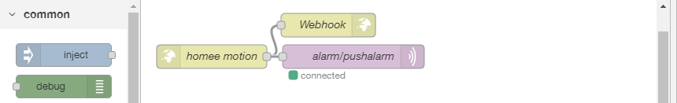

---


#### Flow Download

```json
[{"id":"4080d8b0.359ba8","type":"http in","z":"4ea30e4c.29d4","name":"homee motion","url":"/homee/motionsensor/","method":"post","upload":false,"swaggerDoc":"","x":90,"y":220,"wires":[["a073e475.1c5da8","66f1a6a1.b59f78"]]},{"id":"a073e475.1c5da8","type":"http response","z":"4ea30e4c.29d4","name":"Webhook","statusCode":"","headers":{"content-type":"application/json"},"x":238,"y":180,"wires":[]},{"id":"66f1a6a1.b59f78","type":"mqtt out","z":"4ea30e4c.29d4","name":"alarm/pushalarm","topic":"instar/000389888811/alarm/pushalarm","qos":"1","retain":"false","broker":"9e4e460d.640f18","x":270,"y":220,"wires":[]},{"id":"9e4e460d.640f18","type":"mqtt-broker","z":"","name":"IN-9010FHD","broker":"192.168.2.165","port":"8883","tls":"b55f9f2e.fe529","clientid":"","usetls":true,"compatmode":true,"keepalive":"60","cleansession":true,"birthTopic":"","birthQos":"0","birthPayload":"","closeTopic":"","closeQos":"0","closePayload":"","willTopic":"","willQos":"0","willPayload":""},{"id":"b55f9f2e.fe529","type":"tls-config","z":"","name":"","cert":"","key":"","ca":"","certname":"instar-cert.cert","keyname":"","caname":"","servername":"","verifyservercert":false}]
```

* __Note__ that this flow uses the MQTT topic `instar/000389888811/alarm/pushalarm` - you will have to swap _000389888811_ with the MAC address of your camera to make this work.