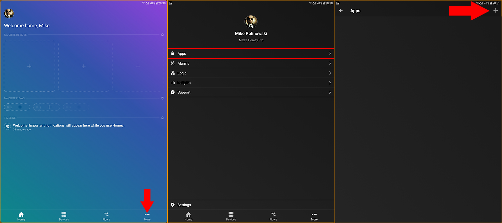
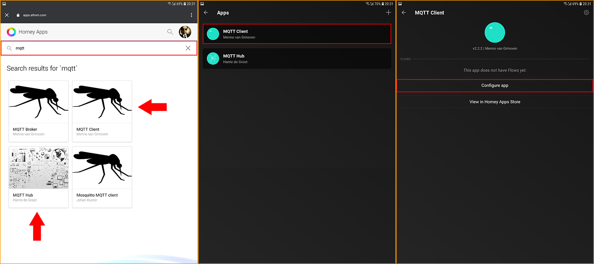
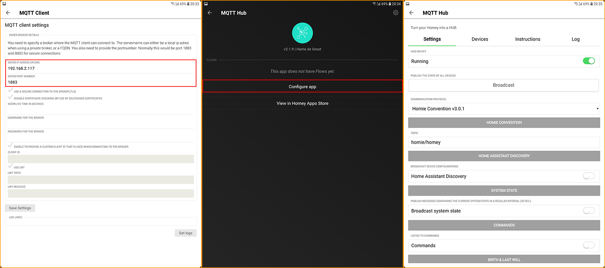
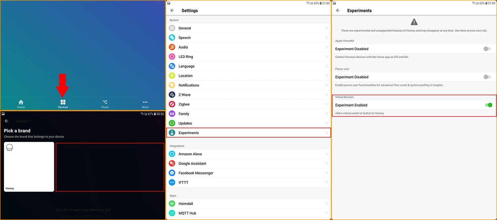
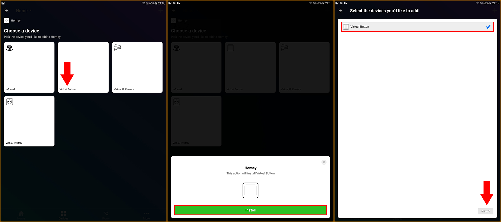
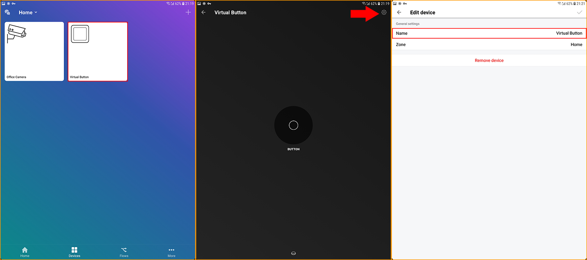
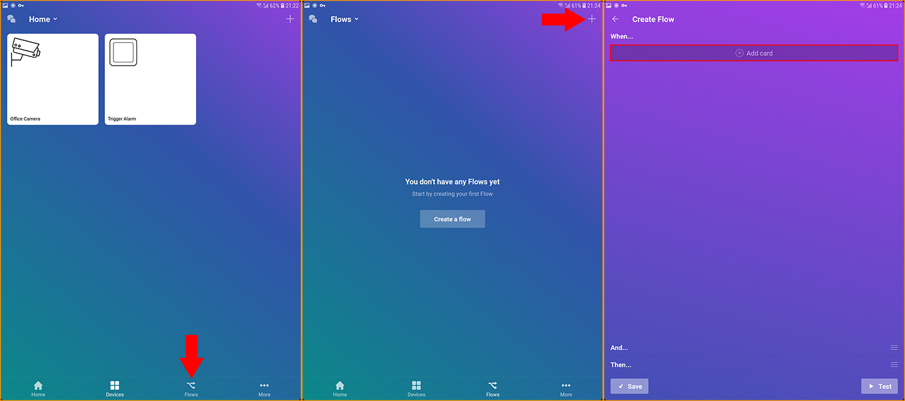
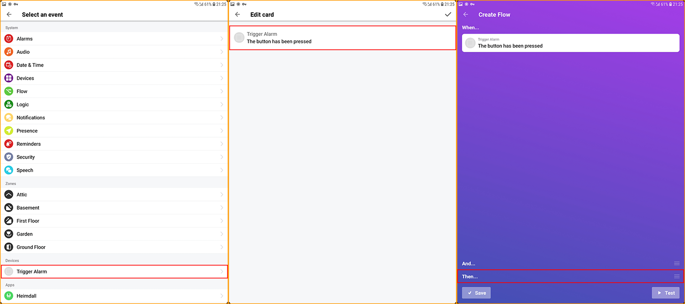
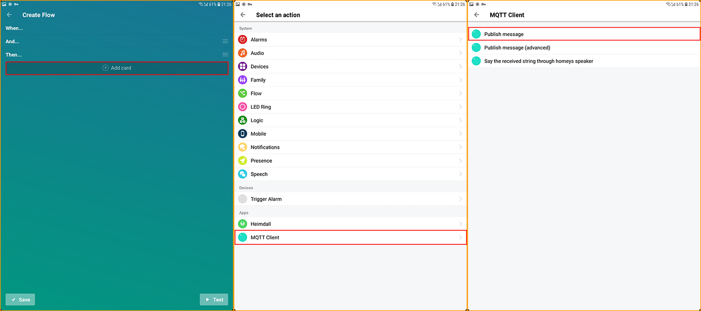
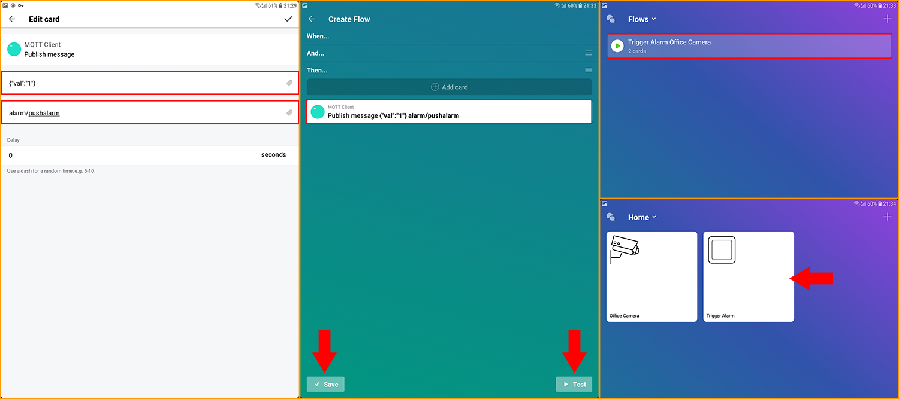

<!-- TOC -->

- [Adding the Homey MQTT Client](#adding-the-homey-mqtt-client)
- [Sending a MQTT Command to your Camera](#sending-a-mqtt-command-to-your-camera)

<!-- /TOC -->

In this tutorial we want to connect an INSTAR Full HD camera through it's MQTT Interface with the [Athom Homey Smarthome](https://www.athom.com/en/).

## Adding the Homey MQTT Client

Homey is a modular - that means that it is only set up with a limited amount of functionality out of the box. You can use the Homey App Store to load all kinds of kinds apps onto your gateway to personalize it's functionality. For the following we are going to need an MQTT client to be able to connect to the MQTT server on our camera.

---

---

1. Start by launching your Homey App for [iOS](https://apps.apple.com/us/app/homey/id1435800024) or [Android](https://play.google.com/store/apps/details?id=app.homey&hl=en_US) and switch to the __More__ App.

2. Open the Apps category.

3. And click on the __+__ icon in the top right to add a new app.

---

---

4. Type `mqtt` into the search field and select the __MQTT Client__. I am also installing the MQTT Hub - _this is optional_. The Hub App publishes Homey state variables through MQTT which comes in handy if you also use another smarthome solution that you want to interconnect with your Homey.

5. Once installed, click on the __MQTT Client__ inside the Apps category.

6. Click on __Configure App__ to connect the client to the INSTAR MQTT Server.

---

---

7. Start by entering the IP address of your camera (that is running your MQTT broker) - e.g. `192.168.2.116`. We are going to use the Port `1883` that allows us to connect to the MQTT broker without the SSL encryption (an encrypted connection can be established via the port `8883` but requires a custom SSL certificate which I could not find out how to upload). The __username__ and __password__ for the MQTT broker is the one you set in the MQTT Menu.

8. If you installed the MQTT Hub earlier - _which is optional_ - enter it and click on __Configure app__.

9. Here you can set which information Homey should publish to our MQTT broker for use with other smarthome components.

## Sending a MQTT Command to your Camera

---

---

1.  Now switch to the __Devices__ tab and check if you are able to add virtual devices. If you can't find them, the are still hidden as _experimental features_.

2.  Switch to the __More__ tab and enter the __Settings__ menu. Click on __Experiments__.

3.  Activate __Virtual Devices__.

---

---

4. Back to __Devices__ you should now be able to add a __Virtual Button__.

5. Click on __Install__ to add the button to your devices.

6. Click __Next__ to finish the installation.

---

---

7. You can _click and hold_ the virtual button to rename it.

8. Click on the cog wheel icon to enter the settings menu.

9.  Add a name for your virtual button and add it to a zone.

---

---

10. Now we need to add some logic to made this button work. This can be done in the __Flows__ tab.

11. Click on the __+__ icon in the top right to add a new flow.

12. In the __Create Flow__ menu click on __Add card__ in the _When condition_ to assign an event that should trigger your flow.

---

---

13. Search for your virtual button under __Devices__ and select it.

14. The button only has this one trigger - _When button has bee pressed_. Select it and confirm.

15. Now swipe up the __Then__ section of our flow to define what Homey should do when the flow was triggered.

---

---

16. Now click on __Add card__ to add the __Then__ condition for our flow.

17. Scroll down to the __Apps__ section and select the __MQTT Client__.

18. And choose to __Publish a message__ to the INSTAR MQTT server.

---

---

19. Now you can select a MQTT Topic from the INSTAR MQTT API that you want to update every time the button is pressed. Here I choose `alarm/pushalarm` with a value of `{"val":"1"}` to trigger an alarm on my camera. Note that if you have more than 1 camera connected to the MQTT server, you either have to add the MAC address in front of the MQTT topic to address a specific camera. Or add `all` - `all/alarm/pushalarm` - to address all connected cameras. By adding prefix `local`, you only address the camera that is running the MQTT broker.

20. After you confirmed your edit click __Test__ to verify that everything is working - your cameras System Log should show an __Audio Alarm__ (Note that the Audio Alarm has a __cool-down of 60s__ - so even if you hit the virtual button serveral times, you only get 1 alarm per minute). Now you can click on save to exit the setup window.

21. You now have a working button in the __Devices__ window that can trigger an alarm on your camera. Try to add another button with the MQTT topic `features/ptz/preset` and a value of `{"val":"0"}` - `{"val":"7"}` to have your camera pan&tilt between its preset positions.