import GifContainer from "../../src/components/ImageContainer";


<!-- TOC -->

- [Home Assistant Installation on a Raspberry Pi](#home-assistant-installation-on-a-raspberry-pi)
  - [MQTT Binding](#mqtt-binding)
  - [Testing our MQTT Service](#testing-our-mqtt-service)
- [Adding a UI Switch](#adding-a-ui-switch)
  - [Switch Component](#switch-component)
  - [Configuring the User Interface](#configuring-the-user-interface)
- [Adding your Cameras Live Video](#adding-your-cameras-live-video)
- [Adding a UI Push Button](#adding-a-ui-push-button)
- [Automations](#automations)
  - [Testing our Service](#testing-our-service)
  - [Day/Night Switching Detection Areas](#daynight-switching-detection-areas)
- [Using Home Assistant as the Alarmserver for your Camera](#using-home-assistant-as-the-alarmserver-for-your-camera)

<!-- /TOC -->


## Home Assistant Installation on a Raspberry Pi

Following the [installation instruction](https://www.home-assistant.io/docs/installation/raspberry-pi/) and the [SystemD Service Setup](https://www.home-assistant.io/docs/autostart/systemd/) it turned out to be a breeze to install HASS on our Raspberry Pi 3 with [Raspbian Buster](https://www.raspberrypi.org/downloads/raspbian/).


### MQTT Binding

We noticed that now you are able to add an MQTT broker already during the initial setup. There is no longer the need for doing this inside the configuration YAML files:


---

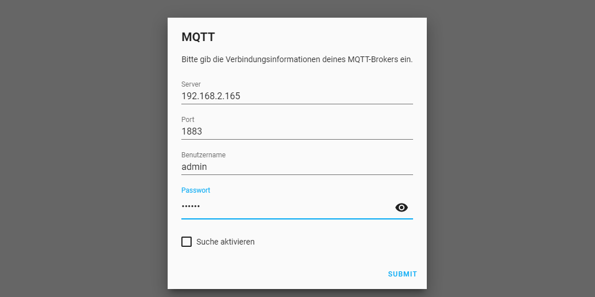

---


When you access the UI for the first time click on adding an extension and choose MQTT from the list. Now type in your INSTAR IP camera IP address (e.g. `192.168.2.165`) followed by the port `1883` and your INSTAR MQTT Broker login.


---


---


If you already installed Home Assistant, go to __Settings__ and __Integrations__ and select to add the _MQTT Broker_ there:


---

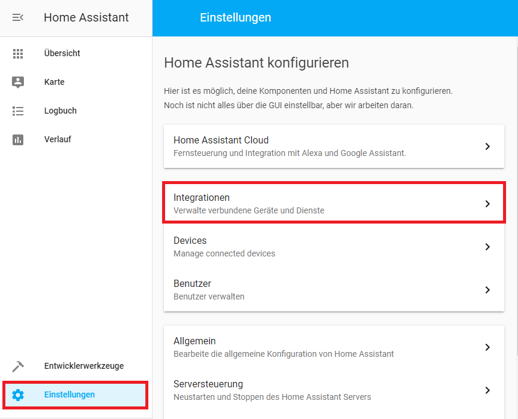

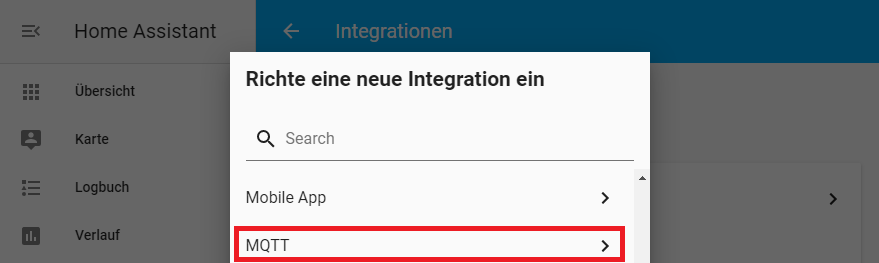

---


### Testing our MQTT Service

To test if everything is working, we need to go to __Developer Tools__ and __MQTT__. Here we can setup a subscription for the topic (__Listen to a topic__) `instar/000389888811/status/alarm/area1/enable` (please replace the __000389888811__ part with the MAC address of your camera).


---

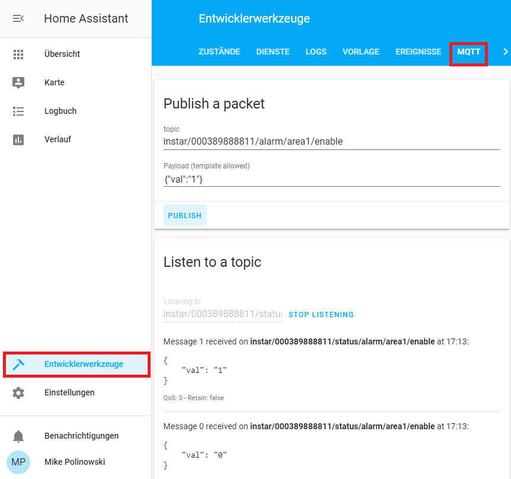

---


In the screenshot you can see that we first received an update that the value for this topic was 0: `{"val":"0"}`. That means that the alarm detection area 1 was deactivated. Now by publishing the value `{"val":"1"}` on the topic `instar/000389888811/alarm/area1/enable` the area gets activated. You can verify this inside your cameras web user interface. You can also deactivate the area again inside the WebUI and see that the MQTT topic switches back to `{"val":"0"}`.


## Adding a UI Switch

We now know that we are able to subscribe to MQTT status topics on our camera and to update these topics via the corresponding command topic. All we need to do now is to add a __Switch Component__ that does this for us and can be assigned to our Home Assistant dashboard.


### Switch Component


To keep our main `configuration.yaml` uncluttered we will create a separate file `switches.yaml` that contains all our MQTT related switches and import this into the configuration by adding the following line: `switch: !include switches.yaml`.


We can now add our first switch components - e.g. to activate and deactivate the motion detection areas:


```yaml
- platform: mqtt
  name: 'Alarm Area 1'
  state_topic: 'instar/000389888811/status/alarm/area1/enable'
  command_topic: 'instar/000389888811/alarm/area1/enable'
  qos: 1
  payload_on: '{"val":"1"}'
  payload_off: '{"val":"0"}'
  optimistic: false
  retain: false

- platform: mqtt
  name: 'Alarm Area 2'
  state_topic: 'instar/000389888811/status/alarm/area2/enable'
  command_topic: 'instar/000389888811/alarm/area2/enable'
  qos: 1
  payload_on: '{"val":"1"}'
  payload_off: '{"val":"0"}'
  optimistic: false
  retain: false

- platform: mqtt
  name: 'Alarm Area 3'
  state_topic: 'instar/000389888811/status/alarm/area3/enable'
  command_topic: 'instar/000389888811/alarm/area3/enable'
  qos: 1
  payload_on: '{"val":"1"}'
  payload_off: '{"val":"0"}'
  optimistic: false
  retain: false

- platform: mqtt
  name: 'Alarm Area 4'
  state_topic: 'instar/000389888811/status/alarm/area4/enable'
  command_topic: 'instar/000389888811/alarm/area4/enable'
  qos: 1
  payload_on: '{"val":"1"}'
  payload_off: '{"val":"0"}'
  optimistic: false
  retain: false
```

For each component - that we assign the switch template to inside our main configuration - we have to define the platform we want to use it on. Now this is the __mqtt__ platform that we added to Home Assistant.


We have both a __state\_topic__ and a __command\_topic__. The first one takes the status topic and defines the state our switch is in. The command topic is the one that we use to update the state and trigger our camera to change it's corresponding internal state e.g. switch our alarm area on or off. Here you can use any of the MQTT Topics that belong to functions that are supported by your camera model.


The message payload is in this case either `{"val":"1"}`, to switch the area on, or  `{"val":"0"}` to deactivate the area. Those are the __payload\_on__ and __value\_payload__ for our switch. Note that you have to surround each one of those with _single-tick quotation marks_.


Now we are also able to set some MQTT magic. The first one is `qos` and stands for __Quality of Service__ - where `0` stands for _fire-and-forget_ (your client might loose an status update if it does not receive the message), `1` means that it is verified that a status update is received and `2` is not relevant for us here (with a qos value of 2 it is made sure that every update is received but only received once - which is important e.g. when you are recording time series from measuring sensors). `optimistic` has to be used when your device does not have a separate `state_topic` - here you have to assume that the command you just sent worked and the state was updated. With `retain` you can hold on to the value of a topic even if the client or server cannot be reached. But we don't need this for our setup.


### Configuring the User Interface

Now we need to add a new __View__ for our camera by switching the UI into the _configuration mode_:


---

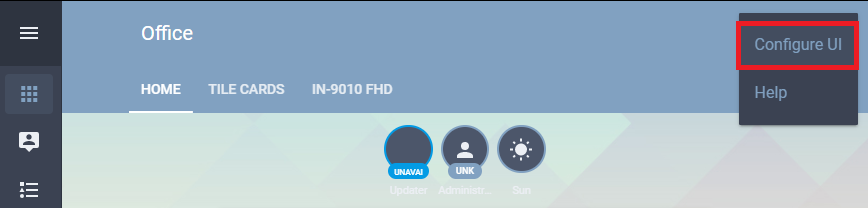

---


Now click on the __+__ as highlighted in the screenshot below and add a view for your camera:


---

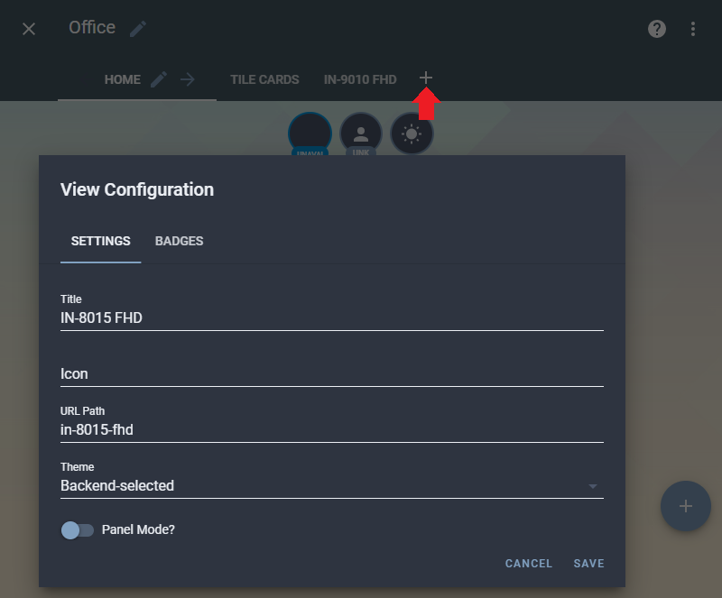

---


Switch to the new view and click on the big __+__ button to add a card that can contain our MQTT switches:


---

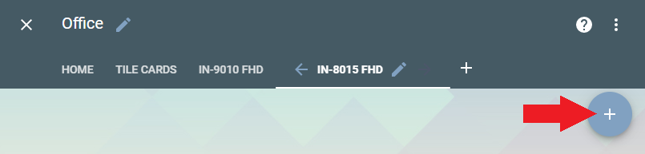

---


Choose an __Entity Card__ and select all the switches we just added to our configuration. They should show up automatically - if not, try reloading Home Assistant:


---

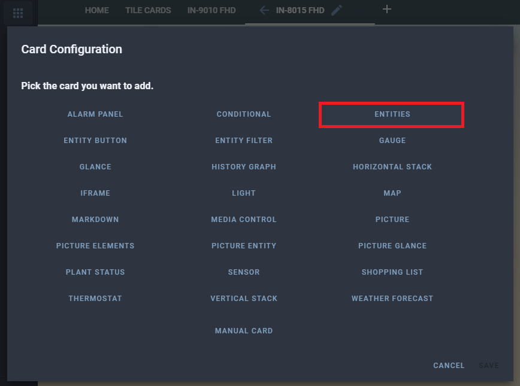

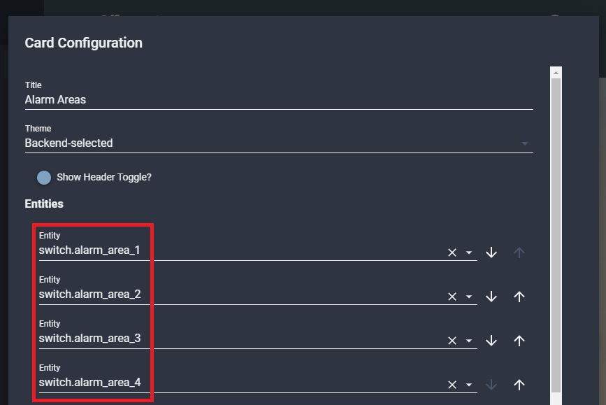

---


Quit the configuration mode to get back to the regular UI and you should be able to see your new card with all 4 alarm area switches. Try switching your alarm areas from your cameras Web User Interface - once you apply your settings there all switched inside Home Assistant should react to the state change immediately.


<GifContainer gifUrl="/assets/gif/Home_Assistant_12.gif" alt="Home Assistant with your INSTAR IP Camera" />


## Adding your Cameras Live Video

## Adding a UI Push Button

Some of our camera's functions don't have 2 states (on/off) - we just need a button that we can push and it should jump back to idle right after that. Examples are:

* Manual Alarm Trigger: `alarm/pushalarm`
* Go to Preset Position: `features/ptz/preset`
* Move Up/Down/Left/Right: `features/ptz/move`  etc.


This can be done in Home Assistant with a script. Make sure that your `scripts.yaml` file exist inside the __.homeassistant__ folder and is linked into your main `configuration.yaml` - `script: !include scripts.yaml`. Then open the scripts file and add the following lines:


```yaml
9010_pushalarm:
  sequence:
    - service: mqtt.publish
      data_template:
        topic: instar/000389888811/alarm/pushalarm
        payload: '{"val":"1"}'
        qos: 1

9010_gotopos1:
  sequence:
    - service: mqtt.publish
      data_template:
        topic: instar/000389888811/features/ptz/preset
        payload: '{"val":"0"}'
        qos: 1

9010_moveright:
  sequence:
    - service: mqtt.publish
      data_template:
        topic: instar/000389888811/features/ptz/move
        payload: '{"val":"right"}'
        qos: 1

9010_movestop:
  sequence:
    - service: mqtt.publish
      data_template:
        topic: instar/000389888811/features/ptz/move
        payload: '{"val":"stop"}'
        qos: 1
```

Choose a name for each script that helps you identify which camera you are addressing, e.g. `9010_pushalarm` and choose the MQTT topics that you want to add in form of buttons to your Home Assistant UI. Note that the __move command__ will move your camera's PTZ head continuously until you hit the __stop command__ - don't forget to add the stop button :)


Just like with our [switches earlier](#configuring-the-user-interface) we now have to activate the configuration mode inside the Home Assistant Lovelace UI and click on the __+__ button to add a new __Entity__:


---

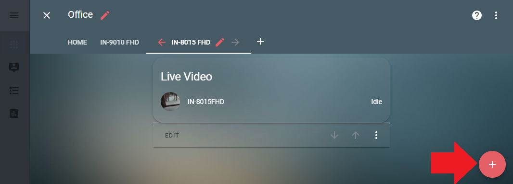

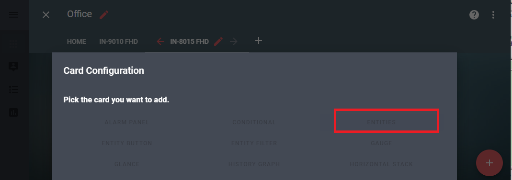

---


Now select the script you want to assign to this button from the __Entity List__ and name the card. Unfortunately, the UI does not yet give us the option to add a `name` and icon to the selected script. But if you click on the two wavy brackets - highlighted here (red arrow):


---

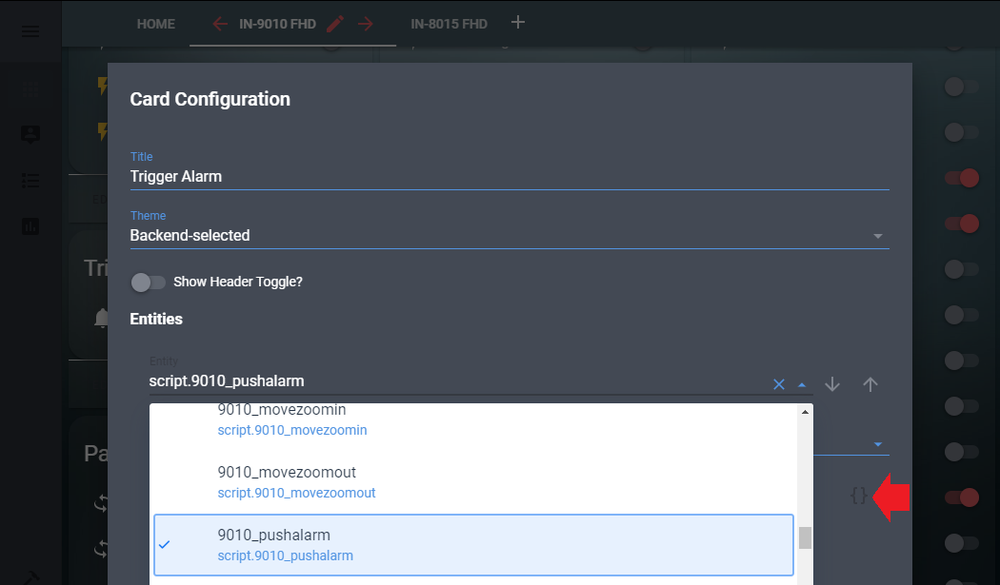

---

You can add them manually into the entity definition:


```yaml
entities:
  - entity: script.9010_pushalarm
    icon: 'mdi:bell'
    name: IN-9010 FHD
show_header_toggle: false
title: Trigger Alarm
type: entities
```


---

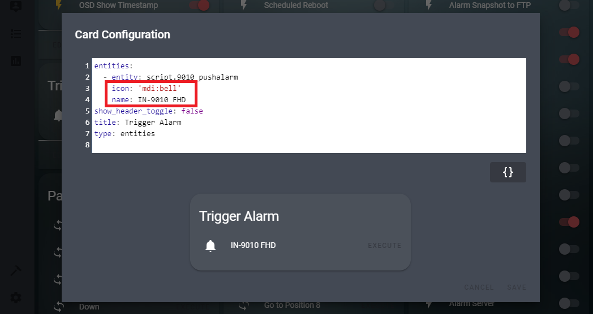

---


You can choose your icon from the [Material Design Icons](https://cdn.materialdesignicons.com/4.5.95/). Note that the button we chose here - `icon: 'mdi:bell'` - is called `mdi-bell` in the Material Design documentation and this name has to be changed accordingly for Home Assistant to recognize the icon.


---

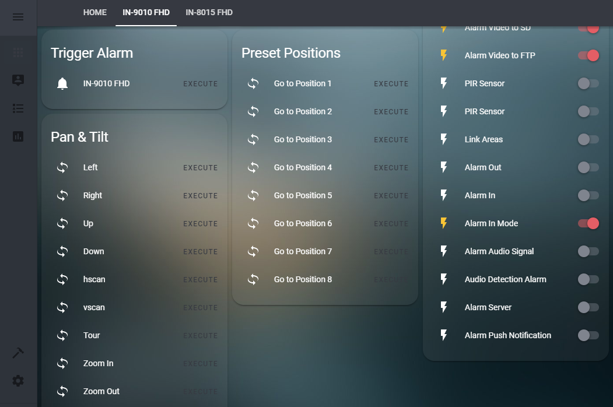

---


Here we added all Pan-Tilt, Preset Position and the Manual Alarm Trigger command to the Lovelace UI.


## Automations

Now that we are able to manually trigger functions on our camera we now want to find a way to automate those processes through Home Assistant. To do this we will first add a prototype service to our `services.yaml` file. This service should be able to receive a __MQTT Topic__ (`target`) and __MQTT Payload__ (`message`) from an automation in the `automations.yaml` file. This can be done by adding the following lines into the automation file:


```yaml
# MQTT Publish Service

send_mqtt_command:
  sequence:
    - service: mqtt.publish
      data_template:
        topic: "{{ target }}"
        payload: "{{ message }}"
        qos: 1
```


 Now make sure that the `automations.yaml` file exists in the _.homeassistant_ directory and is linked into the main `configuration.yaml`: `automation: !include automations.yaml`. Then switch to the Lovelace UI, open the __Configuration Panel__ and select __Automation__:


---

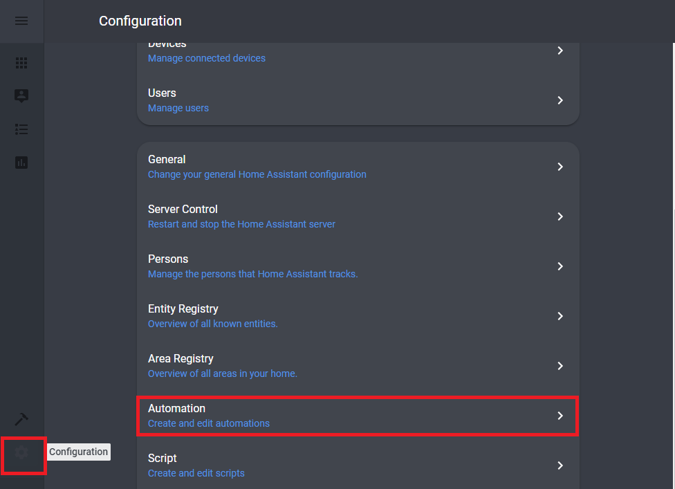

---


### Testing our Service


Click on the red __+__ button to add a new automation. Fill out the form as follows:


---

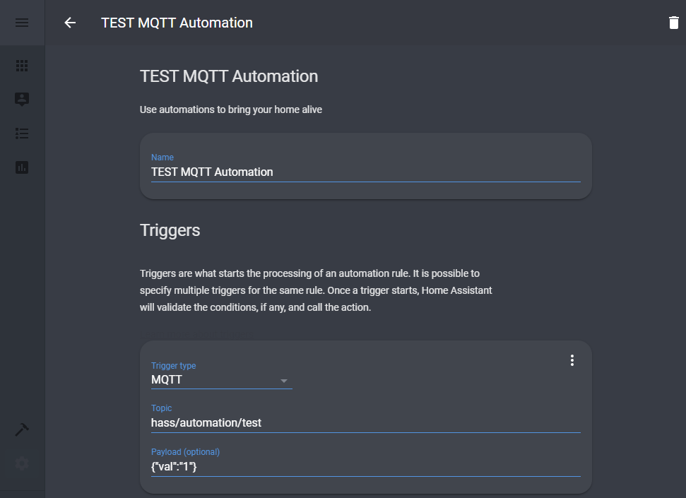

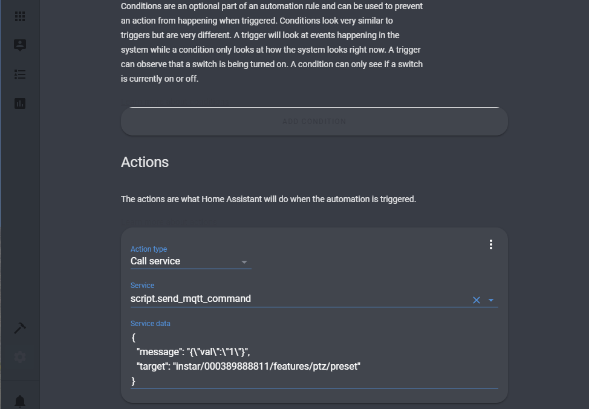

---


To test our automation we want to set up a MQTT topic `hass/automation/test` that, when it receives a payload of `{"val":"1"}` will call our prototype MQTT service we created above and passes down a __message__ and a __topic__ to it:


```json
{
  "message": "{\"val\":\"1\"}",
  "target": "instar/000389888811/features/ptz/preset"
}
```


Note that to be able to send a JSON formated payload inside this JSON expression, we have to escape the quotation marks with a backslash.


By sending the payload `1` to `/features/ptz/preset` we have our camera moving to __preset position 2__. We can test this using __MQTT.fx__:


---

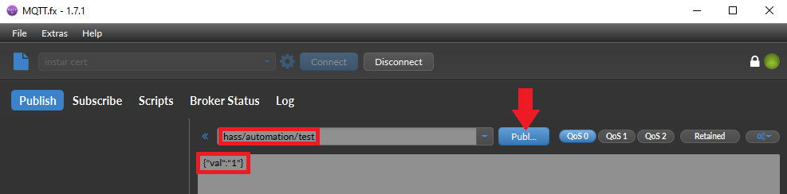

---


Clicking on publish will trigger our automation, that then triggers our service telling our camera to move to preset 2.


When you check the `automations.yaml` file inside the `.homeassistant` directory, you will see that Home Assistant created the automation for us as follows:


```yaml
- id: '1571128164029'
  alias: TEST MQTT Automation
  trigger:
  - payload: '{"val":"1"}'
    platform: mqtt
    topic: hass/automation/test
  condition: []
  action:
  - alias: ''
    data:
      message: '{"val":"1"}'
      target: instar/000389888811/features/ptz/preset
    service: script.send_mqtt_command
```


### Day/Night Switching Detection Areas

Now that we have proven that our concept is sound, we can continue and build our first meaningful automation. For this we can, again, use our prototype MQTT service and have an automation - triggered by a schedule or timed events like sunrise/sunset - pass it the necessary MQTT topics and payloads to switch our detection areas on or off:


---

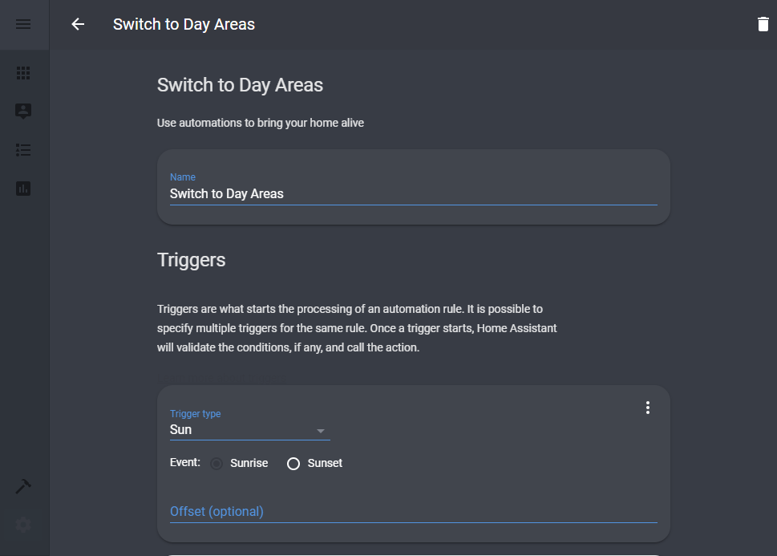

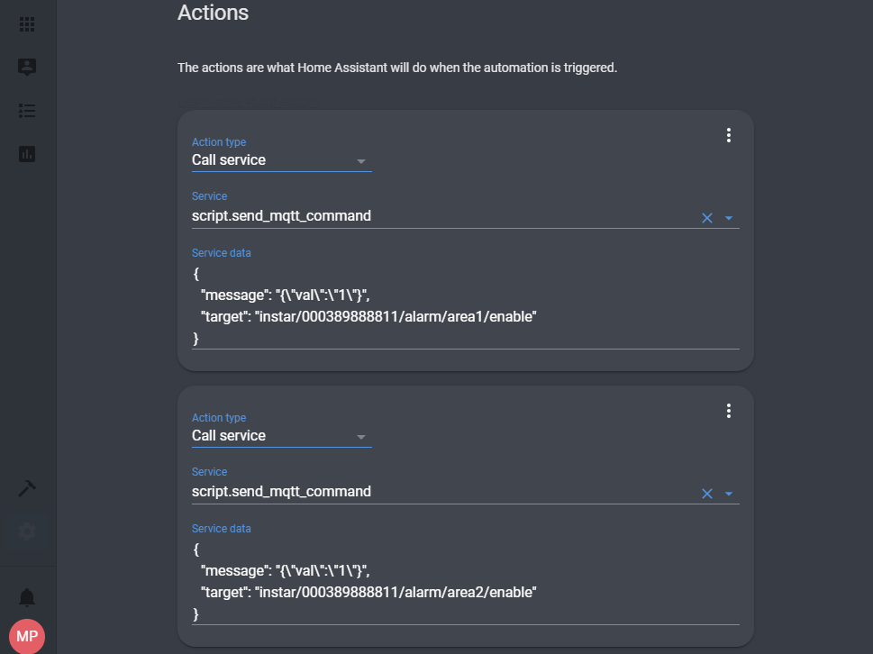

---


This is the __Day Automation__ that is triggered by the __Sunrise__ and will update the MQTT topics to activate Alarm Detection Area 1 & 2, while deactivating Areas 3 & 4. Note that this automation combines 4 actions that all will be let loose on our MQTT Publishing Service every morning by sunrise.


The __Night Automation__ is the opposite - triggered by __Sunset__ and deactivates Areas 1 & 2, while activating Areas 3 & 4.


A quick look into the `automations.yaml` file shows us the two automations that were created through the Lovelace UI:


```yaml
- id: '1571131738957'
  alias: Switch to Night Areas
  trigger:
  - event: sunset
    platform: sun
  condition: []
  action:
  - data:
      message: '{"val":"0"}'
      target: instar/000389888811/alarm/area1/enable
    service: script.send_mqtt_command
  - data:
      message: '{"val":"0"}'
      target: instar/000389888811/alarm/area2/enable
    service: script.send_mqtt_command
  - data:
      message: '{"val":"1"}'
      target: instar/000389888811/alarm/area3/enable
    service: script.send_mqtt_command
  - data:
      message: '{"val":"1"}'
      target: instar/000389888811/alarm/area4/enable
    service: script.send_mqtt_command

    
- id: '1571131880630'
  alias: Switch to Day Areas
  trigger:
  - event: sunrise
    platform: sun
  condition: []
  action:
  - data:
      message: '{"val":"1"}'
      target: instar/000389888811/alarm/area1/enable
    service: script.send_mqtt_command
  - data:
      message: '{"val":"1"}'
      target: instar/000389888811/alarm/area2/enable
    service: script.send_mqtt_command
  - data:
      message: '{"val":"0"}'
      target: instar/000389888811/alarm/area3/enable
    service: script.send_mqtt_command
  - data:
      message: '{"val":"0"}'
      target: instar/000389888811/alarm/area4/enable
    service: script.send_mqtt_command
```


You can now wait for the next Sunrise or Sunset to see if your automation is working (or just use the Home Assistant Developer Tools inside the Lovelace UI to trigger this event).