<!-- TOC -->

- [Docker on Windows](#docker-on-windows)
  - [Setting up the Environment](#setting-up-the-environment)
- [Installing Magento](#installing-magento)
  - [Webmin](#webmin)
  - [MySQL](#mysql)
  - [Magento &amp; Apache](#magento-amp-apache)
  - [PHPMyAdmin](#phpmyadmin)
- [Configuring Magento](#configuring-magento)

<!-- /TOC -->

I want to try set up a Magento 2 Store in Docker on a Windows 10 PC.


## Docker on Windows

Start by [installing Docker](https://docs.docker.com/docker-for-windows/install/) on your Windows PC. Note that you need:


* Windows 10 64-bit: Pro, Enterprise, or Education (Build 15063 or later).
* Hyper-V and Containers Windows features must be enabled.


After the installation sign in with your [Docker Hub](https://hub.docker.com) ID. Start the Docker Settings and select a drive you want to be available for your docker containers - this is the drive we need to store our source code on:


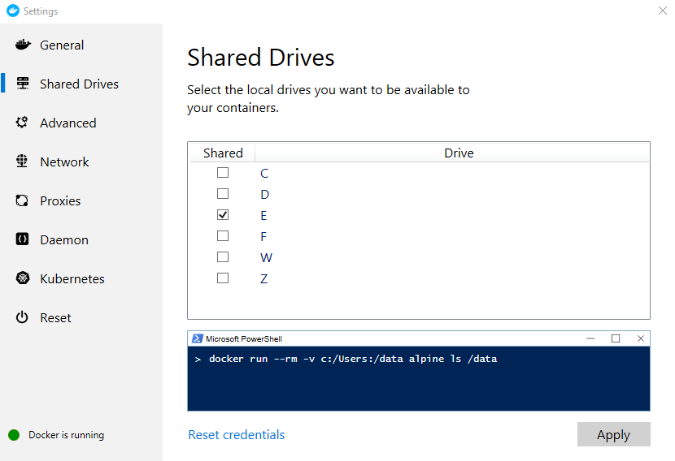


### Setting up the Environment

Now we need to create a `docker-compose.yml` file that will help us setting up the Magento2/LAMP environment:


```yaml
mysql:
  image: mysql:5.7
  ports:
    - 3306:3306
  environment:
    MYSQL_ROOT_PASSWORD: mypassword
  volumes:
    - ./src/db:/var/lib/mysql
  container_name: mysql_5.7
phpmyadmin:
  image: phpmyadmin/phpmyadmin:4.8
  ports:
    - 8080:80
  links:
    - mysql
  environment:
    PMA_HOST: mysql
    PMA_PORT: 3306
  container_name: phpmyadmin_4.8
apache2:
  image: phpcuong/magento2-apache2:3.0
  ports:
    - 80:80
    - 10000:10000
    - 443:443
  links:
    - mysql
  volumes:
    - ./src/html:/var/www/html
  container_name: magento2.3
```

<!-- giaphugroup -->

Create two folders named `html` and `db` and point the two volumes declared above to those directories. In my case there is a `src` folder in the same directory as the compose YAML file. This folder contains both the db and html folder.

Those instruction will set up a MySQL database, PHPMyAdmin and a Ubuntu container with Apache2, PHP 7.1.26, Webmin, Composer and Git.

Now open PowerShell in the directory where you created the YAML file and run the command `docker-compose up -d` to set everything up:


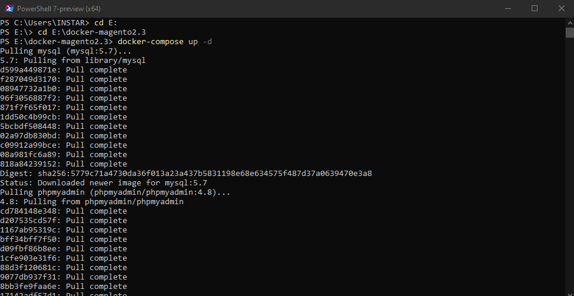


Once Docker finishes you can run `docker images` to see the downloaded images and `docker ps -a` to see that all 3 are now running in the background:


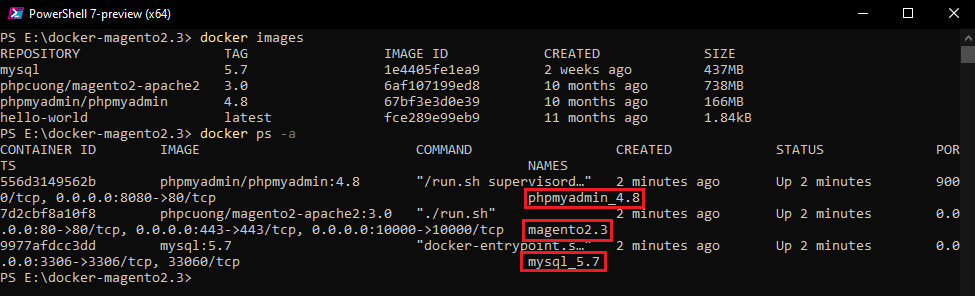


## Installing Magento

We can now verify that the virtual environment inside the Docker container full fills the requirements for Magento 2.2.6:

* Apache 2.4
* MySQL 5.7
* PHP 7.0.13 or higher


To do this run the following command `docker exec -it magento2.3 bin/bash` to access the Docker container that we want to use to install Magento in (__Note__ that you can get the container name `magento2.3` from the screenshot above):


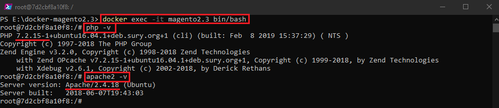


### Webmin

As mentioned above this container comes with [Webmin](http://www.webmin.com) pre-installed. Webmin is a web-based interface for system administration for Unix. You can setup user accounts, Apache, DNS and much more. Webmin removes the need to manually edit Unix configuration files like /etc/passwd, and lets you manage a system from the console or remotely.


The Webmin dashboard is exposed on Port `10000` and can accessed via localhost on your Windows machine:


```
 https://127.0.0.1:10000
```

* username: root
* password: root


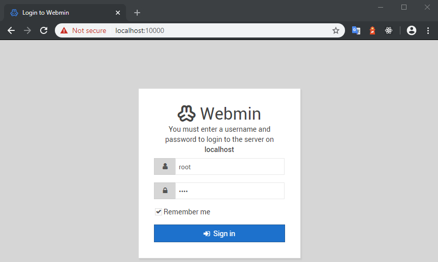


You can use it to make changes to your virtual server take care of outdated packages. __Note__ that changes you make here will be wiped if you rebuild the container:


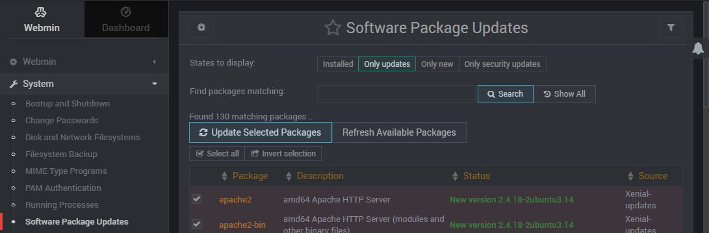


### MySQL

To check your MySQL version run the same command as before to enter the container `docker exec -it mysql_5.7 bin/bash`:


Note that you now have to enter the `MYSQL_ROOT_PASSWORD` you defined in the compose YAML file with the following command `mysql -u root -p` to enter the database:


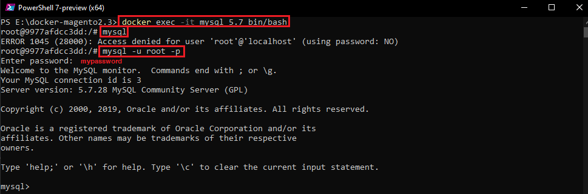


We can now create a database for Magento called `magento_2_3_3` - rename depending on the [version](https://devdocs.magento.com/release/) you wish to install:


```sql
create database magento_2_3_3;
show databases;
```


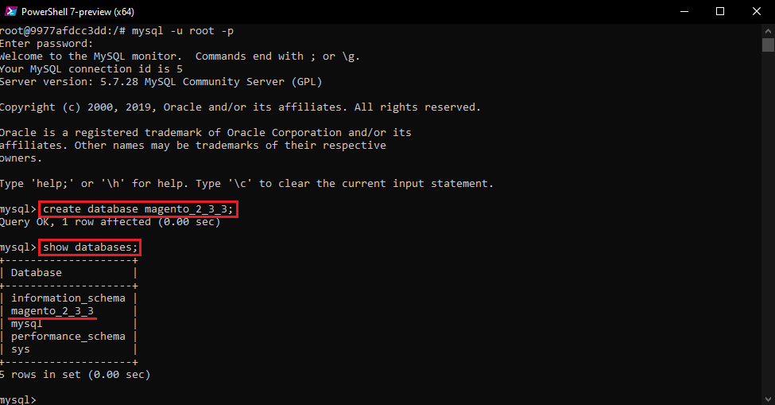


### Magento & Apache

You can download the Magento Source code from the [Tech Resources](https://magento.com/tech-resources/download) page. Unzip all files to the `src/html` folder we created earlier.


While we wait for those files to be unzipped we can already set up a host name for our shop, e.g. `magento-2-3-3.instar.com`. To do this we can edit the Windows __hosts__ file in __\Windows\System32\drivers\etc\\__ and add the following line:


```
127.0.0.1 magento-2-3-3.instar.com
```

So now when we type in `magento-2-3-3.instar.com` to our browsers address bar the address will be resolved to `localhost`.

Now go back to the __Webmin__ interface and point a virtual server to the Magento HTML code and assign the address that you just created your host for:


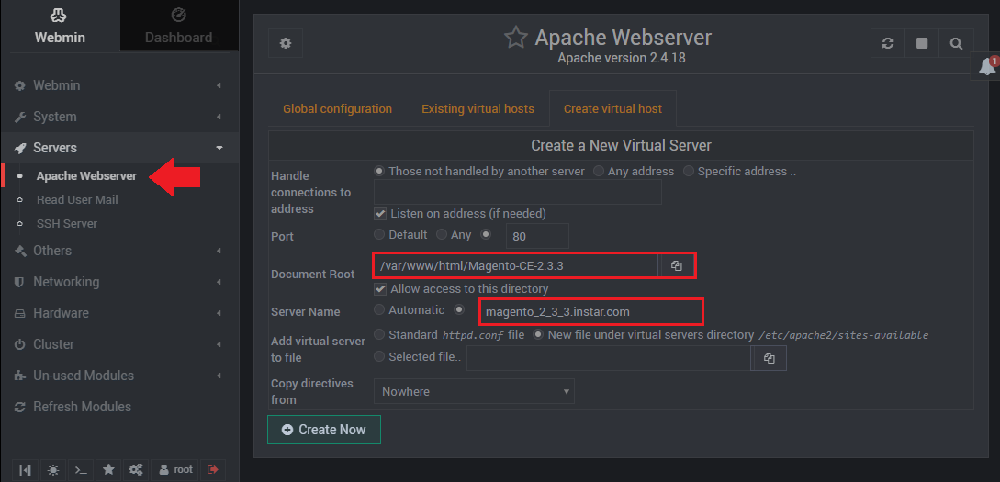


To activate the new configuration we need to restart Apache:


```
docker exec -it magento2.3 bin/bash
service apache2 restart
```

Apache is now hosting our Magento site on `magento-2-3-3.instar.com` and port `80`. Access it through your web browser and start the configuration wizard:


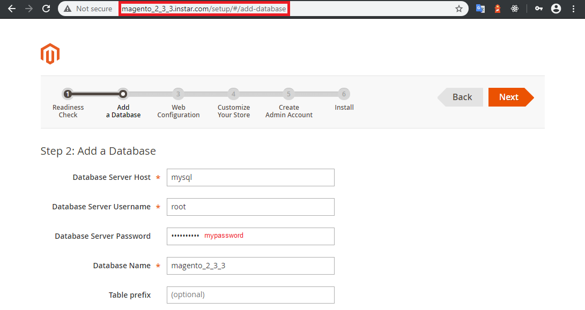


__Note__ that the Magento admin panel can now be reached under `http://magento-2-3-3.instar.com/admin_1kji1i` with the password that you set during the setup process :


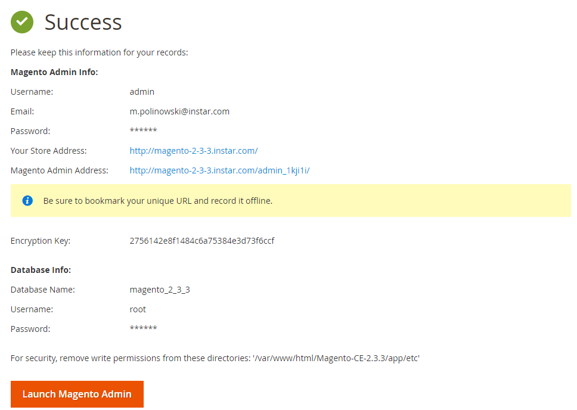


To deploy the frontend run the following command from the `magento` container inside the Magento source folder (path depends on how you named the folder after extracting the Magento source):

```
docker exec -it magento2.3 bin/bash
cd /var/www/html/Magento-CE-2.3.3
php bin/magento setup:static-content:deploy -f
```


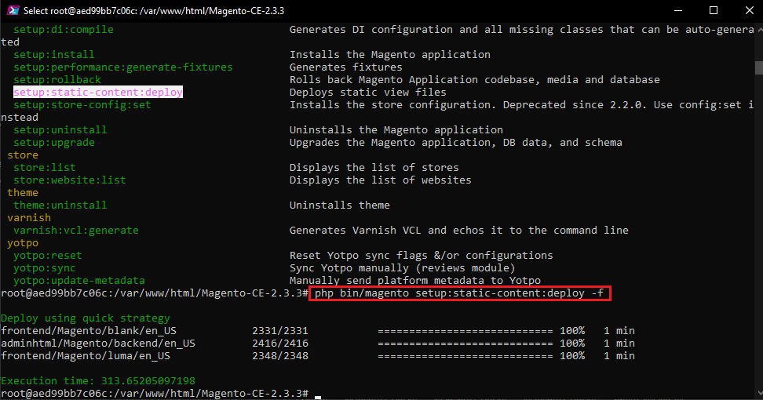


You can find the frontend source code that is being deployed in `\src\html\Magento-CE-2.3.3\pub\static\frontend\Magento\blank\en_US`. The frontend is now available on port `80` with the set URL:


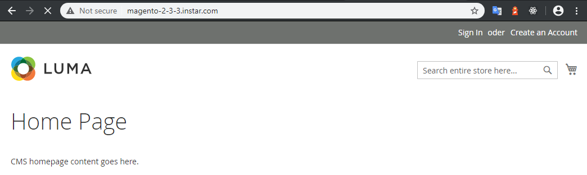


### PHPMyAdmin

We can now access the PHPMyAdmin interface over port `8080` with the domain name we set up `magento-2-3-3.instar.com`:

* username: `root`
* password: `mypassword` (as set by MYSQL_ROOT_PASSWORD)


The installation process populated our database successfully:


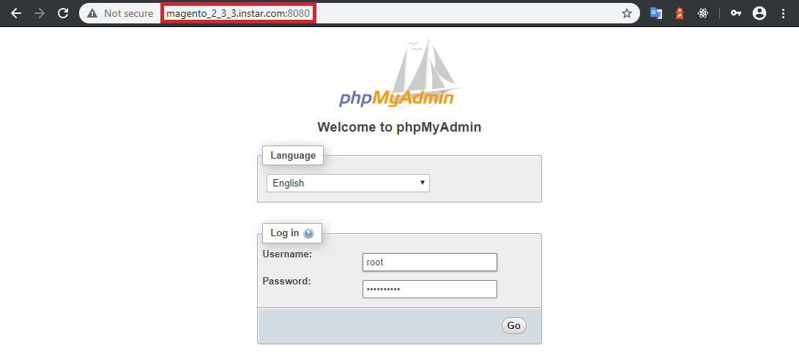


## Configuring Magento

Start by opening the Admin Dashboard through the URL and Login you set in the steps before:


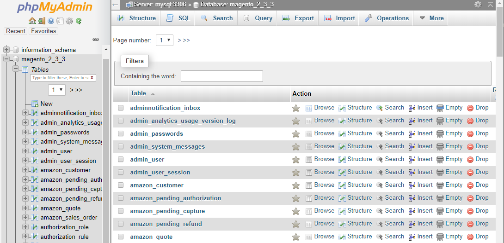