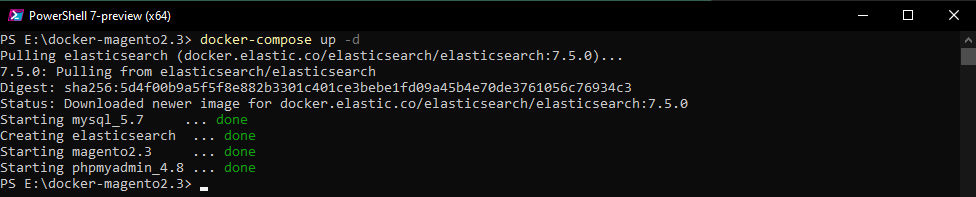
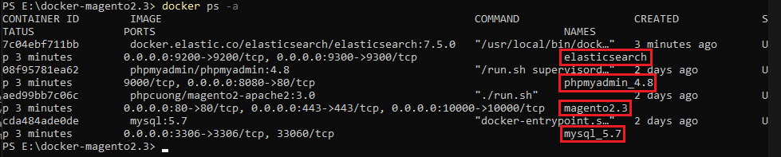
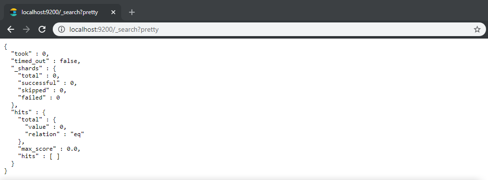
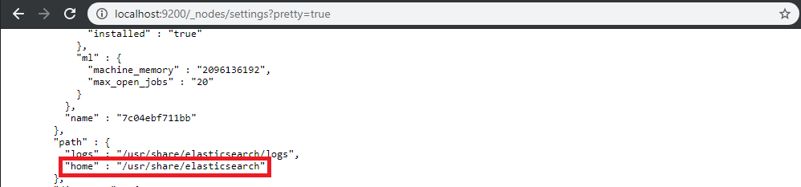
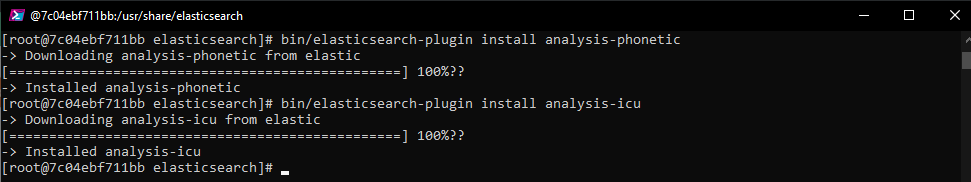
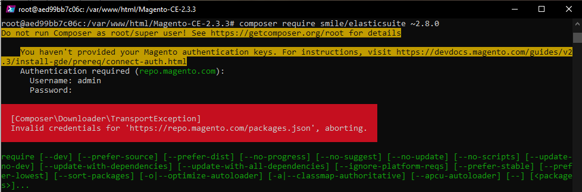
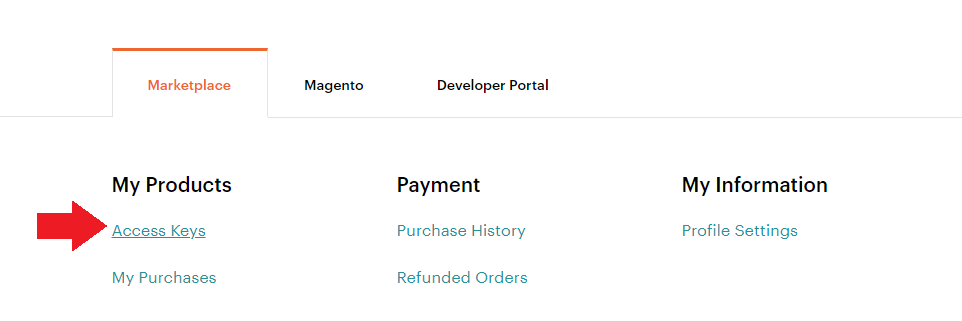
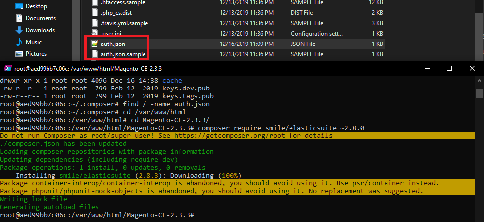
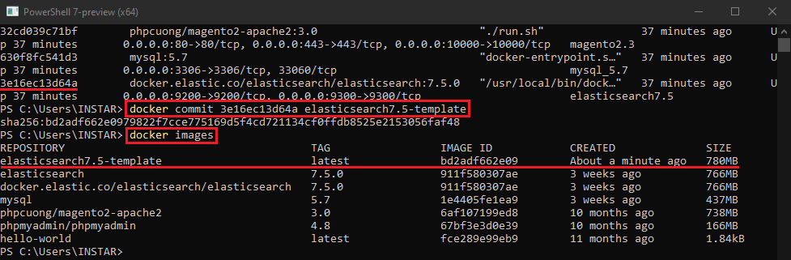

<!-- TOC -->

- [Docker on Windows](#docker-on-windows)
  - [Setting up the Environment](#setting-up-the-environment)
- [Installing Magento](#installing-magento)
  - [Webmin](#webmin)
  - [MySQL](#mysql)
  - [Magento &amp; Apache](#magento-amp-apache)
  - [PHPMyAdmin](#phpmyadmin)
- [Configuring Magento](#configuring-magento)

<!-- /TOC -->


### Setting up the Environment

Now we need can use our [docker-compose.yml](/magento-2-docker-development#setting-up-the-environment) file from the last tutorial and add Elasticsearch to the mix:


```yaml
mysql:
  image: mysql:5.7
  ports:
    - 3306:3306
  environment:
    MYSQL_ROOT_PASSWORD: mypassword
  volumes:
    - ./src/db:/var/lib/mysql
  container_name: mysql_5.7
phpmyadmin:
  image: phpmyadmin/phpmyadmin:4.8
  ports:
    - 8080:80
  links:
    - mysql
  environment:
    PMA_HOST: mysql
    PMA_PORT: 3306
  container_name: phpmyadmin_4.8
apache2:
  image: phpcuong/magento2-apache2:3.0
  ports:
    - 80:80
    - 10000:10000
    - 443:443
  links:
    - mysql
    - elasticsearch
  volumes:
    - ./src/html:/var/www/html
  container_name: magento2.3
elasticsearch:
    image: docker.elastic.co/elasticsearch/elasticsearch:7.5.0
    container_name: elasticsearch7.5
    environment:
      - xpack.security.enabled=false
      - discovery.type=single-node
    ulimits:
      memlock:
        soft: -1
        hard: -1
      nofile:
        soft: 65536
        hard: 65536
    cap_add:
      - IPC_LOCK
    volumes:
      - ./src/elasticsearch-data:/usr/share/elasticsearch/data
    ports:
      - 9200:9200
      - 9300:9300
```


Create two folders named `html`, `db` and `elasticsearch-data` and point the two volumes declared above to those directories. In my case there is a `src` folder in the same directory as the compose YAML file.

Those instruction will set up a MySQL database, PHPMyAdmin, a Ubuntu container with Apache2, PHP 7.1.26, Webmin, Composer and Git and the Elasticsearch Single-Node Cluster.

Now open PowerShell in the directory where you created the YAML file and run the command `docker-compose up -d` to set everything up:





Once Docker finishes you can run `docker images` to see the downloaded images and docker `ps -a` to see that all 3 are now running in the background:





We can check if Elasticsearch is running by visiting `http://localhost:9200/_search?pretty=true` with our web browser:





## Installing Elasticsuite

To make use of Elasticsearch in Magento 2 we need to install the [Elasticsuite Plugin](https://github.com/Smile-SA/elasticsuite.) Plugins can be installed with the `bin/elasticsearch-plugin` tool of Elastic Search. You have to go to your Elastic Search installation directory. Locate your "Home" directory ( Look for Settings -> Path -> Home in the following command output for value ):


```bash
curl localhost:9200/_nodes/settings?pretty=true
```





### Elasticsearch Container


The default directory `home` for Elasticsearch is `/usr/share/elasticsearch`. We now have to enter the Elasticsearch container:


```bash
docker exec -it elasticsearch7.5 /bin/bash

or

docker exec -t -i ContainerID /bin/bash
```


And enter the `home directory` and install the following plugins:


```bash 
bin/elasticsearch-plugin install analysis-phonetic
bin/elasticsearch-plugin install analysis-icu
```





To restart Elasticsearch we now have to restart the `elasticsearch` container.


```bash
docker restart elasticsearch5.7
```


### Magento Container

We can now install the latest version of ElasticSuite through the Magento composer CLI:


```bash
composer require smile/elasticsuite ~2.8.0
```


And we end up with a scary error message - I tried to log in with my Magento admininistrator credentials, but [apparently that was wrong](https://devdocs.magento.com/guides/v2.3/install-gde/prereq/connect-auth.html):





#### Access Keys

To download packages from the [Magento Marketplace](https://marketplace.magento.com/) we first have to sign in, select __My Profile__ and click on __Access Keys__ in the Marketplace tab.





Click __Create a New Access Key__. Enter a specific name for the keys (e.g., the name of the developer receiving the keys) and click __OK__.


New public and private keys are now associated with your account that you can click to copy. Save this information or keep the page open when working with your Magento project. Use the __Public key as your username__ and the __Private key as your password__!


But even so I kept receiving the error message:


```json
[Composer\Downloader\TransportException]
Invalid credentials for 'https://repo.magento.com/packages.json', aborting.
```


The solution was that my installation only had a sample `auth.json` file in the root directory of the Magento content. You need to create a copy and fill out your credentials inside. Afterwards Composer no longer asks for your login:





#### Enable the module and run ElasticSuite

If your Magento instance is already installed, you have to enable the ElasticSuite modules using :


```bash
bin/magento module:enable Smile_ElasticsuiteCore Smile_ElasticsuiteCatalog Smile_ElasticsuiteSwatches Smile_ElasticsuiteCatalogRule Smile_ElasticsuiteVirtualCategory Smile_ElasticsuiteThesaurus Smile_ElasticsuiteCatalogOptimizer Smile_ElasticsuiteTracker Smile_ElasticsuiteAnalytics
```


As recommend run `bin/magento setup:upgrade` and `bin/magento setup:di:compile` afterwards.


Then configure the ElasticSearch server to point to your ElasticSearch cluster (optional if using default server location, http://localhost:9200) and reimport the config :


```bash
bin/magento config:set -l smile_elasticsuite_core_base_settings/es_client/servers elasticsearch7.5:9200
bin/magento config:set -l smile_elasticsuite_core_base_settings/es_client/enable_https_mode 0
bin/magento config:set -l smile_elasticsuite_core_base_settings/es_client/enable_http_auth 0
bin/magento config:set -l smile_elasticsuite_core_base_settings/es_client/http_auth_user ""
bin/magento config:set -l smile_elasticsuite_core_base_settings/es_client/http_auth_pwd ""
bin/magento app:config:import
```


#### Process First Indexing

Once you have completed all previous points, you can process a full reindexing of the catalogsearch_fulltext index.


```bash
bin/magento index:reindex catalogsearch_fulltext
bin/magento index:reindex elasticsuite_categories_fulltext
bin/magento index:reindex elasticsuite_thesaurus
```


Once the reindex is done, you are all set and can view your frontend catalog and search pages being rendered via Smile Elastic Suite !


## Commit the Changes

Now that we've modified the container we have to commit the changes. To commit the changes and create a new image based on said changes, issue the command:


```bash
docker commit CONTAINER_ID elasticsearch7.5-template
docker commit CONTAINER_ID magento2.3.3-template
```


Where CONTAINER_ID is the ID given to you when you initially ran the container.





```yaml
mysql:
  image: mysql:5.7
  ports:
    - 3306:3306
  environment:
    MYSQL_ROOT_PASSWORD: mypassword
  volumes:
    - ./src/db:/var/lib/mysql
  container_name: mysql_5.7
phpmyadmin:
  image: phpmyadmin/phpmyadmin:4.8
  ports:
    - 8080:80
  links:
    - mysql
  environment:
    PMA_HOST: mysql
    PMA_PORT: 3306
  container_name: phpmyadmin_4.8
apache2:
  image: magento2.3.3-template
  ports:
    - 80:80
    - 10000:10000
    - 443:443
  links:
    - mysql
    - elasticsearch
  volumes:
    - ./src/html:/var/www/html
  container_name: magento2.3
elasticsearch:
    image: elasticsearch7.5-template
    container_name: elasticsearch7.5
    environment:
      - xpack.security.enabled=false
      - discovery.type=single-node
    ulimits:
      memlock:
        soft: -1
        hard: -1
      nofile:
        soft: 65536
        hard: 65536
    cap_add:
      - IPC_LOCK
    volumes:
      - ./src/elasticsearch-data:/usr/share/elasticsearch/data
    ports:
      - 9200:9200
      - 9300:9300
```