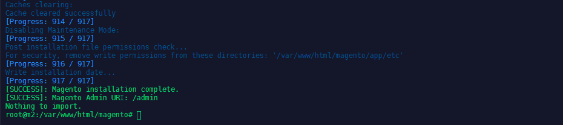

<!-- TOC -->


<!-- /TOC -->


Magento supports nginx 1.8 (or the latest mainline version). You must also install the latest version of php-fpm. The following section describes how to install Magento 2.x on Ubuntu 16 using nginx, PHP, and MySQL.


## Install NGINX


```
apt-get -y install nginx
``` 


After completing the following sections and installing Magento, we’ll use a sample configuration file to configure NGINX.


## Install and configure php-fpm

Magento requires several PHP extensions to function properly. In addition to these extensions, you must also install and configure the php-fpm extension if you are using nginx.

1. Install php-fpm and php-cli:


```bash
apt-get -y install php7.3-fpm php7.3-cli
```


2. Open the php.ini files in an editor:

```
nano /etc/php/7.3/fpm/php.ini
nano /etc/php/7.3/cli/php.ini
```


3. Edit both files to set a memory limit of 2G and add the following two lines to the end of the files:


```bash
memory_limit = 2G
max_execution_time = 1800
zlib.output_compression = On
```

4. Restart the php-fpm service:


```bash
systemctl restart php7.3-fpm
```


## Installing and configuring MySQL 5.7


1. Enter this command:


```bash
sudo apt install -y mysql-server mysql-client
```


2. Start MySQL:


```bash
sudo service mysql start
```

3. Secure the installation:


```bash
sudo mysql_secure_installation
```


4. Test the installation:


```bash
mysql -u root -p
```


## Configuring the Magento Database Instance


1. Get to a MySQL command prompt:


```bash
mysql -u root -p
```


Enter the MySQL root user’s password when prompted.


2. Enter the following commands in the order shown to create a database instance named `magento233` with username `magento233`:


```bash
create database magento233;
create user magento233 IDENTIFIED BY 'magento233';
GRANT ALL ON magento233.* TO magento233@localhost IDENTIFIED BY 'magento233';
flush privileges;
```

Enter exit to quit the command prompt.


3. Verify the database by logging in with your new account:


```
mysql -u magento233 -p
show databases;
```


## Install and configure Magento2


1. To install Magento 2 with composer, you will need to setup an Access key with your account. Go to:


```bash
https://marketplace.magento.com/customer/account/
```


2. Change to the web server docroot directory or a directory that you have configured as a virtual host docroot. For this example, we’re using the Debians default /var/www/html.


```bash
cd /var/www/html
```


3. Install Composer globally. You’ll need Composer to update dependencies before installing Magento:


```bash
curl -sS https://getcomposer.org/installer | sudo php -- --install-dir=/usr/bin --filename=composer
```


4. Create a new Composer project using the Magento Open Source package. The public key will be the username and the private key will be the password. 


```bash
composer create-project --repository=https://repo.magento.com/ magento/project-community-edition <install-directory-name>
```

5. Set read-write permissions for the web server group before you install the Magento software. This is necessary so that the Setup Wizard and command line can write files to the Magento file system:


```
cd /var/www/html/<magento install directory>
find var generated vendor pub/static pub/media app/etc -type f -exec chmod g+w {} +
find var generated vendor pub/static pub/media app/etc -type d -exec chmod g+ws {} +
chown -R :www-data .
chmod u+x bin/magento
```


6. Install Magento from the command line. This example assumes that the Magento install directory is named `magento`, the db-host is on the same machine (localhost), and that the db-name, db-user, and db-password are all magento233:


```bash
bin/magento setup:install \
--base-url=http://my.domain/magento \
--db-host=localhost \
--db-name=magento233 \
--db-user=magento233 \
--db-password=magento233 \
--backend-frontname=admin \
--admin-firstname=admin \
--admin-lastname=admin \
--admin-email=admin@admin.com \
--admin-user=admin \
--admin-password=admin123 \
--language=en_US \
--currency=USD \
--timezone=America/Chicago \
--use-rewrites=1
```





<!-- bin/magento setup:install \
--base-url=http://m2.instar.de/de \
--db-host=localhost \
--db-name=magento233 \
--db-user=magento233 \
--db-password=magento233 \
--backend-frontname=admin \
--admin-firstname=admin \
--admin-lastname=admin \
--admin-email=m.polinowski@gmail.com \
--admin-user=admin \
--admin-password=admin123 \
--language=en_US \
--currency=USD \
--timezone=America/Chicago \
--use-rewrites=1 -->


7. Switch to developer mode:


```bash
cd /var/www/html/magento/bin
./magento deploy:mode:set developer
```


## Configure NGINX

We can configure NGINX using the `nginx.conf.sample` configuration file provided in the Magento installation directory and an NGINX virtual host.


These instructions assume you’re using the Debian default location for the NGINX virtual host (e.g., `/etc/nginx/sites-available`) and Debian default docroot (e.g., /var/www/html).


1. Create a new virtual host for your Magento site:


```bash
nano /etc/nginx/sites-available/magento233.conf
```


2. Add the following configuration:


```conf
upstream fastcgi_backend {
  server  unix:/run/php/php7.3-fpm.sock;
}

server {

  listen 80;
  server_name www.magento-dev.com;
  set $MAGE_ROOT /var/www/html/magento;
  include /var/www/html/magento/nginx.conf.sample;
}
```

The include directive must point to the sample NGINX configuration file in your Magento installation directory. Replace www.magento-dev.com with your domain name. This must match the base URL you specified when installing Magento.


Leave the main `nginx.conf` at it's default settings:


```nginx
#user  nobody;
worker_processes  1;

#error_log  logs/error.log;
#error_log  logs/error.log  notice;
#error_log  logs/error.log  info;

#pid        logs/nginx.pid;


events {
    worker_connections  1024;
}


http {
    include       mime.types;
    default_type  application/octet-stream;

    #log_format  main  '$remote_addr - $remote_user [$time_local] "$request" '
    #                  '$status $body_bytes_sent "$http_referer" '
    #                  '"$http_user_agent" "$http_x_forwarded_for"';

    #access_log  logs/access.log  main;

    sendfile        on;
    #tcp_nopush     on;

    #keepalive_timeout  0;
    keepalive_timeout  65;

    #gzip  on;

    server {
        listen       80;
        server_name  localhost;

        #charset koi8-r;

        #access_log  logs/host.access.log  main;

        location / {
            root   html;
            index  index.html index.htm;
        }

        #error_page  404              /404.html;

        # redirect server error pages to the static page /50x.html
        #
        error_page   500 502 503 504  /50x.html;
        location = /50x.html {
            root   html;
        }

        # proxy the PHP scripts to Apache listening on 127.0.0.1:80
        #
        #location ~ \.php$ {
        #    proxy_pass   http://127.0.0.1;
        #}

        # pass the PHP scripts to FastCGI server listening on 127.0.0.1:9000
        #
        #location ~ \.php$ {
        #    root           html;
        #    fastcgi_pass   127.0.0.1:9000;
        #    fastcgi_index  index.php;
        #    fastcgi_param  SCRIPT_FILENAME  /scripts$fastcgi_script_name;
        #    include        fastcgi_params;
        #}

        # deny access to .htaccess files, if Apache's document root
        # concurs with nginx's one
        #
        #location ~ /\.ht {
        #    deny  all;
        #}
    }


    # another virtual host using mix of IP-, name-, and port-based configuration
    #
    #server {
    #    listen       8000;
    #    listen       somename:8080;
    #    server_name  somename  alias  another.alias;

    #    location / {
    #        root   html;
    #        index  index.html index.htm;
    #    }
    #}


    # HTTPS server
    #
    #server {
    #    listen       443 ssl;
    #    server_name  localhost;

    #    ssl_certificate      cert.pem;
    #    ssl_certificate_key  cert.key;

    #    ssl_session_cache    shared:SSL:1m;
    #    ssl_session_timeout  5m;

    #    ssl_ciphers  HIGH:!aNULL:!MD5;
    #    ssl_prefer_server_ciphers  on;

    #    location / {
    #        root   html;
    #        index  index.html index.htm;
    #    }
    #}

}
```


3. Activate the newly created virtual host by creating a symlink to it in the `/etc/nginx/sites-enabled` directory:


```bash
ln -s /etc/nginx/sites-available/magento223.conf /etc/nginx/sites-enabled
```


4. Verify that the syntax is correct:


```bash
nginx -t
```


5. Restart NGINX:


```bash
systemctl restart nginx
```