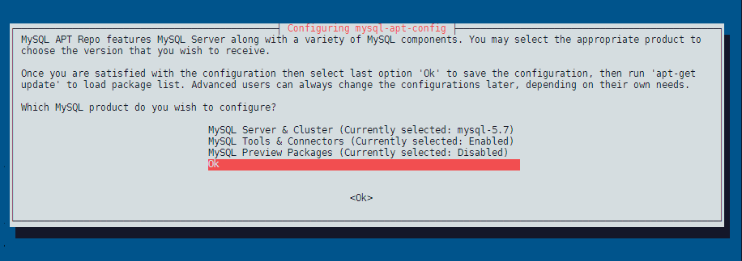

<!-- TOC -->

- [Install PHP 7.2](#install-php-72)
  - [Set the Timezone](#set-the-timezone)
  - [Increase PHP memory limit](#increase-php-memory-limit)
  - [Disable asp_tags](#disable-asptags)
  - [Enable opcache.save_comments](#enable-opcachesavecomments)
- [Install NGINX](#install-nginx)
  - [NGINX installation:](#nginx-installation)
  - [Install and configure php-fpm](#install-and-configure-php-fpm)
  - [Configure PHP](#configure-php)
- [Install MySQL](#install-mysql)
  - [Install MySQL on Debian 10](#install-mysql-on-debian-10)
  - [Connect MySQL](#connect-mysql)
  - [max_allowed_packet](#maxallowedpacket)
  - [Configuring the Magento database](#configuring-the-magento-database)
  - [Verify the database by logging in with the Magento user](#verify-the-database-by-logging-in-with-the-magento-user)
- [Install Magento](#install-magento)
  - [Install composer](#install-composer)
  - [Set file permissions](#set-file-permissions)
  - [Install Magento](#install-magento-1)
  - [Switch to Developer Mode](#switch-to-developer-mode)
  - [Configure NGINX](#configure-nginx)

<!-- /TOC -->


## Install PHP 7.2

Run below commands to upgrade the current packages to the latest version:


```bash
sudo apt update 
sudo apt upgrade
```


Now setup PPA on Debian 10. Then import packages signing key. After that configure PPA for the PHP packages on your system:


```bash
sudo apt install ca-certificates apt-transport-https 
wget -q https://packages.sury.org/php/apt.gpg -O- | sudo apt-key add -
echo "deb https://packages.sury.org/php/ buster main" | sudo tee /etc/apt/sources.list.d/php.list
```


Now run the following commands to install PHP 7.2:


```bash
sudo apt update
sudo apt install php7.2
```

Install the necessary PHP modules:

```bash
sudo apt install php7.2-cli php7.2-common php7.2-curl php7.2-gd php7.2-json php7.2-mbstring php7.2-mysql php7.2-xml php7.2-bcmath php7.2-gd php7.2-intl php7.2-opcache php7.2-soap
```

Now we need to configure PHP v7.2 - to find out which `php.ini` file is the one that is loaded run `php -i`:


```bash
php -i
phpinfo()
PHP Version => 7.2.26-1+0~20191218.33+debian10~1.gbpb5a34b

System => Linux Magento2 4.19.0-6-amd64 #1 SMP Debian 4.19.67-2+deb10u2 (2019-11-11) x86_64
Build Date => Dec 18 2019 15:01:47
Server API => Command Line Interface
Virtual Directory Support => disabled
Configuration File (php.ini) Path => /etc/php/7.2/cli
Loaded Configuration File => /etc/php/7.2/cli/php.ini
Scan this dir for additional .ini files => /etc/php/7.2/cli/conf.d
Additional .ini files parsed => /etc/php/7.2/cli/conf.d/10-mysqlnd.ini,
```

> Note: on my system there was a second configuration file in `/etc/php/7.2/apache2/php.ini`. In a later step I am going to install NGINX that is going to add more files in `/etc/php/7.2/fpm/php.ini` and  `/etc/php/7.2/cli/php.ini`. The Magento documentation recommend to do all changes to all `php.ini` files on your system.

We can see that the loaded configuration file is `/etc/php/7.2/cli/php.ini`:


```bash
nano /etc/php/7.2/cli/php.ini
```

### Set the Timezone

Edit the `php.ini` configuration file and update the [timezone](https://www.php.net/manual/en/timezones.php) value in `date.timezone` setting tag:


```yaml
date.timezone = "Europe/Berlin"
```

### Increase PHP memory limit

Simply increase the default value to the recommended value:

* Compiling code or deploying static assets: `756M`
* Installing and updating Magento components from Magento Marketplace: `2G`
* Testing: `~3-4G`


```yaml
memory_limit = 2G
```

### Disable asp_tags

ASP style tags have been removed from PHP in version 7. If you still use a template that uses them, they need to be [deactivated on the theme side](https://stackoverflow.com/questions/14694116/how-to-disable-asp-style-php-tags-within-a-specific-file)


### Enable opcache.save_comments

Enable [opcache.save_comments](https://www.php.net/manual/en/opcache.configuration.php#ini.opcache.save_comments) and it is recommended to enable the [PHP OpCache](http://php.net/manual/en/intro.opcache.php) for performance reasons.


```yaml
[opcache]
; Determines if Zend OPCache is enabled
opcache.save_comments=1
opcache.enable=1
```


## Install NGINX

### NGINX installation:

```bash
apt -y install nginx
```


### Install and configure php-fpm

The `php-fpm` extension is needed for NGINX in addition to the modules we already installed earlier:


```bash
apt -y install php7.2-fpm php7.2-cli
```


### Configure PHP

Open the following two, new `php.ini` files in an editor:

```bash
nano /etc/php/7.2/fpm/php.ini
nano /etc/php/7.2/cli/php.ini
```

And edit both files to match the following lines:


```bash
memory_limit = 2G
max_execution_time = 1800
zlib.output_compression = On
```

Now restart all services:


```bash
systemctl restart php7.2-fpm
service nginx restart
```


## Install MySQL

MySQL team provides official MySQL PPA for Debian Linux. You can download and install the package on your Debian system, which will add PPA file to your system. Run below command to enable PPA:
  

```bash
wget http://repo.mysql.com/mysql-apt-config_0.8.13-1_all.deb
sudo dpkg -i mysql-apt-config_0.8.13-1_all.deb
```


During the installation of MySQL apt config package, It will prompt to select MySQL version to install. Select the MySQL 5.7 option to install on your system:





### Install MySQL on Debian 10

Run the following commands to install MySQL on a Debian machine.


```bash
sudo apt update && apt upgrade
sudo apt install mysql-server
```

Input a secure password and same to confirm password window. This will be MySQL root user password required to log in to MySQL server:


### Connect MySQL


Now connect to the MySQL database using the command line:

```bash
mysql -u root -p
Enter password: 
Welcome to the MySQL monitor.  Commands end with ; or \g.
Your MySQL connection id is 2
Server version: 5.7.28 MySQL Community Server (GPL)

Copyright (c) 2000, 2019, Oracle and/or its affiliates. All rights reserved.

Oracle is a registered trademark of Oracle Corporation and/or its
affiliates. Other names may be trademarks of their respective
owners.

Type 'help;' or '\h' for help. Type '\c' to clear the current input statement.

mysql>
```


### max_allowed_packet

If you expect to import large numbers of products into Magento, you can increase the value for max_allowed_packet that is larger than the default, 16MB.

To increase the value, open `/etc/mysql/mysql.cnf` in a text editor and locate the value for max_allowed_packet. Save your changes to `mysql.cnf`, close the text editor, and restart MySQL (`service mysql restart`).


### Configuring the Magento database


Enter the following commands in the order shown to create a database instance named magento with username magento (make sure that you are on the MySQL CLI `mysql -u root -p`):


```bash
create database magento;
create user magento IDENTIFIED BY 'magento';
GRANT ALL ON magento.* TO magento@localhost IDENTIFIED BY 'magento';
flush privileges;
```

Enter exit to quit the command prompt.


### Verify the database by logging in with the Magento user


```bash
mysql -u magento -p
```

If you can login with the password `magento` and have access to the created database named `magento` everything is looking fine:


```bash
mysql -u magento -p
Enter password: 
Welcome to the MySQL monitor.  Commands end with ; or \g.
Your MySQL connection id is 3
Server version: 5.7.28 MySQL Community Server (GPL)

Copyright (c) 2000, 2019, Oracle and/or its affiliates. All rights reserved.

Oracle is a registered trademark of Oracle Corporation and/or its
affiliates. Other names may be trademarks of their respective
owners.

Type 'help;' or '\h' for help. Type '\c' to clear the current input statement.

mysql> show databases;
+--------------------+
| Database           |
+--------------------+
| information_schema |
| magento            |
+--------------------+
2 rows in set (0.00 sec)

mysql> 
```


## Install Magento

### Install composer

```
sudo apt-get install composer
```


```bash
sudo useradd -r -s /bin/false magento
su - magento
```

If your web server docroot directory is `/var/www/html` run the following command to have composer install magento to `/var/www/html/magento`


```bash
composer create-project --repository=https://repo.magento.com/ magento/project-community-edition /var/www/html/magento
```

When prompted, enter your Magento authentication keys. Public and private keys are created and configured in your [Magento Marketplace](https://marketplace.magento.com/customer/accessKeys/). The public key will be the username and the private key will be the password.


__ERROR Message__: The zip extension and unzip command are both missing, skipping. Your command-line PHP is using multiple ini files. Run `php --ini` to show them.


Install `apt install zip unzip php7.2-zip` - but I can only see the cli `php.ini` when I run `php -i`?


### Set file permissions

You must set read-write permissions for the web server group before you install the Magento software. This is necessary so that the Setup Wizard and command line can write files to the Magento file system.


```bash
cd /var/www/html/magento
find var generated vendor pub/static pub/media app/etc -type f -exec chmod g+w {} +
find var generated vendor pub/static pub/media app/etc -type d -exec chmod g+ws {} +
chown -R :www-data .
chmod u+x bin/magento
```

### Install Magento

This example assumes that the Magento install directory is named magento2ee, the db-host is on the same machine (localhost), and that the db-name, db-user, and db-password are all magento:


```bash
bin/magento setup:install \
--base-url=http://mysite.dev \
--db-host=localhost \
--db-name=magento \
--db-user=magento \
--db-password=magento \
--admin-firstname=admin \
--admin-lastname=admin \
--admin-email=admin@admin.com \
--admin-user=admin \
--admin-password=admin123 \
--language=en_US \
--currency=USD \
--timezone=America/Chicago \
--use-rewrites=1
```


> __Don't forget__ to write down the Admin panel URL that will be displayed at the end of the installation process! It will looks something like this `/af345azfd`. Once the Installation is through, you will be able access your web shop via the base URL that you assigned above, e.g. http://mysite.dev (make sure that it is an URL that resolves to your development server, obviously). The Admin panel can then be reached by adding the admin URL to the end of this domain: `http://mysite.dev/af345azfd`.


### Switch to Developer Mode


```bash
cd /var/www/html/magento/bin
./magento deploy:mode:set developer
```


### Configure NGINX


1. Create a new virtual host for your Magento site:


```bash
nano /etc/nginx/sites-available/magento.conf
```


2. Add the following configuration:


```bash
upstream fastcgi_backend {
  server  unix:/run/php/php7.2-fpm.sock;
}

server {

  listen 88;
  server_name www.magento-dev.com;
  set $MAGE_ROOT /var/www/html/magento;
  include /var/www/html/magento/nginx.conf.sample;
}
```

Replace www.magento-dev.com with your domain name.


Activate the newly created virtual host by creating a symlink to it in the `/etc/nginx/sites-enabled` directory:


```bash
ln -s /etc/nginx/sites-available/magento.conf /etc/nginx/sites-enabled
```

4. Save and exit the editor and verify that the syntax is correct:


```bash
nginx -t
nginx: the configuration file /etc/nginx/nginx.conf syntax is ok
nginx: configuration file /etc/nginx/nginx.conf test is successful
```


Restart nginx:


```bash
systemctl reload nginx
```

You can now access the webshop through the URL you set as [base-url in the Magento installation script](#install-magento-1):


