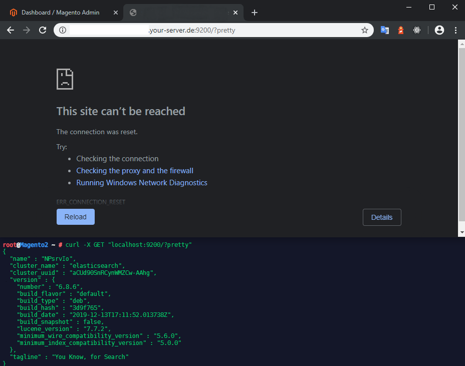
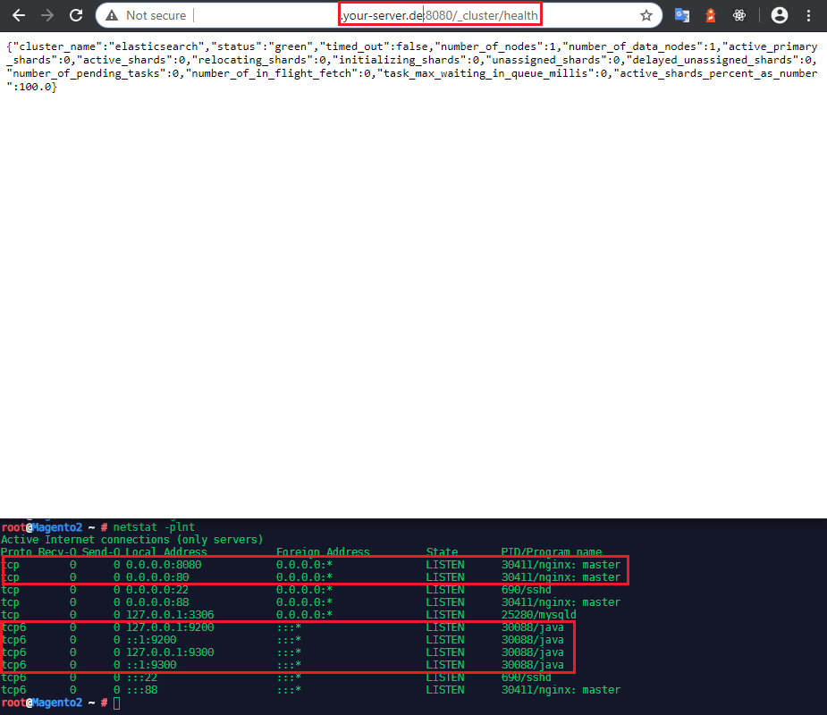
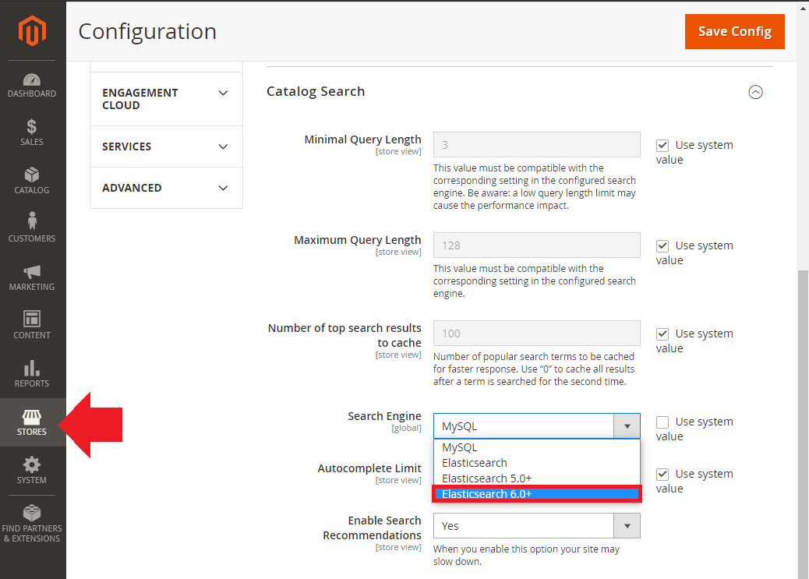
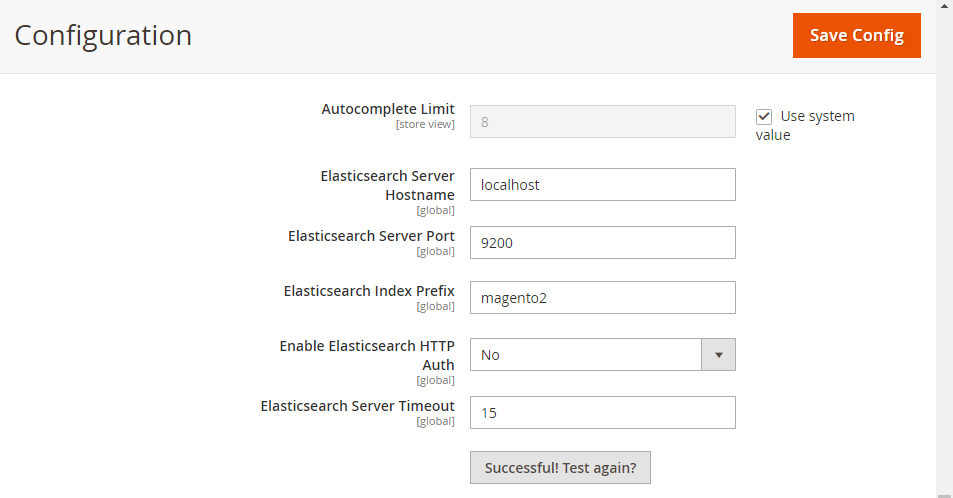
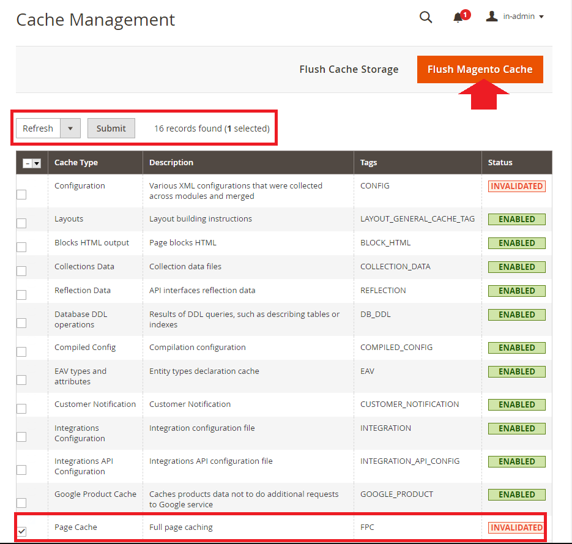
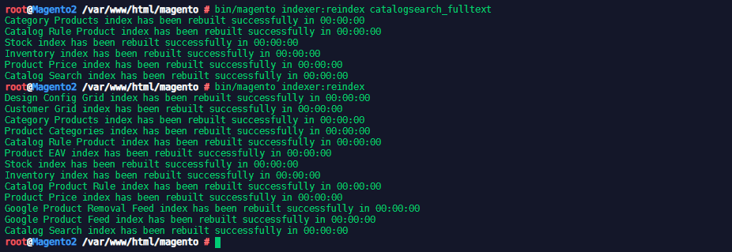

<!-- TOC -->

- [Install prerequisites and Elasticsearch](#install-prerequisites-and-elasticsearch)
  - [Installing OpenJDK 8](#installing-openjdk-8)
  - [Install Elasticsearch 6.x](#install-elasticsearch-6x)
- [Configure NGINX and Elasticsearch](#configure-nginx-and-elasticsearch)
  - [Set up NGINX as a proxy](#set-up-nginx-as-a-proxy)
  - [Configure Elasticsearch within Magento](#configure-elasticsearch-within-magento)
  - [Reindexing catalog search and refreshing the full page cache](#reindexing-catalog-search-and-refreshing-the-full-page-cache)

<!-- /TOC -->


## Install prerequisites and Elasticsearch

### Installing OpenJDK 8

Start by verifying that Java hasn't been installed yet on your system:


```bash
java -version
-bash: java: command not found
```


Java LTS version 8 is not available in the official Debian Buster repositories. You can still install it by enabling the AdoptOpenJDK repository which provides prebuilt OpenJDK packages ([check alternatives](https://stackoverflow.com/questions/57031649/how-to-install-openjdk-8-jdk-on-debian-10-buster)):


```bash
apt update
apt install apt-transport-https ca-certificates wget dirmngr gnupg software-properties-common
```

Import the repository’s GPG key using the following wget command:


```bash
wget -qO - https://adoptopenjdk.jfrog.io/adoptopenjdk/api/gpg/key/public | sudo apt-key add -
```


Add the AdoptOpenJDK APT repository to your system:


```bash
sudo add-apt-repository --yes https://adoptopenjdk.jfrog.io/adoptopenjdk/deb/
```


Once the repository is enabled, update apt sources and install Java 8 using the following commands:


```bash
sudo apt update
sudo apt install adoptopenjdk-8-hotspot
```


Finally, verify the installation by checking the Java version. The output should look something like this::


```bash
java -version
openjdk version "1.8.0_232"
OpenJDK Runtime Environment (AdoptOpenJDK)(build 1.8.0_232-b09)
OpenJDK 64-Bit Server VM (AdoptOpenJDK)(build 25.232-b09, mixed mode)
```


### Install Elasticsearch 6.x


Download and install the public signing key:


```bash
wget -qO - https://artifacts.elastic.co/GPG-KEY-elasticsearch | sudo apt-key add -
```

Save the repository definition to `/etc/apt/sources.list.d/elastic-6.x.list`:


```bash
echo "deb https://artifacts.elastic.co/packages/6.x/apt stable main" | sudo tee -a /etc/apt/sources.list.d/elastic-6.x.list
```


You can install the Elasticsearch Debian package with:


```bash
apt update && sudo apt install elasticsearch
```


To configure Elasticsearch to start automatically when the system boots up, run the following commands:


```bash
sudo /bin/systemctl daemon-reload
sudo /bin/systemctl enable elasticsearch.service
```


Elasticsearch can be started and stopped as follows:


```bash
systemctl start elasticsearch.service
systemctl stop elasticsearch.service
```


These commands provide no feedback as to whether Elasticsearch was started successfully or not. Instead, this information will be written in the log files located in /var/log/elasticsearch/. You can also check the service status:


```bash
systemctl status elasticsearch.service
● elasticsearch.service - Elasticsearch
   Loaded: loaded (/lib/systemd/system/elasticsearch.service; enabled; vendor preset: enabled)
   Active: active (running) since Mon 2020-01-13 07:47:05 CET; 8s ago
     Docs: http://www.elastic.co
 Main PID: 30088 (java)
    Tasks: 30 (limit: 4915)
   Memory: 1.2G
   CGroup: /system.slice/elasticsearch.service
           ├─30088 /bin/java -Xms1g -Xmx1g -XX:+UseConcMarkSweepGC -XX:CMSInitiatingOccupancyFraction=75 -XX:+UseCMSInitiatingOccup           └─30180 /usr/share/elasticsearch/modules/x-pack-ml/platform/linux-x86_64/bin/controller

Jan 13 07:47:05 Magento2 systemd[1]: Started Elasticsearch.
```


You can now access Elasticsearch by:


```bash
url -X GET "localhost:9200/?pretty"

{
  "name" : "NPsrvIo",
  "cluster_name" : "elasticsearch",
  "cluster_uuid" : "aCUd90SnRCynWMZCw-AAhg",
  "version" : {
    "number" : "6.8.6",
    "build_flavor" : "default",
    "build_type" : "deb",
    "build_hash" : "3d9f765",
    "build_date" : "2019-12-13T17:11:52.013738Z",
    "build_snapshot" : false,
    "lucene_version" : "7.7.2",
    "minimum_wire_compatibility_version" : "5.6.0",
    "minimum_index_compatibility_version" : "5.0.0"
  },
  "tagline" : "You Know, for Search"
}
```


Elasticsearch is configured to only be accessible from localhost:





You can change this in the __Network Section__ of `/etc/elasticsearch/elasticsearch.yml`:


```yml
# ---------------------------------- Network -----------------------------------
#
# Set the bind address to a specific IP (IPv4 or IPv6):
#
#network.host: 192.168.0.1
#
# Set a custom port for HTTP:
#
#http.port: 9200
#
# For more information, consult the network module documentation.
```


By default the `network.host` is set to `127.0.0.1` - setting it to `0.0.0.0` will open Elasticsearch up to all your network interfaces. But be aware that Elasticsearch 6 does not have a [free User Authentication](/securing-elasticsearch-with-read-only-rest) pre-installed!


## Configure NGINX and Elasticsearch

### Set up NGINX as a proxy

Create a new file `/etc/nginx/sites-available/elasticsearch.conf` with the following content:


```bash
server {
   listen 8080;
   location /_cluster/health {
      proxy_pass http://localhost:9200/_cluster/health;
   }
}
```


Symlink the configuration file into `site-enabled` and restart NGINX:


```bash
ln -s /etc/nginx/sites-available/elasticsearch.conf /etc/nginx/sites-enabled
nginx -t
service nginx restart
```


Verify the proxy works by entering the following command `netstat -plnt` and try opening the URL inside your browser `http://your-server.de:8080/_cluster/health` :





We now have [Magento 2.3.3 running on Port 80](/magento-2-installation-with-nginx-on-debian-buster) and our health check for Elasticsearch on Port 8080 - both available on all network interfaces `0.0.0.0`. While the Elasticsearch API Ports 9200/9300 are securely bound to `127.0.0.1` and cannot be accessed from the internet.


### Configure Elasticsearch within Magento


1. Log in to the Magento Admin as an administrator.
2. Click __Stores__ > __Configuration__ > __Catalog__ > __Catalog Search__.
3.  From the Search Engine list, select the correct Elasticsearch version as the following figure shows.





| __Option__ | __Description__ |
|---|---|
| __Elasticsearch Server Hostname__ | Enter the fully qualified hostname or IP address of the machine running Elasticsearch - as we are running Elasticsearch locally, we can use `localhost` |
| __Elasticsearch Server Port__ | Enter the Elasticsearch web server proxy port - for us `9200` |
| __Elasticsearch Index Prefix__ | Enter the Elasticsearch index prefix. If you use a single Elasticsearch instance for more than one Magento installation |
| __Enable Elasticsearch HTTP Auth__ | Click Yes only if you enabled authentication for your Elasticsearch server - we did not. |


4. Click Test Connection.





### Reindexing catalog search and refreshing the full page cache

After you change Magento’s Elasticsearch configuration, you must reindex the catalog search index and refresh the full page cache using the Admin or command line.


To refresh the cache using the Admin:


1. In the Admin, click System > Cache Management.
2. Select the checkbox next to Page Cache.
3. From the Actions list in the upper right, click Refresh.
4. Flush the Magento Cache





Enter the following command to reindex the catalog search index only:


```bash
bin/magento indexer:reindex catalogsearch_fulltext
```


Enter the following command to reindex all indexers:


```bash
bin/magento indexer:reindex
```


Wait until reindexing completes.





<!-- Installing Elasticsuite

To make use of Elasticsearch in Magento 2 we need to install the [Elasticsuite Plugin](https://github.com/Smile-SA/elasticsuite.) Plugins can be installed with the `bin/elasticsearch-plugin` tool of Elastic Search. You have to go to your Elastic Search installation directory. Locate your "Home" directory ( Look for Settings -> Path -> Home in the following command output for value ):


```bash
curl localhost:9200/_nodes/settings?pretty=true
```


Elasticsearch Container


The default directory `home` for Elasticsearch is `/usr/share/elasticsearch`. We now have to enter the Elasticsearch container:


```bash
docker exec -it elasticsearch7.5 /bin/bash

or

docker exec -t -i ContainerID /bin/bash
```


And enter the `home directory` and install the following plugins:


```bash 
bin/elasticsearch-plugin install analysis-phonetic
bin/elasticsearch-plugin install analysis-icu
```


To restart Elasticsearch we now have to restart the `elasticsearch` container.


```bash
docker restart elasticsearch5.7
```


Magento Container

We can now install the latest version of ElasticSuite through the Magento composer CLI:


```bash
composer require smile/elasticsuite ~2.8.0
```


And we end up with a scary error message - I tried to log in with my Magento admininistrator credentials, but [apparently that was wrong](https://devdocs.magento.com/guides/v2.3/install-gde/prereq/connect-auth.html):


Access Keys

To download packages from the [Magento Marketplace](https://marketplace.magento.com/) we first have to sign in, select __My Profile__ and click on __Access Keys__ in the Marketplace tab.


Click __Create a New Access Key__. Enter a specific name for the keys (e.g., the name of the developer receiving the keys) and click __OK__.


New public and private keys are now associated with your account that you can click to copy. Save this information or keep the page open when working with your Magento project. Use the __Public key as your username__ and the __Private key as your password__!


But even so I kept receiving the error message:


```json
[Composer\Downloader\TransportException]
Invalid credentials for 'https://repo.magento.com/packages.json', aborting.
```


The solution was that my installation only had a sample `auth.json` file in the root directory of the Magento content. You need to create a copy and fill out your credentials inside. Afterwards Composer no longer asks for your login:


Enable the module and run ElasticSuite

If your Magento instance is already installed, you have to enable the ElasticSuite modules using :


```bash
bin/magento module:enable Smile_ElasticsuiteCore Smile_ElasticsuiteCatalog Smile_ElasticsuiteSwatches Smile_ElasticsuiteCatalogRule Smile_ElasticsuiteVirtualCategory Smile_ElasticsuiteThesaurus Smile_ElasticsuiteCatalogOptimizer Smile_ElasticsuiteTracker Smile_ElasticsuiteAnalytics
```


As recommend run `bin/magento setup:upgrade` and `bin/magento setup:di:compile` afterwards.


Then configure the ElasticSearch server to point to your ElasticSearch cluster (optional if using default server location, http://localhost:9200) and reimport the config :


```bash
bin/magento config:set -l smile_elasticsuite_core_base_settings/es_client/servers elasticsearch7.5:9200
bin/magento config:set -l smile_elasticsuite_core_base_settings/es_client/enable_https_mode 0
bin/magento config:set -l smile_elasticsuite_core_base_settings/es_client/enable_http_auth 0
bin/magento config:set -l smile_elasticsuite_core_base_settings/es_client/http_auth_user ""
bin/magento config:set -l smile_elasticsuite_core_base_settings/es_client/http_auth_pwd ""
bin/magento app:config:import
```


Process First Indexing

Once you have completed all previous points, you can process a full reindexing of the catalogsearch_fulltext index.


```bash
bin/magento index:reindex catalogsearch_fulltext
bin/magento index:reindex elasticsuite_categories_fulltext
bin/magento index:reindex elasticsuite_thesaurus
```


Once the reindex is done, you are all set and can view your frontend catalog and search pages being rendered via Smile Elastic Suite !


Commit the Changes

Now that we've modified the container we have to commit the changes. To commit the changes and create a new image based on said changes, issue the command:


```bash
docker commit CONTAINER_ID elasticsearch7.5-template
docker commit CONTAINER_ID magento2.3.3-template
```


Where CONTAINER_ID is the ID given to you when you initially ran the container.


```yaml
mysql:
  image: mysql:5.7
  ports:
    - 3306:3306
  environment:
    MYSQL_ROOT_PASSWORD: mypassword
  volumes:
    - ./src/db:/var/lib/mysql
  container_name: mysql_5.7
phpmyadmin:
  image: phpmyadmin/phpmyadmin:4.8
  ports:
    - 8080:80
  links:
    - mysql
  environment:
    PMA_HOST: mysql
    PMA_PORT: 3306
  container_name: phpmyadmin_4.8
apache2:
  image: magento2.3.3-template
  ports:
    - 80:80
    - 10000:10000
    - 443:443
  links:
    - mysql
    - elasticsearch
  volumes:
    - ./src/html:/var/www/html
  container_name: magento2.3
elasticsearch:
    image: elasticsearch7.5-template
    container_name: elasticsearch7.5
    environment:
      - xpack.security.enabled=false
      - discovery.type=single-node
    ulimits:
      memlock:
        soft: -1
        hard: -1
      nofile:
        soft: 65536
        hard: 65536
    cap_add:
      - IPC_LOCK
    volumes:
      - ./src/elasticsearch-data:/usr/share/elasticsearch/data
    ports:
      - 9200:9200
      - 9300:9300
``` -->