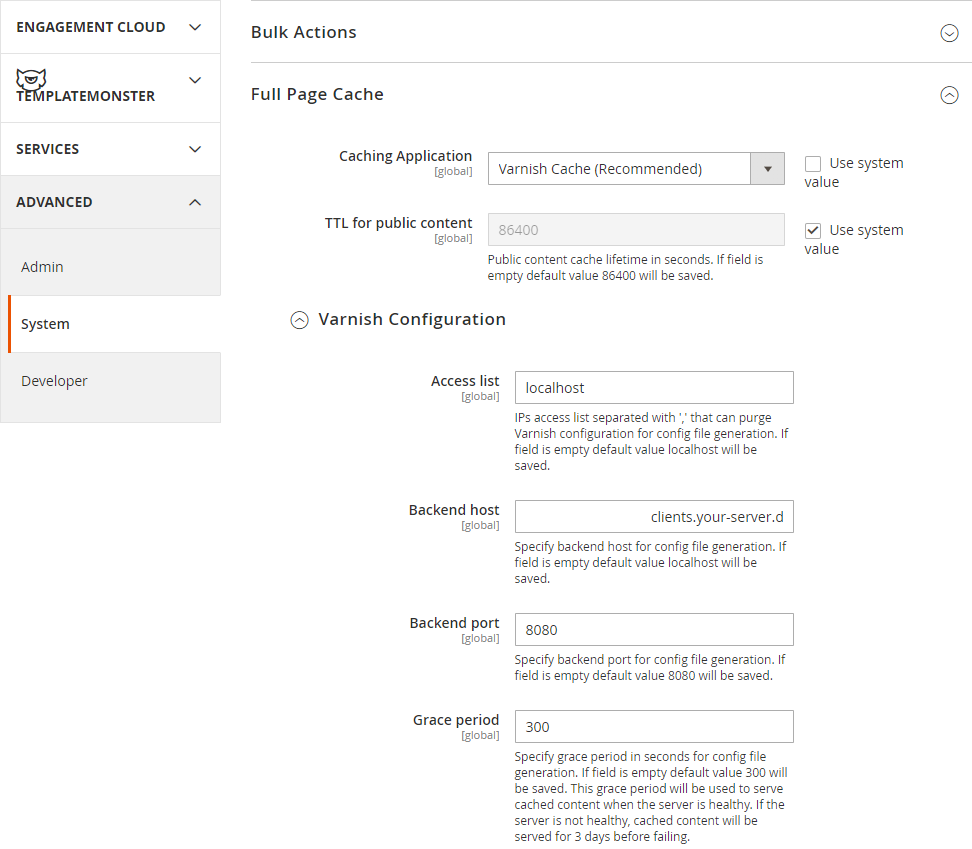
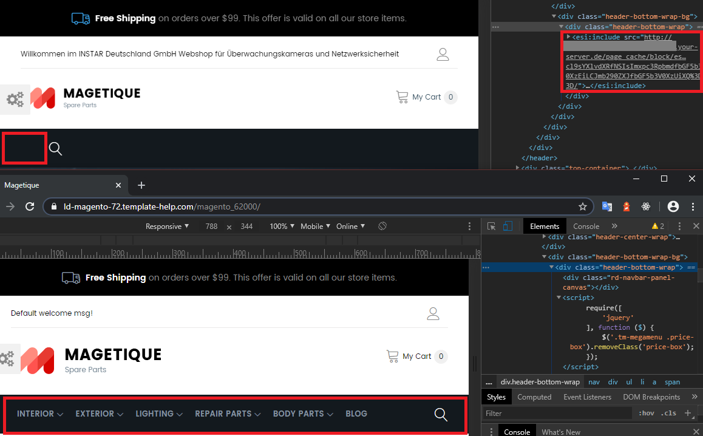

<!-- TOC -->

- [Install Varnish 6 on Debian 10](#install-varnish-6-on-debian-10)
- [Configure NGINX](#configure-nginx)
- [Modify the Varnish system configuration](#modify-the-varnish-system-configuration)
- [Modify default.vcl](#modify-defaultvcl)
- [Configure Magento to use Varnish](#configure-magento-to-use-varnish)
- [Export a Varnish Configuration File](#export-a-varnish-configuration-file)
- [The Varnishing of the TopMenu](#the-varnishing-of-the-topmenu)

<!-- /TOC -->


<!-- ## Install Varnish 5 on Debian 10

Add the packagecloud GPG key so that the repository will be authenticated and verified:


```bash
wget https://packagecloud.io/varnishcache/varnish5/gpgkey -O - | sudo apt-key add -
```


Make sure you have these packages for using https repositories:


```bash
sudo apt-get install apt-transport-https debian-archive-keyring -y
```


Add the Varnish 5 repository from packagecloud for Debian Buster (10):


```bash
echo "deb https://packagecloud.io/varnishcache/varnish5/debian/ buster main" | sudo tee -a /etc/apt/sources.list.d/varnishcache_varnish5.list
echo "deb-src https://packagecloud.io/varnishcache/varnish5/debian/ buster main" | sudo tee -a /etc/apt/sources.list.d/varnishcache_varnish5.list
apt update
```

__NO RELEASE OF VARNISH 5 AVAILABLE FOR DEBIAN BUSTER__ Have to wait for Magento update to support for Varnish 6..... -->


## Install Varnish 6 on Debian 10

In order to get [Varnish](https://varnish-cache.org/docs/6.0/installation/install.html) up and running type sudo apt-get install varnish. Enter the following command to display the version of Varnish you are running:


```bash
varnishd -V
varnishd (varnish-6.1.1 revision efc2f6c1536cf2272e471f5cff5f145239b19460)
Copyright (c) 2006 Verdens Gang AS
Copyright (c) 2006-2015 Varnish Software AS
```


## Configure NGINX

Configure your web server to listen on a port other than the default port `80` because Varnish responds directly to incoming HTTP requests, not the web server. In the sections that follow, we use port `8080` as an example:


```bash
nano /etc/nginx/sites-available/magento.conf
```


Change the server to listen to port `8080`:


```js
upstream fastcgi_backend {
  server  unix:/run/php/php7.2-fpm.sock;
}

server {

  listen 8080 default_server;
  server_name your-server.de;
  set $MAGE_ROOT /var/www/html/magento;
  include /var/www/html/magento/nginx.conf.sample;
}
```


Test and reload NGINX:


```bash
nginx -t
service nginx reload
```


## Modify the Varnish system configuration

As a user with root privileges, open your Vanish configuration file in a text editor:


```bash
nano /etc/default/varnish
```


Set the Varnish listen port to 80:


```js
VARNISH_LISTEN_PORT=80
```


Make sure that DAEMON_OPTS contains the correct listening port for the `-a` parameter:


```js
DAEMON_OPTS="-a :80 \
             -T localhost:6082 \
             -f /etc/varnish/default.vcl \
             -S /etc/varnish/secret \
             -s malloc,256m"
```


Save your changes to the Varnish configuration file and exit the text editor.


## Modify default.vcl

This section discusses how to provide minimal configuration so Varnish returns HTTP response headers. This enables you to verify Varnish works before you configure Magento to use Varnish.


1. Back up default.vcl:


```bash
cp /etc/varnish/default.vcl /etc/varnish/default.vcl.bak
```


Open `/etc/varnish/default.vcl` in a text editor and locate the `backend default` and replace the value of .host with the fully qualified hostname or IP address and listen port of the Varnish backend or origin server; that is, the server providing the content Varnish will accelerate. Replace the value of .port with the web server’s listen port:


```js
backend default {
    .host = "my.domain.com";
    .port = "8080";
}
```


Save your changes to default.vcl and exit the text editor and restart Varnish:


```bash
service varnish restart
```


__Unfortunatly__ this did not change the Port Varnish was running on:


```bash
netstat -tulpn | grep varnish
tcp        0      0 0.0.0.0:6081            0.0.0.0:*               LISTEN      1634/varnishd       
tcp        0      0 127.0.0.1:6082          0.0.0.0:*               LISTEN      1634/varnishd       
tcp6       0      0 :::6081                 :::*                    LISTEN      1634/varnishd
```

[Following this guide](https://serverfault.com/questions/824389/varnish-daemon-not-listening-on-configured-port/824399), applying changes to the default service is best done by creating a new file `/etc/systemd/system/varnish.service.d/customexec.conf`:


```bash
# create the drop in directory
mkdir /etc/systemd/system/varnish.service.d
# create the drop in file. The name is irrelevant, as long as it ends in .conf
nano /etc/systemd/system/varnish.service.d/customexec.conf
```


Here you only need to add the settings you want do change, everything else will be loaded from the default definition file.


```bash
[Service]
ExecStart=/usr/sbin/varnishd -j unix,user=vcache -F -a :80 -T localhost:6082 -f /etc/varnish/default.vcl -S /etc/varnish/secret -s malloc,256m
```


Afterwards, tell systemctl to reload it's config files and to restart the service


```bash
systemctl daemon-reload
service varnish restart
```


Mow I received an error message:


```bash
service varnish restart
Failed to restart varnish.service: Unit varnish.service has a bad unit file setting.
See system logs and 'systemctl status varnish.service' for details.

systemctl status varnish.service
Warning: The unit file, source configuration file or drop-ins of varnish.service changed on disk● varnish.service - Varnish HTTP accelerator
   Loaded: bad-setting (Reason: Unit varnish.service has a bad unit file setting.)
  Drop-In: /etc/systemd/system/varnish.service.d
           └─customexec.conf
   Active: active (running) since Fri 2020-02-07 11:10:15 CET; 33min ago
     Docs: https://www.varnish-cache.org/docs/6.1/
           man:varnishd
 Main PID: 1634 (varnishd)
    Tasks: 217 (limit: 4915)
   Memory: 71.4M
   CGroup: /system.slice/varnish.service
           ├─1634 /usr/sbin/varnishd -j unix,user=vcache -F -a :6081 -T localhost:6082 -f /etc/v           └─1646 /usr/sbin/varnishd -j unix,user=vcache -F -a :6081 -T localhost:6082 -f /etc/v
Feb 07 11:10:15 Magento2 systemd[1]: Started Varnish HTTP accelerator.
Feb 07 11:10:16 Magento2 varnishd[1634]: Debug: Version: varnish-6.1.1 revision efc2f6c1536cf227Feb 07 11:10:16 Magento2 varnishd[1634]: Debug: Platform: Linux,4.19.0-6-amd64,x86_64,-junix,-smFeb 07 11:10:16 Magento2 varnishd[1634]: Version: varnish-6.1.1 revision efc2f6c1536cf2272e471f5Feb 07 11:10:16 Magento2 varnishd[1634]: Platform: Linux,4.19.0-6-amd64,x86_64,-junix,-smalloc,-Feb 07 11:10:16 Magento2 varnishd[1634]: Debug: Child (1646) Started
Feb 07 11:10:16 Magento2 varnishd[1634]: Child (1646) Started
Feb 07 11:10:16 Magento2 varnishd[1634]: Info: Child (1646) said Child starts
Feb 07 11:10:16 Magento2 varnishd[1634]: Child (1646) said Child starts
Feb 07 11:43:32 Magento2 systemd[1]: varnish.service: Service has more than one ExecStart= setti
```


The duplicated `ExecStart` line is in `/lib/systemd/system/varnish.service`:


```
cat /lib/systemd/system/varnish.service
[Unit]
Description=Varnish HTTP accelerator
Documentation=https://www.varnish-cache.org/docs/6.1/ man:varnishd

[Service]
Type=simple
LimitNOFILE=131072
LimitMEMLOCK=82000
ExecStart=/usr/sbin/varnishd -j unix,user=vcache -F -a :6081 -T localhost:6082 -f /etc/varnish/default.vcl -S /etc/varnish/secret -s malloc,256m
ExecReload=/usr/share/varnish/varnishreload
ProtectSystem=full
ProtectHome=true
PrivateTmp=true
PrivateDevices=true

[Install]
WantedBy=multi-user.target
```


Note that the drop-in should have an empty `ExecStart=` to prevent this problem:


```bash
[Service]
ExecStart=
ExecStart=/usr/sbin/varnishd -j unix,user=vcache -F -a :80 -T localhost:6082 -f /etc/varnish/default.vcl -S /etc/varnish/secret -s malloc,256m
```


Varnish is now running on port 80:


```bash
netstat -tulpn | grep varnish
tcp        0      0 0.0.0.0:80              0.0.0.0:*               LISTEN      2972/varnishd       
tcp        0      0 127.0.0.1:6082          0.0.0.0:*               LISTEN      2972/varnishd       
tcp6       0      0 :::80                   :::*                    LISTEN      2972/varnishd
```


And I am able to access the Magento store again on port 80. You can check that your shop is served by Varnish by querying the HTTP header of your page:


```bash
curl -I http://my.domain.com/
HTTP/1.1 200 OK
Server: nginx/1.14.2
Date: Fri, 07 Feb 2020 12:46:23 GMT
Content-Type: text/html; charset=UTF-8
Set-Cookie: X-Magento-Vary=6b1086e51dc44ada73095007287c835c2e8a8cb2; expires=Fri, 07-Feb-2020 13:46:23 GMT; Max-Age=3600; path=/; HttpOnly
X-Magento-Cache-Control: max-age=86400, public, s-maxage=86400
X-Magento-Cache-Debug: MISS
X-Magento-Tags: store,cms_b,FPC
Pragma: no-cache
Cache-Control: max-age=0, must-revalidate, no-cache, no-store
Expires: Thu, 07 Feb 2019 12:46:23 GMT
X-Content-Type-Options: nosniff
X-XSS-Protection: 1; mode=block
X-Frame-Options: SAMEORIGIN
Content-Encoding: gzip
Vary: Accept-Encoding
X-Varnish: 98400
Age: 0
Via: 1.1 varnish (Varnish/6.1)
Connection: keep-alive
```


> Before you can look at headers, you must set Magento for developer mode. You can also use the [magento deploy:mode:set](https://devdocs.magento.com/guides/v2.3/config-guide/cli/config-cli-subcommands-mode.html#change-to-developer-mode) command.


Make sure Varnish is running then enter the following command on the Varnish server and click on a link on your website:


```bash
varnishlog
```


## Configure Magento to use Varnish

1. Log in to the Magento Admin as an administrator.
2. Click __Stores__ > __Configuration__ > __Advanced__ > __System__ > __Full Page Cache__.
3. From the Caching Application list, click Varnish Caching.
4. Enter a value in the TTL for public content field.
5. Expand Varnish Configuration and enter the following information:


| Field | Description |
| --    | --          |
| Access list | Enter the fully qualified hostname, IP address, or Classless Inter-Domain Routing (CIDR) notation IP address range for which to invalidate content.  [More information](https://www.varnish-cache.org/docs/3.0/tutorial/purging.html) |
| Backend host	| Enter the fully qualified hostname or IP address and listen port of the Varnish backend or origin server; that is, the server providing the content Varnish will accelerate. Typically, this is your web server. [More information](https://www.varnish-cache.org/docs/trunk/users-guide/vcl-backends.html) |
| Backend port |	Origin server's listen port. |
| Grace period	| The grace period determines how long Varnish serves stale content if the backend is not responsive. The default value is 300 seconds. |





6. Click Save Config.


## Export a Varnish Configuration File


1. Click one of the export button to create a `varnish.vcl` you can use with Varnish.


2. Upload the file to `/etc/varnish/varnish.vcl`

3. It is recommended to change the value of `acl purge` to the IP address of the Varnish host.


```bash
 acl purge {
    "localhost";
 }
```


4. Edit `nano /etc/default/varnish` to add the new configuration file:


```js
DAEMON_OPTS="-a :80 \
             -T localhost:6082 \
             -f /etc/varnish/varnish.vcl \
             -S /etc/varnish/secret \
             -s malloc,256m"
```

5. Static files should not be cached by default, but if you want to cache them, you can edit the section `Static files caching` in the VCL to have the following content:


```bash
# Static files should not be cached by default
  return (pass);

# But if you use a few locales and don't use CDN you can enable caching static files by commenting previous line (#return (pass);) and uncommenting next 3 lines
  #unset req.http.Https;
  #unset req.http./*  */;
  #unset req.http.Cookie;
```


6. And reload Varnish and NGINX:


```bash
systemctl daemon-reload
service varnish restart
service nginx restart
```


7. Now that you’re using the `default.vcl` generated for you by Magento, you can perform some final verifications to make sure Varnish is working.


```bash
curl -I -v --location-trusted 'http://my.domain.com'
```


## The Varnishing of the TopMenu

After switching to Varnish I noticed that my _topmenu_ module was no longer loading. Checking the page source showed me that the [Edge Side Include](https://varnish-cache.org/docs/6.0/users-guide/esi.html) was failing:





The [problem in my case](https://github.com/magento/magento2/issues/3421) was a `ttl="3600"` parameter given in the menu component that has to be deleted:


```xml
<?xml version="1.0"?>
<page xmlns:xsi="http://www.w3.org/2001/XMLSchema-instance" xsi:noNamespaceSchemaLocation="urn:magento:framework:View/Layout/etc/page_configuration.xsd">
    <body>
        <referenceContainer name="div.sidebar.main">
            <block class="TemplateMonster\Megamenu\Block\Html\Topmenu"
                   name="catalog.sidebarnav"
                   template="TemplateMonster_Megamenu::html/topmenu.phtml"
                   ifconfig="megamenu/config/megamenu_general_show_left"
                   before="-"
                   ttl="3600" />
        </referenceContainer>
        <referenceBlock name="catalog.topnav" template="TemplateMonster_Megamenu::html/topmenu.phtml" />
    </body>
```


I found this block in `themeXXX\app\code\TemplateMonster\Megamenu\view\frontend\layout\default.xml` in the template source. And on the server inside the magento installation dir `/vendor/magento/module-theme/view/frontend/layout/default.xml`.


There might also be issues with [HTTPS on the backend side](https://support.magento.com/hc/en-us/articles/360028757791-Top-navigation-panel-does-not-load-on-storefront):


```bash
nano /etc/default/varnish
```


In the DAEMON_OPTS variable, add -p feature=+esi_ignore_https,  -p  feature=+esi_ignore_other_elements, -p feature=+esi_disable_xml_check. This would look like:


```js
DAEMON_OPTS="-a :80 \
             -p feature=+esi_ignore_other_elements \
             -p feature=+esi_disable_xml_check \
             -p feature=+esi_ignore_https \
             -T localhost:6082 \
             -f /etc/varnish/varnish.vcl \
             -S /etc/varnish/secret \
             -s malloc,256m"
```


When you change this, you need to run `service varnish restart` for the changes to take effect.